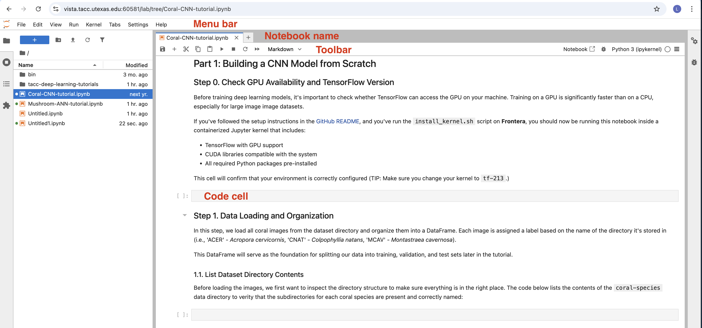

Jupyter Notebook user interface
--------------------------------

When you open a new Jupyter notebook, you will be presented with the
**notebook name**, a **menu bar**, a **toolbar** and an empty **code
cell**.

**Notebook name**: The name displayed at the top of the page, next to
the Jupyter logo, reflects the name of the ``.ipynb`` file. Clicking on
the notebook name brings up a dialog which allows you to rename it.
 
**Menu bar**: The menu bar presents different options that may be used to manipulate the way the notebook functions.

**Toolbar**: The tool bar gives a quick way of performing the most-used operations within the notebook, by clicking on an icon.

**Code cell**: the default type of cell; read on for an explanation of cells.

Structure of a notebook document
--------------------------------

..
  :kbd:`Control-x Control-f`
  :kbd:`C-x C-f`
  :guilabel:`&Cancel`

The notebook consists of a sequence of cells. A cell is a multiline text
input field, and its contents can be executed by using ``Shift-Enter``, or by clicking either the "Play" button the
toolbar, or ``Cell`` and then ``Run`` in the menu bar.
The execution behavior of a cell is determined by the cell's type. There
are three types of cells: **code cells**, **markdown cells**, and **raw
cells**. Every cell starts off being a **code cell**, but its type can
be changed by using a drop-down on the toolbar (which will be "Code",
initially), or via {ref}\ ``keyboard shortcuts <keyboard-shortcuts>``.

For more information on the different things you can do in a notebook,
see the `collection of
examples <https://nbviewer.jupyter.org/github/jupyter/notebook/tree/main/docs/source/examples/Notebook/>`__.

Code cells
~~~~~~~~~~

A *code cell* allows you to edit and write new code, with full syntax
highlighting and tab completion. The programming language you use
depends on the *kernel*, and the default kernel (IPython) runs Python
code.

When a code cell is executed, code that it contains is sent to the
kernel associated with the notebook. The results that are returned from
this computation are then displayed in the notebook as the cell's
*output*. The output is not limited to text, with many other possible
forms of output are also possible, including ``matplotlib`` figures and
HTML tables (as used, for example, in the ``pandas`` data analysis
package). This is known as IPython's *rich display* capability.

.. code:: {seealso}

   [Rich Output] example notebook

Markdown cells
~~~~~~~~~~~~~~

You can document the computational process in a literate way,
alternating descriptive text with code, using *rich text*. In IPython
this is accomplished by marking up text with the Markdown language. The
corresponding cells are called *Markdown cells*. The Markdown language
provides a simple way to perform this text markup, that is, to specify
which parts of the text should be emphasized (italics), bold, form
lists, etc.

If you want to provide structure for your document, you can use markdown
headings. Markdown headings consist of 1 to 6 hash # signs ``#``
followed by a space and the title of your section. The markdown heading
will be converted to a clickable link for a section of the notebook. It
is also used as a hint when exporting to other document formats, like
PDF.

When a Markdown cell is executed, the Markdown code is converted into
the corresponding formatted rich text. Markdown allows arbitrary HTML
code for formatting.

Within Markdown cells, you can also include *mathematics* in a
straightforward way, using standard LaTeX notation: ``$...$`` for inline
mathematics and ``$$...$$`` for displayed mathematics. When the Markdown
cell is executed, the LaTeX portions are automatically rendered in the
HTML output as equations with high quality typography. This is made
possible by `MathJax <https://www.mathjax.org/>`__, which supports a
`large
subset <https://docs.mathjax.org/en/latest/input/tex/index.html>`__ of
LaTeX functionality

Standard mathematics environments defined by LaTeX and AMS-LaTeX (the
``amsmath`` package) also work, such as
``\begin{equation}...\end{equation}``, and
``\begin{align}...\end{align}``. New LaTeX macros may be defined using
standard methods, such as ``\newcommand``, by placing them anywhere
*between math delimiters* in a Markdown cell. These definitions are then
available throughout the rest of the IPython session.

.. code:: {seealso}

   [Working with Markdown Cells] example notebook

Raw cells
~~~~~~~~~

*Raw* cells provide a place in which you can write *output* directly.
Raw cells are not evaluated by the notebook. When passed through
[nbconvert], raw cells arrive in the destination format unmodified. For
example, you can type full LaTeX into a raw cell, which will only be
rendered by LaTeX after conversion by nbconvert.

Basic workflow
--------------

The normal workflow in a notebook is, then, quite similar to a standard
IPython session, with the difference that you can edit cells in-place
multiple times until you obtain the desired results, rather than having
to rerun separate scripts with the ``%run`` magic command.

Typically, you will work on a computational problem in pieces,
organizing related ideas into cells and moving forward once previous
parts work correctly. This is much more convenient for interactive
exploration than breaking up a computation into scripts that must be
executed together, as was previously necessary, especially if parts of
them take a long time to run.

To interrupt a calculation which is taking too long, use the
{guilabel}\ ``Kernel``, {guilabel}\ ``Interrupt`` menu option, or the
{kbd}\ ``i,i`` keyboard shortcut. Similarly, to restart the whole
computational process, use the {guilabel}\ ``Kernel``,
{guilabel}\ ``Restart`` menu option or {kbd}\ ``0,0`` shortcut.

A notebook may be downloaded as a ``.ipynb`` file or converted to a
number of other formats using the menu option {guilabel}\ ``File``,
{guilabel}\ ``Download as``.

.. code:: {seealso}

   [Running Code in the Jupyter Notebook] example notebook

   [Notebook Basics] example notebook

(keyboard-shortcuts)=

Keyboard shortcuts
~~~~~~~~~~~~~~~~~~

All actions in the notebook can be performed with the mouse, but
keyboard shortcuts are also available for the most common ones. The
essential shortcuts to remember are the following:

-  {kbd}\ ``Shift-Enter``: run cell : Execute the current cell, show any
   output, and jump to the next cell below. If {kbd}\ ``Shift-Enter`` is
   invoked on the last cell, it makes a new cell below. This is
   equivalent to clicking the {guilabel}\ ``Cell``, {guilabel}\ ``Run``
   menu item, or the Play button in the toolbar.
-  {kbd}\ ``Esc``: Command mode : In command mode, you can navigate
   around the notebook using keyboard shortcuts.
-  {kbd}\ ``Enter``: Edit mode : In edit mode, you can edit text in
   cells.

For the full list of available shortcuts, click {guilabel}\ ``Help``,
{guilabel}\ ``Keyboard Shortcuts`` in the notebook menus.

Searching
---------

Jupyter Notebook has an advanced built-in search plugin for finding text
within a notebook or other document, which uses the {kbd}\ ``Ctrl-F``
({kbd}\ ``Cmd+F`` for macOS) shortcut by default.

Your browser's ``find`` function will give unexpected results because it
doesn't have access to the full content of a document (by default), but
you can still use your browser find function from the browser menu if
you want, or you can disable the built-in search shortcut using the
Advanced Settings Editor.

Alternatively, you can disable windowed notebook rendering to expose the
full document content to the browser at the expense of performance.

Plotting
--------

One major feature of the Jupyter notebook is the ability to display
plots that are the output of running code cells. The IPython kernel is
designed to work seamlessly with the [matplotlib] plotting library to
provide this functionality. Specific plotting library integration is a
feature of the kernel.

Installing kernels
------------------

For information on how to install a Python kernel, refer to the `IPython
install page <https://ipython.org/install.html>`__.

The Jupyter wiki has a long list of `Kernels for other
languages <https://github.com/jupyter/jupyter/wiki/Jupyter-kernels>`__.
They usually come with instructions on how to make the kernel available
in the notebook.

(signing-notebooks)=

Trusting Notebooks
------------------

To prevent untrusted code from executing on users' behalf when notebooks
open, we store a signature of each trusted notebook. The notebook server
verifies this signature when a notebook is opened. If no matching
signature is found, Javascript and HTML output will not be displayed
until they are regenerated by re-executing the cells.

Any notebook that you have fully executed yourself will be considered
trusted, and its HTML and Javascript output will be displayed on load.

If you need to see HTML or Javascript output without re-executing, and
you are sure the notebook is not malicious, you can tell Jupyter to
trust it at the command-line with:

::

   $ jupyter trust mynotebook.ipynb

See the `security
documentation <https://jupyter-server.readthedocs.io/en/stable/operators/security.html>`__
for more details about the trust mechanism.

Browser Compatibility
---------------------

The Jupyter Notebook aims to support the latest versions of these
browsers:

-  Chrome
-  Safari
-  Firefox

Up to date versions of Opera and Edge may also work, but if they don't,
please use one of the supported browsers.

Using Safari with HTTPS and an untrusted certificate is known to not
work (websockets will fail).

.. code:: {eval-rst}

   .. include:: links.txt
