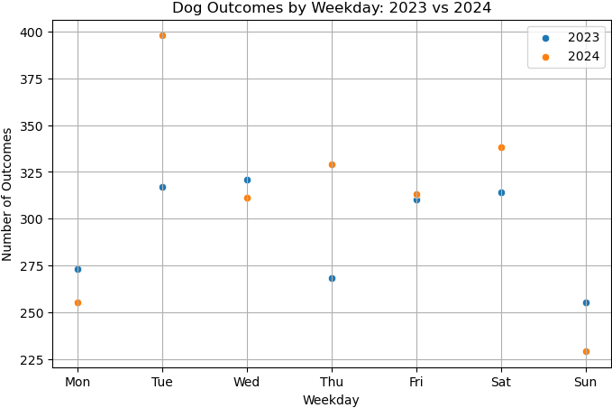

Exploratory Data Analysis
=========================

The success of a machine learning model is heavily dependent on the quality of the data it is
trained on. An important first step in a machine learning project is to familiarize yourself with
the dataset you will be using. This is a process called **exploratory data analysis (EDA)**. We will
mostly be using Python and the ``pandas`` library for this. We will perform these steps in a Jupyter
notebook for convenience, but this can also be done in a standard Python script.

By the end of this section, you should be able to:

* Load structured datasets into a pandas DataFrame
* Inspect and summarize data using `.info()`, `.head()`, and value counts
* Identify and handle missing values
* Drop or filter columns and rows based on criteria
* Convert string-based columns (e.g., age, dates) into numeric or datetime types
* Extract and manipulate date-related features (e.g., weekday, year)
* Visualize distributions using box plots, histograms, and scatter plots
* Compare patterns across subgroups (e.g., years, outcome types)


Getting and Displaying the Data
-------------------------------

Before starting, you'll need to load the dataset containing animal outcome records from the Austin
Animal Center. It will be used throughout this tutorial.

Instead of downloading and unzipping the file manually, we can now **programmatically fetch and
extract the data directly from the URL** using Python. This approach makes your code more portable
and reproducible.

.. code-block:: python
   :linenos:

   import requests
   import zipfile
   import io
   import pandas as pd
   
   # URL pointing to the ZIP file containing the CSV dataset
   url = 'https://github.com/TACC/life_sciences_ml_at_tacc/raw/refs/heads/main/docs/section1/files/Austin_Animal_Center_Outcomes.zip'
   
   # Send an HTTP GET request to fetch the content of the ZIP file
   response = requests.get(url)
   print(response.status_code)  # Should return 200 if the request was successful
   
   # Extract the ZIP file directly from the response's binary content
   with zipfile.ZipFile(io.BytesIO(response.content)) as z:
   
       # Open the CSV file inside the ZIP without saving it to disk
       with z.open('Austin_Animal_Center_Outcomes.csv') as csv_file:
       
           # Read the CSV into a pandas DataFrame
           data = pd.read_csv(csv_file)
           
           # Display the first few rows of the DataFrame
           display(data)

**Explanation of the Code:**

* **requests.get(url)**: Sends an HTTP GET request to the specified URL to retrieve the content of
  the ZIP file.
* **io.BytesIO(response.content)**: Creates an in-memory binary stream from the downloaded content,
  allowing it to be treated as a file-like object.
* **zipfile.ZipFile(...)**: Opens the ZIP file from the in-memory binary stream.
* **z.open('Austin_Animal_Center_Outcomes.csv')**: Accesses the specific CSV file within the ZIP 
  archive.
* **pd.read_csv(csv_file)**: Reads the CSV file into a pandas DataFrame for data manipulation and
  analysis.
* **display(data)**: Displays the DataFrame in a readable format, typically used in Jupyter
  notebooks.

.. warning::

   You may need to install the non-standard libraries `requests` and `pandas` if they are not
   already available in your environment. You can do this using pip:

   .. code-block:: console
   
      # On the command line:
      $ pip install --user requests pandas
      
      - or -
      
      # In a Jupyter notebook:
      ! pip install --user requests pandas

This method avoids the need for manual downloading or unzipping and ensures your code can be run
from any location with internet access.

.. image:: ./images/dataframe.png
   :align: center

The image above represents a **DataFrame**, which is a 2D labeled data structure in pandas. Each
column is a **Series**, each row is indexed (blue box), and column headers serve as keys (red box).

* **index**: row labels (blue)
* **series**: column of values (green)
* **key**: column name (red)

.. note::

   **Alternative method:** You can also download the file manually using the link below, unzip it,
   and place ``Austin_Animal_Center_Outcomes.csv`` in your working directory.
   
   `Austin_Animal_Center_Outcomes.zip <https://github.com/TACC/life_sciences_ml_at_tacc/raw/refs/heads/main/docs/section1/files/Austin_Animal_Center_Outcomes.zip>`_
   
   Once unzipped, make sure the CSV file is accessible from the notebook's current folder, then you
   can load it using:
   
   .. code-block:: python
   
      import pandas as pd
      data = pd.read_csv('Austin_Animal_Center_Outcomes.csv')
      display(data)


Understanding the Structure
---------------------------

Once loaded, we can inspect the dataset. The first few rows give us a general sense of what we are
working with. 

.. note::

   Commands preceded by ``>>>`` are meant to be run in a Python console or Jupyter notebook.

.. code-block:: python

   >>> data.head()

.. image:: ./images/datahead.png
   :align: center 

For more comprehensive info — like the total number of entries, data types, and missing values, we
use ``.info()``:

.. code-block:: python

   >>> data.info()

.. code-block:: text

    <class 'pandas.core.frame.DataFrame'>
    RangeIndex: 173775 entries, 0 to 173774
    Data columns (total 12 columns):
     #   Column            Non-Null Count   Dtype 
    ---  ------            --------------   ----- 
     0   Animal ID         173775 non-null  object
     1   Date of Birth     173775 non-null  object
     2   Name              123991 non-null  object
     3   DateTime          173775 non-null  object
     4   MonthYear         173775 non-null  object
     5   Outcome Type      173729 non-null  object
     6   Outcome Subtype   79660 non-null   object
     7   Animal Type       173775 non-null  object
     8   Sex upon Outcome  173774 non-null  object
     9   Age upon Outcome  173766 non-null  object
     10  Breed             173775 non-null  object
     11  Color             173775 non-null  object

We see that there are 173,775 records. Several fields (like ``Name`` and ``Outcome Subtype``)
contain missing values. All columns are currently stored as strings (object), even dates and age.


Dropping Unnecessary Columns
----------------------------

To streamline our analysis, we can drop columns that are not useful at this stage. For example,
we won't use the color of the animal in our initial exploration.

.. code-block:: python

   >>> data = data.drop(columns=['Color'], errors='ignore')
   >>> data.info()

.. code-block:: text

    <class 'pandas.core.frame.DataFrame'>
    RangeIndex: 173775 entries, 0 to 173774
    Data columns (total 11 columns):
     #   Column            Non-Null Count   Dtype 
    ---  ------            --------------   ----- 
     0   Animal ID         173775 non-null  object
     1   Date of Birth     173775 non-null  object
     2   Name              123991 non-null  object
     3   DateTime          173775 non-null  object
     4   MonthYear         173775 non-null  object
     5   Outcome Type      173729 non-null  object
     6   Outcome Subtype   79660 non-null   object
     7   Animal Type       173775 non-null  object
     8   Sex upon Outcome  173774 non-null  object
     9   Age upon Outcome  173766 non-null  object
     10  Breed             173775 non-null  object
    dtypes: object(11)
    memory usage: 14.6+ MB  


Examining Columns and Values
----------------------------

We can list all columns in the dataset to better understand its structure:

.. code-block:: python

   >>> data.keys()

.. code-block:: text

   Index(['Animal ID', 'Date of Birth', 'Name', 'DateTime', 'MonthYear',
          'Outcome Type', 'Outcome Subtype', 'Animal Type', 'Sex upon Outcome',
          'Age upon Outcome', 'Breed'],
          dtype='object')

Let’s take a closer look at the ``Animal Type`` column:

.. code-block:: python

   >>> data['Animal Type']

.. code-block:: text

    0         Other
    1         Other
    2         Other
    3         Other
    4          Bird
              ...  
    173770      Cat
    173771      Dog
    173772    Other
    173773      Dog
    173774    Other
    Name: Animal Type, Length: 173775, dtype: object

This column represents the type of animal (e.g., dog, cat, bird). We can get the unique types:

.. code-block:: python

   >>> data['Animal Type'].unique()

.. code-block:: text

   >>> array(['Other', 'Bird', 'Dog', 'Cat', 'Livestock'], dtype=object)

And count how many records belong to each category:

.. code-block:: python

   >>> data['Animal Type'].value_counts()

.. code-block:: text

   Dog          94505
   Cat          69399
   Other         8960
   Bird           877
   Livestock       34


Filtering for Specific Categories
---------------------------------

To practice working with subsets of data, let's explore a less common animal type: **livestock**.
This will allow us to demonstrate filtering operations and how to work with small subsets of a
larger dataset.

We start by creating a Boolean mask that identifies rows where the ``'Animal Type'`` column is equal
to ``'Livestock'``. We then apply this filter to create a new DataFrame containing only those rows.

.. code-block:: python

   >>> filter_livestock = data['Animal Type'] == 'Livestock'
   >>> data_livestock = data[filter_livestock]
   >>> data_livestock.head()

.. image:: ./images/livestock_head.png
   :align: center

The resulting table shows all animals labeled as livestock. From this preview, we can already spot
that some records are missing values in the ``Name`` column. We'll address that in the next step.
This kind of targeted filtering is common in EDA, it helps isolate groups of interest for deeper
analysis or validation.


Exercise: List All Livestock Names
^^^^^^^^^^^^^^^^^^^^^^^^^^^^^^^^^^

Try listing all unique livestock names:

.. toggle:: Click to show

  .. code-block:: python

      >>> data_livestock['Name'].unique()

  .. code-block:: python-console

     array([nan, 'Bacon', 'Loki', 'Peppa', 'Hazel', 'Piggy Smalls'], dtype=object)

We can see that some livestock entries are missing a name (``NaN``). In most data analysis
workflows, missing values like these need to be handled — either by imputing values or, as we'll do
here, removing incomplete rows.


Handling Missing Values
-----------------------

In this case, it makes sense to **drop rows where the ``Name``` is missing**, since the name may be
used later for identification or analysis.

We use the ``dropna()`` function, specifying the ``subset`` argument to limit the removal to rows
where ``'Name'`` is ``NaN``.

.. code-block:: python

   >>> data_livestock = data_livestock.dropna(subset=['Name'])
   >>> display(data_livestock)

.. toggle:: Click to show

   .. image:: ./images/livestock_names.png
      :align: center

Now the dataset contains only livestock animals with valid names. This is an example of a simple but
important data cleaning operation common in real-world projects.


Exercise: Find the Oldest Dog
^^^^^^^^^^^^^^^^^^^^^^^^^^^^^

Let's now switch our focus to **dogs**, which make up the largest portion of the dataset. Your task
is to create a new DataFrame, ``data_dog``, that contains only dog entries.

Once the filtering is complete, find the oldest one recorded.

.. toggle:: Click to show

   .. code-block:: python

      >>> dog_filter = data['Animal Type'] == 'Dog'
      >>> data_dog = data[dog_filter]
      >>> data_dog = data_dog.dropna(subset=['Name'])
      >>> print(data_dog['Age upon Outcome'].unique())
      >>>
      >>> filter_age = data_dog['Age upon Outcome'] == '24 years'
      >>> display(data_dog[filter_age])

   .. image:: ./images/oldest_dog.png
      :align: center

This exercise demonstrates how to create a filtered subset, clean it, and search for specific
conditions in real data, a key part of exploratory data analysis.


Type Conversion
---------------

The ``'Age upon Outcome'`` column is currently stored as a string (e.g., ``'3 years'``,
``'2 months'``), which means we can't perform numerical analysis directly on it. In this section, we
will convert this string-based column into a proper numeric format so we can, for example, find the
oldest dogs by age.

We will take the following steps:

1. **Drop rows with missing age values.**  
   These entries can't be processed numerically, so we remove them.
2. **Filter rows that express age in years.**  
   We'll ignore entries like `'4 months'` or `'2 weeks'` for now to simplify conversion.
3. **Extract the numeric part of the string.**  
   We use a regular expression to extract just the digits (e.g., ``'4 years'`` → ``4``).
4. **Convert the result to integers.**
   This gives us a numeric ``AgeInYears`` column that we can use for filtering and visualization.
5. **Find and display the oldest dogs.**  
   Now that we have numeric ages, we can identify and display the oldest dogs.

.. toggle:: Click to show

   .. code-block:: python
   
      # Remove rows where age is missing
      data_dog = data_dog.dropna(subset=['Age upon Outcome'])
   
      # Keep only rows where the age is expressed in full years
      years_filter = data_dog['Age upon Outcome'].str.contains('years')
      data_dog = data_dog[years_filter]
   
      # Extract the number of years from the string and convert to integer
      data_dog['AgeInYears'] = data_dog['Age upon Outcome'].str.extract(r'(\d+)')[0].astype(int)
   
      # Get the maximum age
      max_age = data_dog['AgeInYears'].max()
      print(f'The oldest dog is {max_age} years old.')
   
      # Display the record(s) corresponding to the oldest dog(s)
      display(data_dog[data_dog['AgeInYears'] == max_age])

This process is a good example of how to transform human-readable strings into numeric values that
can be used for meaningful analysis.

Let's take a closer look at this line:

.. code-block:: python

   data_dog['AgeInYears'] = data_dog['Age upon Outcome'].str.extract(r'(\d+)')[0].astype(int)

This command performs **three important operations** in a single step:

1. **Accessing a string method on a pandas Series.**  
   The column `'Age upon Outcome'` contains strings like ``'2 years'``, ``'14 years'``, etc.  
   We use ``.str.extract()`` to apply a **regular expression** to each string in the Series.
2. **Using a regular expression.**  
   The pattern ``r'(\d+)'`` means:
   
   - ``\d`` = match a digit (``0-9``)
   - ``+`` = one or more digits
   - parentheses ``()`` = capture the matched part so it becomes part of the output

   This extracts just the numeric portion from strings like ``'14 years'``, returning a new column
   with values like ``'14'``.

3. **Selecting the first capture group and converting to integer.**  
   The result of ``.str.extract()`` is a DataFrame (because there could be multiple groups).  
   We use ``[0]`` to select the first column of matches.

   Then, ``.astype(int)`` converts the result from string (e.g., ``'14'``) to integer (``14``),
   allowing us to perform numeric operations.

The result is a new column called ``'AgeInYears'`` that contains only numeric ages, ready for
plotting or filtering.

.. tip::

   If you're unfamiliar with regular expressions, think of ``.str.extract(r'(\d+)')`` as a way to
   pull the number out of a string that looks like ``"14 years"`` — it's like a smarter version of
   ``.split()`` or ``.replace()``.


Visualize Data
--------------

After performing type conversion and filtering, we can begin visualizing the data to understand
trends and distributions. Visualization is a key part of exploratory data analysis, helping to
reveal patterns that might not be obvious from raw numbers alone.


Box Plot of Dog Ages
^^^^^^^^^^^^^^^^^^^^

We use a box plot to summarize the distribution of dog ages in years. This shows the median,
quartiles, and outliers.

.. code-block:: python

   >>> import seaborn as sns
   >>> import matplotlib.pyplot as plt
   >>> sns.boxplot(data=data_dog, x='AgeInYears')

.. image:: ./images/AgeInYears.png
   :align: center

From this plot, we can quickly identify typical age ranges and see if any unusually young or old
dogs are present.

.. warning::

   Make sure to pip install any necessary dependencies!


Bar Plot of Outcome Types
^^^^^^^^^^^^^^^^^^^^^^^^^

We now look at what happens to the dogs. Were they adopted, transferred, returned, or something
else? The ``'Outcome Type'`` column records this.

.. code-block:: python

   >>> sns.histplot(data = data_dog['Outcome Type'])
   >>> plt.xticks(rotation=45, ha='right')

.. image:: ./images/OutcomeType.png
   :align: center

This bar chart shows the frequency of each outcome type. Rotating the x-axis labels makes them
easier to read.


Exercise: Plot and Find the Most Common Outcome Subtype
^^^^^^^^^^^^^^^^^^^^^^^^^^^^^^^^^^^^^^^^^^^^^^^^^^^^^^^

Each outcome type can be broken down further. For example, a "Transfer" might go to a foster home, a
partner shelter, or another facility. This detail is captured in the ``'Outcome Subtype'`` column.

Try plotting the distribution of outcome subtypes to see which are most frequent.

.. toggle:: Click to show

    .. code-block:: python

       >>> sns.histplot(data = data_dog['Outcome Subtype'])
       >>> plt.xticks(rotation=45, ha='right')

    .. image:: ./images/OutcomeSubtype.png
       :align: center

This visualization gives you more context about how different outcomes occur, for instance, whether
transfers usually go to partners or other locations.


Working with Dates
------------------

Many datasets include timestamp information, which can be incredibly useful for time-based analysis.
In our case, the ``'DateTime'`` column records when each outcome occurred, but it is currently
stored as a string, which limits what we can do with it.

To perform operations like grouping by day of the week, we first need to convert the column to a
proper ``datetime`` object using ``pandas``.

We then extract:

* The **weekday number** (0 = Monday, 6 = Sunday)
* The **weekday name** (e.g., 'Monday', 'Tuesday')

.. code-block:: python

   # Convert the string to datetime, setting errors='coerce' to safely handle invalid formats
   data_dog['DateTime'] = pd.to_datetime(data_dog['DateTime'], errors='coerce', utc=True)

   # Extract the weekday number (0 = Monday, 6 = Sunday)
   data_dog['weekday'] = data_dog['DateTime'].dt.weekday

   # Extract the full weekday name (e.g., 'Monday', 'Tuesday')
   data_dog['weekday_name'] = data_dog['DateTime'].dt.day_name()

   # Preview the updated DataFrame
   data_dog.head()

.. image:: ./images/data_weekdays.png
   :align: center

Now each dog outcome is labeled with the day of the week it occurred, both numerically and by name.
This opens up the possibility of analyzing weekly patterns, for example, determining which day sees
the most adoptions or the fewest returns.


Exercise: Which Day Has the Most and Least Outcomes?
^^^^^^^^^^^^^^^^^^^^^^^^^^^^^^^^^^^^^^^^^^^^^^^^^^^^

.. toggle:: Click to show

    .. code-block:: python

       >>> data_dog['weekday_name'].value_counts()

    .. code-block:: text

        weekday_name
        Monday       178
        Tuesday      146
        Wednesday    126
        Sunday       100
        Thursday      96
        Friday        68
        Saturday      61
        Name: count, dtype: int64

    From the result, we can see that Mondays had the most outcomes, while Saturdays had the fewest
    in this filtered dataset. This kind of temporal insight is often valuable when planning staffing
    or outreach for shelters.


Calculating the Overall Date Range
^^^^^^^^^^^^^^^^^^^^^^^^^^^^^^^^^^

Now that we've converted the ``'DateTime'`` column to proper ``datetime`` objects, we can calculate
how long a time period the dataset covers.

This is helpful for understanding how recent the data is, and whether it spans days, months, or
years, which can influence how you interpret trends over time.

.. code:: python

   >>> min_date = data_dog['DateTime'].min()
   >>> max_date = data_dog['DateTime'].max()
   >>> range_date = max_date - min_date
   >>> print(range_date)

This code calculates:

* ``min_date``: the earliest date in the dataset
* ``max_date``: the most recent date
* ``range_date``: the total time span between them

The result might look like:

.. code-block:: text

    3762 days 00:00:00

This tells us the filtered dataset covers approximately 10.3 years of outcomes for dogs.


Comparing Weekday Distributions for 2023 vs 2024
^^^^^^^^^^^^^^^^^^^^^^^^^^^^^^^^^^^^^^^^^^^^^^^^

A useful exploratory question is: **Did outcome patterns shift between years?**  
To investigate this, we compare the distribution of dog outcomes by weekday in two different years:
2023 and 2024.

.. code-block:: python

   # Filter the dataset by year
   data_2024 = data_dog[data_dog['DateTime'].dt.year == 2024]
   data_2023 = data_dog[data_dog['DateTime'].dt.year == 2023]

   # Count outcomes per weekday (0 = Monday, ..., 6 = Sunday)
   w2023 = data_2023['weekday'].value_counts().sort_index()
   w2024 = data_2024['weekday'].value_counts().sort_index()

This gives us the number of outcomes that occurred on each weekday, separately for each year.

Next, we plot the results:

.. code:: python

   >>> plt.figure(figsize=(8, 5))
   >>> sns.scatterplot(x=w2023.index, y=w2023.values, label='2023')
   >>> sns.scatterplot(x=w2024.index, y=w2024.values, label='2024')
   >>> plt.xticks(ticks=range(7), labels=['Mon', 'Tue', 'Wed', 'Thu', 'Fri', 'Sat', 'Sun'])
   >>> plt.title('Dog Outcomes by Weekday: 2023 vs 2024')
   >>> plt.xlabel('Weekday')
   >>> plt.ylabel('Number of Outcomes')
   >>> plt.legend()
   >>> plt.grid(True)
   >>> plt.show()



From this plot, you can visually compare the activity levels across the week between the two years.
For example, if adoptions were much lower on Tuesdays and Wednesdays in 2024 compared to 2023, that
might signal a shift in shelter scheduling or public behavior.


Conclusion
----------

You now know how to:

* Explore real datasets using pandas
* Visualize distributions with seaborn
* Clean and transform data for analysis

In a practical setting, you would typically perform these steps interactively on your own data
prior to training a machine learning model. Once finished, going back through the steps and saving
them to a new script is good practice. This way, you can reproduce your EDA process and share it
with others.


Summary of Common EDA Operations
--------------------------------

Here's a reference table of the main operations and functions covered in this tutorial:

.. list-table::
   :header-rows: 1
   :widths: 20 30 50

   * - **Step**
     - **Purpose**
     - **Common Function(s)**
   * - Load data
     - Import CSV as a DataFrame
     - ``pd.read_csv()``
   * - Preview data
     - Look at the first few rows
     - ``data.head()``, ``display(data)``
   * - Inspect structure
     - Check types, memory usage, and missing values
     - ``data.info()``
   * - Column overview
     - See column names and value counts
     - ``data.keys()``, ``data['col'].value_counts()``
   * - Handle missing data
     - Remove rows with `NaN` in specific columns
     - ``data.dropna(subset=['col'])``
   * - Filter rows
     - Create subsets based on condition
     - ``data[data['col'] == 'value']``
   * - Type conversion
     - Convert strings to numbers or dates
     - ``astype(int)``, ``pd.to_datetime()``
   * - Extract from strings
     - Parse numeric values from strings
     - ``.str.extract(r'(\\d+)')``, ``.str.split()``
   * - Work with dates
     - Get weekday, year, etc.
     - ``.dt.weekday``, ``.dt.day_name()``, ``.dt.year``
   * - Summary statistics
     - Min, max, range of dates
     - ``data['Date'].min()``, ``.max()``, ``.max() - .min()``
   * - Visualize distributions
     - Understand data shape and outliers
     - ``sns.boxplot()``, ``sns.histplot()``
   * - Compare groups
     - Examine trends across years or categories
     - ``value_counts()``, ``scatterplot()``


Additional Resources
--------------------

* `Pandas reference documentation <https://pandas.pydata.org/docs/index.html>`_
* `Seaborn reference documentation <https://seaborn.pydata.org/index.html>`_
