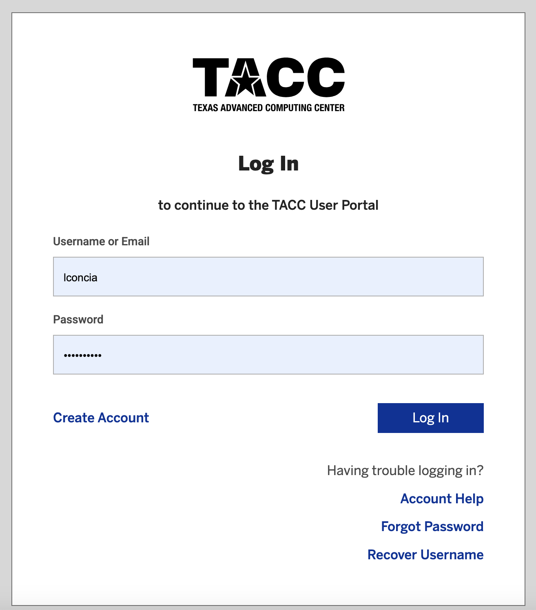
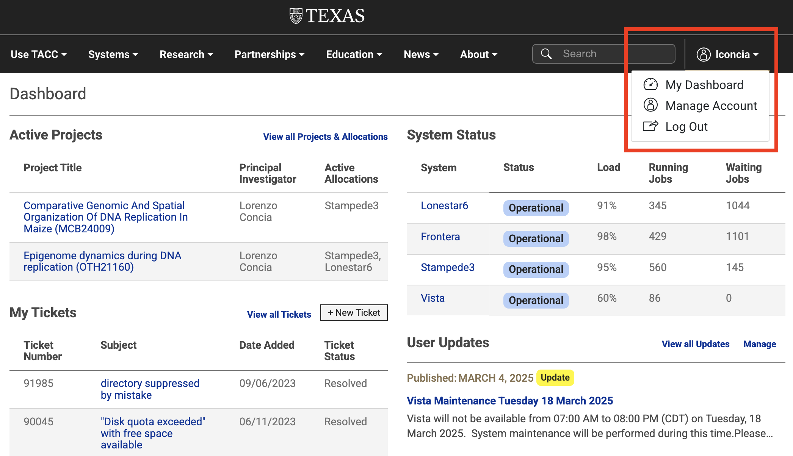
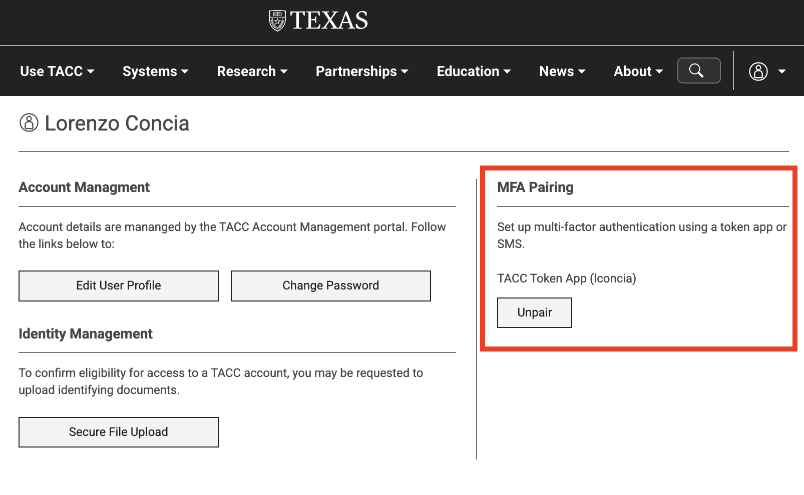

Introduction to High Performance Computing
==========================================

High Peformance Computing (HPC) refers to the aggregation of computing resources (i.e.
supercomputers or clusters) to achieve performance far greater than a single workstation or server.
By the end of this section, you should be able to:

* Describe basic HPC architecture
* Log in to a remote HPC system at TACC
* Navigate the TACC file systems
* Transfer files to and from TACC systems

Basic HPC System Architecture
-----------------------------

As you prepare to use TACC systems for this workshop, it is important to understand the basic
architecture. We can think of an HPC systeam as a very large and complicated laboratory instrument.
Users need to learn how to:

* Interface with it / push the right buttons (Linux)
* Load samples (transfer data)
* Run experiments (submit batch jobs)
* Interpret the results (perform data analysis / vis)

.. image:: ./images/hpc_schematic.png
   :target: ./images/hpc_schematic.png
   :alt: HPC System Architecture

**IMPORTANT: Login vs. Compute Nodes**

An HPC system has login nodes and compute nodes. We cannot run applications on the **login nodes**
because they require too many resources and will interrupt the work of others. Instead, we must
submit a job to a queue to run on **compute nodes**.

Systems Available at TACC
-------------------------

Clusters
^^^^^^^^

* `Frontera <https://tacc.utexas.edu/systems/frontera/>`_: The fastest academic supercomputer in the
  world, providing computational capability that makes larger, more complex research challenges
  possible.
* `Vista <https://tacc.utexas.edu/systems/vista/>`_: Vista expands TACC's capacity for AI and
  ensures that the broadscience, engineering, and education research communities have access to the
  most advanced computing and AI technologies.
* `Stampede3 <https://tacc.utexas.edu/systems/stampede3/>`_: The newest strategic resource advancing
  NSF's supercomputing ecosystem for the nation's open science community.
* `Lonestar6 <https://tacc.utexas.edu/systems/lonestar6/>`_: Supporting Texas researchers in
  providing simulation, data analysis, visualization, and AI/machine learning.
* `Jetstream2 <https://tacc.utexas.edu/systems/jetstream2/>`_: A user-friendly, scalable cloud
  environment with reproducible, sharable computing on geographically isolated clouds.

Storage Systems
^^^^^^^^^^^^^^^

* `Corral <https://tacc.utexas.edu/systems/corral/>`_: Storage and data management resource designed
  and optimized to support large-scale collections and a collaborative research environment.
* `Ranch <https://tacc.utexas.edu/systems/ranch/>`_: Long-term data archiving environment designed,
  implemented, and supported to provide storage for data sets of the TACC user community.
* `Stockyard <https://tacc.utexas.edu/systems/stockyard/>`_: Global file system at the center of
  TACC's system ecosystem that supports data-driven science by providing online storage of large
  datasets, and offers migration for further data management and archiving.

File Systems
^^^^^^^^^^^^

The account-level environment variables ``$HOME``, ``$WORK``, and ``$SCRATCH`` store the paths to
directories that you own on each of these file systems. 
 
+---------------------+-----------------------------------+--------------------------------------------------------------------------------------------------------------------+
| File System         | Quota                             | Key Features                                                                                                       | 
+=====================+===================================+====================================================================================================================+
| ``$HOME``           |- 25GB                             |- Backed up.                                                                                                        |
|                     |- 200,000 files                    |- Recommended Use: scripts and templates, environment settings, compilation, cron jobs                              |
+---------------------+-----------------------------------+--------------------------------------------------------------------------------------------------------------------+
| ``$WORK``           |- 1TB                              |- NOT backed up.                                                                                                    |
|                     |- 3,000,000 files                  |- Recommended Use: software installations, original datasets that can't be reproduced.                              |
+---------------------+-----------------------------------+--------------------------------------------------------------------------------------------------------------------+
| ``$SCRATCH``        |- No quota assigned                |- NOT backed up.                                                                                                    |
|                     |                                   |                                                                                                                    |
|                     |                                   |- Recommended Use: Reproducible datasets, I/O files: temporary files, checkpoint/restart files, job output files    |
+---------------------+-----------------------------------+--------------------------------------------------------------------------------------------------------------------+

Files in ``$SCRATCH`` are subject to purge if access time is more than 10 days old.

Create an Account
-----------------

Authentication 
^^^^^^^^^^^^^^

To log in to TACC systems and participate in this workshop, you will need a TACC account and must
have set up multi-factor authentication using a token app or SMS.  You can do this by visiting the
`TACC portal <https://tacc.utexas.edu/portal/login>`_:

Then clicking on your username at the top right of the page:

And selecting "Manage Account", and, under MFA Pairing, clicking to pair:

You can find more details about MFA Pairing `here <https://docs.tacc.utexas.edu/basics/mfa/>`_.

.. tip::
   
   In your **TACC portal**, you can also view your allocations, open tickets, and the systems along
   with their current status.

Connecting to the Machines
--------------------------

This training will be fully interactive. Participants are **strongly encouraged** to follow along on
the command line. In this workshop, for commands on the local system we will use:

.. code-block:: console

   [local]$

And commands on remote systems will resemble:

.. code-block:: console

   [frontera]$ 

or:

.. code-block:: console

   [vista]$

Connecting to Frontera
^^^^^^^^^^^^^^^^^^^^^^

To log in to Frontera, follow the instructions for your operating system below.

Mac / Linux (Use Terminal)
~~~~~~~~~~~~~~~~~~~~~~~~~~

Open the application 'Terminal' and:

.. code-block:: console
   
   [local]$ ssh username@frontera.tacc.utexas.edu

   To access the system:
   
   1) If not using ssh-keys, please enter your TACC password at the password prompt
   2) At the TACC Token prompt, enter your 6-digit code followed by <return>.

   (enter password)
   (enter 6-digit token)

Windows (Use WSL2 or an SSH Client)
~~~~~~~~~~~~~~~~~~~~~~~~~~~~~~~~~~~

Open the application WSL2 :

.. code-block:: console
   
   [local]$ ssh username@frontera.tacc.utexas.edu

   To access the system:
   
   1) If not using ssh-keys, please enter your TACC password at the password prompt
   2) At the TACC Token prompt, enter your 6-digit code followed by <return>.

   (enter password)
   (enter 6-digit token)

Or open an SSH client like `PuTTY <https://www.chiark.greenend.org.uk/~sgtatham/putty/latest.html>`_:

.. code-block:: console

   Open the application 'PuTTY'
   enter Host Name: frontera.tacc.utexas.edu
   (click 'Open')
   (enter username)
   (enter password)
   (enter 6-digit token)

Successful Login to Frontera
~~~~~~~~~~~~~~~~~~~~~~~~~~~~

If your login was successful, your terminal will look something like this:

.. code-block:: console 

   ------------------------------------------------------------------------------
                      Welcome to the Frontera Supercomputer
         Texas Advanced Computing Center, The University of Texas at Austin
   ------------------------------------------------------------------------------
   
                 ** Unauthorized use/access is prohibited. **
   
   If you log on to this computer system, you acknowledge your awareness
   of and concurrence with the UT Austin Acceptable Use Policy. The
   University will prosecute violators to the full extent of the law.
   
   TACC Usage Policies:
   http://www.tacc.utexas.edu/user-services/usage-policies/
   ______________________________________________________________________________
   
   Welcome to Frontera, *please* read these important system notes:
   
   --> Frontera user documentation is available at:
          https://portal.tacc.utexas.edu/user-guides/frontera
   
   ---------------------- Project balances for user lconcia ----------------------
   | Name           Avail SUs     Expires |                                      |
   | TACC-SCI          100918  2025-06-30 |                                      |
   ------------------------ Disk quotas for user lconcia -------------------------
   | Disk         Usage (GB)     Limit    %Used   File Usage       Limit   %Used |
   | /home1              2.5      25.0     9.96         4974      200000    2.49 |
   | /work2            698.0    1024.0    68.16       311422     3000000   10.38 |
   | /scratch1           0.0       0.0     0.00          146           0    0.00 |
   | /scratch2           0.0       0.0     0.00            1           0    0.00 |
   | /scratch3           0.0       0.0     0.00            1           0    0.00 |
   -------------------------------------------------------------------------------

A Note About Quotas
^^^^^^^^^^^^^^^^^^^

The welcome message you receive upon successful login to Frontera has useful information
for you to keep track of. Especially of note is the breakdown of disk quotas for your account,
as you can keep an eye on whether your usage is nearing the determined limit. 

Once your usage is nearing the quota, you'll start to experience issues that will not only
impact your own work, but also impact the system for others. For example, if you're nearing
your quota in ``$WORK``, and your job is repeatedly trying (and failing) to write to ``$WORK``,
you will stress that file system.

.. tip::

   Another useful way to monitor your disk quotas (and TACC project balances) at any time is to
   execute:
   
   .. code-block:: console
   
      [frontera]$ /usr/local/etc/taccinfo

Data Management
---------------

Creating and Changing Folders
^^^^^^^^^^^^^^^^^^^^^^^^^^^^^

On a Windows or Mac desktop, our present location determines what files and folders we can access. I
can "see" my present location visually with the help of the graphic interface - I could be looking
at my Desktop, or the contents of a folder, for example. In a Linux command-line interface, we lack
the same visual cues to tell us what our location is. Instead, we use a command - ``pwd`` (print
working directory) - to tell us our present location. Try executing this command on Frontera:

.. code-block:: console

   [frontera]$ pwd
   /home1/03302/lconcia

This home location on the Linux filesystem is unique for each user, and it is roughly analogous to
C:\\Users\\username on Windows, or /Users/username on Mac.

To see what files and folders are available at this location, use the ``ls`` (list) command:

.. code-block:: console

   [frontera]$ ls

I have no files or folders in my home directory yet, so I do not get a response. We can create some
folders using the ``mkdir`` (make directory) command. The words  'folder' and 'directory' are
interchangeable:

.. code-block:: console

   [frontera]$ mkdir folder1
   [frontera]$ mkdir folder2

.. code-block:: console

   [frontera]$ ls
   folder1 folder2

Now we have some folders to work with. To "open" a folder, navigate into that folder using the
``cd`` (change directory) command. This process is analogous to double-clicking a folder on Windows
or Mac:

.. code-block:: console

   [frontera]$ pwd
   /home1/03302/lconcia
   [frontera]$ cd folder1
   [frontera]$ pwd
   /home1/03302/lconcia/folder1

Use ``ls`` to list the contents. What do you expect to see?

.. code-block:: console

   [frontera]$ ls

There is nothing there because we have not made anything yet. Next, we will navigate back to the 
home directory. So far we have seen how to navigate "down" into folders, but how do we navigate 
back "up" to the parent folder? There are different ways to do it. For example, we could use a
shortcut, ``..``,  which refers to the **parent folder** - one level higher than the current
location:

.. code-block:: console

   [frontera]$ cd ..
   [frontera]$ pwd
   /home1/03302/lconcia

We are back in our home directory. Instead, we could specify the complete path of where we want to
go, in this case ``cd /home1/03302/lconcia``. Finally, let's remove the directories we have made,
using ``rmdir`` to remove our folder ``folder1`` and any contents. The ``-r`` command line
option recursively removes subfolders and files located "down" the parent directory. ``-r`` is
required for folders.

.. code-block:: console

   [frontera]$ rm -r folder1
   [frontera]$ ls 
   folder2

Transferring Files to and from Frontera
^^^^^^^^^^^^^^^^^^^^^^^^^^^^^^^^^^^^^^^

To practice transferring files to Frontera's ``$WORK`` and ``$SCRATCH``, we need to identify the 
path to our ``$WORK`` and ``$SCRATCH`` directory.  To identify these paths, we can use helpful
command shortcuts.

To identify the path to our ``$WORK`` directory, we can use ``cd $WORK`` or the helpful shortcut
``cdw``:

.. code-block:: console
   
   [frontera]$ cdw
   [frontera]$ pwd
   /work2/03302/lconcia/frontera

To identify the path to our ``$SCRATCH`` directory, we can use ``cd $SCRATCH`` or the helpful
shortcut ``cds``:

.. code-block:: console
   
   [frontera]$ cds
   [frontera]$ pwd
   /scratch1/03302/lconcia

Copying files from your local computer to Frontera's ``$WORK`` requires the ``scp`` command. This
should be available in your local Terminal (Mac/Linux) or WSL2 (Windows):

.. code-block:: console

   [local]$ scp my_file lconcia@frontera.tacc.utexas.edu:/work2/03302/lconcia/frontera
   (enter password)
   (enter token)

In this command, you specify the name of the file you want to transfer (``my_file``), the username
(``lconcia``), the hostname (``frontera.tacc.utexas.edu``), and the path you want to put the file
(``/work2/03302/lconcia/frontera``). Take careful notice of the separators including spaces, the @
symbol, and the colon. 

Copying files from your local computer **to** Frontera's ``$SCRATCH`` using ``scp``:

.. code-block:: console

   [local]$ scp my_file lconcia@frontera.tacc.utexas.edu:/scratch1/03302/lconcia/frontera
   (enter password)
   (enter token)

Copy files **from** Frontera to your local computer using the following:

.. code-block:: console

   [local]$ scp lconcia@frontera.tacc.utexas.edu:/work2/03302/lconcia/frontera/my_file ./
   (enter password)
   (enter token)

.. note::

   If you wanted to copy ``my_file`` from ``$SCRATCH``, the path you would specify after the
   colon would be ``/scratch1/03302/lconcia/frontera/my_file``.

Instead of files, full directories can be copied using the "recursive" flag (``scp -r ...``). See
additional example ``scp`` usage `here <https://en.wikipedia.org/wiki/Secure_copy>`__.

EXERCISE
~~~~~~~~

1. Download the file `firststeps.zip <https://github.com/TACC/life_sciences_ml_at_tacc/raw/refs/heads/main/docs/section1/files/firststeps.zip>`_
   to your local laptop.
2. Login to Frontera.
3. Identify your ``$WORK`` directory path using ``cdw`` and ``pwd``.
4. From your local computer, copy the file ``firststeps.zip`` to Frontera. (You will need to know where
   the file ``firststeps.zip`` was downloaded on your local computer and navigate to this folder.)
5. Login to Frontera, navigate to your ``$WORK``, and unzip the file using ``unzip firststeps.zip``.

.. toggle:: Click to show the answer

   1. Download the file `firststeps.zip <https://github.com/TACC/life_sciences_ml_at_tacc/raw/refs/heads/main/docs/section1/files/firststeps.zip>`_.

   2. Login to Frontera:

      .. code-block:: console
   
         [local]$ ssh username@frontera.tacc.utexas.edu
         (enter password)
         (enter 6-digit token)

   3. Identify your ``$WORK`` directory path using ``cdw`` and ``pwd``.

      .. code-block:: console

         [frontera]$ cdw
         [frontera]$ pwd
         /work2/03302/lconcia/frontera
         [frontera]$ logout

   4. From your local computer, copy the file ``firststeps.zip`` to Frontera. (You will need to know
      where the file ``firststeps.zip`` was downloaded on your local computer and navigate to this
      folder.)

      .. code-block:: console

         [local]$ scp firststeps.zip lconcia@frontera.tacc.utexas.edu:/work2/03302/lconcia/frontera
         (enter password)
         (enter token)

   5. Login to Frontera, navigate to your ``$WORK``, and unzip the file using
      ``unzip firststeps.zip``.

      .. code-block:: console

         [local]$ ssh username@frontera.tacc.utexas.edu
         (enter password)
         (enter 6-digit token)
         [frontera]$ cdw
         [frontera]$ unzip firststeps.zip

   .. hint::

      Avoid multiple logins by using ``wget`` to download files from the internet directly to
      Frontera.

Tips for Success
----------------

Read the `documentation <https://docs.tacc.utexas.edu/>`_.

* Learn node schematics, limitations, file systems, rules
* Learn about the scheduler, queues, policies
* Determine the right resource for the job

User Responsibility on Shared Resources
^^^^^^^^^^^^^^^^^^^^^^^^^^^^^^^^^^^^^^^

HPC systems are shared resources. Your jobs and activity on a cluster, if mismanaged,
can affect others. TACC staff are always
`available to help <https://www.tacc.utexas.edu/about/help/>`_.

Review of Topics Covered
------------------------

+------------------------------------+-------------------------------------------------+
| Command                            |  Effect                                         |
+====================================+=================================================+
| ``pwd``                            |  print working directory                        |
+------------------------------------+-------------------------------------------------+
| ``ls``                             |  list files and directories                     |
+------------------------------------+-------------------------------------------------+
| ``mkdir dir_name``                 |  make a new directory                           |
+------------------------------------+-------------------------------------------------+
| ``cd dir_name/``                   |  navigate into a directory                      |
+------------------------------------+-------------------------------------------------+
| ``rm -r dir_name/``                |  remove a directory and its contents            |
+------------------------------------+-------------------------------------------------+
| ``.`` or ``./``                    |  refers to the present location                 |
+------------------------------------+-------------------------------------------------+
| ``..`` or ``../``                  |  refers to the parent directory                 |
+------------------------------------+-------------------------------------------------+
| ``cd $WORK``, ``cdw``              |  Navigate to ``$WORK`` file system              |
+------------------------------------+-------------------------------------------------+
| ``cd $SCRATCH``, ``cds``           |  Navigate to ``$SCRATCH`` file system           |
+------------------------------------+-------------------------------------------------+
| ``scp local remote``               |  Copy a file from local to remote               |
+------------------------------------+-------------------------------------------------+
| ``scp remote local``               |  Copy a file from remote to local               |
+------------------------------------+-------------------------------------------------+

Additional Resources
--------------------

* `TACC account set up <https://tacc.utexas.edu/portal/login>`_
* `TACC documentation <https://docs.tacc.utexas.edu/>`_
* `TACC help desk <https://www.tacc.utexas.edu/about/help>`_
* `SCP examples <https://en.wikipedia.org/wiki/Secure_copy>`_
