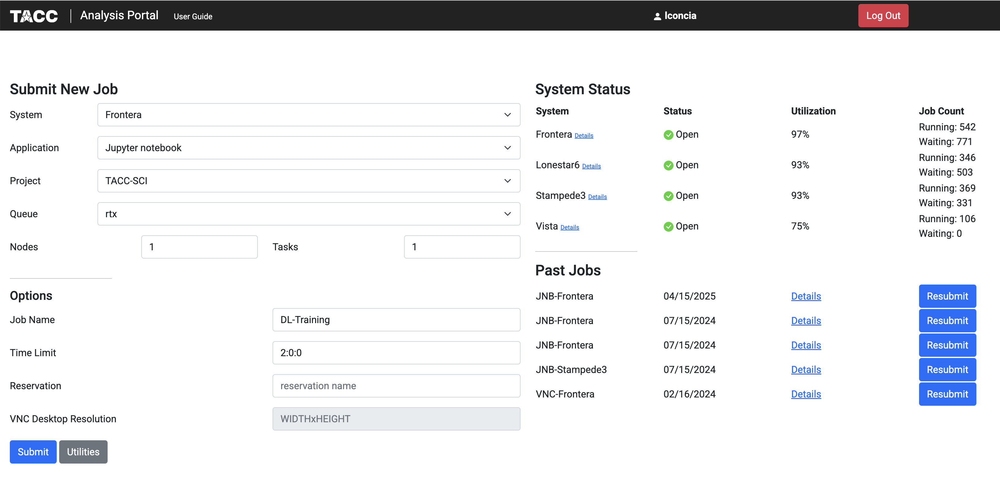
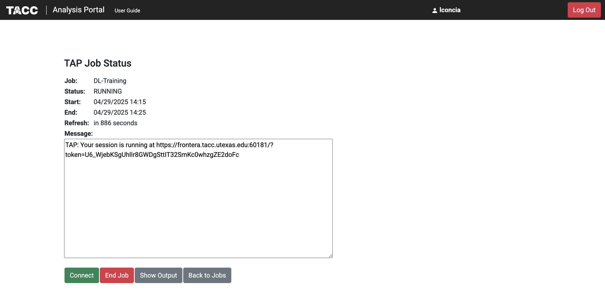
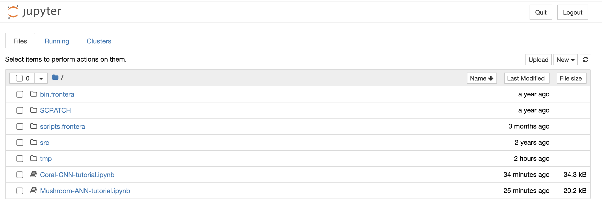
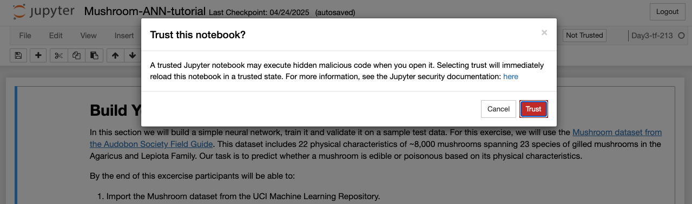
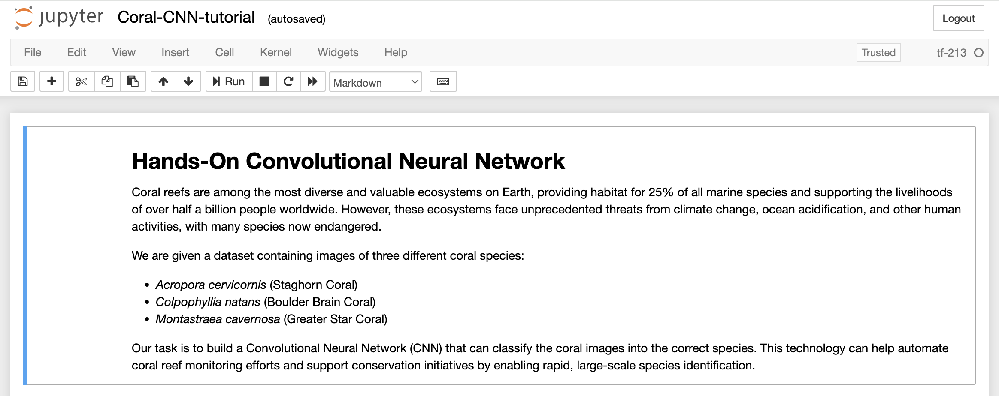

Set up for Tutorials
====================

Set up for Deep Learning Tutorial
---------------------------------

This repository contains hands-on tutorials and materials that accompany
the `Deep Learning
section <https://life-sciences-ml-at-tacc.readthedocs.io/en/latest/section3/overview.html>`__
of the Life Sciences Machine Learning Institute at the `Texas Advanced
Computing Center (TACC) <https://tacc.utexas.edu/>`__.

.. _1-accessing-frontera:

1. Accessing Frontera
^^^^^^^^^^^^^^^^^^^^^

Log into Frontera using SSH:

.. code:: bash

   ssh username@frontera.tacc.utexas.edu
   (username@frontera.tacc.utexas.edu) Password: 
   (username@frontera.tacc.utexas.edu) TACC Token Code:

   # ------------------------------------------------------------------------------
   # Welcome to the Frontera Supercomputer
   # Texas Advanced Computing Center, The University of Texas at Austin
   # ------------------------------------------------------------------------------

.. _2-getting-the-tutorial-materials:

2. Getting the Tutorial Materials
^^^^^^^^^^^^^^^^^^^^^^^^^^^^^^^^^

Navigate to your scratch directory and clone this tutorial repository:

.. code:: bash

   cds # shortcut for cd #SCRATCH
   git clone https://github.com/kbeavers/tacc-deep-learning-tutorials.git

.. _3-environment-setup:

3. Environment Setup
^^^^^^^^^^^^^^^^^^^^

.. _a-start-an-interactive-session:

a. Start an Interactive Session
~~~~~~~~~~~~~~~~~~~~~~~~~~~~~~~

.. code:: bash

   cds
   idev -m 20

.. _b-set-up-the-container-environment:

b. Set up the Container Environment
~~~~~~~~~~~~~~~~~~~~~~~~~~~~~~~~~~~

.. code:: bash

   # Load the Apptainer module
   module load tacc-apptainer

   # Pull the Docker container image created for this tutorial
   apptainer pull docker://kbeavers/tf-213:frontera

   # Run the kernel setup script
   cd tacc-deep-learning-tutorials
   bash ./scripts/install_kernel.sh

.. _4-dataset-preparation:

4. Dataset Preparation
^^^^^^^^^^^^^^^^^^^^^^

Extract the provided coral species image dataset

.. code:: bash

   bash ./scripts/download_dataset.sh

.. _5-launching-the-tutorial:

5. Launching the Tutorial
^^^^^^^^^^^^^^^^^^^^^^^^^

.. _a-copy-the-tutorial-notebooks-to-your-home-directory:

a. Copy the tutorial notebooks to your home directory
~~~~~~~~~~~~~~~~~~~~~~~~~~~~~~~~~~~~~~~~~~~~~~~~~~~~~

.. code:: bash

   cp ./tutorials/Mushroom-ANN-tutorial.ipynb $HOME/
   cp ./tutorials/Coral-CNN-tutorial.ipynb $HOME/

These notebooks are provided as blank templates for you to fill in as
you work through the exercises. To complete this tutorial:

1. Follow the step-by-step instructions on our
   `ReadTheDocs <https://life-sciences-ml-at-tacc.readthedocs.io/en/latest/section3/overview.html>`__.
2. Write the code from the ReadTheDocs page into the corresponding empty
   cells in your notebook.
3. Execute each cell to build your ANN/CNN and see the results.

If you get stuck, a completed solution is available within the
``tutorials`` directory of this repository.

.. _b-access-the-tacc-analysis-portal-and-configure-your-session-as-follows:

b. Access the `TACC Analysis Portal <https://tap.tacc.utexas.edu/jobs/>`__ and configure your session as follows:
~~~~~~~~~~~~~~~~~~~~~~~~~~~~~~~~~~~~~~~~~~~~~~~~~~~~~~~~~~~~~~~~~~~~~~~~~~~~~~~~~~~~~~~~~~~~~~~~~~~~~~~~~~~~~~~~~

-  System: Frontera
-  Application: Jupyter Notebook
-  Project:
-  Queue: rtx
-  Job Name: DL-Training
-  Time Limit: 2:0:0
-  Reservation: (or leave blank if no reservation)

.. _c-final-steps:

c. Final Steps:
~~~~~~~~~~~~~~~

-  Click 'Submit' and wait for the job to start
-  Click 'Connect' when the a node becomes available

 

- The TAP job will open the user $HOME directory. Open ``Mushroom-ANN-tutorial.ipynb`` or ``Coral-CNN-tutorial.ipynb``.

-  Change your kernel to ``tf-213``. Click on the menu ``kernel``, then ``Change kernel``, and select the kernel ``tf-213``. Trust the kernel by clicking on the button "Not trusted" at the top right 

.. image::  ./images/TAP_4.kernel_change.png
   :target: ./images/TAP_4.kernel_change.png
   :alt:  Figure 4 Changing the kernel version ant trust the kernel

-  The Jupyter notebook will ask confirmation before trusting the kernel.

-  After clicking "trust" on the confirmation button, the button at the top right will appear as "Trusted".

-  The Jupyer notebook will be ready to be run. Note: The kernel may take a few moments to initialize on first use.

Set up for the CNN Tutorial
---------------------------

On Day 3 we will run a hands-on Convolutional Neural Network (CNN) tutorial.
Here we provide the instruction to retrieve the necessary files and set up the enviroment.

1. Accessing Frontera
^^^^^^^^^^^^^^^^^^^^^

Log in to Frontera using SSH:

.. code-block:: bash
    
    ssh username@frontera.tacc.utexas.edu
    (username@frontera.tacc.utexas.edu) Password: 
    (username@frontera.tacc.utexas.edu) TACC Token Code:

    # ------------------------------------------------------------------------------
    # Welcome to the Frontera Supercomputer
    # Texas Advanced Computing Center, The University of Texas at Austin
    # ------------------------------------------------------------------------------

2. Getting the Tutorial Materials
^^^^^^^^^^^^^^^^^^^^^^^^^^^^^^^^^

Navigate to your $SCRATCH directory and clone the tutorial repository:

.. code-block:: bash

    cds  # shortcut for cd $SCRATCH
    git clone git@github.com:kbeavers/coral-species-CNN-tutorial.git

3. Environment Setup
^^^^^^^^^^^^^^^^^^^^

a) Start an Interactive Session:

.. code-block:: bash

    cds
    idev -m 20

b) Set up the Container Environment:

.. code-block:: bash

    # Load the apptainer module
    module load tacc-apptainer

    # Pull the Docker container image created for this tutorial
    apptainer pull docker://kbeavers/tf-cuda101-frontera:0.1

    # Run the kernel setup script
    bash ./coral-species-CNN-tutorial/scripts/install_kernel.sh

4. Dataset Preparation
^^^^^^^^^^^^^^^^^^^^^^

Extract the provided coral species image dataset:

.. code-block:: bash

    cd coral-species-CNN-tutorial
    bash ./scripts/download_dataset.sh

5. Launching the Tutorial
^^^^^^^^^^^^^^^^^^^^^^^^^

a) Copy the tutorial notebook to your $HOME directory:

.. code-block:: bash

    cp ./tutorials/Coral-CNN.ipynb $HOME/

b) Access the TACC Analysis Portal and configure your session as follows:

   - System: Frontera
   - Application: Jupyter Notebook
   - Project: <your-allocation>
   - Queue: rtx
   - Job Name: CNN-Training
   - Time Limit: 2:0:0
   - Reservation: <your-reservation>

c) Final Steps:

   - Click 'Submit' and wait for the job to start
   - Click 'Connect' when available
   - Open ``Coral-CNN.ipynb`` in your $HOME directory
   - Change your kernel to ``tf-cuda101``
   - Trust the kernel if necessary

Note: The kernel may take a few moments to initialize on first use. 

6. Check GPU Availability
^^^^^^^^^^^^^^^^^^^^^^^^^

Before training deep learning models on HPC systems, it's important to check whether TensorFlow can access the GPU. 
Training on a GPU is significantly faster than on a CPU, especially for large image datasets.

If you've followed the setup instructions in the previous section, and you've run the ``install_kernel.sh`` script on Frontera, you should now be running the tutorial notebook inside a containerized Jupyter kernel that includes:

- TensorFlow (v. _____) with GPU support
- CUDA libraries compatible with the system 
- All required Python packages pre-installed

To confirm that your environment is correctly configured, run the following code cell in the tutorial notebook (TIP: Make sure to change your kernel to ``tf-cuda101``):

.. code-block:: python

    import tensorflow as tf

    # Check if TensorFlow can detect the GPU
    print("Num GPUs Available: ", len(tf.config.list_physical_devices('GPU')))

    # Print TensorFlow version
    print(tf.__version__)

