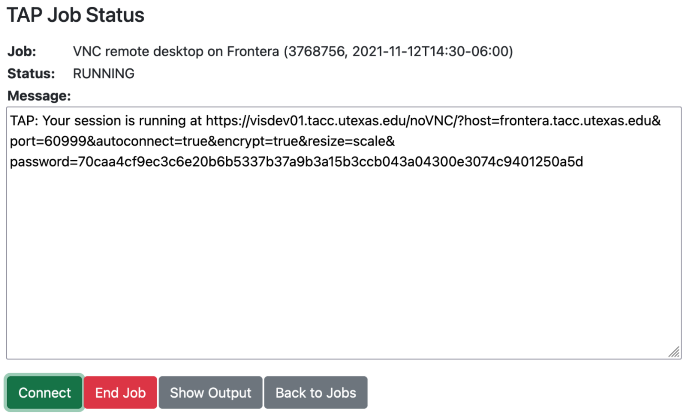
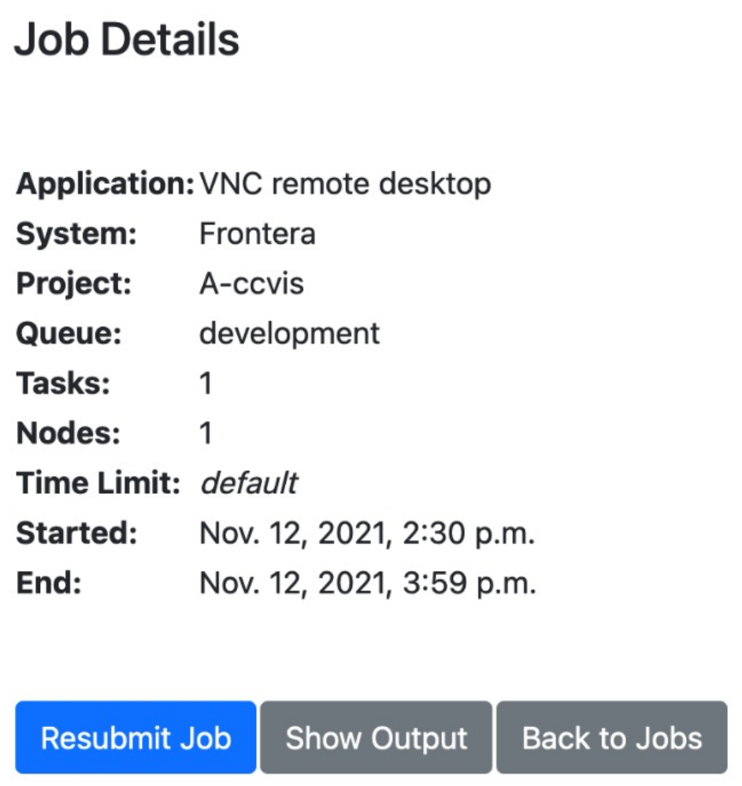
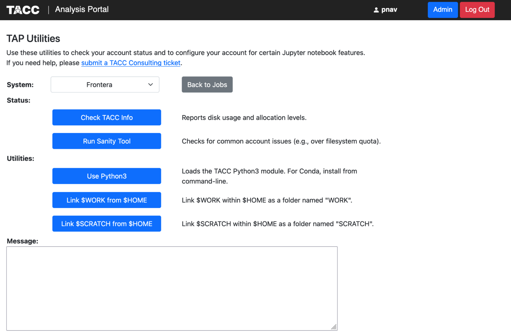
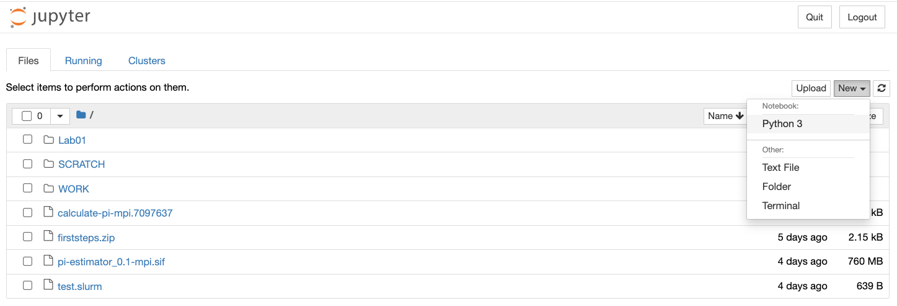
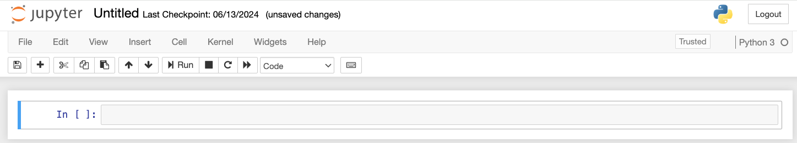
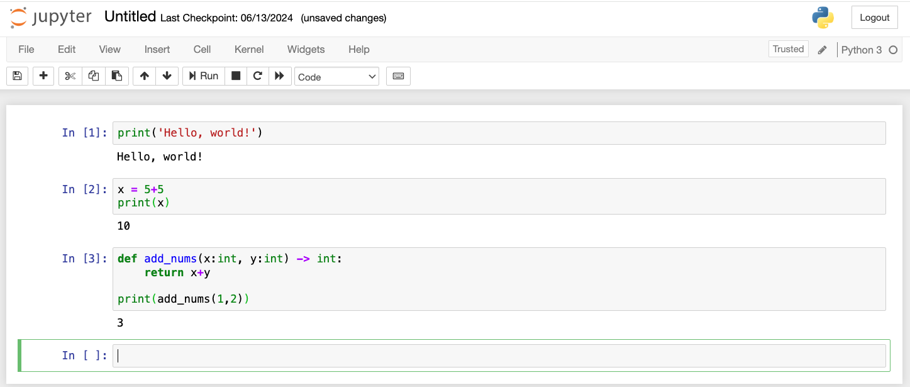
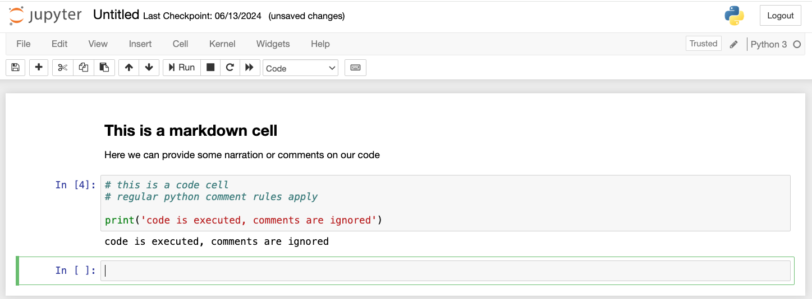
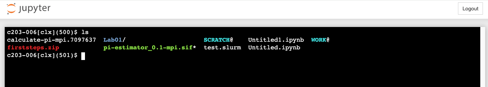
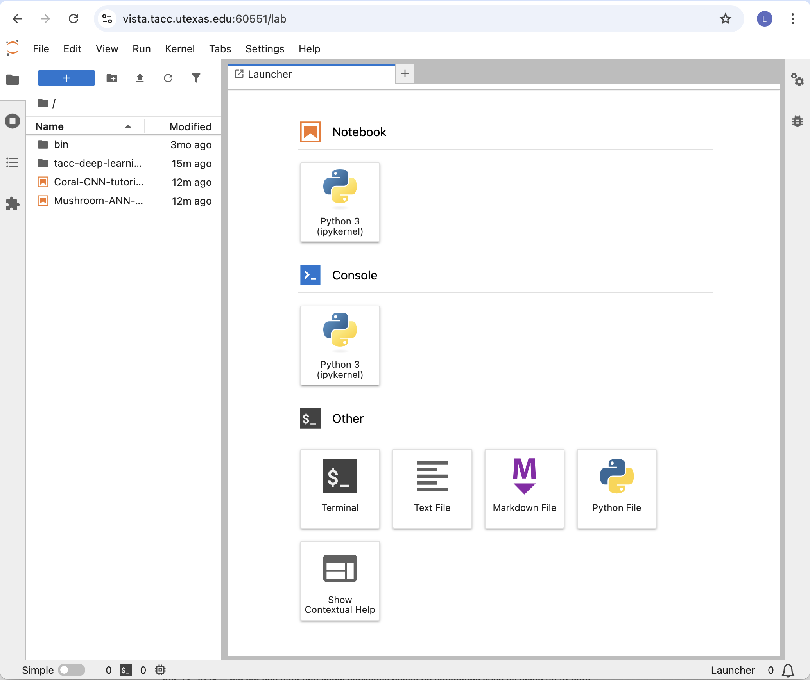
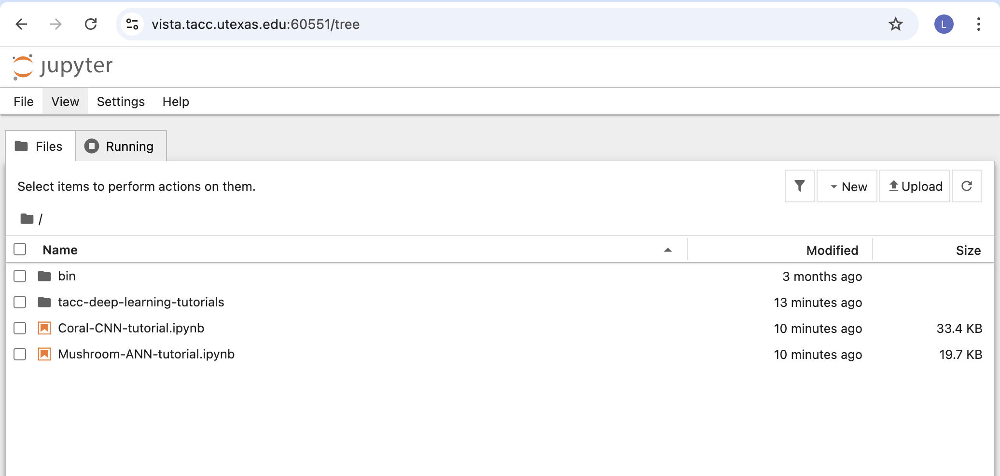

TACC Analysis Portal
====================

The `TACC Analysis Portal (TAP) <https://tap.tacc.utexas.edu/>`_ is a web-based portal that provides
access to interactive sessions on TACC HPC systems. TAP-supported applications include Desktop Cloud
Visualization (DCV) remote desktop, Jupyter Notebooks, and RStudio. Any user with an allocation on 
one of TACC's HPC systems can log in to TAP and use the services. Over the course of this workshop,
we will be using TAP to launch Jupyter Notebooks and DCV remote desktop sessions as a convenient way
to interatively write/run Python code and build/train machine learning models. By the end of this
section, you should be able to:

* Log in to the TACC Analysis Portal
* Submit a Jupyter Notebook job to a TACC system
* Connect to a Jupyter Notebook session
* Choose the correct Jupyter kernel
* Run simple Python code in a Jupyter Notebook

Accessing the Portal
--------------------

Log in to the `TAP <https://tap.tacc.utexas.edu/>`_ using the same username and password that you
use to access the TACC User Portal. Once you've logged in you'll be directed to the Home Screen
where you can begin scheduling jobs.

.. image::  ./images/1TAP.png
   :alt:  Figure 1. TAP Home Screen

Job Management
--------------

Submitting a Job
^^^^^^^^^^^^^^^^

.. raw:: html

   Submitting a job on TAP
   requires the following inputs:  
   <b>&nbsp( 1 )&nbsp</b>

* **System:** where the job will run. The system selector drop-down will contain the TAP-supported
  TACC systems where you have an allocation. The system must be selected first, as the values of the
  other selectors are determined by the selected system. 
* **Application:** which application the job will run. The application selector will contain the
  applications available on the selected system (DCV, VNC, Jupyter, or RStudio)
* **Project:** which project allocation to bill for the job run. The project selector will contain
  the projects associated with your account on the selected system.  
* **Queue:** which system queue will receive the job. The queue selector will contain the
  TAP-supported queues on the selected system.  
* **Nodes:** the number of nodes the job will occupy. We recommend leaving this setting at 1 unless
  you know you need more nodes. This is equivalent to the `-N` option in SLURM.  
* **Tasks:** the number of MPI tasks the job will use. We recommend leaving this setting at 1 unless
  you know you need more tasks. This is equivalent to the `-n` option in SLURM.  

.. raw:: html

   A TAP job also accepts these
   additional optional inputs:  
   <b>&nbsp( 2 )&nbsp</b>
 
* **Time Limit:** how long the job will run. If left blank, the job will use the TAP default runtime
  of 2 hours.  
* **Reservation:** the reservation in which to run the job. If you have a reservation on the
  selected system and want the job to run within that reservation, specify the name here.  
* **VNC Desktop Resolution:** desktop resolution for a VNC job. If this is left blank, a VNC job
  will use the default resolution of 1024x768.  

.. raw:: html

   After specifying the job
   inputs, select the <b>Submit</b> 
   <b>&nbsp( 8 )&nbsp</b>   
    button, and your job will
   be submitted to the remote system. After submitting the job, you will be automatically redirected
   to the job status page. You can get back to this page from the <b>Status</b> 
   <b>&nbsp( 3 )&nbsp</b> 
    button. If the job is already
   running on the system, click the<b> Connect </b> 
   <b>&nbsp( 5 )&nbsp</b>
    button from the Home Screen
   or Job status to connect to your application.

|

|

Click the "Check Status" button to update the page with the latest job status. The diagnostic
information will include an estimated start time for the job if Slurm is able to provide one. Jobs
submitted to development queues typically start running more quickly than jobs submitted to other
queues.

Ending a Submitted Job 
^^^^^^^^^^^^^^^^^^^^^^

.. raw:: html

   When you are finished with 
   your job, you can end your job using the <b>End</b> 
   <b>&nbsp( 4 )&nbsp</b>   
   button on the TAP Home Screen
   page or on the Job Status page. Note that closing the browser window will not end the job. Also
   note that if you end the job from within the application (for example, pressing "Enter" in the
   red xterm in a DCV or VNC job), TAP will still show the job as running until you check status for
   the job, click "End Job" within TAP, or the requested end time of the job is reached.

|

Resubmitting a Past Job
^^^^^^^^^^^^^^^^^^^^^^^

.. raw:: html

   You can resubmit a past job
   using the<b> Resubmit </b>
   <b>&nbsp( 7 )&nbsp</b> 
   button from the Home Screen
   page. The job will be submitted with the same inputs used for the past job, including any
   optional inputs. Select  <b>Details</b> 
   <b>&nbsp( 6 ) </b>&nbsp; 
   to see the inputs that were
   specified for the past job. 

|

|
 

Utilities
---------

.. raw:: html

    TAP provides certain useful
    diagnostic and logistic utilities on the Utilities page. Access the Utilities page by selecting
    the <b>Utilities</b> <b>&nbsp( 9 )</b>
     &nbsp;button on the Home Screen page. 

|

|

Configuring Jupyter Notebook
^^^^^^^^^^^^^^^^^^^^^^^^^^^^

The Utilities section provides access to several common actions related to Jupyter Notebooks. 

* **"Use Python3"** sets the TACC Python3 module as part of your default modules so that TAP will
  use Python3 for Jupyter Notebooks. If you want to use a non-default Python installation, such as
  Conda, you will need to install it yourself via the system command line. TAP will use the first
  ``jupyter-notebook`` command in your ``$PATH``, so make sure that the command ``which
  jupyter-notebook`` returns the Jupyter Notebook you want to use. Conda install typically
  configures your environment so that Conda is first on your ``$PATH``.
* **"Link $WORK from $HOME"** and **"Link $SCRATCH from $HOME"** create symbolic links in your
  ``$HOME`` directory so that you can access ``$WORK`` and ``$SCRATCH`` from within a Jupyter
  Notebook. TAP launches Jupyter Notebooks from within your ``$HOME`` directory, so these other file
  systems are not reachable without such a linking mechanism. The links will show up as "WORK" and
  "SCRATCH" in the Jupyter file browser. You only need to create these links once and they will
  remain available for all future jobs.

.. warning::

   Vista by default does not have the Python3 module loaded, nor is it in the default module path.
   This means that if you try to run a Jupyter Notebook on Vista, it will return an error. To fix
   this, you must manually log in to Vista on the command line and perform the following steps:

   .. code-block:: console

      [vista]$ module load gcc
      [vista]$ module load python3
      [vista]$ module save

   This is a one-time setup step. After this, you can use TAP to launch Jupyter Notebooks on Vista.

Obtaining TACC Account Status 
^^^^^^^^^^^^^^^^^^^^^^^^^^^^^

The Status section provides system information and diagnostics. "Check TACC Info" will show account
balances and filesystem usage for the selected system. "Run Sanity Tool" performs a series of sanity
checks to catch common account issues that can impact TAP jobs (for example, being over filesystem
quota on your ``$HOME`` directory).

Troubleshooting TAP
-------------------

If you encounter an error while using TAP, or if your job status remains in "PENDING" for more than 
a few moments, alert with workshop instructors.

.. note::

   For this workshop, we will be using Frontera and Vista systems, and we will be launching both DCV
   sessions and Jupyter Notebooks. Each day has a unique reservation name. Make sure to choose the
   right system, application, and reservation name each day. If you are not sure, ask one of the
   instructors for help.

Using Jupyter Notebooks
-----------------------

When you connect to a Jupyter Notebook session, you will be presented with the default file browser
view. To start a new notebook, click on the "New" button in the top right corner and select the 
desired kernel. The default kernel is Python 3.

.. warning::

   The workshop instructors will configure your accounts with additional kernels, and will inform
   you which kernels should be selected for each day of the workshop.

Jupyter Notebook User Interface
-------------------------------

After selecting the kernel, you will be taken to the Jupyter Notebook user interface. The notebook
user interface is a web-based application that allows you to create and share documents that contain
live code, equations, visualizations, and narrative text. The notebook interface is designed to be
intuitive and easy to use. The main components of the Jupyter Notebook user interface are:

* **Notebook name**: The name displayed at the top of the page, next to the Jupyter logo, reflects
  the name of the ``.ipynb`` file. Clicking on the notebook name brings up a dialog which allows you
  to rename it.
* **Menu bar**: The menu bar contains various options for manipulating the notebook. You can use the
  menu bar to create new notebooks, open existing notebooks, save notebooks, and perform other
  operations.
* **Toolbar**: The tool bar gives a quick way of performing the most-used operations within the
  notebook, by clicking on an icon. For example, you can use the toolbar to execute code cells,
  insert new cells, and change the cell type.
* **Cells**: The main building blocks of Notebooks are the cells. Each cell can contain either code
  or text. You can add new cells, delete cells, and move cells around in the notebook. The order of
  the cells is important, as the output of one cell may depend on the input of another cell.
* **Output**: The output of the code will be displayed directly below the cell.

Code Cells
^^^^^^^^^^

Code cells are blocks of code that can be executed. You can write code in the cell and execute it by
either pressing the "Run" button in the toolbar or using the keyboard shortcut ``Shift+Enter``. The
output of the code will be displayed directly below the cell.

Jupyter Notebooks can also import Python libraries (with the ``import`` statement), be used to
define functions, display plots, and run any arbitrary Python code. Be aware that the order in which
you run the cells matters. For example, you must first import a library befor you can use it.

Markdown Cells
^^^^^^^^^^^^^^

Markdown cells are blocks of text that can be formatted using Markdown syntax. You can use Markdown
to create headings, lists, links, images, and other types of formatted text. To create a Markdown
cell, select the cell type from the drop-down menu in the toolbar and write your text using Markdown
syntax. You can execute the Markdown cell by pressing the "Run" button or using the keyboard
shortcut ``Shift+Enter``. The cell will be rendered as formatted text.

Markdown cells will follow standard Markdown syntax for formatting headings, lists, text emphasis,
etc. Please refer to the `Markdown documentation <https://www.markdownguide.org/cheat-sheet/>`_ for
more information on how to use Markdown syntax.

Saving .ipynb File
^^^^^^^^^^^^^^^^^^

The Jupyter Notebook can be saved as a ``.ipynb`` file by clicking on the "Save" button in the
toolbar. Saving a notebook will save the current state of the notebook, including all code cells,
output, and Markdown cells. However, if you re-open the notebook you will need to re-run the code
cells to see the output.

You can share Notebooks with others by sending them the ``.ipynb`` file. The recipient can open the
notebook in their own Jupyter Notebook environment and run the code cells to see the output. The
recipient will need to use the same kernel, or a kernel with the same libraries installed, in order
to run the code cells successfully.

Jupyter Terminal
----------------

Jupyter provides a terminal interface that allows you to run shell commands directly from the
notebook. You can open a terminal by clicking on the "New" button in the top right corner and
selecting "Terminal". The terminal will open in a new tab and you can run shell commands just like
you would in a regular terminal. This is useful for running shell commands, installing packages,
and performing other tasks that require a command line interface.

Switching Between Views
-----------------------

By default, Vista visualizes Jupyter in the "Lab" view.

   
To switch back to the standard "tree" view, edit the URL in your browser to replace the word "/lab"
with "/tree".

Additional Resources
--------------------

* `TACC Analysis Portal (TAP) <https://tap.tacc.utexas.edu/>`_
* `TAP documentation <https://docs.tacc.utexas.edu/tutorials/TAP/>`_
* `Jupter Notebooks <https://jupyter.org/>`_
* `Markdown guide <https://www.markdownguide.org/cheat-sheet/>`_
* `Installing kernels <https://aiml-environments-at-tacc.readthedocs.io/en/latest/ai_containers_tacc/Containerized%20Kernel%20for%20Jupyter%20Notebooks.html>`_