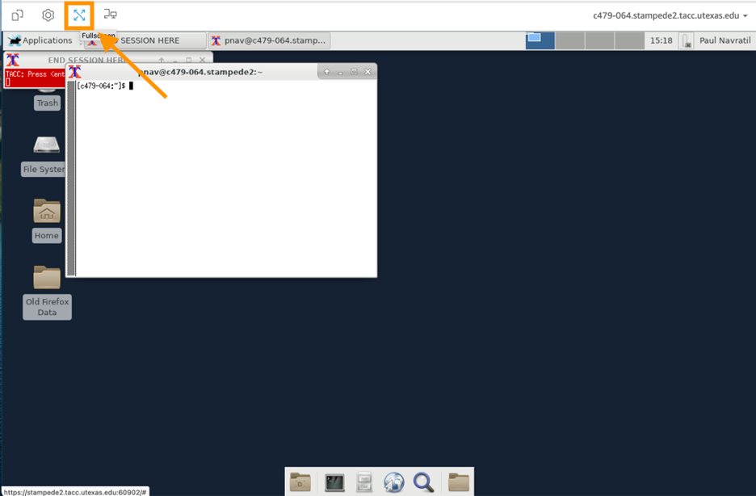
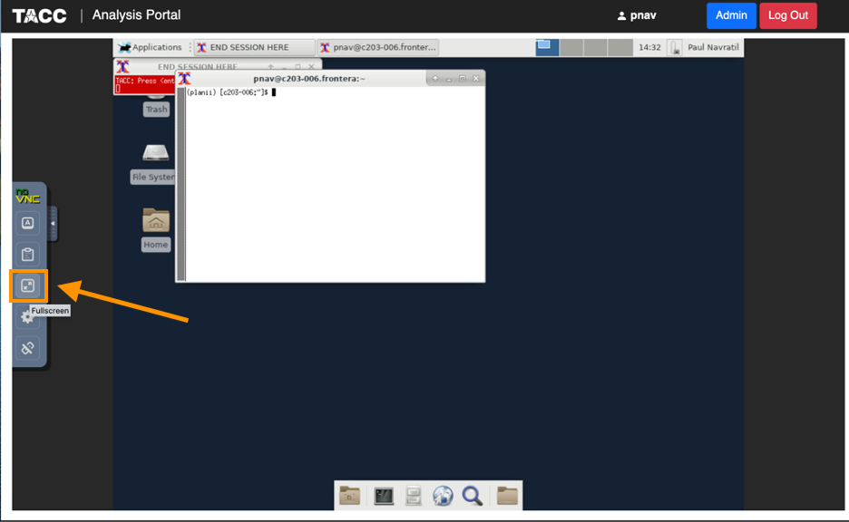
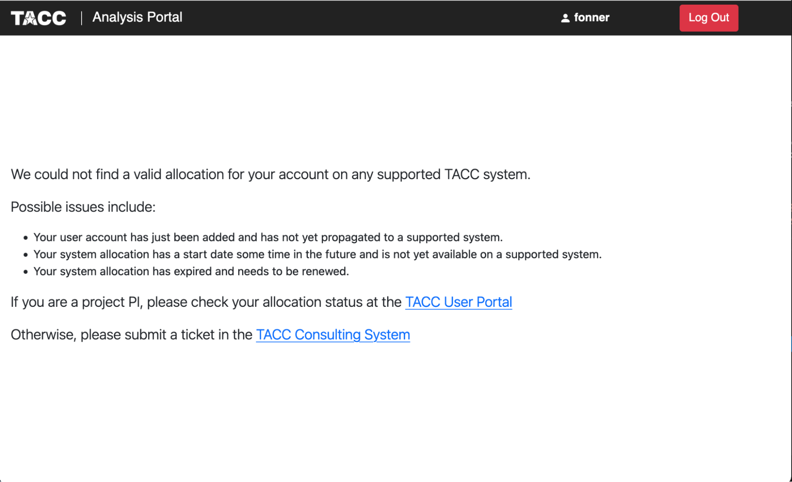
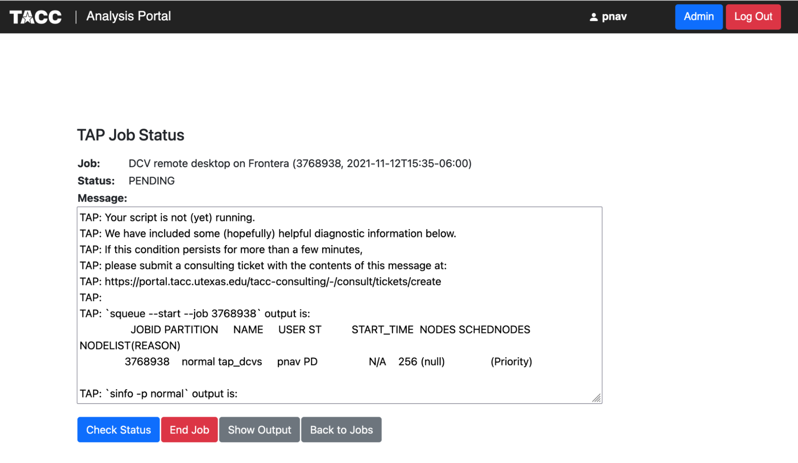
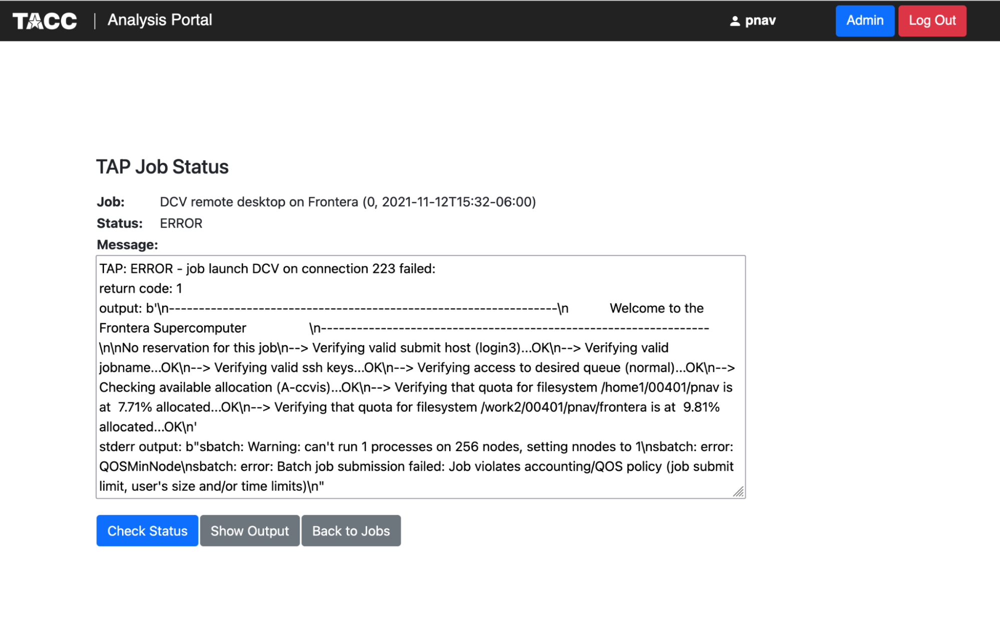

TACC Analysis Portal
====================

Over the next several units we will use the `TACC Analysis Portal <https://tap.tacc.utexas.edu/>`_
(TAP) to run interactive Jupyter Notebook sessions on TACC systems. TAP targets users who want the
convenience of web-based portal access while maintaining control over low-level job behavior.  

Any user with an allocation on one of TACC's HPC Systems, e.g. Frontera, Vista, Stampede3, and
Lonestar6, has access to the TACC Analysis Portal. TAP-Supported applications include:

* DCV (Desktop Cloud Visualization) remote desktop
* VNC (Virtual Network Computing) remote desktop
* **Jupyter Notebook**
* RStudio

By the end of this section, you should be able to:

* Log in to the TACC Analysis Portal
* Submit a Jupyter Notebook job to a TACC system
* Connect to a Jupyter Notebook session
* Choose the correct Jupyter kernel
* Run simple Python code in a Jupyter Notebook

Accessing the Portal
--------------------

Log in to TACC Analysis Portal using the same username and password that you use to access the TACC
User Portal. Once you've logged in you'll be directed to the Home Screen where you can begin
scheduling jobs.

.. image::  ./images/1TAP.png
   :target: ./images/1TAP.png
   :alt:  Figure 1. TAP Home Screen

Submitting a Job
^^^^^^^^^^^^^^^^

.. raw:: html

 Submitting a job on TAP requires the following inputs:  
 <b>&nbsp( 1 )&nbsp</b>
..
 .. raw:: html

    
    ( 1 )

* **System:** where the job will run. The system selector drop-down will contain the TAP-supported TACC systems where you have an allocation. The system must be selected first, as the values of the other selectors are determined by the selected system. 
* **Application:** which application the job will run. The application selector will contain the applications available on the selected system (DCV, VNC,Jupyter, or RStudio)
* **Project:** which project allocation to bill for the job run. The project selector will contain the projects associated with your account on the selected system.  
* **Queue:** which system queue will receive the job. The queue selector will contain the TAP-supported queues on the selected system.  
* **Nodes:** the number of nodes the job will occupy. We recommend leaving this setting at 1 unless you know you need more nodes. This is equivalent to the `-N` option in SLURM.  
* **Tasks:** the number of MPI tasks the job will use. We recommend leaving this setting at 1 unless you know you need more tasks. This is equivalent to the `-n` option in SLURM.  

..  (&nbsp;2&nbsp;)
 
.. raw:: html

 A TAP job also accepts these additional optional inputs:  
 <b>&nbsp( 2 )&nbsp</b>
 
* **Time Limit:** how long the job will run. If left blank, the job will use the TAP default runtime of 2 hours.  
* **Reservation:** the reservation in which to run the job. If you have a reservation on the selected system and want the job to run within that reservation, specify the name here.  
* **VNC Desktop Resolution:** desktop resolution for a VNC job. If this is left blank, a VNC job will use the default resolution of 1024x768.  

.. raw:: html

 After specifying the job inputs, select the <b>Submit</b> 
 <b>&nbsp( 8 )&nbsp</b>   
  button, and your job will be submitted to the remote system. After submitting the job, you will be automatically redirected to the job status page. You can get back to this page from the <b>Status</b> 
 <b>&nbsp( 3 )&nbsp</b> 
  button. If the job is already running on the system, click the<b> Connect</b> 
 <b>&nbsp( 5 )&nbsp</b> 
  button from the Home Screen or Job status to connect to your application.

|

.. image::  ./images/2TAP.png
   :target: ./images/2TAP.png
   :alt:  Figure 2. Job Status

|

Click the "Check Status" button to update the page with the latest job status. The diagnostic information will include an estimated start time for the job if Slurm is able to provide one. Jobs submitted to development queues typically start running more quickly than jobs submitted to other queues.

Ending a Submitted Job 
^^^^^^^^^^^^^^^^^^^^^^

.. raw:: html

 When you are finished with your job, you can end your job using the <b>End</b> 
 <b>&nbsp( 4 )&nbsp</b>   
 button on the TAP Home Screen page or on the Job Status page. Note that closing the browser window will not end the job. Also note that if you end the job from within the application (for example, pressing "Enter" in the red xterm in a DCV or VNC job), TAP will still show the job as running until you check status for the job, click "End Job" within TAP, or the requested end time of the job is reached.

Resubmitting a Past Job
^^^^^^^^^^^^^^^^^^^^^^^

.. raw:: html

    You can resubmit a past job using the<b> Resubmit </b>
    <b>&nbsp( 7 )&nbsp</b> 
    button from the Home Screen page. The job will be submitted with the same inputs used for the past job, including any optional inputs. Select  <b>Details</b> 
    <b>&nbsp( 6 ) </b>&nbsp; 
    to see the inputs that were specified for the past job. 

|

.. image::  ./images/3TAP.png
   :target: ./images/3TAP.png
   :width: 300
   :align: center
   :alt:  Figure 3. TAP Job Details

|
 

Utilities
^^^^^^^^^

.. raw:: html

    TAP provides certain useful diagnostic and logistic utilities on the Utilities page. Access the Utilities page by selecting the <b>Utilities</b> <b>&nbsp( 9 ) </b> &nbsp;button on the Home Screen page. 

.. image::  ./images/4TAP.png
   :target: ./images/3TAP.png
   :align: center
   :alt:  e 4. TAP Utilities

Configuring Jupyter Notebook
^^^^^^^^^^^^^^^^^^^^^^^^^^^^

The Utilities section provides access to several common actions related to Jupyter Notebooks. 
* **"Use Python3"** sets the TACC Python3 module as part of your default modules so that TAP will use Python3 for Jupyter Notebooks. If you want to use a non-default Python installation, such as Conda, you will need to install it yourself via the system command line. TAP will use the first "jupyter-notebook" command in your `$PATH`, so make sure that the command "which jupyter-notebook" returns the Jupyter Notebook you want to use. Conda install typically configures your environment so that Conda is first on your `$PATH`.

"Link `$WORK` from `$HOME`" and "Link `$SCRATCH` from `$HOME`" create symbolic links in your `$HOME` directory so that you can access `$WORK` and `$SCRATCH` from within a Jupyter Notebook. TAP launches Jupyter Notebooks from within your `$HOME` directory, so these other file systems are not reachable without such a linking mechanism. The links will show up as "WORK" and "SCRATCH" in the Jupyter file browser. You only need to create these links once and they will remain available for all future jobs.

Obtaining TACC Account Status 
^^^^^^^^^^^^^^^^^^^^^^^^^^^^^

The Status section provides system information and diagnostics. "Check TACC Info" will show account balances and filesystem usage for the selected system. "Run Sanity Tool" performs a series of sanity checks to catch common account issues that can impact TAP jobs (for example, being over filesystem quota on your `$HOME` directory).

Setting a Remote Desktop to Full Screen Mode  
^^^^^^^^^^^^^^^^^^^^^^^^^^^^^^^^^^^^^^^^^^^^

Both DCV and VNC support full-screen mode. DCV will automatically adjust the desktop resolution to use the full screen, whereas VNC will keep the original desktop resolution within the full-screen view.

In DCV, click the Fullscreen button in the upper left corner of the DCV desktop.

.. 
  #   :width: 300

|

In VNC, open the control bar on the left side of the screen, then click the Fullscreen button.

|
 

Troubleshooting 
^^^^^^^^^^^^^^^

* **No Allocation Available** If TAP cannot find an allocation for your account on a supported system, you will see the message below. If the issue persists, [create a ticket][HELPDESK] in the TACC Consulting System.

* **Job Submission returns PENDING** If the job does not start immediately, TAP will load a status page with some diagnostic information. If the job status is "PENDING", the job was successfully submitted and has not yet started running. If Slurm can predict when the job will start, that information will be in the `squeue --start` output in the message window. Clicking the "Check Status" button will update the job status. When the job has started, TAP will show a "Connect" button.

* **Job Submission returns ERROR** If the TAP status page shows that the job status is "ERROR", then there was an issue with the Slurm submission, and the message box will contain details. If you have difficulty interpreting the error message or resolving the issue, please create a ticket in the TACC Consulting System and include the TAP message.
 

Using Jupyter Notebooks
-----------------------

.. warning::

   Add section here on using Jupyter Notebooks for basic functions.
