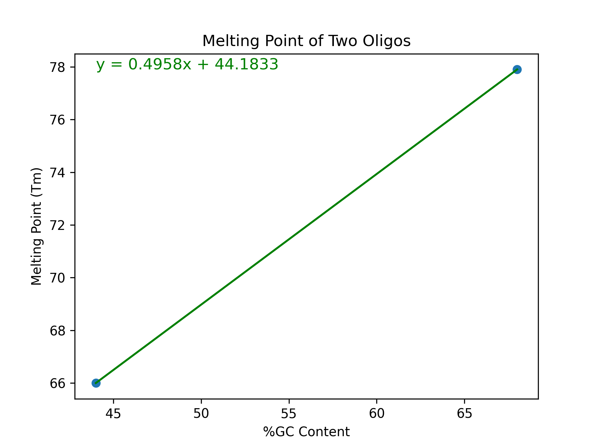
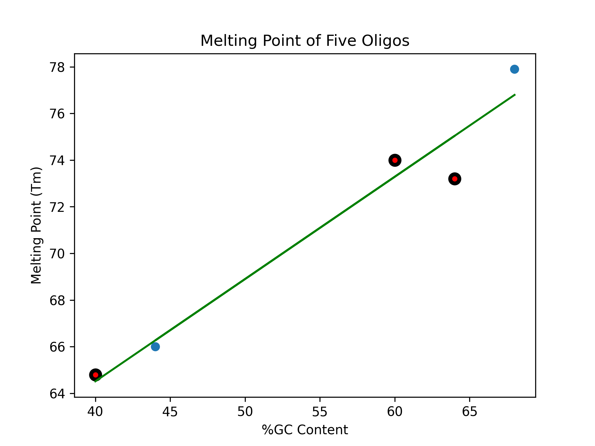
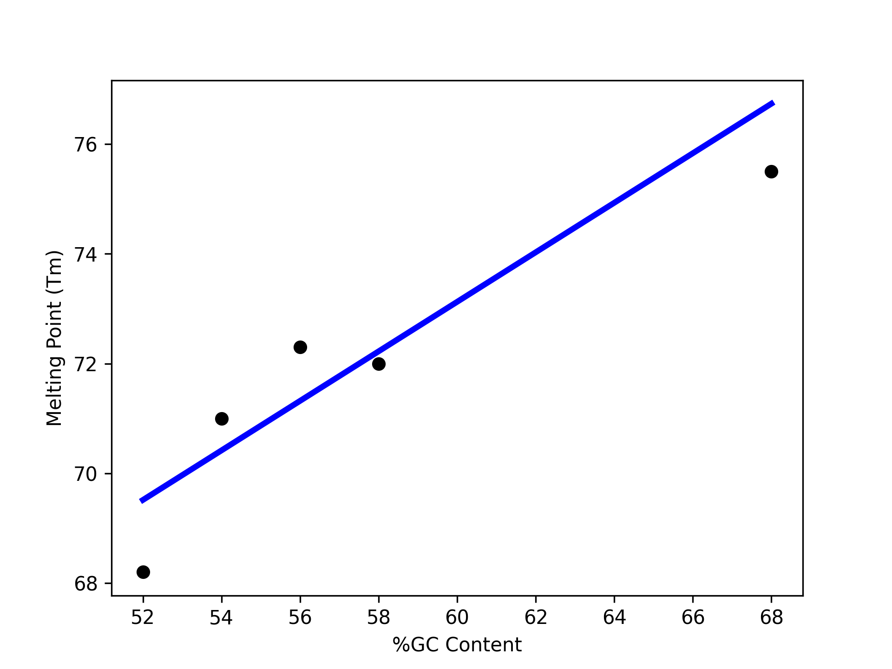

Linear Regression
=================

In this section, we introduce our first ML algorithm called Linear Regression. We also 
introduce the SciKit-Learn Python library which provides an implementation of Linear 
Regression and many other ML algorithms. By the end of this section, you should be able to:

* Describe the basics of the Linear Regression model
* Identify which ML problems Linear Regression could potentially be applied to
* Install and import the SciKit-Learn Python package into a Python program
* Use SciKit-Learn to implement a basic Linear Regression model

Introduction
------------

In Linear Regression, we make the assumption that there is a linear relationship between the
dependent and independent variables. To simplify the discussion, we'll assume for now that there are
just two variables, one *independent* and one *dependent*. 

Our goal is to model (or predict) the dependent variable from the independent variable. It is
customary to use :math:`X` for the independent variable and :math:`Y` for the dependent variable. To
say that there is a linear relationship between :math:`X` and :math:`Y` is to say that they are
related by a linear equation.

We know from elementary algebra that a linear equation has the form:

.. math::

  Y - Y_1 = m(X- X_1)

and is uniquely determined by two points :math:`(X_1, Y_1)` and :math:`(X_2, Y_2)`. This is called
the **point-slope form** of the linear equation. Note that by solving the left-hand side of the
equation for :math:`Y`, we can put the equation in **slope-intercept** form: 

.. math::

   Y = mX + B 

Consider the case of predicting the melting point (:math:`Tm`) of a short oligonucleotide. This is
commonly done when designing primers for DNA amplification during PCR. In the real world, the
melting point depends on a number of factors including oligo composition, oligo length, oligo
concentration, and salt concentrations, but for simplicity, let us make the assumption that the
value is determined by :math:`\%GC` content alone. G-C basepairs form three hydrogen bonds, whereas
A-T form only two, thus a higher percentage of GC bases increases melting point of DNA. Let us
further assume that the relationship is linear. 

We can restate the remarks above in this context as follows: Given the :math:`\%GC` of a short
nucleotide and melting point of two oligos, we can uniquely determine the linear equation relating
:math:`\%GC` and melting point. Here are two example values for :math:`\%GC` and :math:`Tm`:

* Oligo 1: 68% GC; 77.9°C
* Oligo 2: 44% GC; 66°C

We can think of these properties as corresponding to the points :math:`(68, 77.9)` and
:math:`(44, 66)` which leads to the system of equations to find Slope (:math:`m`) and y-intercept
(:math:`b`):

.. math::

  m = ΔY/ΔX = 0.4958

  b = Y - 0.4958*X = 44.183

and then to the formula :math:`Y = 0.4958(X) + 44.183` which we can visualize as follows:

Congratulations! In some sense, this is our very first linear model. It models the melting point
:math:`Tm` (the :math:`Y` variable) of an oligo as a linear function of the :math:`\%GC` content
(the :math:`X` variable).

Using this formula, we could predict the value of another oligo based on it's GC content. Here are
some additional properties. How does our model perform?

* Oligo 3: 40% GC; actual value: 64.8°C; predicted value: ?
* Oligo 4: 60% GC; actual value: 74°C; predicted value: ?
* Oligo 5: 64% GC; actual value: 73.2°C; predicted value: ?

*Solution:*

We plug the points into the equation :math:`Y = 0.4958(X) + 44.1833` and compute :math:`Y`:

* Oligo 3: Predicted Value = :math:`0.4958(40) + 44.183 = 64°C`
* Oligo 4: Predicted Value = :math:`0.4958(60) + 44.183 = 73.9°C`
* Oligo 5: Predicted Value = :math:`0.4958(64) + 44.183 = 75.9°C` 

If we add these additional data points to our plot, we see that our model did pretty well on Oligo 3, 
less good on Oligo 4, and was quite a bit off for Oligo 5 . 

|

Incorporating Additional Data 
-----------------------------

There are two main problems with our initial approach. 

The first problem is that the linear model we generated was based on the data of just two melting
points. For a 20 nucleotide strand of DNA, there are >10^12 unique sequence combinations! Shouldn't
we try to somehow create the model based on as much data as possible? 

.. note:: 

   In machine learning, there is typically an assumption that incorporating more data into the model
   training process will produce a more accurate model.

However, if we try to add even a third point to our linear equation we run into our second problem:
the first two points uniquely determined the line. Put another way, there is no simultaneous
solution to the equations:

.. math::

  Y - 77.9 = m(X- 68)

  Y - 66 = m(X- 44)

  Y - 64 = m(X- 40)

These equations are just the result of entering the three properties (i.e., :math:`(68, 77.9)`,  
:math:`(44, 66)` and :math:`(40, 68)`) into the general form :math:`Y - Y_1 = m(X- X_1)`.

In mathematics, we say that such a system of equations is *overdetermined*; i.e., there are more
equations than unknowns, and such systems typically have no solution. In general, when working with
real-world data we will not be able to find exact solutions to the set of model equations.

Instead, with Linear Regression, the basic idea is to find a linear equation that, when used to
predict the dependent variable of the known data points, minimizes a *cost* function. The cost
function is related to another function, called the *error* function, which is also called a *loss*
function. The error function assigns an error to each data point, and the cost function aggregates
these errors across a set of data points. 

There are different ways to define the error function, but conceptually, the error function will be
similar to the difference between the predicted value and the actual value. Similarly, there are
different ways to define the cost function using the error function, but one way is to just add up
the errors of all data points in our training set. 

Of course, the difference could be positive or negative, and if we just add up the differences, the
positive and negative values could cancel each other out, so instead of just summing the errors, one
can sum up the squares of the errors. Finally, since summing all of the errors will result in a 
larger cost for increases in the size of the data set, we want to take an average instead. That
leads to the following equation for cost:

.. math:: 

   Cost(M) = (\frac{1}{|D|})\sum_{d\in Data} M_{error}(d) \approx (\frac{1}{|D|})\sum_{d\in Data} (M(d) - Y_{actual}(d))^2
   
The equation above says that the cost associated with a model, :math:`M`, is given by the sum of the 
squares of the differences between the actual value and the model's predicted value across the
elements :math:`d` in a dataset, :math:`D`, divided by the total size of :math:`D`. This approach is
called the **least squares approximation** of the linear model.  

Finding the Linear Model Algorithmically 
----------------------------------------

How do we find the linear model, :math:`M`, that minimizes the cost function, :math:`Cost(M)`? 
We'll try to provide the basic idea of what is involved, though we don't give full details in 
this section. 

Recall that the model, :math:`M`, is defined by just two parameters, the :math:`m` and :math:`B` in
the slope-intercept form:

.. math::

   Y = mX + B

So, our goal is to find :math:`m` and :math:`B` that minimizes :math:`Cost(M)`. To simplify the
discussion, let us assume that :math:`B=0` (the y-intercept). 

Suppose we have :math:`n` data points in our data set: :math:`(x_1, y_1), ..., (x_n,y_n)`. Then the 
cost is a function of :math:`m` and :math:`B` as follows:

.. math::

   Cost(m, B ) = \sum_{j\in 1,..,n} (mx_j + B - y_j)^2

Since we are assuming :math:`B=0`, we are left with:

.. math::

   Cost(m) = \sum_{j\in 1,..,n} (mx_j - y_j)^2

But all of the :math:`x_j, y_j` are known values coming from points in our dataset, so this is just 
a quadratic equation in the variable :math:`m`. From Calculus, we know:

  1. This equation is differentiable,
  2. It will have a minimum where the derivative is 0,  
  3. The derivative is a linear function so it will have exactly one zero. 

So, it turns out we can find the model that minimizes the cost by finding the zero of a linear
function. 

.. note:: 

   The discussion above ignores a lot of details. In practice, a number of additional issues come
   up. Moreover, there is the matter of how to actually find the zeros of a differentiable function.
   If you are interested, the Gradient Decent algorithm is a general purpose optimization algorithm
   for finding the minimum of a differential function.

.. note::

  In the discussion above, we assumed we had just one independent variable (:math:`\%GC`), but 
  similar ideas can be used to deal with the case of multiple independent variables. 

SciKit-Learn
------------

The Python Package SciKit-Learn (``scikit-learn`` on PyPI) provides implementations for a number of
ML algorithms we will cover in this workshop. It also works well with NumPy, Pandas, Matplotlib,
etc. 

To install scikit-learn using pip:

.. code-block:: console

   [frontera]$ pip install --user scikit-learn

The main package is the ``sklearn`` package; check your installation: 

.. code-block:: python3 

   >>> import sklearn 

.. tip::

   If you are using the Jupyter Notebook kernel provided by the instructors, you should already have
   ``scikit-learn`` installed and you can skip this step.

Linear Regression in sklearn: First Steps
^^^^^^^^^^^^^^^^^^^^^^^^^^^^^^^^^^^^^^^^^

As a first step, let's create a linear regression model using our DNA melting point data from above. 

To get started, we create a ``LinearRegression`` object from the ``sklearn.linear_model`` module:

.. code-block:: python

   >>> import sklearn.linear_model
   >>> lr = sklearn.linear_model.LinearRegression()

The next step is to fit the model to some data. We'll go ahead and use all of the data points 
from the five properties in the discussion above. We'll use the ``.fit()`` function to fit the model
to a collection of data.

Recall we have the following data points representing our 5 oligos: 
:math:`(68, 77.9), (44, 66), (40, 64.8), (60, 74)`, and :math:`(64, 73)`. 

We need to pass the :math:`X` values and the :math:`Y` values as separate arrays to the ``fit()``
function. 

Keep in mind that, in this first example, we have just one independent variable, but in general, 
there will be multiple independent variables in the data set. For example, we will look at a
diabetes  dataset that has additional variables such as: age, glucose, BMI, blood pressure, etc. 

With that in mind, we need to be careful when providing the data to the ``fit()`` function. The 
``LinearRegression`` class is designed to work for the general case, where there will be many 
independent variables. Thus, we pass each :math:`X` value as an array of (in this case, 1) value, and
similarly for :math:`Y`: 

.. code-block:: python

   >>> data_x = [[68], [44], [40], [60], [64], [48]]
   >>> data_y = [[77.9], [66], [64.8], [74], [73.2], [66.6]]
   
   >>> # now, we can fit the model to the data 
   >>> lr.fit(data_x, data_y)

That's it! With that little bit of code, sklearn executed the least squares approximation algorithm
to find the linear model that minimizes the error function.

We can now use the ``lr`` object to predict additional values. Suppose we know the values of some 
additional oligos:

  * Oligo 6: 52% GC; 68.2°C
  * Oligo 7: 56% GC; 72.3°C

We can predict the values using the model's ``.predict()`` function. In general, the 
``predict()`` function takes an array of values to predict and returns an array of predictions.

Note also that that the sklearn LinearRegression model is designed for the general 
case where one has multiple independent and dependent variables. Therefore, when calling
``predict()``, we must pass each set of independent variables as an array, even if there is 
only one variable/value.

Thus, we'll call predict as follows -- **note the use of the 2-d array!**:

.. code-block:: python

   >>> lr.predict([[52]])
   --> array([[69.51365462]])

   >>> lr.predict([[56]])
   --> array([[71.31967871]])

Thus, the model predicts that the melting point of Oligo 6 will be 69.5°C and the melting point of
Oligo 7 will be 71.3°C.  

Predicting on Test Data and Plotting the Results
^^^^^^^^^^^^^^^^^^^^^^^^^^^^^^^^^^^^^^^^^^^^^^^^

We can call the ``predict()`` function on an array of data, as follows:

.. code-block:: python

   >>> test_data_x = [[52], [54], [56], [58], [68]]
   >>> test_data_y = [[68.2], [71], [72.3], [72], [75.5]] # actual values
   >>> test_predict = lr.predict(test_data_x) # values predicted by model on the test data

Note the shape of the ``test_predict`` object:

.. code-block:: python

   >>> test_predict.shape
   --> (5,1)

We can use matplotlib to visualize the results of the model's predictions on these test data: 

.. code-block:: python

   >>> import matplotlib.pyplot as plt

   >>> plt.scatter(test_data_x, test_data_y, color="black")
   >>> plt.xlabel("%GC Content")
   >>> plt.ylabel("Melting Point (Tm)")
   >>> plt.plot(test_data_x, test_predict, color="blue", linewidth=3)

|

Note that we are using two matplotlib functions here to plot two separate sets of data: 

* The ``scatter`` is used to simply plot a set of points on an X-Y coordinate plane. 
  In this case, we have used ``scatter`` to display the actual melting point values.
* The ``plot`` is used to connect the points with a line. In this case, 
  we have used ``plot`` to display the linear regression model, which of course is a 
  straight line.

Linear Regression with Pandas
^^^^^^^^^^^^^^^^^^^^^^^^^^^^^

We can pass Pandas DataFrames directly to the sklearn functions (e.g., ``fit()`` and ``predict()``)
once they have been pre-processed. The DNA melting point data is available on the class git
repository inside unit02 folder. You can
`download it here <https://raw.githubusercontent.com/TACC/life_sciences_ml_at_tacc/refs/heads/main/docs/section2/files/dna_melting_points.csv>`_.
Download the csv file from the website and read it into a DataFrame:

.. code-block:: python

    >>> import pandas as pd
    >>> melting_points = pd.read_csv('dna_melting_points.csv')

Check that the DataFrame has what we expect: 

.. code-block:: python

    >>> melting_points.info()
    <class 'pandas.core.frame.DataFrame'>
    RangeIndex: 6 entries, 0 to 5
    Data columns (total 2 columns):
    #   Column         Non-Null Count  Dtype  
    ---  ------         --------------  -----  
    0   percent_gc     6 non-null      int64  
    1   melting_point  6 non-null      float64
    dtypes: float64(1), int64(1)
    memory usage: 224.0 bytes

Pass the ``fit()`` function the independent and dependent variables, then use the ``predict()``
function to predict dependent variables given independent variables.

.. toggle:: Click to show the answer

   .. code-block:: python
   
      >>> X = melting_points.drop(columns=['melting_point'])
      >>> Y = melting_points['melting_point']
      >>> lr = sklearn.linear_model.LinearRegression()
      >>> lr.fit(X,Y)
   
      >>> # be careful of the shape of the object that you pass to predict()
      >>> # predict one value... 
      >>> lr.predict(X.iloc[0:1])
      --> array([76.737751])

      >>> # predict a set of values
      >>> lr.predict(X.iloc[0:10])
      --> array([76.737751, 65.90160643, 64.09558233, 73.12570281, 74.93172691, 67.70763052])

      >>> # How do they compare to the actual values?
      >>> print(f"estimated melting point for Oligo 1: {lr.predict(X.iloc[0:1])}, actual melting point for Oligo 1: {Y.iloc[0]}")
      --> estimated melting point for Oligo 1: [76.737751], actual melting point for Oligo 1: 77.9

Additional Resources
--------------------

* Adapted from: 
  `COE 379L: Software Design For Responsible Intelligent Systems <https://coe-379l-sp24.readthedocs.io/en/latest/index.html>`_
* `SciKit-Learn Linear Regression Documentation <https://scikit-learn.org/stable/modules/generated/sklearn.linear_model.LinearRegression.html>`_
