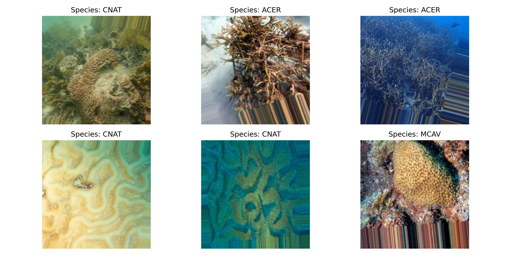
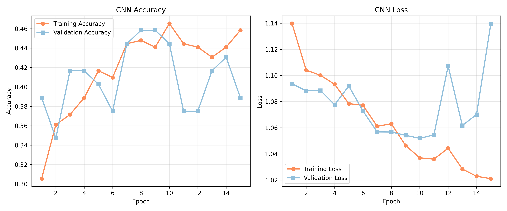
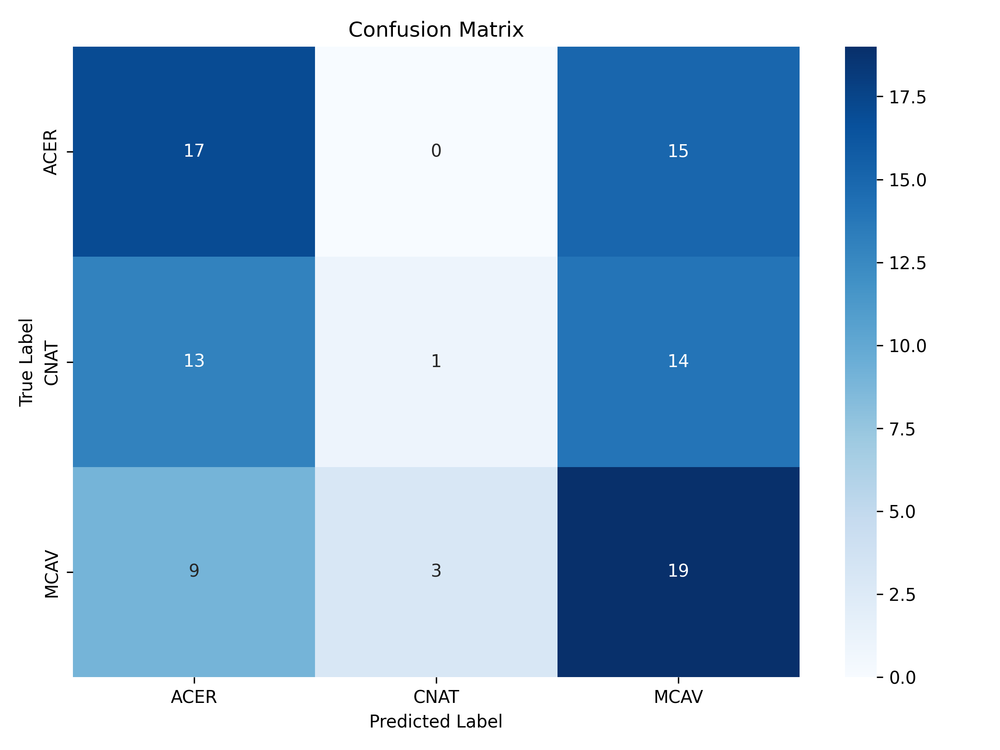
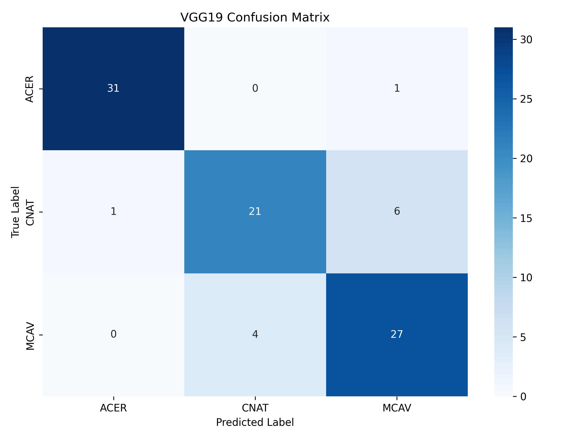

Build Your Own Convolutional Neural Network
=====================================

Coral reefs are among the most diverse and valuable ecosystems on Earth, providing habitat for 25% of all marine species and supporting the livelihoods of over half a billion people worldwide.
However, these ecosystems face unprecedented threats from climate change, ocean acidification, and other human activities, with many species now endangered.

We are given a dataset containing images of three different coral species: 

- *Acropora cervicornis* (Staghorn Coral)
- *Colpophyllia natans* (Boulder Brain Coral)
- *Montastraea cavernosa* (Greater Star Coral)

Our task is to build a Convolutional Neural Network (CNN) that can classify the coral images into the correct species. 
This technology can help automate coral reef monitoring efforts and support conservation initiatives by enabling rapid, large-scale species identification.

============================
Tutorial Setup and Materials
============================

All materials and instructions for running this tutorial in the `TACC Analysis Portal <https://tap.tacc.utexas.edu/>`_ are available in our GitHub repository: `TACC Deep Learning Tutorials <https://github.com/kbeavers/tacc-deep-learning-tutorials>`_.

=====================================
Part 1: Building a CNN Model from Scratch
=====================================

++++++++++++++++++++++++++++++++++++
Step 1: Data Loading and Organization
++++++++++++++++++++++++++++++++++++

In this step, we load all coral images from the dataset directory and organize them into a DataFrame. 
Each image is assigned a label based on the name of the directory it's stored in (i.e., 'ACER' - *Acropora cervicornis*, 'CNAT' - *Colpophyllia natans*, 'MCAV' - *Montastraea cavernosa*). 

This DataFrame will serve as the foundation for splitting our data into training, validation, and test sets later in the tutorial.

1.1 List Dataset Directory Contents
-----------------------------------

Before loading the images, we first want to inspect the directory structure to make sure everything is in the right place. 
The code below lists the contents of the ``coral-species`` data directory to verify that the subdirectories for each coral species are present and correctly named:

.. code-block:: python

    from pathlib import Path

    # Define the path to the dataset directory
    # NOTE: Replace the path below with the full path to your scratch directory containing the training materials
    dataset_dir = Path('/path/to/your/scratch/directory/tacc-deep-learning-tutorials/data/coral-species')

    # List the contents of the data directory
    print(list(dataset_dir.iterdir()))

    # You should see something like this:
    # [PosixPath('../data/coral-species/MCAV'), PosixPath('../data/coral-species/ACER'), PosixPath('../data/coral-species/CNAT')]
    
1.2 Check File Extensions
--------------------------

Next, we scan the dataset directory and all its subdirectories to find out what types of image files are present. 
This helps us catch unexpected or unsupported file types (e.g., GIFs, txt files, etc.), which could cause problems later when loading images. 

This also allows us to see if the images are all in the same format or not.

.. code-block:: python

    # Recursively list all files under the dataset directory
    image_files = list(dataset_dir.rglob("*"))

    # Extract and print the unique file extensions
    # This helps us confirm that only valid image files are present
    extensions = set(p.suffix.lower() for p in image_files if p.is_file())
    print("File extensions found:", extensions)

**Question**: What file extensions are present in the dataset? Write down your answer.

1.3 Explore Image Dimensions and Color Modes
--------------------------------------------

Before feeding images into a CNN, it's important to understand the basic properties of the dataset.
In this step, we examine the **dimensions** (width x height) as well as the **color mode** (e.g., RGB, RGBA, grayscale) of each image.
This helps us decide if we need to resize or convert images before we begin training our CNN. 

The script below prints a summary and gives recommendations if inconsistencies are found.

.. code-block:: python

    from PIL import Image
    from pathlib import Path
    from collections import Counter

    def explore_image_dataset(data_root):
        """
        Explore basic properties of images: size and color mode.
        """
        print("Starting image dataset exploration...\n")
        
        # Gather all .jpg files in the dataset
        image_files = list(Path(data_root).rglob('*.jpg'))
        print(f"Found {len(image_files)} image files\n")
        
        # Track sizes and color modes
        image_sizes = []
        color_modes = []

        print("Checking image dimensions and color modes...\n")
        for img_path in image_files:
            with Image.open(img_path) as img:
                image_sizes.append(img.size)   
                color_modes.append(img.mode)  

        # Summarize image sizes
        size_counts = Counter(image_sizes)
        print("=== Image Sizes ===")
        print(f"Found {len(size_counts)} unique image sizes:")
        for size, count in size_counts.most_common():
            print(f"- {size}: {count} images")

        # Summarize color modes
        mode_counts = Counter(color_modes)
        print("\n=== Color Modes ===")
        print(f"Found {len(mode_counts)} unique color modes:")
        for mode, count in mode_counts.most_common():
            print(f"- {mode}: {count} images")

        # Simple recommendations
        print("\n=== Recommendations ===")
        if len(size_counts) > 1:
            print(f"Images have different sizes. Consider resizing.")
        else:
            print("All images are the same size.")
        
        if len(mode_counts) > 1:
            print("Images have different color modes. Consider converting to RGB.")
        else:
            print("All images share the same color mode.")

    # Run the function
    data_root = Path('../data/coral-species')
    explore_image_dataset(data_root)
    
Our dataset analysis reveals some important characteristics that we'll need to keep in mind as we proceed with the tutorial:

 1. **Image Size Variation**: We have 451 total images in our dataset, with 88 different image sizes (dimensions). Also notice that some images are in portrait orientation (height > width) while others are landscape (width > height). CNNs expect all images to have the same dimensions, so we'll need to resize them to a standard size before training our model.

 2. **Color Mode**: All images share the same color mode. Great!

We will address these issues in Step 4 when we prepare our data for input into the CNN. 

1.4 Check for Corrupted Images
------------------------------

Before continuing, we want to make sure that all images files are readable. 
Corrupted files can break your model training or cause unexpected errors during preprocessing. 

In this step, we:

  1. Attempt to open each '.jpg' file using PIL 
  2. Discard any files that fail to load 

This ensures we only keep clean, valid images for training.

.. code-block:: python

    from PIL import Image
    from tqdm import tqdm

    # Find all .jpg files in the dataset
    # NOTE: add the correct file extension(s) for your image dataset in the space indicated below
    # TIP: see Step 1.2
    image_paths = list(dataset_dir.rglob('*.___'))

    # Create lists to store valid and corrupted files
    valid_images = []
    bad_images = []

    print("Checking for corrupted images...\n")

    # tqdm adds a progress bar to show how long the process will take
    for path in tqdm(image_paths):
        try:
            # Try to open and verify the image
            with Image.open(path) as img:
                img.verify()
            # If the image is valid, add it to valid_images
            valid_images.append(path)

        except Exception:
            # If any error occurs while opening/verifying the image, add it to bad_images
            bad_images.append(path)

    print(f"Valid images: {len(valid_images)}")
    print(f"Corrupted images removed: {len(bad_images)}")

If there are any corrupted images in your dataset, this code will automatically remove them. 

1.5 Create a DataFrame of Image Paths and Labels
-----------------------------------------------

Now that we have taken a peek at the format of our data and have removed any corrupted images, we can start setting up our data for training.
In this step, we build a ``pandas.DataFrame`` that organizes all the image data into two columns:

  1. **filepath**: The full path to each image file
  2. **label**: The class label for each image, taken from the directory name

This structured DataFrame is essential for training with Keras' ``flow_from_dataframe`` method that we'll use later in the tutorial.

.. code-block:: python

    import pandas as pd

    # Build (filepath, label) pairs from valid image paths
    data = []
    for path in valid_images:
        label = path.parent.name # Extract label from directory name
        data.append((str(path), label))

    # Create a DataFrame with columns for filepath and label
    df = pd.DataFrame(data, columns=["filepath", "label"])

    # (Optional) Shuffle the DataFrame to randomize order of images
    df = df.sample(frac=1, random_state=123).reset_index(drop=True)

    # Show a preview of the DataFrame
    df.head()
    
++++++++++++++++++++++++++++++++++++
Step 2: Visualize the Data
++++++++++++++++++++++++++++++++++++

2.1 Visualize the Class Distribution
-----------------------------------------------

Before training our CNN, it's important to understand how many images we have for each class (i.e., coral species in this case).

In this step we:

  1. Count how many images belong to each class
  2. Plot the class distribution as a pie chart and bar graph

If the dataset is imbalanced (i.e., some classes have far more images than others), we may need to account for this later using **class weights** or **data augmentation**.

.. code-block:: python

    import matplotlib.pyplot as plt

    # Count class distribution
    counts = df['label'].value_counts()

    # Create a 1-row, 2-column subplot
    fig, axes = plt.subplots(1, 2, figsize=(12, 5))

    # Define a color palette for consistency
    colors = ['#8158ff', '#ff9423', '#7fcdbb'] 

    # Pie chart
    axes[0].pie(counts.values, labels=counts.index, autopct='%1.1f%%', startangle=90, colors=colors)
    axes[0].axis('equal')
    axes[0].set_title('Class Distribution (Percentage)')

    # Bar chart
    axes[1].bar(counts.index, counts.values, color=colors)
    axes[1].set_title('Class Distribution (Values)')
    axes[1].set_ylabel('Number of Images')
    plt.setp(axes[1].get_xticklabels(), rotation=45, ha='right')

    # Layout adjustment
    plt.tight_layout()
    plt.show()

    # Print label counts and percentages
    for label, count in counts.items():
        print(f"{label}: {count} images ({count/len(df)*100:1f}%)")

**Thought Challenge**: Describe the class distribution in your own words. How much of the dataset is made up by the largest class? The smallest class? Is there anything that we need to address before continuing?

2.2 Visualize Images from the Dataset
-----------------------------------------------

It's helpful to look at a few images from each class to get a better understanding of the dataset.
This will give us a better sense of:

- What each coral species looks like
- How much visual variation exists within each class (e.g., different angles, lighting, etc.)
- Whether the dataset includes noise, blur, or other artifacts

We'll display a grid of randomly selected images, grouped by class.

.. code-block:: python

    import matplotlib.pyplot as plt
    from tensorflow.keras.preprocessing.image import load_img
    import random

    # Set seed for reproducibility
    random.seed(123)

    # Set the number of images to display per class
    samples_per_class = 3

    # Get list of unique coral species names (classes)
    classes = df['label'].unique()

    # Create a figure with appropriate size
    # The height (2.5 * len(classes)) ensures enough space for all images
    plt.figure(figsize=(12, len(classes) * 2.5))

    # Loop through each class to create a grid of images
    for i, label in enumerate(sorted(classes)):
        # Filter DataFrame to get only images from the current class
        class_df = df[df['label'] == label]

        # Randomly select 3 images from the current class 
        sample_paths = random.sample(list(class_df['filepath']), samples_per_class)

        # Create subplot for each image
        for j, img_path in enumerate(sample_paths):

            # Calculate position in grid: (row * width) + column + 1
            plt.subplot(len(classes), samples_per_class, i * samples_per_class + j + 1)

            # Load and display the image
            img = load_img(img_path)        # Load the image
            plt.imshow(img)                 # Display the image
            plt.title(label)                # Add species name as title
            plt.axis('off') 

    plt.tight_layout()
    plt.show()

.. image:: ./images/coral_species_images.png
   :width: 800px
   :align: center

**Thought Challenge**: Try changing the ``random.seed`` value a few times to view different images from the dataset. What do you notice? Take a moment to write down your observations.

*Remember: the quality of a machine learning model is decided largely by the quality of the dataset it was trained on!*

++++++++++++++++++++++++++++++++++++
Step 3: Split the Dataset and Handle Class Imbalance
++++++++++++++++++++++++++++++++++++

3.1 Split the Dataset into Training, Validation, and Test Sets
-------------------------------------------------------------

We are now ready to split our labeled image dataset into three parts:

  1. **Training Set**: Used to train the model
  2. **Validation Set**: Used to tune hyperparameters and monitor model performance during training
  3. **Test Set**: Used to evaluate the final model's performance after training is complete

We will use the ``train_test_split`` function from scikit-learn in two stages:

  1. First, we split the original dataset into **training + test** sets
  2. Then, we split the training set again into **training + validation** 

This approach ensures that our CNN *never sees the test set* during training, which is important for obtaining an unbiased estimate of the model's performance.

To preserve the class distribution across splits, we use ``stratify=df["label"]`` to ensure each split has the same proportion of each class as in the original dataset.
This is called **stratified sampling**. 

.. code-block:: python

    # NOTE: Replace the spaces indicated below with your code
    from sklearn.model_selection import ____

    # First, split the original dataset into training + test sets
    train_df, test_df = train_test_split(
        df,                            # This is our DataFrame from step 1.5
        test_size=____,                # How much of the data should be in the test set?
        stratify=____,                 # Ensure each split maintains original class distribution
        random_state=123               # Set the random seed for reproducibility
    )

    # Then, split the training set into training + validation sets
    ____, ____ = train_test_split(
        ____,                          # What goes here?
        test_size=____,                # How much of the data should be in the validation set?
        stratify=____,                 # Ensure each split maintains original class distribution
        random_state=123               # Set the random seed for reproducibility
    )

    # Print split sizes
    total = len(df)
    print(f"\nDataset splits:")
    print(f"Train: {len(train_df)} images ({len(train_df)/total:.2%})")
    print(f"Validation: {len(val_df)} images ({len(val_df)/total:.2%})")
    print(f"Test: {len(test_df)} images ({len(test_df)/total:.2%})")

**Thought Challenge**: Will changing the ``random_state`` value in the ``train_test_split`` function change your model's performance? Why or why not?

.. toggle:: Click to show

    **Answer**: Yes – even though stratification preserves class balance, changing ``random_state`` changes *which individual images* go into the training set. For example:

    - With ``random_state=123``, the model might learn from images A, B, and C
    - With ``random_state=456``, the model might learn from images D, E, and F 
 
    Since each image has unique properties (lighting, orientation, scale, background, etc.), the model will learn slightly different features depending on the exact training set.
    As a result, its internal weights and final accuracy may vary. 

    Try running the full training pipeline multiple times with different ``random_state`` values. Do your metrics stay stable? What might that tell you about the robustness of your model?

3.2 Compute Class Weights
-------------------------

If our dataset is imbalanced (i.e., some classes have many more images than others), the model may learn to favor those majority classes. 
To address this, we can compute **class weights** based on the training data using the ``compute_class_weight`` function from scikit-learn.

These weights:

 - Assign higher importance to underrepresented classes
 - Are passed into ``model.fit()`` using the ``class_weight`` argument
 - Adjust how the loss is calculated during training

This technique helps the model give balanced attention to all classes during training. 

While our dataset is quite balanced, we provide the code for computing class weights below:

.. code-block:: python

    from sklearn.utils.class_weight import compute_class_weight
    import numpy as np

    # Get unique class labels
    class_labels = np.unique(train_df['label'])

    # Compute class weights based on training labels
    class_weights = compute_class_weight(
        class_weight='balanced',
        classes=class_labels,
        y=train_df['label']
    )

    # Convert to a dictionary: {label: weight}
    class_weight_dict = dict(zip(class_labels, class_weights))

    # Preview the result
    print("Computed class weights:")
    for label, weight in class_weight_dict.items():
        print(f"{label}: {weight:.2f}")

++++++++++++++++++++++++++++++++++++
Step 4: Image Preprocessing and Data Generators
++++++++++++++++++++++++++++++++++++

As we discovered in Step 1.3, we need to prepare our images before feeding them into the CNN. 
This step involves two key concepts:

**a. Data Generators**

Data generators are special tools that help us efficiently load and preprocess image data in small batches (instead of all at once).
Keras provides a built-in data generator called ``ImageDataGenerator`` that can:

  - Resize all images to a consistent size
  - Normalize pixel values (e.g., from [0-255] to [0-1])
  - Augment the training data with random transformations to improve generalization 

Data generators can be used with Keras model methods like ``fit()``, ``evaluate()``, and ``predict()``, which is particularly useful when dealing with large datasets that don't all fit into memory at once.  

**b. Data Augmentation**

Data augmentation is a powerful technique that helps our model learn more robust features by creating variations of our training images.
Augmentation techniques not only expand the size of our training set, but also help prevent overfitting by exposing our model to different variations of our images.

Conveniently, ``ImageDataGenerator`` also provides a number of built-in augmentation techniques that we can use to augment our training data, such as:

  - Random rotations
  - Zooming in or out
  - Shifting the image left or right
  - Flipping the image horizontally

Each of these modifications creates a new, slightly different version of our training images, helping our model learn to recognize the same features in different orientations.

4.1 Define Image Preprocessing and Augmentation
-----------------------------------------------

We will define three separate ``ImageDataGenerator`` objects, one for each dataset split (train, val, test):

  - ``train_datagen`` will apply both normalization and augmentation to the training data
  - ``val_datagen`` and ``test_datagen`` will only apply normalization (no augmentation)

.. code-block:: python

    from tensorflow.keras.preprocessing.image import ImageDataGenerator

    # Set image size and batch size
    IMAGE_SIZE = (224, 224)
    BATCH_SIZE = 32

    # Define training data generator
    train_datagen = ImageDataGenerator(
        rescale=1./255,             # Normalize pixel values to [0, 1]
        rotation_range=30,          # Augment: Random rotation
        width_shift_range=0.2,      # Augment: Random horizontal shift
        height_shift_range=0.2,     # Augment: Random vertical shift
        zoom_range=0.2,             # Augment: Random zoom
        horizontal_flip=True,       # Augment: Random horizontal flip
        fill_mode='nearest'         # Augment: After random transformations, fill in missing pixels with nearest neighbor
    )

    # Validation and test data generators only need normalization – do not augment
    val_datagen = ImageDataGenerator(rescale=1./255)
    test_datagen = ImageDataGenerator(rescale=1./255)
    
4.2 Load Images Using ``flow_from_dataframe()``
-----------------------------------------------

Now that our preprocessing methods are defined, we can use ``flow_from_dataframe()`` to load images in batches directly from our labeled Dataframes (``train_df``, ``val_df``, and ``test_df``).

All generators return batches of preprocessed image tensors and their corresponding labels.

.. code-block:: python

    # Training generator
    train_generator = train_datagen.flow_from_dataframe(
        dataframe=train_df,         # Our training DataFrame
        x_col='filepath',           # Column containing image paths
        y_col='label',              # Column containing labels
        target_size=IMAGE_SIZE,     # Resize images to this size
        batch_size=BATCH_SIZE,      # Number of images per batch
        class_mode='categorical',   # One-hot encode the labels
        color_mode='rgb',           # Use RGB color channels
        shuffle=True                # Randomize order of images
    )

    # Validation generator
    val_generator = val_datagen.flow_from_dataframe(
        # ... same parameters as above ...
        shuffle=False               # Keep original order for validation
    )

    # Test generator
    test_generator = test_datagen.flow_from_dataframe(
        # ... same parameters as above ...
        shuffle=False               # Keep original order for testing
    )

Sanity Check: Inspect a Batch from the Training Generator
~~~~~~~~~~~~~~~~~~~~~~~~~~~~~~~~~~~~~~~~~~~~~~~~~~~~~~~~~

Let's inspect the output of the ``train_generator`` to make sure it's working as expected.

In the code below, we:

 - Retrieve one batch of images and labels from the training generator
 - Check the shape of the batch
 - Display a few image-label pairs to confirm the generator is working

.. code-block:: python

    # Get one batch from the training generator
    images, labels = next(train_generator)

    # Check the shape of the batch
    print("Image batch shape:", images.shape)    # Should be (BATCH_SIZE, height, width, channels)
    print("Label batch shape:", labels.shape)    # Should be (BATCH_SIZE, num_classes)

    # Preview the first 5 label vectors
    print("\nFirst 5 labels (one-hot encoded):")
    print(labels[:5])

Visualize a Few Images from the Training Generator
~~~~~~~~~~~~~~~~~~~~~~~~~~~~~~~~~~~~~~~~~~~~~~~~~~

Let's display a few images from the training geneator along with their decoded class labels.

.. code-block:: python

    import matplotlib.pyplot as plt
    import numpy as np

    # Get a fresh batch of images
    images, labels = next(train_generator)

    # Display 6 images in a grid
    plt.figure(figsize=(12, 6))

    # Show each image
    for i in range(6):
        plt.subplot(2, 3, i + 1)
        
        # Get the species name
        species_names = list(train_generator.class_indices.keys())
        species = species_names[np.argmax(labels[i])]
        
        # Show the image
        plt.imshow(images[i])
        plt.title(f"Species: {species}")
        plt.axis("off")

    plt.tight_layout()
    plt.show()

**Thought Challenge**: Look carefully at the images displayed above.
Try running the code cell multiple times and changing the code to display images from the validation and test generators. 
What do you notice about the images that you didn't see before (in Step 3)?
Do you notice any differences in the images each time you run the cell? 
Think about why this might be happening. 

++++++++++++++++++++++++++++++++++++
Step 5: Define Your CNN Model Architecture
++++++++++++++++++++++++++++++++++++

Congratulations! Our data is now ready to be used to train a Convolutional Neural Network to classify our coral images.

In this step, we will define the architecture of our CNN model. 
Below, we define a model that consists of three main parts:

 1. **Convolutional Blocks** (Feature Extraction):

   - Block 1: 32 filters (3x3 kernels), followed by Average Pooling
   - Block 2: 64 filters (3x3 kernels), followed by Average Pooling
   - Block 3: 128 filters (3x3 kernels), followed by Average Pooling

 Each block increases the number of filters, allowing the model to learn increasingly complex features.

 2. **Flatten Layer**: Converts the 3D feature maps into a 1D vector for the dense layers
 3. **Dense Layers** (Classification):

   - First dense layer: 128 perceptrons
   - Second dense layer: 64 perceptrons
   - Output layer: How many perceptrons should our output layer have? Which activation function should we use?

.. code-block:: python

    from tensorflow.keras import models, layers
    from tensorflow.keras.optimizers import RMSprop

    # Build a custom CNN architecture
    cnn_model = models.Sequential([
        # Input layer: matches image shape
        layers.Input(shape=(___, ___, __)),

        # Convolution Block 1
        layers.Conv2D(32, (3, 3), padding='same', activation='relu'),
        layers.AveragePooling2D((2, 2), padding='same'),

        # Convolution Block 2
        # ...
        # ...

        # Convolution Block 3
        # ...
        # ...

        # Flatten to convert 2D feature maps into a 1D vector
        layers.Flatten(),

        # Fully connected layers
        layers.Dense(128, activation='relu'),
        layers.Dense(64, activation='relu'),
        layers.Dense(___, activation='___')   
    ])

Once you have filled in the blanks and defined your model, let's compile it:

.. code-block:: python

    cnn_model.compile(
        optimizer=RMSprop(learning_rate=1e-4),
        loss='categorical_crossentropy',
        metrics=['accuracy']
    )

In the code above, we use the ``RMSprop`` optimizer, which adapts the learning rate based on recent gradients, and is a popular choice for image classification tasks.
We also set the learning rate to ``1e-4``, which sets the initial learning rate for the optimizer.

*Note: While these are good starting choices, you might want to experiment with different optimizers or learning rates based on your model's performance.*

Finally, let's display our model architecture and parameter count:

.. code-block:: python

    cnn_model.summary()

**Model: "sequential"**

+--------------------------------+----------------------+-------------+
| Layer (type)                   | Output Shape         | Param #     |
+================================+======================+=============+
| conv2d (Conv2D)                | (None, 224, 224, 32) | 896         |
+--------------------------------+----------------------+-------------+
| average_pooling2d              | (None, 112, 112, 32) | 0           |
| (AveragePooling2D)             |                      |             |
+--------------------------------+----------------------+-------------+
| conv2d_1 (Conv2D)              | (None, 112, 112, 64) | 18,496      |
+--------------------------------+----------------------+-------------+
| average_pooling2d_1            | (None, 56, 56, 64)   | 0           |
| (AveragePooling2D)             |                      |             |
+--------------------------------+----------------------+-------------+
| conv2d_2 (Conv2D)              | (None, 56, 56, 128)  | 73,856      |
+--------------------------------+----------------------+-------------+
| average_pooling2d_2            | (None, 28, 28, 128)  | 0           |
| (AveragePooling2D)             |                      |             |
+--------------------------------+----------------------+-------------+
| flatten (Flatten)              | (None, 100352)       | 0           |
+--------------------------------+----------------------+-------------+
| dense (Dense)                  | (None, 128)          | 12,845,184  |
+--------------------------------+----------------------+-------------+
| dense_1 (Dense)                | (None, 64)           | 8,256       |
+--------------------------------+----------------------+-------------+
| dense_2 (Dense)                | (None, 3)            | 195         |
+--------------------------------+----------------------+-------------+

  **Total params**: 12,946,883 (49.39 MB)

  **Trainable params**: 12,946,883 (49.39 MB)

  **Non-trainable params**: 0 (0.00 B)

**Thought Challenge**: Break down the model summary above, layer by layer. 

.. toggle:: Click to show

    1. **First Convolutional Block**

        - Input: 224 x 224 RGB images
        - ``conv2d``: Creates 32 feature maps using 3x3 kernels -> Output shape maintains input size due to padding (224, 224, 32)
        - ``average_pooling2d``: Reduces spatial dimensions by half -> Output shape (112, 112, 32)

    2. **Second Convolutional Block**

        - ``conv2d_1``: Creates 64 feature maps using 3x3 kernels -> Output shape maintains input size due to padding (112, 112, 64)
        - ``average_pooling2d_1``: Reduces spatial dimensions by half -> Output shape (56, 56, 64)

    3. **Third Convolutional Block**

        - ``conv2d_2``: Creates 128 feature maps using 3x3 kernels -> Output shape maintains input size due to padding (56, 56, 128)
        - ``average_pooling2d_2``: Reduces spatial dimensions by half -> Output shape (28, 28, 128)

    4. **Classification Layers**

        - ``flatten``: Converts 3D feature maps into a 1D vector -> Output shape (100352)
        - ``dense``: First dense layer with 128 perceptrons
        - ``dense_1``: Second dense layer with 64 perceptrons
        - ``dense_2``: Output layer with 3 perceptrons (one for each coral species)

Calculating Parameters in CNNs
------------------------------

Let's break down the parameter calculation for our model.

The formula for calculating the number of parameters in a convolutional layer is:

``(kernel_height x kernel_width x input_channels x filters) + filters``

    - the ``+ filters`` part is for the bias term (one per filter)

**Thought Challenge**: What is the formula for calculating the number of parameters in a dense layer? Can you correctly calculate the total number of parameters in our model? Write down each step of your calculation. 

.. toggle:: Click to show

    **Convolutional Layers**

    1. First Conv2D:
     * 3x3 kernel, 3 input channels (RGB), 32 filters
     * (3 x 3 x 3 x 32) + 32 = 896 parameters

    2. Second Conv2D:
     * 3x3 kernel, 32 input channels, 64 filters
     * ( 3 x 3 x 32 x 64) + 64 = 18,496 parameters

    3. Third Conv2D:
     * 3x3 kernel, 64 input channels, 128 filters
     * (3 x 3 x 64 x 128) + 128 = 73,856 parameters

    **Dense Layers**
        
    Formula: ``(inputs x perceptrons) + perceptrons``

    - the ``+ perceptrons`` part is for the bias term (one per perceptron)

    1. First Dense:
     * 100352 inputs (flattened), 128 perceptrons
     * (100352 x 128) + 128 = 12,845,184 parameters

    2. Second Dense:
     * 128 inputs, 64 perceptrons
     * (128 x 64) + 64 = 8,256 parameters

    3. Output Dense:
     * 64 inputs, 3 perceptrons (one per coral species)
     * (64 x 3) + 3 = 195 parameters

++++++++++++++++++++++++++++++++++++
Step 6: Train the CNN Model
++++++++++++++++++++++++++++++++++++

Now that our CNN architecture is defined, we can train the model using the ``fit()`` method. 

During training, the model will learn patterns in the training data and adjust its parameters to minimize the loss function.
After each epoch, the model's performance is evaluated on the validation set. 

Here, we will also pass in ``class_weight`` to demonstrate how to handle imbalanced data.

We also track the training history, which we'll use later to visualize performance over time. 

.. code-block:: python

    cnn_history = cnn_model.fit(
        train_generator,
        validation_data=val_generator,
        epochs=15,
        class_weight=class_weight_dict # Computed in Step 4.2
    )

Example output:

.. code-block:: python-console

    Epoch 1/15
    9/9 ━━━━━━━━━━━━━━━━━━━━ 8s 843ms/step - accuracy: 0.2970 - loss: 1.1531 - val_accuracy: 0.3889 - val_loss: 1.0936
    Epoch 2/15
    9/9 ━━━━━━━━━━━━━━━━━━━━ 7s 730ms/step - accuracy: 0.3414 - loss: 1.1029 - val_accuracy: 0.3472 - val_loss: 1.0883
    Epoch 3/15
    9/9 ━━━━━━━━━━━━━━━━━━━━ 7s 723ms/step - accuracy: 0.3875 - loss: 1.0959 - val_accuracy: 0.4167 - val_loss: 1.0886
    Epoch 4/15
    9/9 ━━━━━━━━━━━━━━━━━━━━ 6s 697ms/step - accuracy: 0.3971 - loss: 1.0936 - val_accuracy: 0.4167 - val_loss: 1.0776
    Epoch 5/15
    9/9 ━━━━━━━━━━━━━━━━━━━━ 7s 729ms/step - accuracy: 0.4104 - loss: 1.0802 - val_accuracy: 0.4028 - val_loss: 1.0919
    ...
    Epoch 15/15
    9/9 ━━━━━━━━━━━━━━━━━━━━ 7s 755ms/step - accuracy: 0.4277 - loss: 1.0193 - val_accuracy: 0.3889 - val_loss: 1.1392

Visualizing Training History
------------------------------

After training the model, we can visualize the accuracy and loss over time to better understand how the model is learning.
These plots can help us identify overfitting, underfitting, or confirm that the model is learning as expected.

We use the ``cnn_history`` object returned by the ``fit()`` method to plot the training and validation accuracy and loss:

.. code-block:: python

    import matplotlib.pyplot as plt

    def plot_training_history(history, title_prefix="CNN"):
        acc = history.history['accuracy']
        val_acc = history.history['val_accuracy']
        loss = history.history['loss']
        val_loss = history.history['val_loss']
        epochs = range(1, len(acc) + 1)

        # Set color palette
        training_color = '#fc8d59'    
        validation_color = '#91bfdb'  

        # Plot accuracy
        plt.figure(figsize=(14, 5))
        plt.subplot(1, 2, 1)
        plt.plot(epochs, acc, color=training_color, linestyle='-', marker='o',
                label='Training Accuracy', linewidth=2)
        plt.plot(epochs, val_acc, color=validation_color, linestyle='-', marker='s',
                label='Validation Accuracy', linewidth=2)
        plt.title(f'{title_prefix} Accuracy')
        plt.xlabel('Epoch')
        plt.ylabel('Accuracy')
        plt.legend()
        plt.grid(True, alpha=0.3)

        # Plot loss
        plt.subplot(1, 2, 2)
        plt.plot(epochs, loss, color=training_color, linestyle='-', marker='o',
                label='Training Loss', linewidth=2)
        plt.plot(epochs, val_loss, color=validation_color, linestyle='-', marker='s',
                label='Validation Loss', linewidth=2)
        plt.title(f'{title_prefix} Loss')
        plt.xlabel('Epoch')
        plt.ylabel('Loss')
        plt.legend()
        plt.grid(True, alpha=0.3)

        plt.tight_layout()
        plt.show()

    # Call the plotting function
    plot_training_history(cnn_history)

The plots above show the training and validation accuracy/loss over 15 epochs.

**Thought Challenge**: What do you notice about the training and validation accuracy and loss? What does this tell you about the model's learning performance (i.e. overfitting, underfitting, healthy learning)? Write down your answer before checking our interpretation below.

.. toggle:: Click to show

    **Accuracy (Left Plot)**
     - Training accuracy increases over time, reaching about 50% before declining again in the final epochs
     - Validation accuracy remains low, indicating poor generalization

    **Loss (Right Plot)**
     - Training loss steadily decreases, showing that the model is fitting the training data
     - Validation loss fluctuates and does not improve

    **Interpretation**: The model is memorizing the training data, but is failing to learn patterns that generalize to unseen data. In other words, the model is **overfitting** to the training data.

++++++++++++++++++++++++++++++++++++
Step 7: Evaluate the Model on the Test Set
++++++++++++++++++++++++++++++++++++
 
Now that we've trained our model, it's time to evaluate its performance on the test set.
This step is crucial because it helps us understand how well the model generalizes to new, unseen data, which is a good indicator of its real-world performance.

Evaluate Test Accuracy and Loss
-------------------------------

We use ``model.evaluate()`` to calculate the test accuracy and loss. These metrics give us a quick overview of the model's performance.

.. code-block:: python

    # Evaluate test accuracy and loss
    test_loss, test_acc = cnn_model.evaluate(test_generator, verbose=0)
    print(f"Test Accuracy: {test_acc:.2%}")
    print(f"Test Loss: {test_loss:.4f}")

Example output:

.. code-block:: python-console

    Test Accuracy: 40.66%
    Test Loss: 1.1422

Our model achieves a test accuracy of 40.66% and a test loss of 1.1422.
While these numbers provide a snapshot of performance, they don't tell the whole story. Let's dig deeper with a confusion matrix.

Visualize Predictions with a Confusion Matrix
---------------------------------------------

A confusion matrix provides a detailed breakdown of the model's predictions compared to the true labels.
It helps identify which classes are being confused with each other.

.. code-block:: python

    from sklearn.metrics import confusion_matrix
    import matplotlib.pyplot as plt
    import seaborn as sns

    # Get predicted probabilities for each class
    pred_probs = cnn_model.predict(test_generator)

    # Convert to predicted class labels
    y_pred = np.argmax(pred_probs, axis=1)

    # Get true labels
    y_true = test_generator.classes

    # Create confusion matrix
    cm = confusion_matrix(y_true, y_pred)

    # Map class indices back to names
    class_names = list(test_generator.class_indices.keys())

    # Plot confusion matrix
    plt.figure(figsize=(8, 6))
    sns.heatmap(cm, annot=True, fmt='d', cmap='Blues',
                xticklabels=class_names,
                yticklabels=class_names)
    plt.title("Confusion Matrix")
    plt.xlabel("Predicted Label")
    plt.ylabel("True Label")
    plt.tight_layout()
    plt.show()

Detailed Performance with a Classification Report
------------------------------------------------

The classification report provides precision, recall, and F1-scores for each class, offering a more nuanced view of model performance.

.. code-block:: python

    from sklearn.metrics import classification_report

    # Print classification report
    print("Classification Report:")
    print(classification_report(y_true, y_pred, target_names=class_names))

Example output:

.. code-block:: python-console

    Classification Report:
                  precision    recall  f1-score   support

            ACER       0.44      0.53      0.48        32
            CNAT       0.25      0.04      0.06        28
            MCAV       0.40      0.61      0.48        31

        accuracy                           0.41        91
       macro avg       0.36      0.39      0.34        91
    weighted avg       0.37      0.41      0.35        91

Click below to see a brief explanation of the metrics in the classification report.

.. toggle:: Click to show

    **Precision**: The ratio of correctly predicted positive observations to the total predicted positives. 

     - Formula: :math:`\frac{\text{True Positives}}{\text{True Positives} + \text{False Positives}}`
     - Interpretation: High precision indicates a low false positive rate, which is useful when the cost of false positives is high.

    **Recall**: The ratio of correctly predicted positive observations to all actual positives.

     - Formula: :math:`\frac{\text{True Positives}}{\text{True Positives} + \text{False Negatives}}`
     - Interpretation: High recall indicates a low false negative rate, which is useful when the cost of false negatives is high.
  
    **F1-score**: The weighted average of precision and recall. It considers both false positives and false negatives. 

     - Formula: :math:`2 \times \frac{\text{Precision} \times \text{Recall}}{\text{Precision} + \text{Recall}}`
     - Interpretation: The F1-score is useful when you need to balance precision and recall. It provides a single score that considers both false positives and false negatives.

    **Support**: The number of actual occurrences of the class in the test data.

**Thought Challenge**: Critically assess the performance of our model based on the accuracy/loss values, confusion matrix, and classification report. 
Are there any classes that the model is particularly good or bad at predicting? Think about the data and why the model might be performing better or worse for certain classes.

=====================================
Part 2: Transfer Learning with VGG19
=====================================

In this section, we apply a technique called **transfer learning** to improve model performance on our coral species classification task.

**Transfer learning** is a deep learning technique where we *reuse a model that has already been trained on a large dataset for a different but related task*.
Instead of starting from scratch, we "transfer" the knowledge learned by the pre-trained model to our new task.

This is especially useful when you have a limited dataset, you want to train a model faster, or you want to achieve better accuracy with less computational effort. 

We will use the **VGG19 model**, a classic convolutional neural network architecture developed by researchers at Oxford University.
It was trained on the **ImageNet** dataset, which contains over 14 million images across 1000 classes. 

++++++++++++++++++++++++++++++++++++
Step 1: Prepare Data for VGG19
++++++++++++++++++++++++++++++++++++

1.1 Define Image Preprocessing and Augmentation
-----------------------------------------------

VGG19 expects input images to be preprocessed in a very specific way because of the way it was trained.
We use the ``preprocess_input()`` function from ``tensorflow.keras.applications.vgg19`` to preprocess our images. 
Specifically, this function converts RGB pixel values to the format VGG19 was originally trained on (i.e., channels in BGR order, zero-centered with respect to ImageNet).

Let's create new data generators for VGG19 using ``ImageDataGenerator`` with:

 - ``preprocess_input`` for normalization
 - Augmentation on the training set
 - No augmentation on the validation and test sets

.. code-block:: python

    from tensorflow.keras.applications.vgg19 import VGG19, preprocess_input
    from tensorflow.keras.preprocessing.image import ImageDataGenerator

    # Constraints
    IMAGE_SIZE = (224, 224)
    BATCH_SIZE = 32

    # Define new ImageDataGenerators for VGG19
    vgg19_train_datagen = ImageDataGenerator(
        preprocessing_function=preprocess_input,
        rotation_range=30,
        width_shift_range=0.2,
        height_shift_range=0.2,
        zoom_range=0.2,
        horizontal_flip=True,
        fill_mode='nearest'
    )

    vgg19_val_datagen = ImageDataGenerator(preprocessing_function=preprocess_input)
    vgg19_test_datagen = ImageDataGenerator(preprocessing_function=preprocess_input)

1.2 Load Images Using ``flow_from_dataframe()``
-----------------------------------------------

Just like we did for our CNN model, we can use ``flow_from_dataframe()`` to load images in batches directly from our labeled Dataframes (``train_df``, ``val_df``, and ``test_df``).

.. code-block:: python

    # Assuming train_df, val_df, and test_df are defined
    # Create training generator below
    train_generator_vgg19 = _____

    # Create validation generator below
    val_generator_vgg19 = _____

    # Create test generator below
    test_generator_vgg19 = _____

+++++++++++++++++++++++++++++++++++++++++
Step 2: Define and Train the VGG19 Model
+++++++++++++++++++++++++++++++++++++++++

2.1 Load VGG19 Base Model and Stack a Custom Classifier
-----------------------------------------------

We now load the **VGG19 base model**, which has been pre-trained on ImageNet.
We exclude the original classification head (``include_top=False``) and freeze all convolutional layers.

Next, we stack a **custom classifier** on top using Keras’ ``Sequential`` API:

- Flatten the output of VGG19’s last convolutional layer
- Add the same fully connected (dense) layers that we had in our original CNN built from scratch

.. code-block:: python

    from tensorflow.keras.applications import VGG19
    from tensorflow.keras import layers, models
    from tensorflow.keras.optimizers import RMSprop

    # Load VGG19 base (without top classifier)
    vgg_base = VGG19(weights='imagenet', include_top=False, input_shape=(224, 224, 3))
    vgg_base.trainable = False  # Freeze all pretrained layers

    # Build the full model
    VGG19_model = models.Sequential([
        vgg_base,
        # Add a flatten layer:
        # ... your code here ...

        # Then add our three dense layers:
        # ... your code here ...
        # ... your code here ...
        # ... your code here ...
    ])

Now, let's compile the model with the same optimizer and loss function as our previous model.

.. code-block:: python

    # Compile with a low learning rate optimizer
    VGG19_model.compile(
        # ... your code here ...
        # ... your code here ...
        # ... your code here ...
    )

2.2 Define Training Callbacks
-----------------------------------------------

Next, let's define some **training callbacks**. 
Callbacks are functions executed during training that allow the training process to change its behavior dynamically.

Some common callbacks include:

- **EarlyStopping**: This callback stops training when a monitored metric (e.g., validation accuracy) stops improving. It helps prevent overfitting by halting training once the model's performance plateaus.
- **ReduceLROnPlateau**: This callback reduces the learning rate when a monitored metric (e.g., validation loss) stops improving. By lowering the learning rate, the model can converge to a better local minimum (preventing it from getting stuck in a suboptimal solution).

.. code-block:: python

    from tensorflow.keras.callbacks import EarlyStopping, ReduceLROnPlateau

    # Define callbacks
    callbacks = [
        EarlyStopping(
            monitor='val_accuracy',      # Monitor validation accuracy
            patience=5,                  # Number of epochs to wait before stopping
            restore_best_weights=True    # Restore the best weights from the epoch with the highest validation accuracy
        ),
        ReduceLROnPlateau(
            monitor='val_loss',          # Monitor validation loss
            factor=0.5,                  # Reduce learning rate by 50%
            patience=3,                  # Number of epochs to wait before reducing learning rate
            min_lr=1e-6                  # Minimum learning rate
        )
    ]

    # Train the model with callbacks
    VGG19_history = VGG19_model.fit(
        train_generator_vgg19,
        validation_data=val_generator_vgg19,
        epochs=15,
        callbacks=callbacks             # Pass the callbacks to the fit method
    )

Example Output:

.. code-block:: python-console

    Epoch 1/15
    9/9 ━━━━━━━━━━━━━━━━━━━━ 29s 3s/step - accuracy: 0.4572 - loss: 5.0584 - val_accuracy: 0.6944 - val_loss: 1.5519 - learning_rate: 1.0000e-04
    Epoch 2/15
    9/9 ━━━━━━━━━━━━━━━━━━━━ 28s 3s/step - accuracy: 0.6513 - loss: 1.5908 - val_accuracy: 0.7500 - val_loss: 0.9063 - learning_rate: 1.0000e-04
    Epoch 3/15
    9/9 ━━━━━━━━━━━━━━━━━━━━ 27s 3s/step - accuracy: 0.7646 - loss: 1.1652 - val_accuracy: 0.8056 - val_loss: 0.6648 - learning_rate: 1.0000e-04
    Epoch 4/15
    9/9 ━━━━━━━━━━━━━━━━━━━━ 27s 3s/step - accuracy: 0.8072 - loss: 0.6574 - val_accuracy: 0.7639 - val_loss: 0.9794 - learning_rate: 1.0000e-04
    Epoch 5/15
    9/9 ━━━━━━━━━━━━━━━━━━━━ 27s 3s/step - accuracy: 0.7946 - loss: 0.8754 - val_accuracy: 0.8333 - val_loss: 0.8113 - learning_rate: 1.0000e-04
    Epoch 6/15
    9/9 ━━━━━━━━━━━━━━━━━━━━ 27s 3s/step - accuracy: 0.8660 - loss: 0.4163 - val_accuracy: 0.8194 - val_loss: 0.5671 - learning_rate: 1.0000e-04
    Epoch 7/15
    9/9 ━━━━━━━━━━━━━━━━━━━━ 27s 3s/step - accuracy: 0.7877 - loss: 0.9008 - val_accuracy: 0.8889 - val_loss: 0.4990 - learning_rate: 1.0000e-04
    Epoch 8/15
    9/9 ━━━━━━━━━━━━━━━━━━━━ 27s 3s/step - accuracy: 0.8594 - loss: 0.4907 - val_accuracy: 0.8611 - val_loss: 0.8336 - learning_rate: 1.0000e-04
    Epoch 9/15
    9/9 ━━━━━━━━━━━━━━━━━━━━ 28s 3s/step - accuracy: 0.8471 - loss: 0.5522 - val_accuracy: 0.7917 - val_loss: 0.9105 - learning_rate: 1.0000e-04
    Epoch 10/15
    9/9 ━━━━━━━━━━━━━━━━━━━━ 27s 3s/step - accuracy: 0.8221 - loss: 0.5745 - val_accuracy: 0.8750 - val_loss: 0.5311 - learning_rate: 1.0000e-04
    Epoch 11/15
    9/9 ━━━━━━━━━━━━━━━━━━━━ 27s 3s/step - accuracy: 0.9017 - loss: 0.3225 - val_accuracy: 0.8889 - val_loss: 0.4855 - learning_rate: 5.0000e-05
    Epoch 12/15
    9/9 ━━━━━━━━━━━━━━━━━━━━ 28s 3s/step - accuracy: 0.9296 - loss: 0.1915 - val_accuracy: 0.8750 - val_loss: 0.4505 - learning_rate: 5.0000e-05

Visualizing Training History
------------------------------

Just like we did for our first CNN model, let's plot the training and validation performance over time. 

Refer back to Section 1: Step 6 – *Visualizing Training History* for a refresher on how to do this.

.. code-block:: python

    # Plot for VGG19
    plot_training_history(VGG19_history, title_prefix='VGG19')

.. image:: ./images/VGG19_history.png
   :width: 800px
   :align: center

**Thought Challenge**: Compare the performance of our VGG19 model to our previous CNN model. What are some major differences in the training curves?

++++++++++++++++++++++++++++++++++++++++++++++++
Step 3: Evaluate the VGG19 Model on the Test Set
++++++++++++++++++++++++++++++++++++++++++++++++

Just like we did for our first CNN model, let's evaluate the VGG19 model on the test set.

Evaluate Test Accuracy and Loss
-------------------------------

First, let's calculate the test accuracy and loss. Can you recall how to do this?

.. code-block:: python

    # Evaluate test accuracy and loss
    # ... your code here ...
    # ... your code here ...
    # ... your code here ...

Example output:

.. code-block:: python-console

    Test Accuracy: 86.81%
    Test Loss: 0.6583

Our model achieves a test accuracy of 86.81% and a test loss of 0.6583. What an improvement!

Visualize Predictions with a Confusion Matrix
---------------------------------------------

Now, let's visualize the predictions of our VGG19 model on the test set with a confusion matrix.

Refer back to Section 1: Step 7 – *Visualize Predictions with a Confusion Matrix* for a refresher on how to do this.

.. code-block:: python

    # Get predicted probabilities for each class
    pred_probs = # ... your code here ...

    # Convert to predicted class labels
    y_pred = np.argmax(pred_probs, axis=1)

    # Get true labels
    y_true = # ... your code here ...

    # Create confusion matrix
    cm = # ... your code here ...

    # Map class indices back to names
    class_names = # ... your code here ...

    # Plot confusion matrix
    plt.figure(figsize=(8, 6))
    sns.heatmap(cm, annot=True, fmt='d', cmap='Blues',
                xticklabels=class_names,
                yticklabels=class_names)
    plt.title("Confusion Matrix")
    plt.xlabel("Predicted Label")
    plt.ylabel("True Label")
    plt.tight_layout()
    plt.show()

Notice how the confusion matrix shows a distinct diagonal pattern, where the true and predicted labels are the same more often than not?
This indicates that our model is performing well on all classes. Nice!

Detailed Performance with a Classification Report
------------------------------------------------

Finally, let's print out the full classification report.

.. code-block:: python

    # Print the full classification report
    # ... your code here ...
    # ... your code here ...
    # ... your code here ...

Example output:

.. code-block:: python-console

    Classification Report (VGG19):
                  precision    recall  f1-score   support

            ACER       0.97      0.97      0.97        32
            CNAT       0.84      0.75      0.79        28
            MCAV       0.79      0.87      0.83        31

        accuracy                           0.87        91
       macro avg       0.87      0.86      0.86        91
    weighted avg       0.87      0.87      0.87        91

**Thought Challenge**: Compare the performance of our VGG19 model to our previous CNN model. What are some major differences in the classification report? Are there still any problematic classes that the model is struggling with? If so, what do you think is causing this?

++++++++++++++++++++++++++++++++++++++++++++++++
Step 4: Visualize Predictions from the Test Set
++++++++++++++++++++++++++++++++++++++++++++++++

Let's display a few test images along with their predicted labels, true labels, and the model's confidence scores.

This helps visually confirm whether predictions make sense – and helps identify patterns in misclassifications.

.. code-block:: python

    import matplotlib.pyplot as plt
    import numpy as np
    from tensorflow.keras.preprocessing.image import load_img, img_to_array

    # Number of test images to show
    num_images = 8

    # Sample a few random rows from the test results
    sample_df = vgg19_results_df.sample(n=num_images, random_state=123).reset_index(drop=True)

    # Set up the plot grid
    plt.figure(figsize=(16, 8))
    for i in range(num_images):
        row = sample_df.iloc[i]
        img = load_img(row['Filepath'], target_size=(224, 224))
        
        plt.subplot(2, num_images // 2, i + 1)
        plt.imshow(img)
        plt.axis('off')
        
        # Determine color based on prediction accuracy
        is_correct = row['Predicted Label'] == row['True Label']
        color = 'green' if is_correct else 'red'
        
        # Create title with colored text
        title = f"Pred: {row['Predicted Label']}\nTrue: {row['True Label']}\nConf: {row['Confidence']:.2f}"
        plt.title(title, fontsize=10, color=color)

    plt.suptitle("Sample Predictions", fontsize=12)
    plt.tight_layout()
    plt.show()

.. image:: ./images/vgg19_sample_predictions.png
   :width: 800px
   :align: center

++++++++++++++++++++++++
Final Thoughts and Wrap-Up
++++++++++++++++++++++++

Congratulations!

- You have successfully built and trained a Convolutional Neural Network (CNN) using the VGG19 architecture to classify coral species.
- You learned how to implement and utilize training callbacks to optimize the model's performance.
- You explored the importance of data preprocessing and augmentation in improving model accuracy.
- You gained insights into the practical application of deep learning in biological data analysis.

Next Steps
----------

To further enhance your model, consider the following ideas:

- **Fine-tune VGG19**: Unfreeze some of the deeper convolutional layers and retrain the model to better adapt to your specific dataset.
- **Explore Other Architectures**: Experiment with different pre-trained models like ResNet or Inception to compare their performance with VGG19.
- **Enhance Data Augmentation**: Implement more aggressive data augmentation techniques such as color jitter, brightness shifts, cropping, and noise addition to increase model robustness.
- **Improve Image Quality**: Apply image cleaning or filtering techniques to enhance the quality of your dataset.
- **Optimize Model Architecture**: Consider adding Batch Normalization, Dropout, or other regularization techniques to improve model generalization.

Contribute to this Tutorial!
----------------------------

We encourage you to share your improvements and insights with the community. If you develop a model that surpasses our current implementation, we'd love to see it!

Here's how you can contribute:

- **Fork the Repository**: Create your own copy of the repository to work on.
- **Enhance and Document**: Add your new model architecture, results, and any notes or observations.
- **Submit a Pull Request**: Share your improvements by submitting a pull request to contribute to this tutorial.

Let's see what you can build!

---

Thank you for following along! You've made significant progress in understanding how deep learning can be applied to real-world biological data. Keep experimenting and learning!