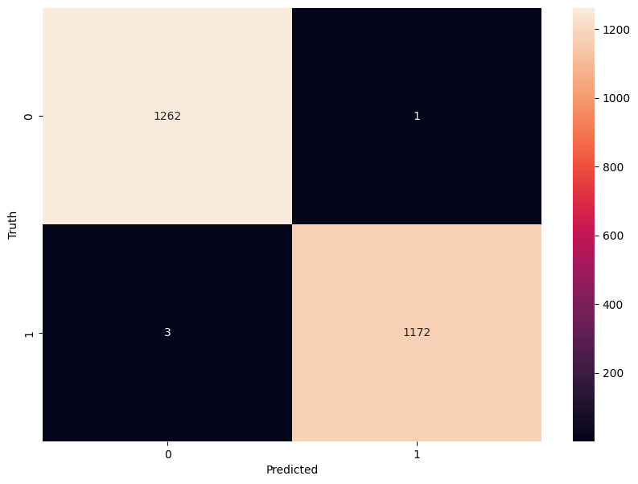

Build Your Own Neural Network
=============================

In this section we will build a simple neural network, train it and validate it on a sample test data.
For this exercise, we will use the `Mushroom dataset from the Audobon Society Field Guide <https://archive.ics.uci.edu/dataset/73/mushroom>`_.
This dataset includes 22 physical characteristics of ~8,000 mushrooms spanning 23 species of gilled mushrooms in the Agaricus and Lepiota Family.
Our task is to predict whether a mushroom is edible or poisonous based on its physical characteristics.

By the end of this excercise participants will be able to:

1. Import the Mushroom dataset from the UCI Machine Learning Repository.
2. Examine and preprocess the data to be fed to the neural network.
3. Build a sequential model neural network using TensorFlow Keras.
4. Evaluate the model's performance on test data.

TensorFlow and Keras Fundamentals
---------------------------------

Before we dive into the hands-on exercise, let's briefly introduce the tools we'll be using.

TensorFlow and Keras
^^^^^^^^^^^^^^^^^^^^

.. image:: ./images/TensorFlow-Icon.png
    :width: 100px
    :align: right

`TensorFlow <https://www.tensorflow.org/>`_ is one of the most powerful open-source machine learning libraries available today. 
Developed by Google, TensorFlow offers a wide range of tools and resources to help you build, train, and deploy neural networks, making it accessible to both beginners and experts.

At its core, TensorFlow uses multi-dimensional arrays called *tensors* to represent:

* Input data
* Model parameters (weights and biases that the model learns)
* Outputs (predictions from the model)

.. list-table:: Common Tensor Types
    :widths: 25 35 30
    :align: center
    :header-rows: 1

    * - **Tensor Type**
      - **Example**
      - **Shape**
    * - **Scalar (Rank-0)**
      - ``5``
      - ``()``
    * - **Vector (Rank-1)**
      - ``[1, 2, 3]``
      - ``(3,)``
    * - **Matrix (Rank-2)**
      - ``[[1, 2, 3], [4, 5, 6]]``
      - ``(2, 3)``

`Keras <https://www.tensorflow.org/guide/keras>`_ is the high-level API of the TensorFlow platform. 
It provides a simple and intuitive way to define neural network architectures, and it's designed to be easy to use and understand.

Keras simplifies every step of the machine learning workflow, including data preprocessing, model building, training, and deployment.
Unless you're developing custom tools on top of TensorFlow, you should use Keras as your default API for deep learning tasks. 

Building Models with Keras
^^^^^^^^^^^^^^^^^^^^^^^^^^

Keras offers three approaches to building neural networks, but we'll focus on the Sequential API, which is perfect for the linear stack of layers we need for our mushroom classifier.

The basic workflow we'll follow is:

1. **Define the model architecture**: Specify the layers, their sizes, and activation functions
2. **Compile the model**: Set the optimizer, loss function, and metrics
3. **Train the model**: Fit the model to our training data
4. **Evaluate performance**: Test the model on unseen data

Here's a preview of what our model code will look like:

.. code-block:: python3

    from tensorflow.keras.models import Sequential
    from tensorflow.keras.layers import Input, Dense

    # 1. Define the model architecture
    model = Sequential([
        Input(shape=(number_of_features,)),    # Input layer matching our feature count
        Dense(units=10, activation='relu'),    # Hidden layer with 10 neurons
        Dense(units=1, activation='sigmoid')   # Outputs a probability between 0 and 1
    ])

    # 2. Compile the model
    model.compile(                             
        optimizer='adam',                      # Gradient-based optimizer
        loss='binary_crossentropy',            # Loss function for binary classification
        metrics=['accuracy']                   # Track accuracy during training
    )

    # Display model summary to understand its structure
    model.summary()

    # 3. Train the model
    model.fit(
        X_train, y_train,                      # Training data and labels
        validation_split=0.2,                  # Use 20% of training data for validation
        epochs=5,                              # Number of complete passes through the dataset
        batch_size=32                          # Number of samples per gradient update
    )

    # 4. Evaluate model performance
    test_loss, test_accuracy = model.evaluate(X_test, y_test)
    print(f"Test accuracy: {test_accuracy:.4f}")

With this foundation in place, let's start building our our own neural network!

Building a Sequential Model Neural Network
------------------------------------------

Tutorial Setup and Materials
^^^^^^^^^^^^^^^^^^^^^^^^^^^^

All materials and instructions for running this tutorial in the `TACC Analysis Portal <https://tap.tacc.utexas.edu/>`_ are available in our GitHub repository: `TACC Deep Learning Tutorials <https://github.com/kbeavers/tacc-deep-learning-tutorials>`_.

Step 1: Importing and examining the data
^^^^^^^^^^^^^^^^^^^^^^^^^^^^^^^^^^^^^^^^

The Mushroom dataset is available in the University of California, Irvine Machine Learning Repository, which is a popular repository for machine learning datasets.
Conveniently, the ``ucimlrepo`` Python package provides a simple interface to download and load datasets directly from this repository.

First, we will import the Mushroom dataset using the ``ucimlrepo`` package:

.. code-block:: python3

    import pandas as pd
    import random
    from ucimlrepo import fetch_ucirepo 

    # Set seed for reproducibility
    random.seed(123)

    # fetch dataset 
    mushroom = fetch_ucirepo(id=73) 

Let's inspect the metadata:

.. code-block:: python3

    print("Dataset Overview:", mushroom.metadata.abstract)
    print("Number of Instances:", mushroom.metadata.num_instances)
    print("Number of Features:", mushroom.metadata.num_features)
    print("Has Missing Values:", mushroom.metadata.has_missing_values)

.. code-block:: python-console

    # Dataset Overview: From Audobon Society Field Guide; mushrooms described in terms of physical characteristics; classification: poisonous or edible
    # Number of Instances: 8124
    # Number of Features: 22
    # Has Missing Values: yes

We know that the Mushroom dataset has 8124 instances (samples) and 22 features (physical characteristics), and there are missing values in the dataset.
Now that we have loaded the dataset, let's separate the features (``X``) from the target variable and examine the structure of our feature data.

.. code-block:: python3

    X = mushroom.data.features
    print(X.info())

Examine the outout of ``X.info()``:

.. code-block:: python-console

    <class 'pandas.core.frame.DataFrame'>
    RangeIndex: 8124 entries, 0 to 8123
    Data columns (total 22 columns):
     #   Column                    Non-Null Count  Dtype 
    ---  ------                    --------------  ----- 
     0   cap-shape                 8124 non-null   object
     1   cap-surface               8124 non-null   object
     2   cap-color                 8124 non-null   object
     3   bruises                   8124 non-null   object
     4   odor                      8124 non-null   object
     5   gill-attachment           8124 non-null   object
     6   gill-spacing              8124 non-null   object
     7   gill-size                 8124 non-null   object
     8   gill-color                8124 non-null   object
     9   stalk-shape               8124 non-null   object
     10  stalk-root                5644 non-null   object
     11  stalk-surface-above-ring  8124 non-null   object
     12  stalk-surface-below-ring  8124 non-null   object
     13  stalk-color-above-ring    8124 non-null   object
     14  stalk-color-below-ring    8124 non-null   object
     15  veil-type                 8124 non-null   object
     16  veil-color                8124 non-null   object
     17  ring-number               8124 non-null   object
     18  ring-type                 8124 non-null   object
     19  spore-print-color         8124 non-null   object
     20  population                8124 non-null   object
     21  habitat                   8124 non-null   object
    Dtypes: object(22)
    memory usage: 1.4+ MB
    None

Next, let's isolate and examine our target variable ``y``:

.. code-block:: python3

    y = mushroom.data.targets 
    print(y.info())

Examine the outout of ``y.info()``:

.. code-block:: python-console

    <class 'pandas.core.frame.DataFrame'>
    RangeIndex: 8124 entries, 0 to 8123
    Data columns (total 1 columns):
     #   Column     Non-Null Count  Dtype 
    ---  ------     --------------  ----- 
     0   poisonous  8124 non-null   object
    Dtypes: object(1)
    memory usage: 63.6+ KB
    None

In pandas, a Dtype (data type) specifies how the data in a column should be stored and interpreted.
**See Day 1 for more information on Dtypes.** 

When we see a Dtype of ``object``, it typically means the column contains strings or a mix of different data types. Let's examine our data further:

.. code-block:: python3

    print(X.head(3))

.. code-block:: python-console

      cap-shape cap-surface cap-color bruises odor gill-attachment gill-spacing  \
    0         x           s         n       t    p               f            c   
    1         x           s         y       t    a               f            c   
    2         b           s         w       t    l               f            c   

      gill-size gill-color stalk-shape  ... stalk-surface-below-ring  \
    0         n          k           e  ...                        s   
    1         b          k           e  ...                        s   
    2         b          n           e  ...                        s   

      stalk-color-above-ring stalk-color-below-ring veil-type veil-color  \
    0                      w                      w         p          w   
    1                      w                      w         p          w   
    2                      w                      w         p          w   

      ring-number ring-type spore-print-color population habitat  
    0           o         p                 k          s       u  
    1           o         p                 n          n       g  
    2           o         p                 n          n       m  

    [3 rows x 22 columns] 

In this dataset, the features are categorical variables stored as strings (which pandas represents as ``object`` Dtype). 
Each feature is encoded with single-character values that represent specific categories.

For a complete reference of all categorical values and their meanings, visit the `UCI Mushroom Dataset page <https://archive.ics.uci.edu/dataset/73/mushroom>`_.

Here are a few examples of the categorical encodings:
 
 * **cap-shape**: 'x' (convex), 'b' (bell), 'f' (flat), etc.
 * **cap-color**: 'n' (brown), 'y' (yellow), 'w' (white), etc.
 * **odor**: 'p' (pungent), 'a' (almond), 'l' (anise), etc.

Next, let's take a look at the target variable:

.. code-block:: python3

    print(y.head())

.. code-block:: python-console

      poisonous
    0         p
    1         e
    2         e
    3         p
    4         e

The target variable contains two categorical labels: ``p`` (poisonous) and ``e`` (edible).
With this insight into our dataset's structure, our next step is to prepare the data for model training.

**Thought Challenge:** What are some things that you have noticed about the data that you think we will need to fix before feeding it to the neural network? Pause here and write down your thoughts before continuing.

Step 2: Data pre-processing
^^^^^^^^^^^^^^^^^^^^^^^^^^^

Our exploration of the Mushroom dataset reveals a collection of 8124 samples with 22 features and a single target variable. Before proceeding with model development, several preprocessing challenges need to be addressed:

 1. The dataset contains missing values that require handling.
 2. All features are categorical, encoded as text strings (represented as ``object`` type in pandas).
 3. The target variable itself is categorical, using ``p`` to indicate poisonous mushrooms and ``e`` for edible ones.

First, let's handle the missing values. Let's see how many missing values are in the dataset, and where they are located:

.. code-block:: python3

    missing_values = X.isnull().sum()
    print("Columns with missing values:")
    print(missing_values[missing_values > 0])

.. code-block:: python-console
    
    Columns with missing values:
    stalk-root    2480
    Dtype: int64

The output shows that ``stalk-root`` is missing data for 2480 samples, while all other features have complete data.
Let's remove this column from the dataset:

.. code-block:: python3

    X_clean = X.drop(columns='stalk-root')
    
Now we need to encode our categorical variables into a format suitable for the neural network. We'll use one-hot encoding via ``pd.get_dummies()`` to transform each categorical feature into multiple binary columns. For example, if a feature has three possible values (A, B, C), it will be converted into three separate columns, where only one column will have a value of 1 (True) and the others 0 (False):

.. code-block:: python3

    X_encoded = pd.get_dummies(X_clean)
    print(X_encoded.head(2))

.. code-block:: python-console

       cap-shape_b  cap-shape_c  cap-shape_f  cap-shape_k  cap-shape_s  \
    0        False        False        False        False        False   
    1        False        False        False        False        False   

       cap-shape_x  cap-surface_f  cap-surface_g  cap-surface_s  cap-surface_y  \
    0         True          False          False           True          False   
    1         True          False          False           True          False   

       ...  population_s  population_v  population_y  habitat_d  habitat_g  \
    0  ...          True         False         False      False      False   
    1  ...         False         False         False      False       True   

       habitat_l  habitat_m  habitat_p  habitat_u  habitat_w  
    0      False      False      False       True      False  
    1      False      False      False      False      False  

    [2 rows x 112 columns]

Now, instead of having 22 features, we have 112 features, each representing a binary True/False value for each categorical value in the original features.

Finally, let's encode the target variable. We will simply convert the string labels ``p`` and ``e`` into binary numeric values of 1 and 0, respectively.
In this case, 1 will represent a poisonous mushroom and 0 will represent an edible mushroom.

.. code-block:: python3

    y_encoded = y['poisonous'].map({'p': 1, 'e': 0})

Now would be a good time to check the class distribution of our dataset:

.. code-block:: python3

    print("\nClass Distribution:")
    print(y_encoded.value_counts())
    print("\nPercentage:")
    print(y_encoded.value_counts(normalize=True) * 100)

We have a roughly balanced dataset with 51.8% of the samples being edible and 48.2% being poisonous.
We can now split the dataset into training and test sets:

.. code-block:: python3

    from sklearn.model_selection import train_test_split

    # Split the dataset into training and testing sets
    X_train, X_test, y_train, y_test = train_test_split(
        X_encoded,
        y_encoded,
        test_size=0.3,
        stratify=y_encoded,
        random_state=123
    )

    # Examine the shape of the training and testing sets
    print("Training set shape:", X_train.shape, y_train.shape)
    print("Testing set shape:", X_test.shape, y_test.shape)

.. code-block:: python-console

    Training set shape: (5686, 112) (5686,)
    Testing set shape: (2438, 112) (2438,)

**Understanding the Train-Test Split**

The code above divides our data into training and testing sets, creating four objects:
``X_train``, ``X_test``, ``y_train``, and ``y_test``.

.. list-table:: Key Train-Test Split Parameters
   :widths: 20 50 30
   :header-rows: 1

   * - Parameter
     - Purpose
     - In Our Example
   * - ``test_size``
     - Determines what portion of data is reserved for testing
     - 30% for testing, 70% for training
   * - ``stratify``
     - Maintains the same class distribution in both splits
     - Ensures balanced representation of poisonous/edible classes
   * - ``random_state``
     - Controls the randomization for reproducible results
     - Set to 123 for consistent splits across runs

**Why These Parameters Matter:**

* **Test Size**: Finding the right balance between having enough data for training while reserving sufficient data for testing is crucial. Too little test data may not reliably assess model performance; too little training data may limit learning.

* **Stratification**: When working with classification problems, maintaining class proportions is essential. Without stratification, you might accidentally create a test set with disproportionate class representation, leading to misleading evaluation metrics.

* **Reproducibility**: Setting a random seed ensures you can reproduce your experiments exactly, which is fundamental for scientific rigor and debugging.

**Tip**: While our dataset has roughly balanced classes, stratification becomes especially important with imbalanced datasets. Always consider using ``stratify`` as a best practice.

Step 3: Building a sequential model neural network 
^^^^^^^^^^^^^^^^^^^^^^^^^^^^^^^^^^^^^^^^^^^^^^^^^^

Now we'll create a simple neural network for our mushroom classification task. The model will consist of:

- An **input layer** that matches our feature dimensions
- A **hidden layer** with 10 neurons and ReLU activation
- An **output layer** with sigmoid activation for binary classification

This architecture provides a good starting point for understanding how neural networks learn from tabular data.

.. code-block:: python3

    # Import necessary libraries from Keras
    import tensorflow as tf
    from tensorflow.keras import Sequential
    from tensorflow.keras.layers import Input, Dense

    # Set random seed for reproducibility
    tf.random.set_seed(123) 

    # Create model with sequential API
    model = Sequential([
        # Input layer - shape matches our feature count
        Input(shape=(112,)),  # 1D tensor with 112 features
        
        # Hidden layer - 10 neurons with ReLU activation
        # ReLU allows the network to learn non-linear patterns
        Dense(10, activation='relu'),
        
        # Output layer - single neuron with sigmoid activation
        # Sigmoid squashes output between 0-1, perfect for binary classification
        Dense(1, activation='sigmoid')
    ])

    # Compile the model with appropriate settings for binary classification
    model.compile(
        optimizer='adam',              # Adam: efficient gradient-based optimizer
        loss='binary_crossentropy',    # Standard loss function for binary problems
        metrics=['accuracy']           # Track accuracy during training
    )

    # Display model architecture and parameter count
    model.summary()
  
**Thought Challenge**: How many parameters does the model have? Can you calculate this manually and get the same result?

.. toggle:: Click to see the answer

      Let's calculate the parameters manually:
      
      **Layer 1** (Input → Hidden):

      - Input size: ``X_train.shape[1]`` (112 features after one-hot encoding)
      - Output size: 10 neurons
      - Weights: 112 × 10 = 1120 parameters
      - Biases: 10 (one per neuron)
      - Total for Layer 1: 1120 + 10 = 1130 parameters
      
      **Layer 2** (Hidden → Output):

      - Input size: 10 neurons
      - Output size: 1 neuron
      - Weights: 10 × 1 = 10 parameters
      - Biases: 1 (for the output neuron)
      - Total for Layer 2: 10 + 1 = 11 parameters
      
      **Total parameters**: 1130 + 11 = 1141 parameters
      
      This should match the parameter count shown in the model.summary() output. Each neuron has weights for all inputs from the previous layer, plus one bias term.

**Training the Neural Network**

With our model built and compiled, we can now train it on our data. Before executing the training code, let's understand the key parameters we'll use:

.. list-table:: Key Training Parameters
   :widths: 20 80
   :header-rows: 1

   * - Parameter
     - Description
   * - **validation_split=0.2**
     - Reserves 20% of training data to evaluate performance during training, without affecting model weights
   * - **epochs=5**
     - Number of complete passes through the dataset; more epochs allow for more learning iterations but risk overfitting
   * - **batch_size=32**
     - Number of samples processed before weight update; affects memory usage, training speed, and convergence behavior
   * - **verbose=2**
     - Controls output level (0=silent, 1=progress bar, 2=one line per epoch)

**Thought Challenge**: How does the choice of ``batch_size`` affect the training process?

.. toggle:: Click to see the answer

      The ``batch_size`` parameter determines how many samples the model processes before updating its weights.
      
      **Effects of batch size:**
      
      - **Small batch sizes** (e.g., 8-32):
        - Use less memory
        - Update weights more frequently
        - Can help the model escape local minima
        - May make training slower overall
      
      - **Large batch sizes** (e.g., 128-512):
        - More efficient use of GPU/CPU
        - More stable training (less "noisy" updates)
        - Require more memory
        - May get stuck in poor solutions
      
      The batch size of 32 in our example is relatively small, which is good for learning complex patterns in modest-sized datasets.

Now let's train our model with these parameters:

.. code-block:: python3

    # Train the model with the specified parameters
    model.fit(X_train, y_train, validation_split=0.2, epochs=5, batch_size=32, verbose=2)

Below shows the output of the training process:

.. code-block:: python-console

    Epoch 1/5
    143/143 - 0s - 3ms/step - accuracy: 0.8709 - loss: 0.3543 - val_accuracy: 0.9569 - val_loss: 0.1458
    Epoch 2/5
    143/143 - 0s - 969us/step - accuracy: 0.9776 - loss: 0.0964 - val_accuracy: 0.9851 - val_loss: 0.0638
    Epoch 3/5
    143/143 - 0s - 723us/step - accuracy: 0.9894 - loss: 0.0481 - val_accuracy: 0.9938 - val_loss: 0.0364
    Epoch 4/5
    143/143 - 0s - 739us/step - accuracy: 0.9949 - loss: 0.0288 - val_accuracy: 0.9982 - val_loss: 0.0230
    Epoch 5/5
    143/143 - 0s - 738us/step - accuracy: 0.9985 - loss: 0.0186 - val_accuracy: 0.9982 - val_loss: 0.0157

Let's understand what this output tells us:

1. **Progress metrics**:

  - ``143/143``: Shows progress through the training batches; 143 batches were completed out of 143, and each batch contains 32 samples (as specified by ``batch_size=32``)
  - ``0s``: Indicates the time taken for each epoch; here, the first epoch took <1 second to complete.
  - ``3ms/step``: This indicates the average time taken per training step (one forward and backward pass through a single batch) during training.

2. **Training metrics**:

  - ``accuracy: 0.8709``: Represents the accuracy of the model on the training dataset. The accuracy value of approximately 0.8709 indicates that the model correctly predicted 87.09% of the training samples.
  - ``loss: 0.3543``: Represents the training loss value (using binary cross-entropy loss function) on the training dataset. Higher loss values indicate that the model's predictions are further from the true labels.

3. **Validation metrics**:

  - ``val_accuracy: 0.9569``: Represents the accuracy of the model on the validation dataset. The accuracy value of approximately 0.9569 indicates that the model correctly predicted 95.69% of the validation samples.
  - ``val_loss: 0.1458``: Represents the validation loss value (using binary cross-entropy loss function) on the validation dataset. Lower loss values indicate that the model's predictions are closer to the true labels.

Looking at our training results after 5 epochs, we can observe:

1. The model achieved excellent performance, with final training accuracy of 99.85% and validation accuracy of 99.82%.
2. Both training and validation loss steadily decreased across epochs, indicating consistent learning.
3. Validation metrics consistently tracked close to training metrics, suggesting the model generalizes well rather than memorizing the training data.

Let's visualize our training progress before moving on:

.. code-block:: python3

    import matplotlib.pyplot as plt
    
    # Create a simple visualization of training history
    plt.figure(figsize=(10, 4))
    
    # Plot training & validation accuracy
    plt.subplot(1, 2, 1)
    plt.plot([0.8709, 0.9776, 0.9894, 0.9949, 0.9985], label='Training Accuracy')
    plt.plot([0.9569, 0.9851, 0.9938, 0.9982, 0.9982], label='Validation Accuracy')
    plt.title('Model Accuracy')
    plt.ylabel('Accuracy')
    plt.xlabel('Epoch')
    plt.legend()

    # Plot training & validation loss
    plt.subplot(1, 2, 2)
    plt.plot([0.3543, 0.0964, 0.0481, 0.0288, 0.0186], label='Training Loss')
    plt.plot([0.1458, 0.0638, 0.0364, 0.0230, 0.0157], label='Validation Loss')
    plt.title('Model Loss')
    plt.ylabel('Loss')
    plt.xlabel('Epoch')
    plt.legend()
    
    plt.tight_layout()
    plt.show()

.. figure:: ./images/mushroom-training-progress.png
    :width: 600px
    :align: center
    :alt: Training and validation metrics over epochs

This high performance is promising, but we should verify it on our completely separate test set, which the model has never seen during training. This will give us the most reliable measure of how well our model might perform in real-world scenarios.

Step 4: Evaluate the model's performance on test data
^^^^^^^^^^^^^^^^^^^^^^^^^^^^^^^^^^^^^^^^^^^^^^^^^^^^^

The true test of our model's capabilities comes from evaluating it on our completely separate test dataset. Let's see how our neural network performs when classifying mushrooms it has never encountered before!

.. code-block:: python3

    # Make predictions on the test data
    y_pred=model.predict(X_test)

For a binary classification problem like our (poisonous vs edible), the model outputs probabilities between 0 and 1 for each sample. Let's show the first sample's prediction:

.. code-block:: python3

    y_pred[0]

.. code-block:: python-console
    
    array([0.00309971], dtype=float32)

This shows the probability for the first mushroom sample in the test set.
The output is a single value between 0 and 1, where:

 - Values closer to 1 indicate the model is more confident that the sample is poisonous.
 - Values closer to 0 indicate the model is more confident that the sample is edible.

For example, our output value is 0.00309971, which means that the model is 99.9969% confident that the sample is edible.

The model outputs probability values, but for practical mushroom classification, we need definitive "edible" or "poisonous" predictions. We need to convert these continuous probability values into discrete class labels:

.. code-block:: python3

    import numpy as np
    
    # Convert probabilities to binary predictions using a threshold of 0.5
    y_pred_final = (y_pred > 0.5).astype(int)
    
This code performs what's called "thresholding":

1. First, we compare each probability to the threshold value (0.5)
   
   - If probability > 0.5, the result is True (model thinks it's more likely poisonous)
   - If probability ≤ 0.5, the result is False (model thinks it's more likely edible)

2. Then, we convert these True/False values to integers (1/0) with ``.astype(int)``
   
   - True becomes 1 (poisonous)
   - False becomes 0 (edible)

The 0.5 threshold represents the decision boundary - the point where the model is equally confident in either class. We could adjust this threshold if we wanted to be more conservative about certain types of errors (e.g., lowering the threshold would classify more mushrooms as poisonous, reducing the chance of missing toxic ones).

Now, let's visualize the model's prediction accuracy with a **confusion matrix**. 
This will allow us to see how many correct vs incorrect predictions were made using the model above.

.. code-block:: python3

    from sklearn.metrics import confusion_matrix
    import seaborn as sns

    # Create confusion matrix
    cm=confusion_matrix(y_test,y_pred_final)

    # Create visualization
    plt.figure(figsize=(10,7))          # Set figure size to 10x7 inches
    sns.heatmap(cm,annot=True,fmt='d')  # Create heatmap with annotations and display counts as integers
    plt.xlabel('Predicted')             # Label x-axis as 'Predicted'
    plt.ylabel('Truth')                 # Label y-axis as 'Truth'
    plt.show()                          # Display the plot

Output of the above confusion matrix is as follows:

The confusion matrix visualization shows how well our model classifies mushrooms as edible or poisonous. The matrix is a 2x2 grid where:

* The y-axis (Truth) shows the actual class of the mushrooms
* The x-axis (Predicted) shows what our model predicted
* Each cell contains the count of predictions falling into that category
* The heatmap coloring provides visual intensity, where lighter colors indicate higher counts

Reading the matrix:

* **Top-left**: True Negatives (TN) - Correctly identified edible mushrooms
* **Top-right**: False Positives (FP) - Edible mushrooms incorrectly classified as poisonous
* **Bottom-left**: False Negatives (FN) - Poisonous mushrooms incorrectly classified as edible
* **Bottom-right**: True Positives (TP) - Correctly identified poisonous mushrooms 

**Key Classification Metrics**

From these confusion matrix values, we can calculate several important evaluation metrics:

.. list-table:: Classification Metrics for Mushroom Model
   :widths: 20 30 40
   :header-rows: 1

   * - Metric
     - Definition
     - Interpretation for Mushrooms
   * - **Accuracy**
     - :math:`\frac{TP + TN}{TP + TN + FP + FN}`
     - Percentage of all mushrooms correctly classified
   * - **Precision**
     - :math:`\frac{TP}{TP + FP}`
     - When model predicts "poisonous," how often is it right?
   * - **Recall**
     - :math:`\frac{TP}{TP + FN}`
     - Of all poisonous mushrooms, how many did we correctly identify? 
   * - **F1-Score**
     - :math:`2 \times \frac{Precision \times Recall}{Precision + Recall}`
     - Harmonic mean of precision and recall; useful when you need to balance both
   * - **Specificity**
     - :math:`\frac{TN}{TN + FP}`
     - Of all edible mushrooms, how many did we correctly identify?

**Thought Challenge**: Which prediction metric is most important for this model? Why? 

.. toggle:: Click to see the answer

    For mushroom classification, false negatives (bottom-left) are particularly concerning as they represent poisonous mushrooms that were incorrectly classified as edible.

    **Recall** measures a model's ability to correctly identify all true positives within a dataset, minimizing false negatives. 
    Therefore, **recall** is the most important metric for this model.

Let's also print the full classification report of this model using code below

.. code-block:: python3

    from sklearn.metrics import classification_report

    print(classification_report(y_test,y_pred_final, digits=4))

.. code-block:: python-console

               precision    recall  f1-score   support

            0     0.9968    0.9992    0.9980      1263
            1     0.9991    0.9966    0.9979      1175

     accuracy                         0.9979      2438
    macro avg     0.9980    0.9979    0.9979      2438
 weighted avg     0.9980    0.9979    0.9979      2438

The accuracy of our model is 99.79%.
99.79% of the time, this model predicted the correct label on the test data.

**Thought Challenge**: Did we build a successful model? Why or why not? Is there anything we can do to improve the model?

.. toggle:: Click to see the answer

    **Did we build a successful model?**
    
    Yes, by standard performance metrics, our model is remarkably successful:
    
    * Accuracy of 99.79% on the test set
    * Recall of 99.66% for poisonous mushrooms
    * Precision of 99.91% for poisonous predictions
    * F1-score of 99.79%
    
    **Why it's successful:**
    
    * The model efficiently learned the patterns distinguishing edible from poisonous mushrooms
    * Our preprocessing strategies (handling missing values, one-hot encoding) were effective
    * The architecture, despite being simple (just one hidden layer), was sufficient for this task
    * The dataset is well-structured with clear categorical features that strongly correlate with mushroom edibility
    
    **However, there are important considerations:**
    
    In a real-world mushroom classification system, even our 99.66% recall means that approximately 4 out of 1175 poisonous mushrooms were misclassified as edible. For a life-critical application like mushroom toxicity detection, this error rate might still be too high.
    
    **Potential improvements:**
    
    1. **Domain-specific threshold adjustment**: Lower the classification threshold from 0.5 to a more conservative value (e.g., 0.3) to reduce the likelihood of false negatives (missing poisonous mushrooms)
    
    2. **More sophisticated architecture**: Try deeper networks or different architectures that might capture more subtle patterns
    
    3. **Ensemble methods**: Combine multiple models to reduce the chance of missing poisonous mushrooms
    
    4. **Cost-sensitive learning**: Explicitly penalize false negatives (missing poisonous mushrooms) more heavily during training
    
    5. **Uncertainty estimation**: Add methods to quantify prediction uncertainty, so users know when to seek additional verification
    
    **Real-world deployment considerations:**
    
    Even with an improved model, it would be ethically questionable to deploy such a system as the sole decision-maker for mushroom consumption. It should be presented as a tool to assist experts rather than replace human judgment, especially for life-critical decisions.