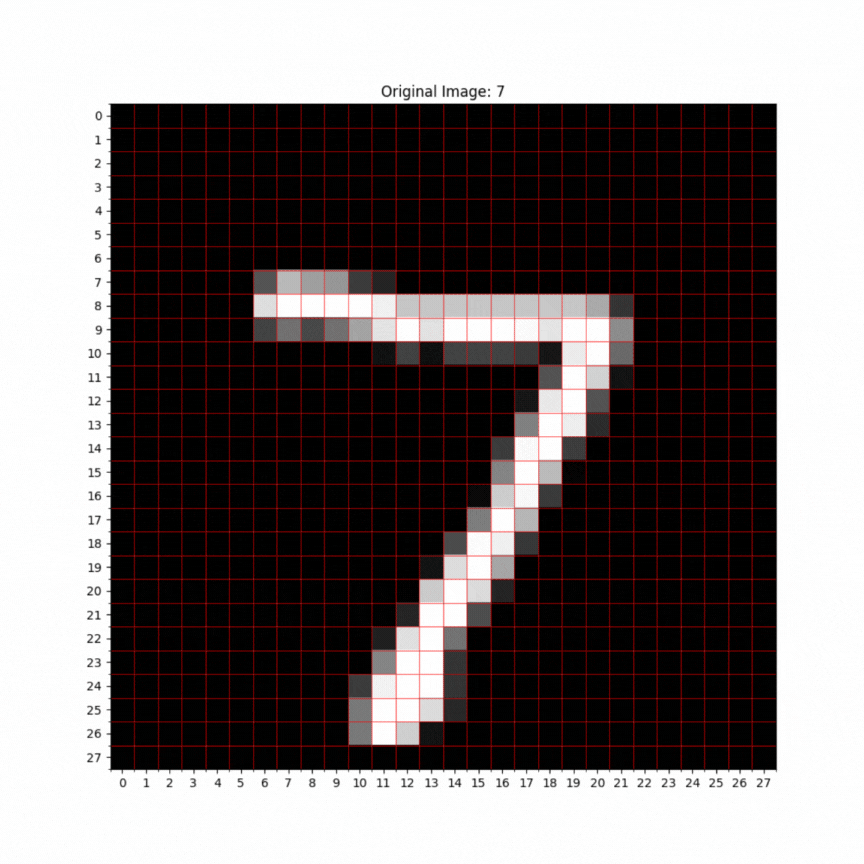
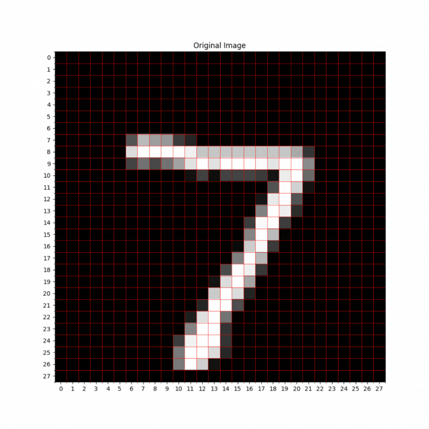
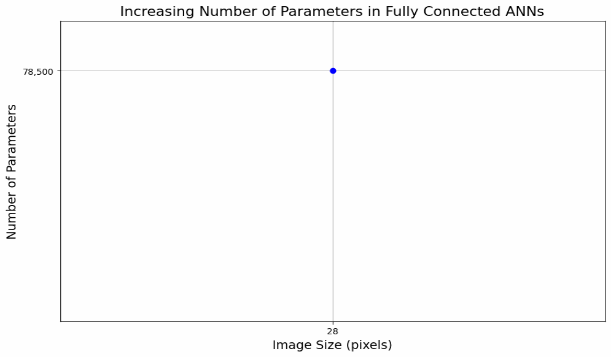
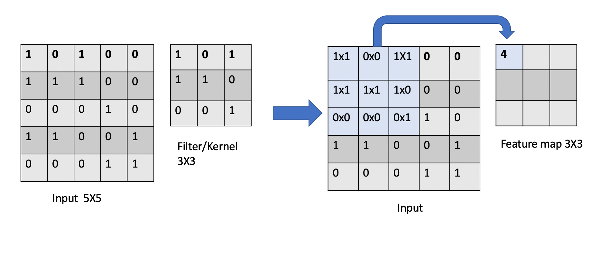
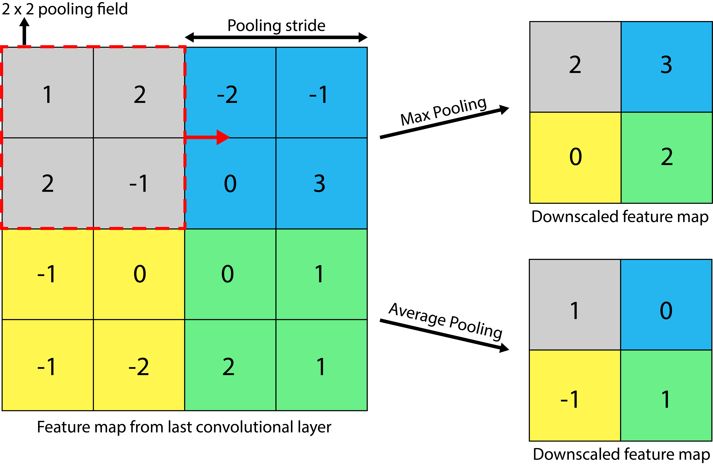
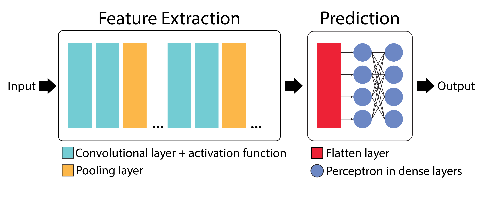
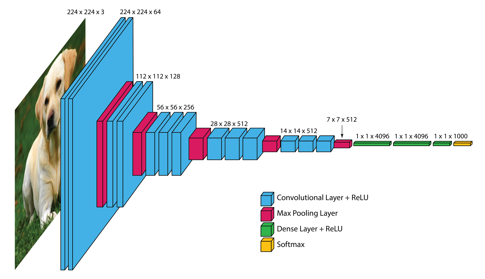
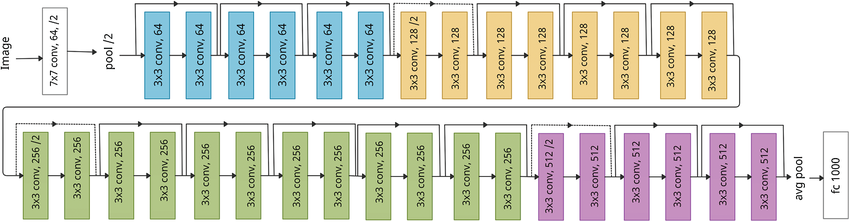

Intro to Convolutional Neural Networks
================================================

In the previous section, we learned how to classify mushrooms based on their physical characteristics.
In this section, we will introduce Convolutional Neural Networks (CNNs), a specialized class of deep neural networks that excel in tasks involving spatial data, particularly image recognition and computer vision.
Understanding CNNs will prepare you for future applications where image data is involved. 

By the end of this exercise participants will be able to:

- Understand the challenges associated with ANNs for image processing
- Explain what makes CNNs a better choice for solving image classification problems
- Understand different CNN architectures, such as VGG16 and LeNet-5 

====================
Why CNNs?
====================

To illustrate the advantages of CNNs, let's consider a common example in machine learning: the MNIST dataset, which consists of images of handwritten digits.

.. figure:: ./images/MNIST.png
    :width: 600px
    :align: center
    :alt: 

When using traditional artificial neural networks (ANNs) to classify these images, several challenges arise:

**1. Loss of Spatial Information**:
ANNs treat input data as flat vectors, disregarding the spatial relationships present in the image.
For instance, when flattening a 28x28 pixel image into a 1D array of 784 pixels, important spatial information is lost.
This means that an ANN might struggle to recognize features like the curves of the digit '3' or the straight lines of the digit '7'. 

**2. Lack of Translation Invariance**:
ANNs cannot reliably recognize objects if their position in the image changes.
For example, an ANN might excel at identifying the digit '7' when it appears in the center of an image, but fail to recognize the same digit if it is shifted to the left or right.
This limitation can lead to poor performance in real-world applications where the position of objects can vary.

**3. Challenges with High Dimensionality**:
ANNs struggle with the rapidly growing number of trainable parameters as image size increases.
Consider a fully connected ANN with a single hidden layer of 100 perceptrons.
Each pixel in the input image is connected to every perceptron, meaning that for a 28 x 28 pixel image, we have (28 x 28 x 100) + 100 (bias) = 78,500 parameters in one hidden layer.
This number grows exponentially with image size, making training on larger images computationally expensive and potentially infeasible.

====================
How CNNs Address These Challenges
====================
Convolutional Neural Networks (CNNs) are specifically designed for processing structured grid data, such as images, time-series data and videos.
Their key capability is identifying object locations in images through a mathematical operation called **convolution**.
This allows CNNs to handle variations in object position, making them ideal for computer vision tasks like image classification, object detection, face recognition, and autonomous driving.

Their utility comes from two simple, yet powerful layers of CNNs, known as the **convolutional** and **pooling** layers.

Convolutional Layer:
~~~~~~~~~~~~~~~~~~~~~~

The convolutional layer is the first layer of a CNN.
It performs *feature extraction* by applying a convolutional kernel (also known as a filter) to the input image.
This filter is a small matrix of weights that slides or *convolves* across the input image, learning local patterns in the image to build a **feature map**. 
You can think of this filter as a sliding window moving across the image, analyzing multiple pixels at once to learn spatial relationships between them:

.. figure:: ./images/convolutions.gif
    :width: 500px
    :align: center
    :alt: 

In the above animation, a **3 x 3** window slides across an image of size **5 x 5** and builds a feature map of size **3 x 3** using the convolution operation.

Let's examine how the convolution operation works when a filter slides across an input image:

    
    Source: https://medium.com/@nikitamalviya/convolution-pooling-f8e797898cf9

**How the convolution operation works:**

 **1. Input Matrix (5 x 5)**: The leftmost matrix represents an input image of size 5x5, where each element contains a numerical value (e.g., pixel intensity)

 **2. Filter/Kernel (3 x 3)**: The middle matrix represents a filter/kernel of size 3x3, which contains the *weights* that will be applied to the input image.

 **3. Convolution Operation**: The filter "scans" over the input image, applying the weights to each element in the image. At each position, the filter multiplies the weights with the corresponding input pixel values and sums up the products to produce a single output value.

 **4. Feature Map (3 x 3)**: The rightmost matrix shows the results after applying the convolution operation at the first position. Each element in the feature map respresents the response of the filter to a specific local pattern in the input image. 

To summarize, a convolutional layer is responsible for detecting important features in an image.
CNNs can have multiple convolutional layers, each layer detecting increasingly complex features.
Lower layers typically detect low-level features such as edges and corners, while higher layers detect more complex patterns and structures.

Convolutional layers help achieve something called **translational invariance** by using the same filter weights across the entire image.
This means that the same filter can recognize features, like a horizontal edge, no matter where they appear in the image.
For example, if a filter learns to find a horizontal edge in one part of the image, it can also find that same edge even if it is slightly moved to another position.

**Thought Challenge**: Closely examine the animation and image above. Can you identify any drawbacks or weaknesses of the convolutional layer? 

.. toggle:: Click to show

    The convolution operation has an inherent limitation: pixels at the edges and corners of the image are used less frequently in calculations compared to pixels in the middle of the image. This is because when the filter slides across the image, it can only partially overlap with edge pixels, leading to potential loss of important edge information.
    
    To avoid this we use a technique known as **padding**, which adds a layer of zeros on the outer edges of image, thereby making the image bigger and preserving the pixels from image corners.

    .. figure:: ./images/padding.png
        :width: 650px
        :align: center
        :alt: 

Pooling Layer
~~~~~~~~~~~~~~~~~~~~~~

In CNNs, pooling layers are used to reduce the dimensionality of the feature maps produced by the convolutional layers.
They help in reducing the number of parameters in the model, thereby reducing the computational complexity and the risk of overfitting.
This process is often referred to as **downsampling** or **downscaling**.

    Average and Max Pooling. Source: [1]_

Consider the above example of a 4 x 4 feature map.
We can apply a 2 x 2 pooling filter with a stride (step size) of 2 pixels. 
With a pooling operation, we can summarize the 4 x 4 feature map into a 2 x 2 *downscaled* feature map, thereby reducing the number of trainable parameters.

Two popular methods of pooling are:

**1. Max Pooling**: The summary of features is represented by the maximum values in that region. This is typically used when the image has a dark background to emphasize the brighter pixels.

**2. Average Pooling**: The summary of features is represented by the average values in that region. This is typically used when a more complete representation of the features is desired. 

Now that we understand Convolutional and Pooling Layers, let's explore how these building blocks come together to construct a complete CNN model.

====================
Basic CNN Architecture
====================

Convolutional Neural Networks (CNNs) are built from several key components: convolutional layers, pooling layers, flatten layers, and fully connected (dense) layers.

**Feature Extraction**

 The convolutional layer, along with the activation function and pooling layer, forms the **feature extraction** stage of the CNN.
 In this stage, filters are applied to the input image to create multi-dimensional feature maps, where each map represents the activation of perceptrons at different spatial locations.

**Prediction**
 The flatten layer and dense layer make up the **prediction stage**. The flatten layer converts the multi-dimensional feature maps into a one-dimensional vector, which is then processed by the dense layer to make predictions.

Adding CNN Layers in TensorFlow Keras
~~~~~~~~~~~~~~~~~~~~~~~~~~~~~~~~~~~~~~~~

Adding a convolutional layer in TensorFlow Keras is straightforward, as you can specify the number of filters and their size when defining the layer.

.. code-block:: python3

    from tensorflow.keras.models import Sequential
    from tensorflow.keras.layers import Conv2D

    # Initializing a sequential model
    model = Sequential()
    model.add(Conv2D(64, (3, 3), activation='relu', padding='same', input_shape=(28, 28, 1)))

With ``model.add`` we are creating a 2D convolutional layer with 64 filters of size :math:`3x3`:

 - ``activation='relu'``: This specifies the activation function applied to the output of the convolutional layer. ReLU (Rectified Linear Unit) is a commonly used activation function in CNNs.

 - ``padding='same'``: This specifies the type of padding to be applied to the input feature maps before performing the convolution operation. "Same" padding means that the input is padded with zeros so that the output has the same dimensions as the input. This helps preserve spatial information at the edges of the feature maps.

 - ``input_shape=(28, 28, 1)``: This specifies the shape of the input data that will be fed into the model. In this case, the input data is expected to have a shape of (28, 28, 1), indicating that it consists of 28x28 grayscale images (1 channel). The (28, 28, 1) tuple represents (height, width, channels). Color images will have multiple channels (e.g., an RGB image will have 3 channels: red, green, and blue).

After adding a convolutional layer we add a pooling layer, with either MaxPooling or AveragePooling.

.. code-block:: python3

    from tensorflow.keras.layers import MaxPooling2D

    model.add(MaxPooling2D((2, 2), padding = 'same'))

We can keep adding a series of convolutional and pooling layers, before flattening the output and
providing it to fully connected Dense layers to produce the final output.

.. code-block:: python3

    # Series of alternating convolutional and pooling layers
    model.add(Conv2D(32, (3, 3), activation='relu', padding="same"))
    model.add(MaxPooling2D((2, 2), padding = 'same'))
    model.add(Conv2D(32, (3, 3), activation='relu', padding="same"))
    model.add(MaxPooling2D((2, 2), padding = 'same'))

You might be wondering why we need a flatten layer.
The Flatten layer in a CNN is necessary to transition from the spatially structured representation of data obtained from convolutional and pooling layers to a format suitable for fully connected layers, which are typically used for making predictions or classifications.

.. code-block:: python3

    from tensorflow.keras.layers import Flatten, Dense

    # flattening the output of the conv layer after max pooling to make it ready for creating dense connections
    model.add(Flatten())

    # Adding a fully connected dense layer with 100 neurons
    model.add(Dense(100, activation='relu'))

    # Adding the output layer with num_classes and activation function as softmax for class classification problem
    model.add(Dense(num_classes, activation='softmax'))

The formula for calculating trainable parameters in each layer is: 

.. math::

    (k_w * k_h * C_{in} +1 ) * C_{out}

Where: 

 - :math:`k_w` = kernel width
 - :math:`k_h` = kernel height
 - :math:`C_{in}` = number of input channels
 - :math:`C_{out}` = number of filters (output channels)

CNN Architectures
~~~~~~~~~~~~~~~~~~~
Different CNN architectures have emerged in the past, some of the popular ones are:

- LeNet-5
- VGG-Net
- ResNet
- Inception V3

Each architecture has some specific use cases where they can be used.
In this lecture, we will cover some basics of VGG-Net and ResNet.

~~~~~~~~~~~~~~~~~~~
VGG-Net
~~~~~~~~~~~~~~~~~~~

VGG-Net is a CNN architecture developed by researchers at the Visual Geometry Group (VGG) at the University of Oxford in 2014 [2]_.
It became famous after performing very well on the ImageNet dataset, a common benchmark for image classification tasks that contains over 14 million images belonging to 1000 classes.

VGG-Net comes in two main variants: VGG-16 and VGG-19, with 16 and 19 layers respectively.
What makes VGG special is its straightforward design:

 **Input Layer**: The VGG-16 model takes in color images (RGB with 3 channels) that are 224 x 224 pixels in size.

 **Convolutional Layers**: VGG-16 has 13 convolutional layers that are responsible for extracting features from the input images. 
 All convolutional layers use:
  - 3 x 3 filters (kernels)
  - Stride of 1 pixel (meaning the filter moves 1 pixel at a time)
  - Padding of 1 pixel (meaning that the input is padded with 1 pixel on all sides to preserve the spatial dimensions of the image)
  - ReLU activation function
  The number of filters in each convolutional layer increases as we go deeper into the network, from 64 filters (resulting in 64 feature maps) in the first few layers to 512 filters (resulting in 512 feature maps) in the later layers.

 **Pooling Layers**: After each block of convolutional layers, a max-pooling layer is applied. 
 The max-pooling layer uses a 2 x 2 window and a stride of 2, which means it takes the maximum value from a 2 x 2 region and reduces the feature map size by half to keep the network efficient and manageable.

 **Fully Connected (Dense) Layers**: 
 After flattening the output of the last max-pooling layer, the 7 x 7 x 512 feature map is flattened into a 1D vector that is then fed into three fully connected dense layers:
  - 1st Dense Layer: 4096 perceptrons + ReLU
  - 2nd Dense Layer: 4096 perceptrons + ReLU
  - 3rd Dense Layer: 1000 perceptrons + Softmax (for classification into 1000 categories in ImageNet)

In total, VGG-16 has 13 convolutional layers and 3 dense layers, giving it a total of 16 trainable layers. 

    Architecture for the VGG-16 CNN. Adapted from: [4]_

The network's uniform structure and strong performance make it a popular choice for many computer vision applications, though its large size (138M parameters for VGG-16) means it requires significant computational resources.

VGG16 is available in the keras.applications package and can be imported using following code.

.. code-block:: python3

    from keras.applications.vgg16 import VGG16

The VGG16 model can be created in one line of code:

.. code-block:: python3

    model_vgg16 = VGG16(weights='imagenet')

You can examine the model architecture and number of trainable parameters by printing a summary:

.. code-block:: python3

    model_vgg16.summary()

~~~~~~~~~~~~~~~~~~~
ResNet
~~~~~~~~~~~~~~~~~~~

**ResNet** (short for **Residual Network**) is a deep CNN architecture introduced by Microsoft Research in 2015 [5]_.
It became famous after winning the ImageNet Large Scale Visual Recognition Challenge (ILSVRC) in 2015 by a large margin, due to its ability to train extremely deep networks (over 100 layers) without suffering from performance degradation.

This was notable because as CNNs get deeper, they often start to suffer from the *vanishing gradient problem*. 
Recall that when training a neural network, the model uses **backpropagation** to adjust the weights based on the gradient of the loss function.
These gradients show how much to change each weight to reduce prediction error. 

However, in very deep networks, these gradients can become very small (they "vanish") as they are passed backward through many layers. 
This causes:
 - Early layers to receive almost no signal
 - Weights to become stuck in their initial random values
 - Training to become slow or even fail to converge

.. figure:: ./images/Vanishing_Gradient_Problem.png
    :width: 400px
    :align: center

    The vanishing gradient problem in deep neural networks. Source: [6]_

ResNet addresses this problem by introducing a novel concept called **skip connections**. 
As the name suggests, a skip connection allows the input of an earlier layer to *skip over one or more layers* and be added directly to the output of a later layer. 
This helps gradients flow backwards more easily through the network, making it easier for the model to learn and update the weights effectively.

Instead of just learning a function :math:`F(x)`, the network learns:

.. math::

    F(x) + x

This means the network is learning the **residual** (the change needed to move from :math:`x` to :math:`F(x) + x`), rather than the function itself, which is often easier.

.. figure:: ./images/skip_connection.png
    :width: 400px
    :align: center

    Skip Connection. Source: [7]_

Common variants include ResNet-50, ResNet-101, and ResNet-152, where the number indicates the total layers in the network.

    Architecture of the ResNet-152 deep CNN model. Source: [8]_

ResNet's architecture allows for extremely deep networks (over 100 layers) while maintaining good training characteristics. The model is available in Keras and can be imported using:

.. code-block:: python3

    from keras.applications import ResNet50, ResNet101, ResNet152
    model_resnet = ResNet152(weights='imagenet')

Choosing Between Architectures
~~~~~~~~~~~~~~~~~~~

There is no one-size-fits-all solution for choosing a CNN architecture.
The best choice depends on your specific task and constraints. 

Below are some key factors to consider when choosing between architectures like VGG, ResNet, and others such as InceptionV3 and Xception:

1. **Task Complexity**:

   - Simple classification tasks (e.g., binary or low-class-count image classification):
  
      * LeNet-5 (not discussed here, but see [9]_)
      * VGG 
  
   - Complex tasks (e.g., object detection):
  
      * ResNet
      * InceptionV3 (not discussed here)

2. **Dataset Size**:

   - Small datasets:
  
      * LeNet-5
      * VGG
  
   - Large datasets:
  
      * ResNet
      * InceptionV3

3. **Computational Resources**:

   - Limited resources (e.g., CPU-only, small GPU):
  
      * LeNet-5 is extremely lightweight and fast to train
      * ResNet-50 (~25M parameters) is a good balance between depth and speed
  
   - High-performance hardware:
  
      * All models work; InceptionV3 is particularly optimized for efficiency at scale

4. **Input Image Size**:

   - Small grayscale images (e.g. 28 x 28):
  
      * LeNet-5
  
   - Standard RGB images (224 x 224):
  
      * VGG
      * ResNet
  
   - Larger images (299 x 299 or more):
  
      * InceptionV3 

**Reference List**
 * The material in this module is based on `COE 379L: Software Design for Responsible Intelligent Systems <https://coe-379l-sp24.readthedocs.io/en/latest/unit03/neural_networks.html>`_
.. [1] Minfei, L., Yidong, G., Ze, C., Zhi, W., Erik, S., & Branko, Š. (2022). Microstructure-informed deep convolutional neural network for predicting short-term creep modulus of cement paste. Cement and Concrete Research, 152, 106681. doi:10.1016/j.cemconres.2021.106681
.. [2] Simonyan, K., & Zisserman, A. (2015). Very Deep Convolutional Networks for Large-Scale Image Recognition. arXiv [Cs.CV]. Retrieved from http://arxiv.org/abs/1409.1556
.. [3] Ferguson, M., Ak, R., Lee, Y.-T. T., & Law, K. H. (2017). Automatic localization of casting defects with convolutional neural networks. 2017 IEEE International Conference on Big Data (Big Data), 1726–1735. doi:10.1109/BigData.2017.8258115
.. [4] Learning, G. (2021, September 23). Everything you need to know about VGG16. Medium. https://medium.com/@mygreatlearning/everything-you-need-to-know-about-vgg16-7315defb5918 
.. [5] He, K., Zhang, X., Ren, S., & Sun, J. (2015). Deep Residual Learning for Image Recognition. arXiv [Cs.CV]. Retrieved from http://arxiv.org/abs/1512.03385
.. [6] Everton Gomede, P. (2024, January 6). Unraveling the vanishing gradient problem in neural networks. Medium. https://medium.com/aimonks/unraveling-the-vanishing-gradient-problem-in-neural-networks-3f58431de75f 
.. [7] Riebesell, J. (2022, April 12). Janosh Riebesell. TikZ.net. https://tikz.net/skip-connection/ 
.. [8] Srinivasan, Kathiravan & Garg, Lalit & Datta, Debajit & Alaboudi, Abdulellah & Jhanjhi, Noor & Agarwal, Rishav & Thomas, Anmol. (2021). Performance Comparison of Deep CNN Models for Detecting Driver's Distraction. Computers, Materials & Continua. 68. 4109-4124. 10.32604/cmc.2021.016736. 
.. [9] Convolutional Neural Networks (CNNs) - COE 379L: Software Design For Responsible Intelligent Systems documentation. (n.d.). https://coe-379l-sp24.readthedocs.io/en/latest/unit03/cnn.html#lenet-5 