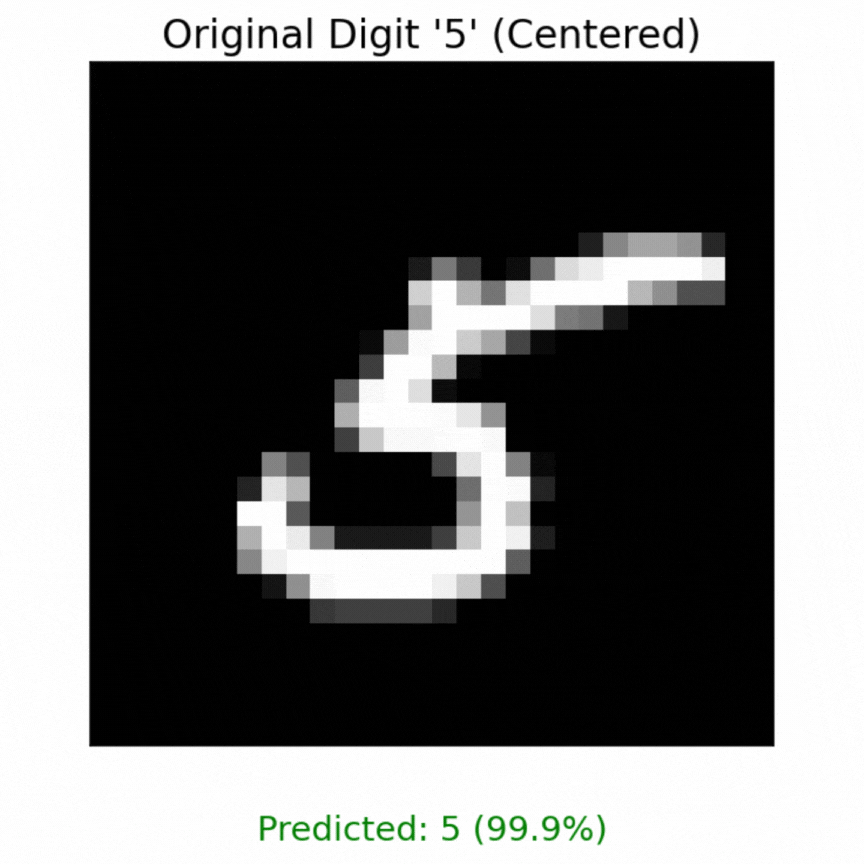
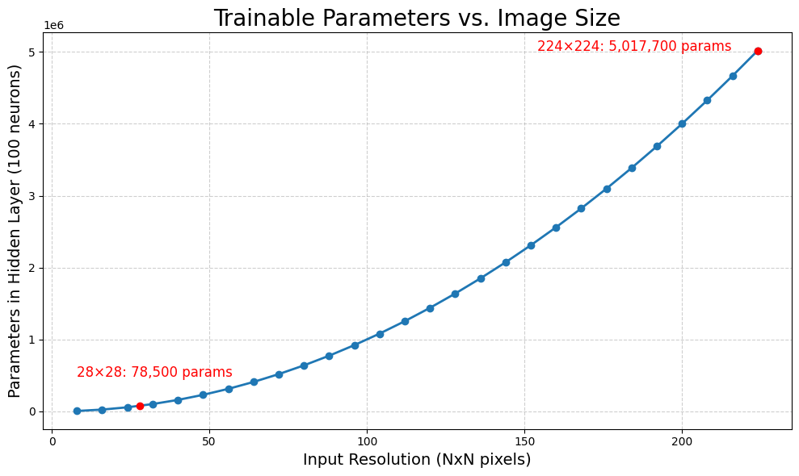

Intro to Convolutional Neural Networks
======================================

In the previous section, we learned how to classify mushrooms based on their physical characteristics.
In this section, we will introduce Convolutional Neural Networks (CNNs), a specialized class of deep neural networks that excel in tasks involving spatial data, particularly image recognition and computer vision.
Understanding CNNs will prepare you for future applications where image data is involved. 

By the end of this exercise participants will be able to:

- Understand the challenges associated with ANNs for image processing
- Explain what makes CNNs a better choice for solving image classification problems
- Understand different CNN architectures, such as VGG16 and LeNet-5 

Why CNNs?
---------

To illustrate the advantages of CNNs, let's consider a common example in machine learning: the MNIST dataset, which consists of images of handwritten digits.

.. figure:: ./images/MNIST.png
    :width: 500px
    :align: center
    :alt: 

When using traditional artificial neural networks (ANNs) to classify these images, several challenges arise:

**1. Loss of Spatial Information**:
ANNs treat input data as flat vectors, disregarding the spatial relationships present in the image.
For instance, when flattening a 28x28 pixel image into a 1D array of 784 pixels, important spatial information is lost.
This means that an ANN might struggle to recognize features like the curves or straight linesof the digit '5'. 

.. figure:: ./images/flatten-MNIST.gif
    :width: 400px
    :align: center
    :alt: 

**2. Lack of Translation Invariance**:
ANNs cannot reliably recognize objects if their position in the image changes.
For example, an ANN might excel at identifying the digit '5' when it appears in the center of an image, but fail to recognize the same digit if it is shifted to the left or right.
This limitation can lead to poor performance in real-world applications where the position of objects can vary.

**3. Challenges with High Dimensionality**:
ANNs struggle with the rapidly growing number of trainable parameters as image size increases.
Consider a fully connected ANN with a single hidden layer of 100 perceptrons.
Each pixel in the input image is connected to every perceptron, meaning that for a 28 x 28 pixel image, we have (28 x 28 x 100) + 100 (bias) = 78,500 parameters in one hidden layer.
This number grows quadratically with image size, making training on larger images computationally expensive and potentially infeasible.

How CNNs Process Grid Data
--------------------------

Convolutional Neural Networks (CNNs) are specifically designed for processing structured grid data, such as images, time-series data and videos.
Their key capability is identifying object locations in images through a mathematical operation called **convolution**.
This allows CNNs to handle variations in object position, making them ideal for computer vision tasks like image classification, object detection, face recognition, and autonomous driving.

Their utility comes from two simple, yet powerful layers of CNNs, known as the **convolutional** and **pooling** layers.

Convolutional Layer:
^^^^^^^^^^^^^^^^^^^^

The convolutional layer is the first layer of a CNN.
It performs *feature extraction* by applying a convolutional kernel (also known as a filter) to the input image.
This filter is a small matrix of weights that slides or *convolves* across the input image, learning local patterns in the image to build a **feature map**. 
You can think of this filter as a sliding window moving across the image, analyzing multiple pixels at once to learn spatial relationships between them:

.. figure:: ./images/convolutions.gif
    :width: 500px
    :align: center
    :alt: 

    Source: `Intuitively Understanding Convolutions for Deep Learning <https://medium.com/data-science/intuitively-understanding-convolutions-for-deep-learning-1f6f42faee1>`_

In the above animation, a **3 x 3** window slides across an image of size **5 x 5** and builds a feature map of size **3 x 3** using the convolution operation.

Let's examine how the convolution operation works when a filter slides across an input image:

.. figure:: ./images/ConvolutionKernel.png
    :width: 650px
    :align: center
    :alt: Full padding GIF 
    
    Source: `COE 379: Software Design for Responsible Intelligent Systems <https://coe-379l-sp24.readthedocs.io/en/latest/unit03/cnn.html>`_

**How the convolution operation works:**

 **1. Input Matrix (5 x 5)**: The leftmost matrix represents an input image of size 5x5, where each element contains a numerical value (e.g., pixel intensity)

 **2. Filter/Kernel (3 x 3)**: The middle matrix represents a filter/kernel of size 3x3, which contains the *weights* that will be applied to the input image.

 **3. Convolution Operation**: The filter "scans" over the input image, applying the weights to each element in the image. At each position, the filter multiplies the weights with the corresponding input pixel values and sums up the products to produce a single output value.

 **4. Feature Map (3 x 3)**: The rightmost matrix shows the results after applying the convolution operation at the first position. Each element in the feature map respresents the response of the filter to a specific local pattern in the input image. 

Each filter learns to detect specific features (like edges, textures, or shapes) regardless of where they appear in the image. This is called **translational invariance** - the ability to recognize features no matter their position.

Multiple convolutional layers detect increasingly complex features: early layers find simple edges while deeper layers detect complex patterns like faces or objects.

**Thought Challenge**: Closely examine the animation and image above. Can you identify any drawbacks or weaknesses of the convolutional layer? 

.. toggle:: Click to show

    The convolution operation has an inherent limitation: pixels at the edges and corners of the image are used less frequently in calculations compared to pixels in the middle of the image. This is because when the filter slides across the image, it can only partially overlap with edge pixels, leading to potential loss of important edge information.
    
    To avoid this we use a technique known as **padding**, which adds a layer of zeros on the outer edges of image, thereby making the image bigger and preserving the pixels from image corners.

    .. figure:: ./images/padding.png
        :width: 650px
        :align: center
        :alt: 

Pooling Layer
^^^^^^^^^^^^^

In CNNs, pooling layers are used to reduce the dimensionality of the feature maps produced by the convolutional layers.
They help in reducing the number of parameters in the model, thereby reducing the computational complexity and the risk of overfitting.
This process is often referred to as **downsampling** or **downscaling**.

.. figure:: ./images/max-and-average-pooling.png
    :width: 500px
    :align: center
    :alt: 

    Average and Max Pooling. Source: [1]_

Consider the above example of a 4 x 4 feature map.
We can apply a 2 x 2 pooling filter with a stride (step size) of 2 pixels. 
With a pooling operation, we can summarize the 4 x 4 feature map into a 2 x 2 *downscaled* feature map, thereby reducing the number of trainable parameters.

Two popular methods of pooling are:

**1. Max Pooling**: The summary of features is represented by the maximum values in that region. This is typically used when the image has a dark background to emphasize the brighter pixels.

**2. Average Pooling**: The summary of features is represented by the average values in that region. This is typically used when a more complete representation of the features is desired. 

Now that we understand Convolutional and Pooling Layers, let's explore how these building blocks come together to construct a complete CNN model.

Basic CNN Architecture
----------------------

Convolutional Neural Networks (CNNs) are built from several key components: convolutional layers, pooling layers, flatten layers, and fully connected (dense) layers.

.. figure:: ./images/CNN-architecture.png
    :width: 650px
    :align: center
    :alt: CNN Architecture

**Feature Extraction**

 The convolutional layer, along with the activation function and pooling layer, forms the **feature extraction** stage of the CNN.
 In this stage, filters are applied to the input image to create multi-dimensional feature maps, where each map represents the activation of perceptrons at different spatial locations.

**Prediction**
 The flatten layer and dense layer make up the **prediction stage**. The flatten layer converts the multi-dimensional feature maps into a one-dimensional vector, which is then processed by the dense layer to make predictions.

Adding CNN Layers in TensorFlow Keras
^^^^^^^^^^^^^^^^^^^^^^^^^^^^^^^^^^^^^

Here's a complete CNN model implementation in TensorFlow Keras:

.. code-block:: python3

    from tensorflow.keras.models import Sequential
    from tensorflow.keras.layers import Conv2D, MaxPooling2D, Flatten, Dense
    
    # Create a complete CNN model
    model = Sequential([
        # ===== FEATURE EXTRACTION LAYERS =====

        # First convolutional layer: extracts basic features like edges and corners
        # - 32: Number of different filters (feature detectors)
        # - (3, 3): Each filter is 3×3 pixels in size
        # - activation='relu': Applies ReLU to introduce non-linearity
        # - padding='same': Adds zeros around edges to preserve spatial dimensions
        # - input_shape=(28, 28, 1): Accepts 28×28 grayscale images (1 channel)
        Conv2D(32, (3, 3), activation='relu', padding='same', input_shape=(28, 28, 1)),

        # First pooling layer: reduces spatial dimensions by half (28x28 -> 14x14)
        # - (2, 2): Pooling window size
        # - Takes maximum value from each 2×2 region
        # - Reduces parameters and provides some translation invariance
        MaxPooling2D((2, 2), padding='same'),
        
        # Second convolutional layer: detects more complex features
        Conv2D(64, (3, 3), activation='relu', padding='same'),

        # Second pooling layer: further reduces dimensions (14x14 -> 7x7)
        MaxPooling2D((2, 2), padding='same'),
        
        # ===== PREDICTION LAYERS =====

        # Flatten layer: converts 3D feature maps (7x7x64) to 1D vector (3136)
        Flatten(),
        
        # First dense layer: 100 perceptrons + ReLU activation
        Dense(100, activation='relu'),

        # Output layer: Number of classes + Softmax activation
        Dense(3, activation='softmax')
    ])
    
    # Compile the model
    model.compile(
        optimizer='adam',                 # Optimizer
        loss='categorical_crossentropy',  # Loss function for multi-class problems
        metrics=['accuracy'])             # Track accuracy during training

    # Print the model architecture
    model.summary()

The output of the model.summary() function is as follows:

.. code-block:: python-console

    Model: "sequential"
    ┏━━━━━━━━━━━━━━━━━━━━━━━━━━━━━━━━━━━━━━┳━━━━━━━━━━━━━━━━━━━━━━━━━━━━━┳━━━━━━━━━━━━━━━━━┓
    ┃ Layer (type)                         ┃ Output Shape                ┃         Param # ┃
    ┡━━━━━━━━━━━━━━━━━━━━━━━━━━━━━━━━━━━━━━╇━━━━━━━━━━━━━━━━━━━━━━━━━━━━━╇━━━━━━━━━━━━━━━━━┩
    │ conv2d (Conv2D)                      │ (None, 28, 28, 32)          │             320 │
    ├──────────────────────────────────────┼─────────────────────────────┼─────────────────┤
    │ max_pooling2d (MaxPooling2D)         │ (None, 14, 14, 32)          │               0 │
    ├──────────────────────────────────────┼─────────────────────────────┼─────────────────┤
    │ conv2d_1 (Conv2D)                    │ (None, 14, 14, 64)          │          18,496 │
    ├──────────────────────────────────────┼─────────────────────────────┼─────────────────┤
    │ max_pooling2d_1 (MaxPooling2D)       │ (None, 7, 7, 64)            │               0 │
    ├──────────────────────────────────────┼─────────────────────────────┼─────────────────┤
    │ flatten (Flatten)                    │ (None, 3136)                │               0 │
    ├──────────────────────────────────────┼─────────────────────────────┼─────────────────┤
    │ dense (Dense)                        │ (None, 100)                 │         313,700 │
    ├──────────────────────────────────────┼─────────────────────────────┼─────────────────┤
    │ dense_1 (Dense)                      │ (None, 3)                   │             303 │
    └──────────────────────────────────────┴─────────────────────────────┴─────────────────┘
    Total params: 332,819 (1.27 MB)
    Trainable params: 332,819 (1.27 MB)
    Non-trainable params: 0 (0.00 B)

Now that we understand how to build a basic CNN from scratch, we can appreciate both the power and complexity of these networks. While our simple model might workwell for tasks like digit recognition, modern computer vision challenges often require deeper, more sophisticated architectures.

Fortunately, the deep learning community has developed several proven CNN architectures that have been refined through years of research and experimentation. These pre-built architectures serve as excellent starting points for our own applications, allowing us to leverage designs that have been optimized for performance, accuracy, and computational efficiency.

Let's explore some of these influential CNN architectures, beginning with VGG-Net, which we'll use in our upcoming classification project.

Popular CNN Architectures
-------------------------

VGG-Net
^^^^^^^

VGG networks (developed by Oxford's Visual Geometry Group (VGG) in 2014 [2]_) became famous after performing very well on the ImageNet dataset, a common benchmark for image classification tasks that contains over 14 million images belonging to 1000 classes.

VGG-16 (16 layers) achieves remarkable performance despite its straightforward architecture, though it requires significant computational resources (138M parameters).

.. figure:: ./images/VGG-architecture.png
   :width: 500px
   :align: center
   :alt:

   VGG-16 Architecture. Adapted from: [3]_

**Input Layer**: VGG-16 takes in color images (RGB with 3 channels) that are 224 x 224 pixels in size.

**Convolutional Layers**: VGG-16 has 13 convolutional layers that are responsible for extracting features from the input images. All convolutional layers use:

  - 3 x 3 filters (kernels)
  - Stride of 1 pixel (meaning the filter moves 1 pixel at a time)
  - Padding of 1 pixel (meaning that the input is padded with 1 pixel on all sides to preserve the spatial dimensions of the image)
  - ReLU activation function
  
The number of filters in each convolutional layer increases as we go deeper into the network, from 64 filters (resulting in 64 feature maps) in the first few layers to 512 filters (resulting in 512 feature maps) in the later layers.

**Pooling Layers**: After each block of convolutional layers, a max-pooling layer is applied. 

 The max-pooling layer uses a 2 x 2 window and a stride of 2, which means it takes the maximum value from a 2 x 2 region and reduces the feature map size by half to keep the network efficient and manageable.

**Fully Connected (Dense) Layers**: After flattening the output of the last max-pooling layer, the 7 x 7 x 512 feature map is flattened into a 1D vector that is then fed into three dense layers:

  - 1st Dense Layer: 4096 perceptrons + ReLU
  - 2nd Dense Layer: 4096 perceptrons + ReLU
  - 3rd Dense Layer: 1000 perceptrons + Softmax (for classification into 1000 categories in ImageNet)

In total, VGG-16 has 13 convolutional layers and 3 dense layers, giving it a total of 16 trainable layers.

VGG-16 is available in the keras.applications package and can be imported using following code.

.. code-block:: python3

    from keras.applications.vgg16 import VGG16

    # Create the VGG16 model (using the weights trained on ImageNet)
    model_vgg16 = VGG16(weights='imagenet')

    # Print the model architecture
    model_vgg16.summary()

**Other Important Architectures**

- **ResNet**: Introduced skip connections that allow training of much deeper networks (50+ layers) by helping gradients flow through the network.
- **InceptionV3**: Uses parallel convolutions of different sizes to capture features at multiple scales simultaneously.
- **MobileNet**: Designed for mobile and embedded devices with limited computational resources.

References and Additional Resources
^^^^^^^^^^^^^^^^^^^^^^^^^^^^^^^^^^^

* The material in this module is based on `COE 379L: Software Design for Responsible Intelligent Systems <https://coe-379l-sp24.readthedocs.io/en/latest/unit03/neural_networks.html>`_

.. [1] Minfei, L., Yidong, G., Ze, C., Zhi, W., Erik, S., & Branko, Š. (2022). Microstructure-informed deep convolutional neural network for predicting short-term creep modulus of cement paste. Cement and Concrete Research, 152, 106681. doi:10.1016/j.cemconres.2021.106681
.. [2] Simonyan, K., & Zisserman, A. (2015). Very Deep Convolutional Networks for Large-Scale Image Recognition. arXiv [Cs.CV]. Retrieved from http://arxiv.org/abs/1409.1556
.. [3] Learning, G. (2021, September 23). Everything you need to know about VGG16. Medium. https://medium.com/@mygreatlearning/everything-you-need-to-know-about-vgg16-7315defb5918 