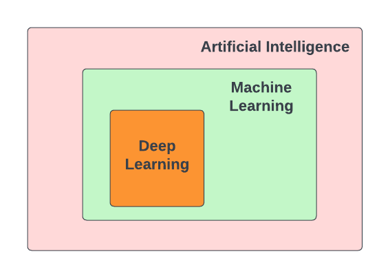
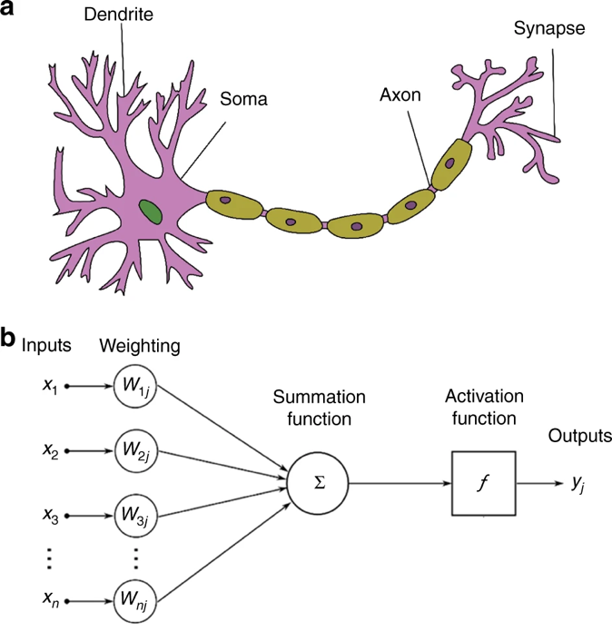
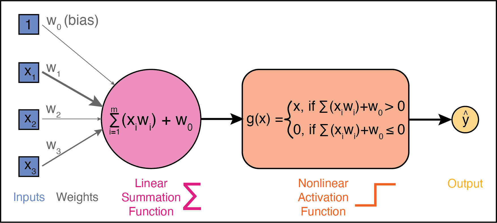
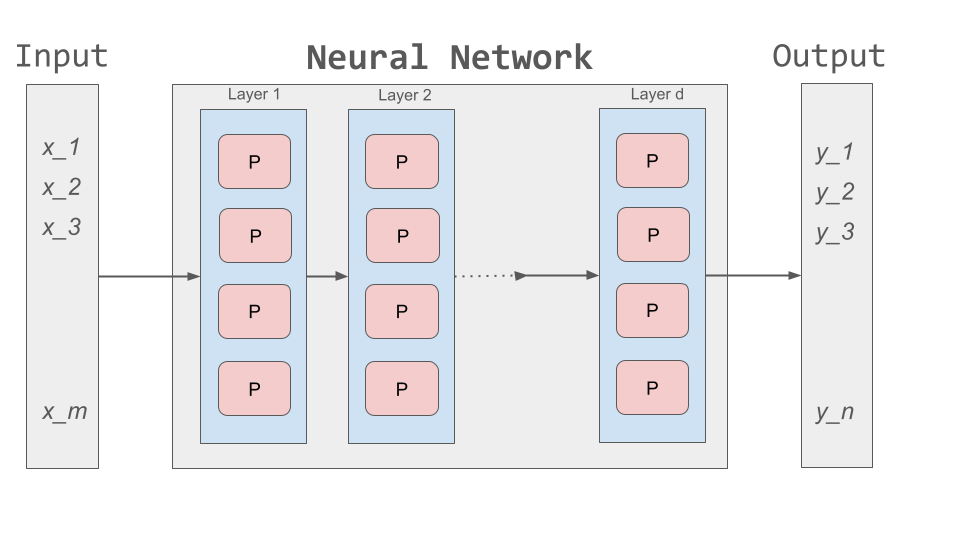
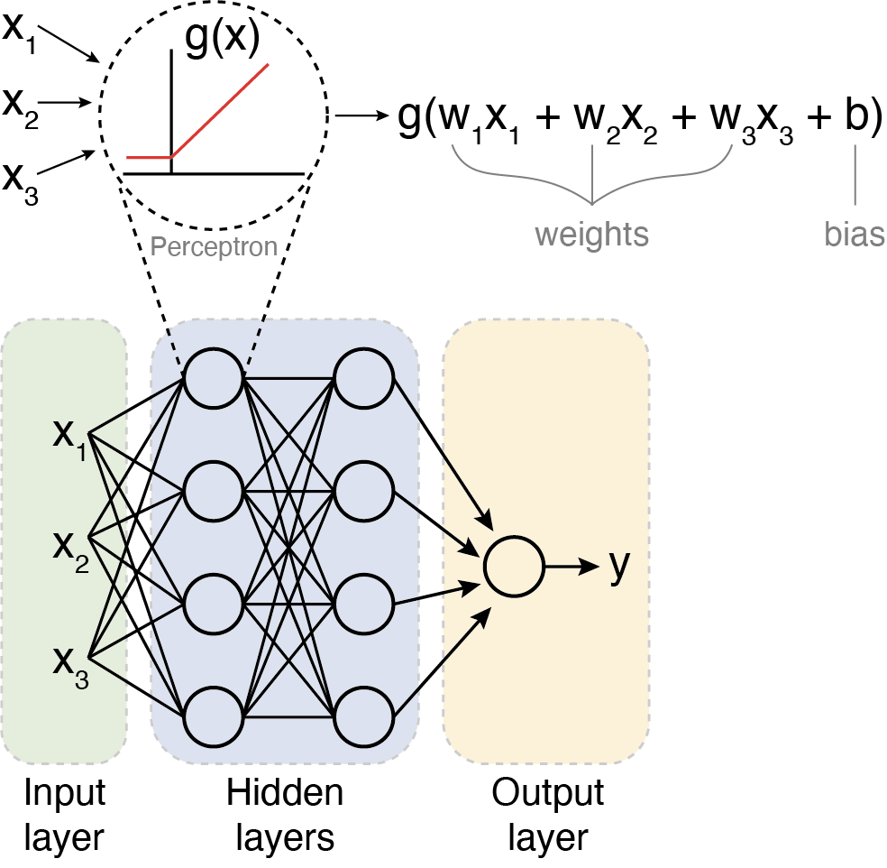
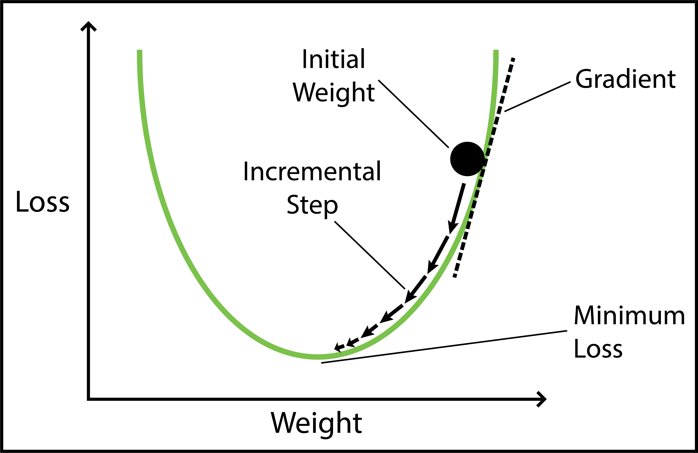
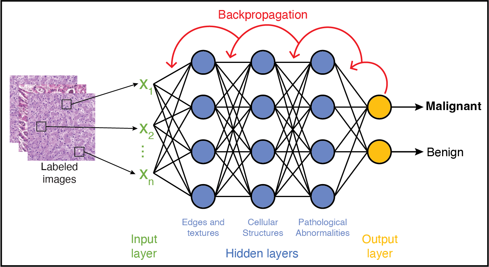
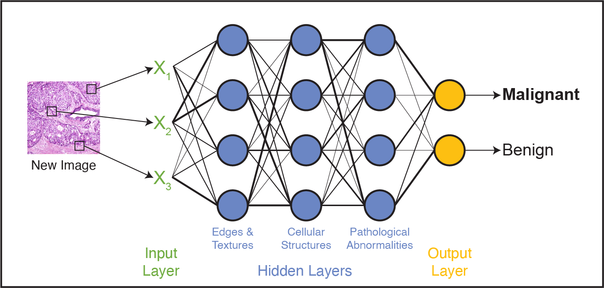
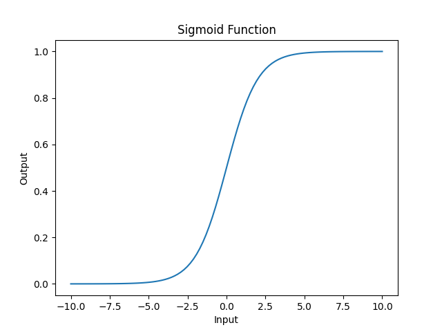
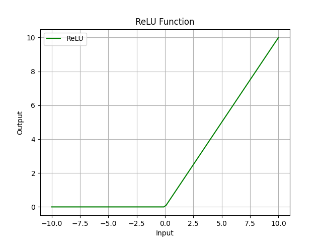

Introduction to Deep Learning
=============

Deep learning has revolutionarized the way computers learn and process information. 
It has become one of the most powerful tools for complex data analysis and automated decision-making.
As a subfield of **artificial intelligence (AI)** and **machine learning (ML)**, deep learning uses **artificial neural networks (ANNs)** to extract patterns and insights from large amounts of data automatically and autonomously. 

Artificial neural networks (ANNs) have been around for several decades, but recent advances in ANN architecture and training methods have driven a surge in their popularity and applications. 
This progress is fueled by:

* **Computing Power**: The accessibility of GPUs and TPUs (Tensor Processing Units) has accelerated the training process, enabling efficient processing of high-dimensional data as well as the development of models with millions (or billions) of parameters.
* **Development of DL Frameworks**: Tools like `TensorFlow <https://www.tensorflow.org/>`_ and `PyTorch <https://pytorch.org/>`_ have made it easier to build and train neural networks and are optimized for GPU and TPU performance.
* **Big Data**: Expanding datasets, such as the `Protein Data Bank (PDB) <https://www.wwpdb.org/>`_ (containing >200,000 protein structures), have enabled the training of larger and more complex models, such as AlphaFold2 [1]_, which won the 2024 Nobel Prize in Chemistry.

Originally proposed in 1943 to help researchers understand brain function [2]_, ANNs now serve as powerful tools for learning from data and solving complex problems.

**Deep Learning in Life Sciences**

Deep learning is driving breakthroughs in life sciences research, including:

    1. `Predicting the 3D structure of proteins from their amino acid sequences <https://doi.org/10.1038/s41586-021-03819-2>`_
    2. `Predicting the intestinal absorption of chemical compounds on the basis of peptide sequence <https://doi.org/10.1186/1471-2105-8-245>`_
    3. `Automated species recognition from image, video, and sound data <https://doi.org/10.1111/2041-210X.13075>`_ 
    4. `Translating the raw signal of long-read Oxford Nanopore sequencers into nucleotide calls <https://doi.org/10.1186/s13059-019-1727-y>`_ 
    5. `Estimating population genetic variables such as mutation rates, population sizes, and recombination rates <https://doi.org/10.1093/molbev/msy224>`_
    6.  `Predicting sample origins based on genetic variation <https://doi.org/10.7554/eLife.54507>`_

The range of deep learning applications is extensive, making it an exciting field for researchers to explore. 
To understand its potential, let's first explore the foundation of deep learning: Artifical Neural Networks.

=============
Understanding Neural Networks
=============
Artifical Neural Networks, or just *neural networks* for short, are the backbone of deep learning.
They consist of artificial neurons called **perceptrons**, which process infomation in a way inspired by biological neurons in the human brain.

In biological neurons, the dendrite receives electrical signals from other neurons and only fires an output signal when the total input signals exceed a certain threshold.
Similarly, perceptrons take in multiple inputs, apply weights to them to signal their importance, and produce a single output that represents the total strength of the input signals. 

    Biological neuron (a) vs. artificial neuron (b). Source: Zhang et al. 2019 [3]_

Perceptrons: The Building Blocks of Neural Networks
--------------------------------------------------

**1. Inputs and Weights**

A perceptron has multiple inputs, which we'll call :math:`x_1`, :math:`x_2`, and :math:`x_3`.
Each input has an associated **weight**, denoted as :math:`w_1`, :math:`w_2`, and :math:`w_3`.
These weights determine how important each input is to the percepton's decision.
During *training*, these weights are adjusted to improve accuracy; during *testing*, they remain fixed.

**2. Linear Summation Function**

Each input is multiplied by its corresponding weight, and then all of the weighted inputs are summed together via a **linear summation function**: 

    .. math:: Sum = (w_1x_1) + (w_2x_2) + (w_3x_3) + w_0
A **bias** term, :math:`w_0`, is also added to the linear combination.
The bias is like the intercept in a linear equation–it allows the perceptron to make predictions even when all inputs are zero.
Together, the weights and bias (:math:`w_0, w_1, w_2,...`) are called the **parameters** of the perceptron.

**3. Nonlinear Activation function**

The weighted sum (including the bias) is then passed through a **nonlinear activation function** to produce the perceptron's output.
One common activation function is the **ReLU (Rectified Linear Unit)** function, which is defined as:
  .. math:: ReLu(x) = max(0, x)
  * If the sum is positive, we keep it as is. 
  * If the sum is negative (or zero), we set it to 0. 
  * As a result, the output has a range of 0 to infinity.
Activation functions introduce **non-linearity**, allowing neural networks to learn complex patterns in data.

The basic architecture of a perceptron is depicted below:

From Perceptrons to Neural Networks
-----------------------------------
A neural network is made up of *layers of perceptrons*, where each perceptron applies a mathematical function to its inputs and passes the result to the next layer.
These layers include:

1. **Input layer**: The first layer of the neural network, which receives raw data (e.g., an image or DNA sequence).
2. **Hidden layers**: Layers between the input and output layers, which learn complex features from the input data.
3. **Output layer**: The final layer of the neural network, which produces the final output (e.g., classification of a tumor as malignant or benign).

The basic architecture of a neural network is depicted below:

Each perceptron in a layer is connected to perceptrons in the next layer, and these *connections have weights*, which determine the influence of each input.
During training, these weights are adjusted to improve accuracy. 

**Putting it all together**
-----------------------------------
To summarize, the perceptron takes in multiple inputs (as many as you want) and assigns weights to them. 
It calculates a weighted sum of the inputs, adds a bias term, and then passes the result through an activation function to produce an output.
When multiple perceptrons are connected, they form a neural network that can learn complex decision boundaries.

    Multilayer perceptron. Adapted from: Beardall et al. 2022 [4]_

=============
Training and Inference
=============

Deep learning involves two main phases: **training** and **inference**.
Broadly speaking, *training* involves multiple iterations of feeding data into a neural network and adjusting its parameters to minimize prediction errors.
This process requires large amounts of data and computational resources to fine-tune the model for accuracy. 
Once trained, the model enters the *inference* phase, where it applies its learned knowledge to new, unseen data to make predictions. 

Let's dive deeper into the training and inference phases of deep learning.

Training
--------------

How do we choose values for the parameters (i.e., the :math:`w_0, w_1, ..., w_n` in each perceptron) to make a neural network accurately predict an outcome?

 1. **Start with random weights**: At first, the model's predictions are guesses and likely to be inaccurate.
 2. **Compare predictions to true labels**: Since the training data is labeled, we can compare the model's predictions to the actual labels (by calculating the error).
 3. **Adjust weights using gradient descent**: The model iteratively updates its parameters to minimize the error, improving its predictions over time. 

**Gradient Descent: A Brief Refresher**

Imagine you are hiking down a mountain in thick fog. Your goal is to reach the bottom of the valley as quickly as possible.
But because of the fog, you can only see a few feet in front of you.
So, you take small steps downhill, always moving in the steepest direction based on what's directly in front of you.
This is pretty much how **gradient descent** works in machine learning. Let's quickly break it down using this image as a guide:

1. *Loss (y-axis) = The height of the mountain*: The higher you are, the worse your model is performing.
2. *Weight (x-axis) = Your position on the mountain*: Different positions on the mountain correspond to different weight values. The goal of training is to find the weight that gives the **Minimum Loss**. 
3. *Initial Weight = Your starting position on the mountain*: This is where you start hiking from (a random weight value). At this point, your model isn't very good (it has high loss).
4. *Gradient = The slope of the mountain at your current position*:

    * If the slope is steep, you take bigger steps (faster learning). If the slope is gentle, you take smaller steps (slower learning) to avoid overshooting the minimum.
    * If the slope is negative, you move right (increase weight). If the slope is positive, move left (decrease weight). 
5. *Minimum Loss = The bottom of the valley*: This is the point where we have reached the optimal weight value. Our model is now performing the best it can.

Gradient descent helps adjust weights, but in multi-layer networks, we need a way to distribute these adjustments across all layers. 
This process is called **backpropagation**, and it allows error signals to flow backward through the network, updating weights efficiently. 

Now that we have a basic understanding of how neural networks adjust their weights, let's look at a real-world example: training a neural network to classify histology images as malignant or benign.

**Training Example: Classifying Malignant vs Benign Cells**

Imagine you are training a neural network to classify microscopy images of cells as either malignant or benign.

 * The first layer of the network detects basic features in the image like edges and textures.
 * The next layer identifies more complex features, like organelles or cell arrangements.
 * Deeper layers might recognize abnormalities and pathological patterns, like irregular nuclei. 

The network processes each training image through all layers and produces a final prediction–*malignant* or *benign*.
If it's wrong, an error signal is sent backward (**backpropagation**), and the weights are adjusted accordingly using gradient descent.
This process continues until the model has the optimal weights and gets the correct answer practically every time. 

Once training is complete, the model no longer updates its weights–it is ready to apply what it has learned to new, unseen data.
This is where *inference* comes in. 

Inference
--------------

Inference refers to the process of making predictions, decisions, or drawing conclusions based on a trained model and input data.
During inference, new input data (e.g., a new, unlabeled microscopy image) is fed into the trained network.
The data passes through the network layers, applying the learned weights and biases to produce a predicted output.
In our example, the neural network would classify the new image as either *malignant* or *benign* based on the patterns learned during training.

Now that we understand the general concepts of *training* and *inference*, let's take a closer look under the hood–how could we implement the basic building blocks of a neural network ourselves?

=============
Building a Neural Network by Hand
=============

What would it take to build a neural network from basic libraries like ``numpy``? We won't implement a complete solution, but let's take a look at some of the basic building blocks that we would need.

Implementing a Perceptron and Layer
--------------

To implement a neural network, at minimum we would need functions to:

 1. Create individual perceptrons of a specific size (i.e., *dimension*) and initialize and maintain that number of weights equal as well as a bias term.
 2. Create layers in our network comprised of a certain number of perceptrons as well as the non-linear activation function to use. 
 3. Compute the output of a layer for some input of the appropriate shape. 

We could implement a perceptron using a numpy array to hold the weights and bias:

.. code-block:: python3

    def create_perceptron(dim):
        """
        Create a perceptron of dimension `dim` and initialize it with random weights.
        """
        # we use dim+1 because we want to have a bias term and `dim` weights
        return np.random.random(dim+1)

Click below to see a detailed code explanation

.. toggle:: Click to show

    This code defines a function called ``create_perceptron`` that:

    1. Takes one parameter `dim` which represents the dimension (number of input features) for the perceptron.
    2. Creates a perceptron by generating random weights using NumPy's ``random.random()`` function.
    3. Returns `dim+1` weights because:
   
       - `dim` weights are used for the actual input features
       - The extra `+1` creates one additional weight that serves as the bias term. 
    For example, if you call ``create_perceptron(3)``, it will return an array of 4 random numbers between 0 and 1 – three weights for the inputs and one bias term. 

We could then implement a layer as a certain number of perceptrons with an activation function:

.. code-block:: python3

    def create_layer(num_perceptrons, dim, activation_function):
        """
        Create a layer of `num_perceptrons` perceptrons, each of dimension `dim` with activation function `activation_function`. 
        Initialize the weights of all perceptrons to a random float between 0 and 1.
        """
        # represent the layer as a list of dictionaries of perceptrons
        layer = []
        for i in range(num_perceptrons):
            layer.append({"weights": create_perceptron(dim), "activation_function": activation_function})
        return layer

.. toggle:: Click to show

    The ``create_layer`` function builds a layer of multiple perceptrons. It:

    1. Takes three parameters:
   
      - ``num_perceptrons``: How many perceptrons to create in this layer
      - ``dim``: The dimension (number of inputs) for each perceptron
      - ``activation_function``: The activation function to use for each perceptron

    2. Creates an empty list called `layer` that will store all the perceptrons.
    3. Uses a for loop to create ``num_perceptrons`` perceptrons, where each perceptron is represented as a dictionary containing:
      - ``weights``: The perceptron's weights created using the ``create_perceptron(dim)`` function we saw earlier. 
      - ``activation_function``: The activation function to use for this perceptron.

    This code effectively creates a complete neural network layer where each perceptron has its own weights and shares the same activation function. 

We need a way to compute the output of a layer from an input.
To do that though, we first need to say a little more about activation functions.
Let's look at a few common ones in a little more detail.

The `sigmoid` Activation Function
--------------

Mathematically, the `sigmoid` function is defined as:

.. math::
    f(x) = \frac{1}{1 + e^{-x}}

Let's try to write this as a helper function using Python. 
The code is pretty simple: you just import numpy and implement the above formula:

.. code-block:: python3

    import numpy as np

    def sigmoid(x):
        return 1.0 / (1 + np.exp(-x))

Next, let's try to plot the sigmoid function:

.. code-block:: python3

    # Import matplotlib, numpy and math
    import matplotlib.pyplot as plt
    import numpy as np
    import math

    x = np.linspace(-10, 10, 100)

    plt.plot(x, sigmoid(x))
    plt.xlabel("Input")
    plt.ylabel("Output")
    plt.title("Sigmoid Function")

    plt.show()

**Thought Challenge:**
 1. What do you think the line ``x = np.linespace(-10, 10, 100)`` does? (Hint: try adjusting these numbers and see what happens)
 2. Take a look at the output of the plot. What do you notice? What types of questions might this activation function be useful for?

The `tanh` Activation Function
--------------   

Mathematically, the `tanh` function is defined as:

.. math::
    f(x) = \frac{e^x - e^{-x}}{e^x + e^{-x}}

**Code Challenge**: Try adding the `tanh` function to our `sigmoid` plot so that you can compare them side by side.

**Thought Challenge**: How does the `tanh` function differ from the `sigmoid` function? What are the implications of this difference?

Write down your answer first. Then click below to see our answer:

.. toggle:: Click to show the answer
    
    **Code Challenge Solution**:

    .. code-block:: python3

        import numpy as np
        import matplotlib.pyplot as plt
        import math

        def sigmoid(x):
            return 1.0 / (1 + np.exp(-x))

        def tanh(x):
            return (np.exp(x) - np.exp(-x)) / (np.exp(x) + np.exp(-x))

        x = np.linspace(-10, 10, 100)

        plt.plot(x, tanh(x), label='Tanh')
        plt.plot(x, sigmoid(x), label='Sigmoid')
        plt.xlabel("Input")
        plt.ylabel("Output")
        plt.title("Tanh vs Sigmoid Functions")
        plt.legend()

        plt.show()

    .. figure:: ./images/tanh-vs-sigmoid-solution.png
        :align: center
        :width: 500px

    **Thought Challenge Solution**:
    
        - How does the `tanh` function differ from the `sigmoid` function?

         1. **Output Range**:
   
             * `Tanh`: Outputs between -1 and 1, meaning it's **zero-centered** (helpful for balancing activations)
             * `Sigmoid`: Outputs between 0 and 1 (always positive). 
         2. **Steepness**: 

             * `Tanh`: Steeper, with a steeper slope around 0, meaning it has stronger gradients and allows faster learning in that range.
             * `Sigmoid`: Less steep, meaning it has weaker gradients and slower learning.
         3. **Vanishing Gradient Issue**: 

             * Both functions flatten out at extreme values, meaning their gradients become very small. 
             * This can slow down learning in deep networks. 
        - What are the implications of this difference?

             * `Tanh` is often preferred for hidden layers because it helps keep activation functions centered around zero, making learning more efficient.
             * `Sigmoid` is still useful for binary classification (output layer) because its output represents probabilities (values between 0 and 1). 

The `ReLU` (Rectified Linear Unit) Activation Function
--------------

The `ReLU` function is the most popular activation function in deep learning.
It is used in almost all Convolutional Neural Networks (CNNs), which we will talk about later in the course.

Mathematically, the `ReLU` function is defined as:

.. math::
    f(x) = max(0, x)

This means that our range of output is from 0 to infinity:
`ReLU` returns the input value if it's positive, and 0 if it's negative or zero. 

**Thought Challenge:**
 1. Can you think of any advantages to using the `ReLU` function over the `sigmoid` or `tanh` functions?

.. toggle:: Click to show the answer

    **Answer**: 
        Unlike the `sigmoid` and `tanh` functions, the `ReLU` function does not flatten out in the positive region.
        This means that the `ReLU` function does not suffer from the vanishing gradient problem, which can make it easier to train deep neural networks.
        `ReLU` is also computationally efficient and straightforward to implement, involving only a simple thresholding operation where negative values and zero are set to zero.

    .. figure:: ./images/sigmoid-tanh-relu.png
        :align: center
        :width: 500px

Creating Layers and Computing the Output of Layers
--------------

Now that we understand how activation functions work, let's build on our previous functions to *compute the output of a layer* when given an input. 

**Step 1: Creating a Layer**

We have already defined a ``create_layer`` function that constructs a layer of perceptrons, each with:

  * A set of randomly initialized weights (including a bias term)
  * A chosen activation function 

For example, we can create a layer with **5 perceptrons**, each expecting **3 input features**, using the ``sigmoid`` activation function:

.. code-block:: python3

    l1 = create_layer(5, 3, sigmoid)

**Step 2: Computing the Output of a Layer**

Given an input, our goal is to compute the output of each perceptron in the layer. This involves:

  1. Computing the **weighted sum** of the inputs.
  2. Adding the **bias** term. 
  3. Passing the result through the perceptron's **activation function**. 

Here's an example function that performs this computation:

.. code-block:: python3

    def compute_output_for_layer(X, layer):
        """
        Compute the output of a layer for an input X.

        Parameters:
       - X: numpy array of shape (d,), where d is the input dimension
       - layer: list of perceptrons (each represented as a dictionary with 'weights' and 'activation_function')
    
        Returns:
       - A numpy array containing the output of each perceptron in the layer.
       """
   
        result = []

        # for each perceptron in the layer
        for p in layer:
            # Compute the weighted sum (dot product) of inputs and weights and add the bias term
            weighted_sum = np.dot(X, p['weights'][1:]) + p['weights'][0]  

            # Apply the activation function
            output = p['activation_function'](weighted_sum)

            # Store the output
            result.append(output)

        return np.array(result)

We can now create an input and compute the output of our layer:

.. code-block:: python3

    >>> X = [0.8, -2.3, 2.15]
    >>> o1 = compute_output_for_layer(X, l1)
    >>> print("Output of Layer 1:", o1)

**Step 3: Computing Output for Multiple Layers**

Now, let's see what happens when we stack layers. 
First, we compute the output of the first layer. 
Then, we pass this output as the input to the next layer. 

Example:

.. code-block:: python3

    # Create a second layer with 2 perceptrons, each expecting 5 inputs (from Layer 1)
    >>> l2 = create_layer(2, 5, sigmoid)

    # Compute output of the second layer
    >>> o2 = compute_output_for_layer(o1, l2)
    >>> print("Output of Layer 2:", o2)

**Key Concept: Fully Connected Layers**

 - The second layer must have an *input dimension* matching the *output dimension* of the previous layer.
 - If Layer 1 has *5 perceptrons*, Layer 2's perceptrons must each take *5 inputs*. 
 - This ensures that every perceptron receives input from every perceptron in the previous layer, making it a **fully connected** layer.

By repeating this process, we can create networks of any depth. 
However, so far, we've only computed outputs. 
To train a neural network, we need a way to *adjust weights* based on taining data. 
This process, called **backpropagation**, is where frameworks like TensorFlow simplify things for us. 

**Reference List**
 * The material in this module is based on `COE 379L: Software Design for Responsible Intelligent Systems <https://coe-379l-sp24.readthedocs.io/en/latest/unit03/neural_networks.html>`_
.. [1] Jumper, J., Evans, R., Pritzel, A. et al. Highly accurate protein structure prediction with AlphaFold. Nature 596, 583–589 (2021). https://doi.org/10.1038/s41586-021-03819-2
.. [2] McCulloch, W.S., Pitts, W. A logical calculus of the ideas immanent in nervous activity. Bulletin of Mathematical Biophysics 5, 115–133 (1943). https://doi.org/10.1007/BF02478259
.. [3] Zhang, Q., Yu, H., Barbiero, M. et al. Artificial neural networks enabled by nanophotonics. Light Sci Appl 8, 42 (2019). https://doi.org/10.1038/s41377-019-0151-0
.. [4] Beardall, William A.V., Guy-Bart Stan, and Mary J. Dunlop. Deep Learning Concepts and Applications for Synthetic Biology. GEN Biotechnology 1, 360–71 (2022). https://doi.org/10.1089/genbio.2022.0017.
