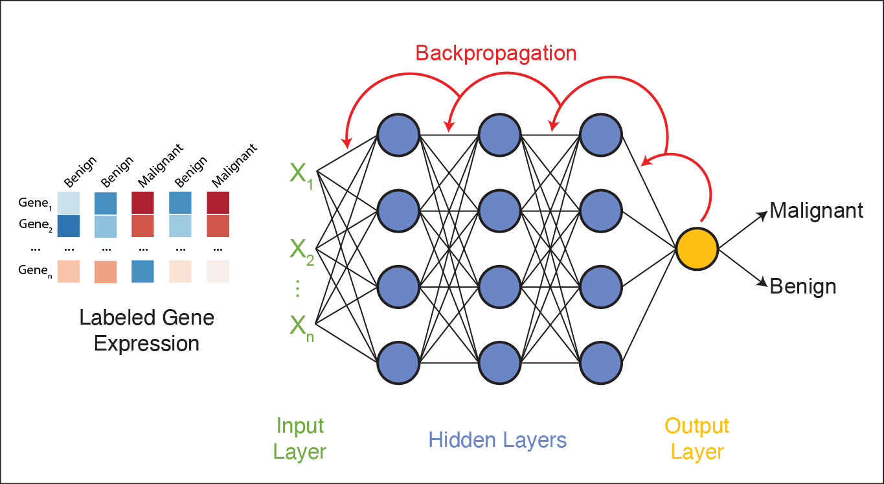

Intro to Deep Learning
=============

Deep learning has revolutionized the way computers learn and process information. 
It has become one of the most powerful tools for complex data analysis and automated decision-making.
As a subfield of **artificial intelligence (AI)** and **machine learning (ML)**, deep learning uses **artificial neural networks (ANNs)** to extract patterns and insights from large amounts of data autonomously. 

.. image:: ./images/AI-ML-DL.png
    :alt: AI-ML-DL Diagram
    :width: 500px
    :align: center

Artificial neural networks (ANNs) have been around for several decades, but recent advances in ANN architecture and training methods have driven a surge in their popularity and applications. 
This progress is fueled by:

* **Computing Power**: The accessibility of GPUs and TPUs (Tensor Processing Units) has accelerated the training process, enabling efficient processing of high-dimensional data as well as the development of models with millions (or billions) of parameters.
* **Development of DL Frameworks**: Tools like `TensorFlow <https://www.tensorflow.org/>`_ and `PyTorch <https://pytorch.org/>`_ have made it easier to build and train neural networks and are optimized for GPU and TPU performance.
* **Big Data**: Expanding datasets, such as the `Protein Data Bank (PDB) <https://www.wwpdb.org/>`_ (containing >200,000 protein structures), have enabled the training of larger and more complex models, such as AlphaFold2 [1]_, whose creators were awarded the 2024 Nobel Prize in Chemistry.

Originally proposed in 1943 to help researchers understand brain function [2]_, ANNs now serve as powerful tools for learning from data and solving complex problems.

**Deep Learning in Life Sciences**

Deep learning is driving breakthroughs in life sciences research, including:

    1. `Predicting the 3D structure of proteins from their amino acid sequences <https://doi.org/10.1038/s41586-021-03819-2>`_
    2. `Predicting the intestinal absorption of chemical compounds on the basis of peptide sequence <https://doi.org/10.1186/1471-2105-8-245>`_
    3. `Automated species recognition from image, video, and sound data <https://doi.org/10.1111/2041-210X.13075>`_ 
    4. `Translating the raw signal of long-read Oxford Nanopore sequencers into nucleotide calls <https://doi.org/10.1186/s13059-019-1727-y>`_ 
    5. `Estimating population genetic variables such as mutation rates, population sizes, and recombination rates <https://doi.org/10.1093/molbev/msy224>`_
    6.  `Predicting sample origins based on genetic variation <https://doi.org/10.7554/eLife.54507>`_

The range of deep learning applications is extensive, making it an exciting field for researchers to explore. 
To understand its potential, let's first explore the foundation of deep learning: Artificial Neural Networks.

=============
Understanding Neural Networks
=============
Artificial Neural Networks, or just *neural networks* for short, are the backbone of deep learning.
They consist of artificial neurons called **perceptrons**, which process information in a way inspired by biological neurons in the human brain.

In biological neurons, the dendrite receives electrical signals from other neurons and only fires an output signal when the total input signals exceed a certain threshold.
Similarly, perceptrons take in multiple inputs, apply weights to them to signal their importance, and produce a single output that represents the total strength of the input signals. 

.. figure:: ./images/Bio-Basis-of-ANNs.png
    :alt: Biological basis of Artifical Neural Networks
    :width: 500px
    :align: center

    Biological neuron (a) vs. artificial neuron (b). Source: Zhang et al. 2019 [3]_

Perceptrons: The Building Blocks of Neural Networks
--------------------------------------------------

**1. Inputs and Weights**

A perceptron has multiple inputs, which we'll call :math:`x_1`, :math:`x_2`, and :math:`x_3`.
Each input has an associated **weight**, denoted as :math:`w_1`, :math:`w_2`, and :math:`w_3`.
These weights determine how important each input is to the perceptron's decision.
During *training*, these weights are adjusted to improve accuracy; during *testing*, they remain fixed.

**2. Linear Summation Function**

Each input is multiplied by its corresponding weight, and then all of the weighted inputs are summed together via a **linear summation function**: 

    .. math:: Sum = (w_1x_1) + (w_2x_2) + (w_3x_3) + w_0
A **bias** term, :math:`w_0`, is also added to the linear combination.
The bias is like the intercept in a linear equation–it allows the perceptron to make predictions even when all inputs are zero.
Together, the weights and bias (:math:`w_0, w_1, w_2,...`) are called the **parameters** of the perceptron.

**3. Nonlinear Activation function**

The weighted sum (including the bias) is then passed through a **nonlinear activation function** to produce the perceptron's output.
One common activation function is the **ReLU (Rectified Linear Unit)** function, which is defined as:
  .. math:: ReLu(x) = max(0, x)
  * If the sum is positive, we keep it as is. 
  * If the sum is negative (or zero), we set it to 0. 
  * As a result, the output has a range of 0 to infinity.
Activation functions introduce **non-linearity**, allowing neural networks to learn complex patterns in data.

The basic architecture of a perceptron is depicted below:

.. figure:: ./images/perceptron_diagram.png
    :alt: How a perceptron works
    :width: 700px
    :align: center

From Perceptrons to Neural Networks
-----------------------------------
A neural network is made up of *layers of perceptrons*, where each perceptron applies a mathematical function to its inputs and passes the result to the next layer.
These layers include:

1. **Input layer**: The first layer of the neural network, which receives raw data (e.g., an image or DNA sequence).
2. **Hidden layers**: Layers between the input and output layers, which learn complex features from the input data.
3. **Output layer**: The final layer of the neural network, which produces the final output (e.g., classification of a tumor as malignant or benign).

The basic architecture of a neural network is depicted below:

.. figure:: ./images/ann-arch-overview.png
    :alt: Basic Idea of ANN Architecture
    :width: 600px
    :align: center

Each perceptron in a layer is connected to perceptrons in the next layer, and these *connections have weights*, which determine the influence of each input.
During training, these weights are adjusted to improve accuracy. 

**Putting it all together**
-----------------------------------
To summarize, the perceptron takes in multiple inputs (as many as you want) and assigns weights to them. 
It calculates a weighted sum of the inputs, adds a bias term, and then passes the result through an activation function to produce an output.
When multiple perceptrons are connected, they form a neural network that can learn complex decision boundaries.

.. figure:: ./images/MLP-diagram.png
    :alt: Multilayer Perceptron Diagram
    :width: 600px
    :align: center

    Multilayer perceptron. Adapted from: Beardall et al. 2022 [4]_

=============
Training and Inference
=============

Deep learning involves two main phases: **training** and **inference**.
Broadly speaking, *training* involves multiple iterations of feeding data into a neural network and adjusting its parameters to minimize prediction errors.
This process requires large amounts of data and computational resources to fine-tune the model for accuracy. 
Once trained, the model enters the *inference* phase, where it applies its learned knowledge to new, unseen data to make predictions. 

Let's dive deeper into the training and inference phases of deep learning.

Training
--------------

How do we choose values for the parameters (i.e., the :math:`w_0, w_1, ..., w_n` in each perceptron) to make a neural network accurately predict an outcome?

 1. **Start with random weights**: At first, the model's predictions are guesses and likely to be inaccurate.
 2. **Compare predictions to true labels**: Since the training data is labeled, we can compare the model's predictions to the actual labels (by calculating the error).
 3. **Adjust weights using gradient descent**: The model iteratively updates its parameters to minimize the error, improving its predictions over time. 

**Gradient Descent: A Brief Refresher**

Imagine you are hiking down a mountain in thick fog. Your goal is to reach the bottom of the valley as quickly as possible.
But because of the fog, you can only see a few feet in front of you.
So, you take small steps downhill, always moving in the steepest direction based on what's directly in front of you.
This is pretty much how **gradient descent** works in machine learning. Let's quickly break it down using this image as a guide:

.. figure:: ./images/gradient-descent.png
    :alt: Gradient Descent concept
    :width: 400px
    :align: center  

1. *Loss (y-axis) = The height of the mountain*: The higher you are, the worse your model is performing.
2. *Weight (x-axis) = Your position on the mountain*: Different positions on the mountain correspond to different weight values. The goal of training is to find the weight that gives the **Minimum Loss**. 
3. *Initial Weight = Your starting position on the mountain*: This is where you start hiking from (a random weight value). At this point, your model isn't very good (it has high loss).
4. *Gradient = The slope of the mountain at your current position*:

    * If the slope is steep, you take bigger steps (faster learning). If the slope is gentle, you take smaller steps (slower learning) to avoid overshooting the minimum.
    * If the slope is negative, you move right (increase weight). If the slope is positive, move left (decrease weight). 
5. *Minimum Loss = The bottom of the valley*: This is the point where we have reached the optimal weight value. Our model is now performing the best it can.

Gradient descent helps adjust weights, but in multi-layer networks, we need a way to distribute these adjustments across all layers. 
This process is called **backpropagation**, and it allows error signals to flow backward through the network, updating weights efficiently. 

Now that we have a basic understanding of how neural networks adjust their weights, let's look at a real-world example: training a neural network to classify gene expression profiles as malignant or benign.

**Training Example: Classifying Malignant vs Benign Tumors from Gene Expression**

Imagine you are training a neural network to classify tumors as either malignant or benign based on its gene expression profile. 

 * Each tumor sample is represented as a long vector of gene expression values–one value per gene.
 * Each input perceptron receives the expression level of a single gene. So, if your dataset includes 20,000 genes, the input layer will contain 20,000 perceptrons. Each one processes the expression level of a single gene. 
 * Hidden layers learn to detect complex, nonlinear patterns by combining gene-level signals into higher-level features.
 * The final layer produces a prediction: *malignant* or *benign*

The network processes each gene expression profile through all layers and generates a prediction.
If it gets the prediction wrong, an error signal is sent backward (**backpropagation**), and the weights are adjusted accordingly using gradient descent.
This process continues across many training samples until the model learns a set of weights that minimizes prediction error.

Once training is complete, the model no longer updates its weights–it is ready to apply what it has learned to new, unseen data.
This is where *inference* comes in. 

Inference
--------------

Inference is the process of using a trained neural network to make predictions on new, unseen data. 
During inference, the model does not update its weights — it simply applies the learned weights to the new data to generate a prediction.

In our example, each new tumor sample is represented as a vector of gene expression values.
This vector is fed into the trained network, which processes it through all layers using the learned weights and biases. 

The network then produces a predicted classification: whether the gene expression profile indicates a *malignant* or *benign* tumor. 

.. figure:: ./images/inference-cancer-classifier-gene-expr.png
    :alt: A neural network in the inference stage
    :width: 700px
    :align: center 

This is the stage where the neural network becomes practically useful: once trained, it can analyze and interpret new biological data to support tasks like diagnosis, prognosis, or treatment decision-making.

Now that we understand the general concepts of *training* and *inference*, let's take a closer look at how we could implement the basic building blocks of a neural network ourselves!

=============
Building a Neural Network by Hand
=============

What would it take to build a neural network from basic libraries like ``numpy``? We won't implement a complete solution, but let's take a look at some of the basic building blocks that we would need.

Implementing a Perceptron and Layer
--------------

To implement a neural network, at minimum we would need functions to:

 1. Create individual perceptrons of a specific size (i.e., *dimension*) and initialize a number of weights equal to the input dimension, along with a bias term.
 2. Create layers in our network comprised of a certain number of perceptrons as well as the non-linear activation function to use. 
 3. Compute the output of a layer for some input of the appropriate shape. 

We could implement a perceptron using a numpy array to hold the weights and bias:

.. code-block:: python3

    def create_perceptron(dim):
        """
        Create a perceptron of dimension `dim` and initialize it with random weights.
        """
        # we use dim+1 because we want to have a bias term and `dim` weights
        return np.random.random(dim+1)

Click below to see a detailed code explanation

.. toggle:: Click to show

    This code defines a function called ``create_perceptron`` that:

    1. Takes one parameter `dim` which represents the dimension (number of input features) for the perceptron.
    2. Creates a perceptron by generating random weights using NumPy's ``random.random()`` function.
    3. Returns `dim+1` weights because:
   
       - `dim` weights are used for the actual input features
       - The extra `+1` creates one additional weight that serves as the bias term. 
    For example, if you call ``create_perceptron(3)``, it will return an array of 4 random numbers between 0 and 1 – three weights for the inputs and one bias term. 

We could then implement a layer as a certain number of perceptrons with an activation function:

.. code-block:: python3

    def create_layer(num_perceptrons, dim, activation_function):
        """
        Create a layer of `num_perceptrons` perceptrons, each of dimension `dim` with activation function `activation_function`. 
        Initialize the weights of all perceptrons to a random float between 0 and 1.
        """
        # represent the layer as a list of perceptrons, where each perceptron is a dictionary
        layer = []
        for i in range(num_perceptrons):
            layer.append({"weights": create_perceptron(dim), "activation_function": activation_function})
        return layer

.. toggle:: Click to show

    The ``create_layer`` function builds a layer of multiple perceptrons. It:

    1. Takes three parameters:
   
      - ``num_perceptrons``: How many perceptrons to create in this layer
      - ``dim``: The dimension (number of inputs) for each perceptron
      - ``activation_function``: The activation function to use for each perceptron

    2. Creates an empty list called `layer` that will store all the perceptrons.
    3. Uses a for loop to create ``num_perceptrons`` perceptrons, where each perceptron is represented as a dictionary containing:
      - ``weights``: The perceptron's weights created using the ``create_perceptron(dim)`` function we saw earlier. 
      - ``activation_function``: The activation function to use for this perceptron.

    This code effectively creates a complete neural network layer where each perceptron has its own weights and shares the same activation function. 

We need a way to compute the output of a layer from an input.
To do that though, we first need to say a little more about activation functions.
Let's look at a few common ones in a little more detail.

The `sigmoid` Activation Function
--------------

Mathematically, the `sigmoid` function is defined as:

.. math::
    f(x) = \frac{1}{1 + e^{-x}}

Let's try to write this as a helper function using Python. 
The code is pretty simple: you just import numpy and implement the above formula:

.. code-block:: python3

    import numpy as np

    def sigmoid(x):
        return 1.0 / (1 + np.exp(-x))

Next, let's try to plot the sigmoid function:

.. code-block:: python3

    # Import matplotlib, numpy and math
    import matplotlib.pyplot as plt
    import numpy as np
    import math

    x = np.linspace(-10, 10, 100)

    plt.plot(x, sigmoid(x))
    plt.xlabel("Input")
    plt.ylabel("Output")
    plt.title("Sigmoid Function")

    plt.show()

**Thought Challenge:**
 **Q1:** What do you think the line ``x = np.linspace(-10, 10, 100)`` does? (Hint: try adjusting these numbers and see what happens)

 **Q2:** Take a look at the output of the plot. What do you notice? What types of questions might this activation function be useful for?

.. figure:: ./images/Sigmoid-Function.png
    :align: center
    :width: 500px

.. toggle:: Click to show the answer

    **Answer**:

    **Q1:** The ``x = np.linspace(-10, 10, 100)`` line creates an array of 100 evenly spaced numbers between -10 and 10. These values are used as the input range for plotting the activation function.
    
    **Q2:** The output values always fall between 0 and 1. As ``x`` becomes very negative, the output approaches 0, and as ``x`` becomes very positive, the output approaches 1. Around ``x = 0``, the function is at its steepest–this is where the function is most sensitive to changes in ``x``. These properties make the sigmoid function useful for binary classification problems, where we want to model probabilities between 0 and 1.

The `softmax` Activation Function
--------------

The `softmax` function is often used in the output layer of neural networks for **multi-class classification** tasks.
It converts raw output scores (called *logits*) into probabilities that sum to 1.

Mathematically, for an input vector :math:`z`, the `softmax` of element :math:`i` is defined as:

.. math:: \text{softmax}(z_i) = \frac{e^{z_i}}{\sum_{j} e^{z_j}}

Without getting into the weeds, the `softmax` function ensures that each output is between 0 and 1, and the sum of all outputs is exactly 1–just like a probability distribution.

Let's look at a Python implementation:

.. code-block:: python3

    def softmax(z):
        e_z = np.exp(z - np.max(z)) 
        return e_z / np.sum(e_z)

**Thought Challenge:** Try running ``softmax([2.0, 1.0, 0.1])``. What do you notice about the output? Why might `softmax` be better than using `sigmoid` when we have multiple classes?

.. toggle:: Click to show the answer

    **Answer**: 

    - ``softmax([2.0, 1.0, 0.1])`` returns ``[0.65900114, 0.24243297, 0.09856589]``. This means that the model is most confident in the first class, and least confident in the third class.
    - `softmax` is better than `sigmoid` for multi-class problems because it looks at all the output perceptrons together, rather than independently, and **forces the model to choose the most likely class**. 

    For example, imagine you are building a model to classify a cancer sample into one of three cancer types. You wouldn't want the model to say: "It's 90% likely to be a sarcoma, 70% likely to be a carcinoma, and 50% likely to be a lymphoma."
    That is confusing–and not very useful!

    Instead, with `softmax`, the model would say: "Given all the evidence, I'm 90% confident that this is a sarcoma, 5% that it's a carcinoma, and 5% that it's a lymphoma."

The `ReLU` (Rectified Linear Unit) Activation Function
--------------

The `ReLU` function is the most popular activation function in deep learning.
It is used in almost all Convolutional Neural Networks (CNNs), which we will talk about later in the course.

Mathematically, the `ReLU` function is defined as:

.. math::
    f(x) = max(0, x)

This means that our range of output is from 0 to infinity:
`ReLU` returns the input value if it's positive, and 0 if it's negative or zero. 

.. figure:: ./images/ReLU-function.png
    :align: center
    :width: 500px

**Thought Challenge:**
 1. Can you think of any advantages to using the `ReLU` function over the `sigmoid` function?

.. toggle:: Click to show the answer

    **Answer**: 
        Unlike the `sigmoid` function, the `ReLU` function does not flatten out in the positive region.
        This means that the `ReLU` function does not suffer from the vanishing gradient problem, which can make it easier to train deep neural networks.
        `ReLU` is also computationally efficient and straightforward to implement, involving only a simple thresholding operation where negative values and zero are set to zero.

    .. figure:: ./images/sigmoid-relu.png
        :align: center
        :width: 700px

Creating Layers and Computing the Output of Layers
--------------

Now that we understand how activation functions work, let's build on our previous functions to *compute the output of a layer* when given an input. 

**Step 1: Creating a Layer**

We have already defined a ``create_layer`` function that constructs a layer of perceptrons, each with:

  * A set of randomly initialized weights (including a bias term)
  * A chosen activation function 

For example, we can create a layer with **5 perceptrons**, each expecting **3 input features**, using the ``sigmoid`` activation function:

.. code-block:: python3

    l1 = create_layer(5, 3, sigmoid)

**Step 2: Computing the Output of a Layer**

Given an input, our goal is to compute the output of each perceptron in the layer. This involves:

  1. Computing the **weighted sum** of the inputs.
  2. Adding the **bias** term. 
  3. Passing the result through the perceptron's **activation function**. 

Here's an example function that performs this computation:

.. code-block:: python3

    def compute_output_for_layer(X, layer):
        """
        Compute the output of a layer for an input X.

        Parameters:
       - X: numpy array of shape (d,), where d is the input dimension
       - layer: list of perceptrons (each represented as a dictionary with 'weights' and 'activation_function')
    
        Returns:
       - A numpy array containing the output of each perceptron in the layer.
       """
   
        result = []

        # for each perceptron in the layer
        for p in layer:
            # Compute the weighted sum (dot product) of inputs and weights and add the bias term
            weighted_sum = np.dot(X, p['weights'][1:]) + p['weights'][0]  

            # Apply the activation function
            output = p['activation_function'](weighted_sum)

            # Store the output
            result.append(output)

        return np.array(result)

We can now create an input and compute the output of our layer:

.. code-block:: python3

    >>> X = [0.8, -2.3, 2.15]
    >>> o1 = compute_output_for_layer(X, l1)
    >>> print("Output of Layer 1:", o1)

**Step 3: Computing Output for Multiple Layers**

Now, let's see what happens when we stack layers. 
First, we compute the output of the first layer. 
Then, we pass this output as the input to the next layer. 

Example:

.. code-block:: python3

    # Create a second layer with 2 perceptrons, each expecting 5 inputs (from Layer 1)
    >>> l2 = create_layer(2, 5, sigmoid)

    # Compute output of the second layer
    >>> o2 = compute_output_for_layer(o1, l2)
    >>> print("Output of Layer 2:", o2)

**Key Concept: Fully Connected Layers**

 - The second layer must have an *input dimension* matching the *output dimension* of the previous layer.
 - If Layer 1 has *5 perceptrons*, Layer 2's perceptrons must each take *5 inputs*. 
 - This ensures that every perceptron receives input from every perceptron in the previous layer, making it a **fully connected** layer.

By repeating this process, we can create networks of any depth. 
However, so far, we've only computed outputs. 
To train a neural network, we need a way to *adjust weights* based on training data. 
This process, called **backpropagation**, is where frameworks like TensorFlow simplify things for us. 

=============
Introduction to TensorFlow
=============

**What is TensorFlow?**

.. image:: ./images/TensorFlow-Icon.png
    :width: 150px
    :align: right

`TensorFlow <https://www.tensorflow.org/>`_ is one of the most powerful open-source machine learning libraries available today. 
Developed by Google, TensorFlow offers a wide range of tools and resources to help you build, train, and deploy neural networks, making it accessible to both beginners and experts.

At its core, TensorFlow is a library for programming with linear algebra and statistics, using multi-dimensional arrays called *tensors* to represent data. 

**What is a Tensor?**

Everything in TensorFlow is built around tensors. 
To understand TensorFlow, we first need to understand what a tensor is.

A **tensor** is a multi-dimensional array, similar to NumPy arrays. Unlike traditional lists or NumPy arrays, however, *TensorFlow tensors are optimized for parallel computing* and can be processed across mutiple CPU/GPU/TPU cores simultaneously, significantly speeding up computations. 

.. list-table:: 

    * - **Tensor Type**
      - **Example**
      - **Shape**
    * - **Scalar (Rank-0)**
      - ``5``
      - ``()``
    * - **Vector (Rank-1)**
      - ``[1, 2, 3]``
      - ``(3,)``
    * - **Matrix (Rank-2)**
      - ``[[1, 2, 3], [4, 5, 6]]``
      - ``(2, 3)``

Neural networks use tensors to represent:

 * Input data (e.g., images, text, audio, etc.)
 * Weights (parameters the model learns)
 * Outputs (predictions from the model)

Every layer in a neural network takes tensors as input, applies mathematical operations, and produces tensors as output.

-----------
Getting Started with TensorFlow
-----------

First, install and import TensorFlow:

.. code-block:: python3

    pip install tensorflow
    import tensorflow as tf

Now, let's create some tensors!

**Creating Tensors**
-----------

**Scalar or Rank-0 Tensor:** 

Let's start by creating a simple scalar (Rank-0) tensor. Recall that a scalar is just a single number.

.. code-block:: python3
    
    # Create a scalar (Rank-0 Tensor)
    rank_0_tensor = tf.constant(4)
    print(rank_0_tensor)
    # Output: tf.Tensor(4, shape=(), dtype=int32)

What does this output tell us?

  1) The value of the tensor is ``4``,
  2) It has no shape (since it's just a single number), and 
  3) The data type is integer (int32). 

**Vector or Rank-1 Tensor:** 

A vector is just a list of numbers (a 1D array). In TensorFlow, we create it like this:
   
.. code-block:: python3

    # Create a vector (Rank-1 tensor) of floats.
    rank_1_tensor = tf.constant([2.0, 3.0, 4.0])
    print(rank_1_tensor)
    # Output: tf.Tensor([2. 3. 4.], shape=(3,), dtype=float32)

What does this output tell us?

.. toggle:: Click to see the answer

    1) The tensor is a vector of numbers: [2.0, 3.0, 4.0]
    2) The shape of the tensor is (3,), meaning it has 3 elements in one row.
    3) The data type is float32 (since we used decimals). 

**Matrix or Rank-2 Tensor:** 

**Code Challenge**: Trying making a tensor with 2 rows and 3 columns (a 2x3  matrix) using ``tf.constant()``. 
 
Write down your answer first. Then click below to see our answer:

.. toggle:: Click to see the answer

    .. code-block:: python3

        rank_2_tensor = tf.constant([[1, 2, 3], [4, 5, 6]])
        print(rank_2_tensor)

        # Output:
        tf.Tensor(
            [[1 2 3]
            [4 5 6]], shape=(2, 3), dtype=int32)

**Tensor Operations**
-----------

TensorFlow also provides built-in functions for mathematical operations, including common activation functions:

.. code-block:: python3

    z = tf.constant([-2.0, 0.0, 2.0])

    # Sigmoid function
    print(tf.math.sigmoid(z))
    # tf.Tensor([0.11920292 0.5        0.8807971 ], shape=(3,), dtype=float32)

    # Tanh function
    print(tf.math.softmax(z))
    # tf.Tensor([0.01587624 0.11731043 0.86681336], shape=(3,), dtype=float32)

    # ReLU function
    print(tf.nn.relu(z))
    # tf.Tensor([0. 0. 2.], shape=(3,), dtype=float32)

Perhaps you noticed that the last one is taken from the neural networks API (i.e., the ``nn`` module) of TensorFlow.
You can also get similar APIs from **TensorFlow Keras**, which we are also going to use for building neural networks. 

At this point, we are ready to build our first neural network using Keras!

=============
Building a First Neural Network with TensorFlow Keras
=============

----------------
What is Keras?
----------------

*Keras* is the high-level API of the TensorFlow platform. 
It provides a simple and intuitive way to define neural network architectures, and it's designed to be easy to use and understand.

Keras simplifies every step of the machine learning workflow, including data preprocessing, model building, training, and deployment.
Unless you're developing custom tools on top of TensorFlow, you should use Keras as your default API for deep learning tasks. 

**Core Concepts: Models and Layers**

Keras is built around two key concepts: ``Layers`` and ``Models``. 

**1. Layers**

The ``tf.keras.layers.Layer`` class is the fundamental abstraction in Keras.
A ``Layer`` is a building block of a neural network. It takes input tensors, applies some transformation, and produces output tensors.
Weights created by layers can be trainable or non-trainable. 
You can also use layers to handle data preprocessing tasks like normalization and text vectorization. 

**2. Models**

A ``Model`` is an object that groups layers together and that can be trained on data.
There are three types of models in Keras:
* **Sequential Model**: The simplest type of model, where layers are stacked linearly (one after another). 
* **Functional API**: Allows for more complex model architectures, including multi-input and multi-output models. 
* **Model Subclassing**: Provides full flexibility for custom model development by subclassing the ``tf.keras.Model`` class. 

In the example below, you will see how easy it is to build a simple neural network with Keras. 
We will build a **Sequential Model** to classify plants using the Iris dataset.

----------------
Step 1: Loading the Data
----------------

Before we get started building the model, let's import the dataset and look at its basic characteristics:

.. code-block:: python3

    >>> from sklearn import datasets
    >>> iris = datasets.load_iris()

    # The independent variables
    >>> iris.feature_names  # This tells us the column names
    >>> iris.data.shape     # This tells us the shape of the data
    >>> iris.data           # This shows us the data

    # The dependent variables
    >>> iris.target_names
    >>> iris.target.shape 
    >>> iris.target

**Thought Challenge**: Describe the data in the Iris dataset. Specifically:
 1. How many independent variables (features) are present in the dataset? What are they?
 2. How many samples are there in the dataset?
 3. How many dependent variables (classes) are in the dataset? What are they?
 4. What is the shape and format of the features? The classes?

Type your answer first. Then click below to see the answer:

.. toggle:: Click to show the answer

    1. There are 4 independent variables (features) in the dataset: sepal length (cm), sepal width (cm), petal length (cm), and petal width (cm).
    2. There are 150 samples in the dataset.
    3. There are 3 dependent variables (classes) in the dataset: setosa, versicolor, and virginica.
    4. The features are encoded as floats in a 2D array with shape (150, 4). The classes are encoded as integers in a 1D array with shape (150,).

Let's split the data into train and test sets and *one-hot encode* the target variable. 
One-hot encoding refers to converting categorical data (like the iris species: setosa, versicolor, and virginica) into a binary vector format:

.. code-block:: python3

    from sklearn.model_selection import train_test_split
    from tensorflow.keras.utils import to_categorical

    X = iris.data       # Contains all the flower measurements (features)
    y = iris.target     # Contains the flower species (classes)

    # Split the data into train and test sets using the train_test_split function from sklearn.model_selection
    X_train, X_test, y_train, y_test = train_test_split(X, y, test_size=0.2, stratify=y, random_state=1)

    # One-hot encode the target variable using the to_categorical function from Keras
    y_train_encoded = to_categorical(y_train)
    y_test_encoded = to_categorical(y_test)

    # Examine the one-hot encoded target variable:
    print(y_train_encoded)
    # Setosa is represented as [1. 0. 0.]
    # Versicolor is represented as [0. 1. 0.]
    # Virginica is represented as [0. 0. 1.]

Before we  continue, let's think about the architecture of the neural network we want to build. 

**Thought Challenge**: What is the fundamental architecture of the neural network we want to build? Take 5-10 minutes to examine the data and draw a rough sketch of the neural network. HINT: What does the input layer look like? What about the output layer? The hidden layers?

----------------
Step 2: Import Modules from Keras and Build the Model
----------------

We import Sequential from ``Keras.models``: Sequential is the main model class we'll use to build our neural network layer by layer in a linear stack. 
We also import Input from ``Keras.layers``: Input defines the shape of the input tensor and serves as an entry point into the model.
Finally, we import Dense from ``Keras.layers``: Dense represents a fully connected neural network layer where each neuron connects to all neurons in the previous layer.

.. code-block:: python3

    from keras.models import Sequential
    from keras.layers import Input, Dense

Now, let's build a sequential model with 3 layers: an input layer, a hidden layer, and an output layer:

* **Input Layer**:

   - Uses the Input function to explicitly define the shape of the input tensor
   - The input dimension *must* match the number of features in the input data (4 in this case)
   - Typically, there is no activation function for the input layer
  
* **Second Layer (Hidden Layer)**: 

   - We can use any number of perceptrons we want
   - We can use any activation function we want
   - We do not need to specify an input dimension because Keras can infer the input dimension from the output dimension of the previous layer.
   - **QUESTION**: What should the input dimension be?
  
* **Third Layer (Output Layer)**: 

  - The number of perceptrons *must* match the number of dependent variables in the dataset (3 in this case)
  - We can use any activation function we want (but think about why we might want to use a different activation function for the output layer than the hidden layer)
  - We do not need to specify an input dimension because Keras can infer the dimension from the output dimension of the previous layer.

.. code-block:: python3
    
    # Create a sequential model with 3 layers:
    model = Sequential([                # Create a sequential model
        Input(shape=(4,)),              # Input layer with 4 features
        Dense(128, activation='relu'),  # Hidden layer with 128 perceptrons and ReLU activation
        Dense(3, activation='softmax')  # Output layer with 3 perceptrons and softmax activation
    ])

----------------
Step 3: Compile the Model and Check Model Summary
----------------

Before the model is ready for training, it needs a few more settings. 
These are added during the model's ``compile`` step. Here are a few important parameters to consider:

* **Optimizer**: This parameter specifies the optimizer (algorithm used update the weights) to use during training. Options include: ``'rmsprop'``, ``'adam'``, ``'sgd'``, etc.
  
  - **Learning rate** is a crucial hyperparameter that determines how quickly the model learns. A higher learning rate can lead to faster convergence but may also lead to overshooting the optimal solution.
  - We set the learning rate within the optimizer parameter (e.g., model.compile(optimizer="adam", learning_rate=0.001)).
  
* **Loss**: This parameter specifies the loss function to use during training. The loss function measures how well the model performs on the training data and guides the optimizer in adjusting the model's parameters. Options include: 

  - Binary Classification: ``'binary_crossentropy'``
  - Multi-Class Classification: ``'categorical_crossentropy'``, ``'sparse_categorical_crossentropy'``
  - Regression: ``'mean_squared_error'``, ``'mean_absolute_error'``

* **Metrics**: This parameter defines the metrics used to monitor the training and testing steps. Options include: ``'accuracy'``, ``'precision'``, ``'recall'``, etc.

You need to provide appropriate values for these parameters based on your specific task and model architecture.

In the Iris example when we compile the model, we specify the optimizer (``'Adam'``), the loss function (``'categorical_crossentropy'``, suitable for multi-label classification problems), and metrics to evaluate during training (``'accuracy'``). 

Time permitting we will look at different types of optimizers.

.. code-block:: python3

    model.compile(optimizer='adam', loss='categorical_crossentropy', metrics=['accuracy'])

Let's now print and explore the model summary:

.. code-block:: python3

    model.summary()

The output should look similar to the following:

.. code-block:: python3

    Model: "sequential"
    _________________________________________________________________
    Layer (type)                 Output Shape              Param #
    =================================================================
    dense (Dense)                (None, 128)                640
    dense_1 (Dense)              (None, 3)                  387
    =================================================================
    Total params: 1,047 (4.01 KB)
    Trainable params: 1,047 (4.01 KB)
    Non-trainable params: 0 (0.00 Byte)

Let's break down the summary:

**Model**: The type of model being used. In this case, it's a sequential model.

**Layer (type)**: Each layer in the model is listed along with its type.
For example, "dense" indicates a fully connected layer. Recall that we had 3 total layers: one input layer (not shown), one dense "hidden" layer with 128 perceptrons, and one dense output layer with 3 perceptrons.

**Output Shape**: The output shape of each layer. For example, ``(None, )`` indicates that the batch size is not specified (i.e., the model can handle any number of training samples), and ``( ,128)`` refers to the output dimension of the layer. Note that the output dimension is the same as the number of perceptrons in the layer, which is what we would expect for a fully connected network (i.e., dense layers).

**Param #**: The number of trainable parameters (weights and biases) in each layer. In the first dense layer there are 128 perceptrons, the input dimension was 4, and there is 1 bias term associated with each perceptron. 
Therefore, the first layer has a total of:

.. math::
    
    (4\ input\ features * 128\ perceptrons) + 128\ bias\ terms = 640\ parameters

**Thought Challenge**: Why are there 387 parameters in the output layer?

----------------
Step 4: Train the model
----------------

Once we have our model constructed we are ready for training!
We use the ``model.fit()`` method to train our model. This method takes several arguments:

* ``x`` and ``y``: The input and target data, respectively. A number of valid types can be passed here, including numpy arrays, TensorFlow tensors, Pandas DataFrames, and others.
* ``epochs``: The number of complete passes over the entire training dataset that will be performed during training.
* ``batch_size``: The number of samples per gradient update during training. Can be  an integer or ``None``. If ``None``, the batch size will be set to the size of the training dataset.

.. note::

    The choice of batch_size can affect the memory usage while fitting the model. 
    Bigger batch sizes can sometimes cause out of memory issues.

* ``validation_split``: The percentage, as a float, of the dataset to hold out for validation. Keras will compute the validation score at the end of each epoch. 
* ``verbose``: (0, 1, or 2). An integer controlling how much debug information is printed during training. A value of 0 suppresses all messages. 

.. code-block:: python3

    >>> model.fit(X_train, y_train_encoded, validation_split=0.1, epochs=20, verbose=2)

    Epoch 1/20
    4/4 - 0s - 14ms/step - accuracy: 0.8704 - loss: 0.4889 - val_accuracy: 0.9167 - val_loss: 0.4317
    Epoch 2/20
    4/4 - 0s - 10ms/step - accuracy: 0.8611 - loss: 0.4798 - val_accuracy: 0.9167 - val_loss: 0.4198
    Epoch 3/20
    4/4 - 0s - 10ms/step - accuracy: 0.8704 - loss: 0.4708 - val_accuracy: 0.9167 - val_loss: 0.4094
    Epoch 4/20
    4/4 - 0s - 10ms/step - accuracy: 0.8704 - loss: 0.4616 - val_accuracy: 0.9167 - val_loss: 0.4014
    Epoch 5/20
    4/4 - 0s - 10ms/step - accuracy: 0.9352 - loss: 0.4517 - val_accuracy: 1.0000 - val_loss: 0.3937
    Epoch 6/20
    4/4 - 0s - 10ms/step - accuracy: 0.9537 - loss: 0.4421 - val_accuracy: 0.9167 - val_loss: 0.3853
    Epoch 7/20
    4/4 - 0s - 10ms/step - accuracy: 0.9537 - loss: 0.4338 - val_accuracy: 0.9167 - val_loss: 0.3784
    Epoch 8/20
    4/4 - 0s - 9ms/step - accuracy: 0.9537 - loss: 0.4254 - val_accuracy: 1.0000 - val_loss: 0.3743
    Epoch 9/20
    4/4 - 0s - 10ms/step - accuracy: 0.9630 - loss: 0.4180 - val_accuracy: 1.0000 - val_loss: 0.3668
    Epoch 10/20
    4/4 - 0s - 9ms/step - accuracy: 0.9630 - loss: 0.4121 - val_accuracy: 1.0000 - val_loss: 0.3569
    Epoch 11/20
    4/4- 0s - 9ms/step - accuracy: 0.9722 - loss: 0.4057 - val_accuracy: 1.0000 - val_loss: 0.3521
    Epoch 12/20
    4/4 - 0s - 9ms/step - accuracy: 0.9630 - loss: 0.3980 - val_accuracy: 1.0000 - val_loss: 0.3420
    Epoch 13/20
    4/4 - 0s - 10ms/step - accuracy: 0.9537 - loss: 0.3891 - val_accuracy: 1.0000 - val_loss: 0.3348
    Epoch 14/20
    4/4 - 0s - 9ms/step - accuracy: 0.9537 - loss: 0.3831 - val_accuracy: 1.0000 - val_loss: 0.3295
    Epoch 15/20
    4/4 - 0s - 9ms/step - accuracy: 0.9630 - loss: 0.3771 - val_accuracy: 1.0000 - val_loss: 0.3273
    Epoch 16/20
    4/4 - 0s - 9ms/step - accuracy: 0.9630 - loss: 0.3757 - val_accuracy: 1.0000 - val_loss: 0.3221
    Epoch 17/20
    4/4 - 0s - 9ms/step - accuracy: 0.9815 - loss: 0.3626 - val_accuracy: 0.9167 - val_loss: 0.3109
    Epoch 18/20
    4/4 - 0s - 10ms/step - accuracy: 0.9259 - loss: 0.3639 - val_accuracy: 0.9167 - val_loss: 0.3096
    Epoch 19/20
    4/4 - 0s - 10ms/step - accuracy: 0.8981 - loss: 0.3630 - val_accuracy: 0.9167 - val_loss: 0.3004
    Epoch 20/20
    4/4 - 0s - 9ms/step - accuracy: 0.9537 - loss: 0.3492 - val_accuracy: 1.0000 - val_loss: 0.2959
    <keras.src.callbacks.history.History object at 0x1476b3350>     

You can read more about the parameters available to the ``fit()`` function in the documentation [5]_.

----------------
Step 5: Test the Model
----------------

We evaluate the model's performance on a test dataset using the ``model.evaluate()`` method. 

.. code-block:: python3

    # Evaluate the model on the test set
    test_loss, test_accuracy = model.evaluate(X_test, y_test_encoded, verbose=0)
    print(f"Test Loss:", test_loss)
    print(f"Test Accuracy:", test_accuracy)

How well did your neural network perform?

With these steps we were able to set up a simple feedforward neural network using Keras with three layers (input, hidden, output) and specify the model's architecture, compilation parameters, and make preditions on some input data!

**Exercise**: Can you walk through this code and explain what's happening?
Come up with a hypothetical scenario where this model might be useful.

.. code-block:: python3

    from keras.models import Sequential
    from keras.layers import Input, Dense

    model = Sequential([                   
        Input(shape=(28,)),              
        Dense(64, activation='relu'),
        Dense(32, activation='relu'),
        Dense(2, activation='sigmoid')     
    ])

    model.compile(optimizer='sgd', loss='binary_crossentropy', metrics=['accuracy', 'precision'])

    model.summary()

Write down your answer first. Then click below to see our answer:

.. toggle:: Click to see the answer

    .. code-block:: python3

        from keras.models import Sequential
        from keras.layers import Input, Dense

        model = Sequential([                   
            Input(shape=(28,)),              # Input layer expecting 28 features
            Dense(64, activation='relu'),    # First hidden layer with 64 neurons using ReLU activation
            Dense(32, activation='relu'),    # Second hidden layer with 32 neurons using ReLU activation
            Dense(2, activation='sigmoid')   # Output layer with 2 neurons using sigmoid activation
        ])

        # Compile the model:
        # - optimizer: Stochastic Gradient Descent (SGD)
        # - loss: Binary Crossentropy (for binary classification)
        # - metrics: Accuracy and Precision
        model.compile(optimizer='sgd', loss='binary_crossentropy', metrics=['accuracy', 'precision'])

        # Print a summary of the model's architecture
        model.summary()

    This neural network has the following key characteristics:

    - The dataset has 28 input variables (features)
    - There are two hidden layers with 64 and 32 neurons, respectively
    - Both hidden layers use the ReLU activation function
    - The output layer has 2 neurons with the sigmoid activation function, indicative of a binary classification problem

**Reference List**
 * The material in this module is based on `COE 379L: Software Design for Responsible Intelligent Systems <https://coe-379l-sp24.readthedocs.io/en/latest/unit03/neural_networks.html>`_
.. [1] Jumper, J., Evans, R., Pritzel, A. et al. Highly accurate protein structure prediction with AlphaFold. Nature 596, 583–589 (2021). https://doi.org/10.1038/s41586-021-03819-2
.. [2] McCulloch, W.S., Pitts, W. A logical calculus of the ideas immanent in nervous activity. Bulletin of Mathematical Biophysics 5, 115–133 (1943). https://doi.org/10.1007/BF02478259
.. [3] Zhang, Q., Yu, H., Barbiero, M. et al. Artificial neural networks enabled by nanophotonics. Light Sci Appl 8, 42 (2019). https://doi.org/10.1038/s41377-019-0151-0
.. [4] Beardall, William A.V., Guy-Bart Stan, and Mary J. Dunlop. Deep Learning Concepts and Applications for Synthetic Biology. GEN Biotechnology 1, 360–71 (2022). https://doi.org/10.1089/genbio.2022.0017.
.. [5] Keras Documentation: Model fit. https://www.tensorflow.org/api_docs/python/tf/keras/Model#fit