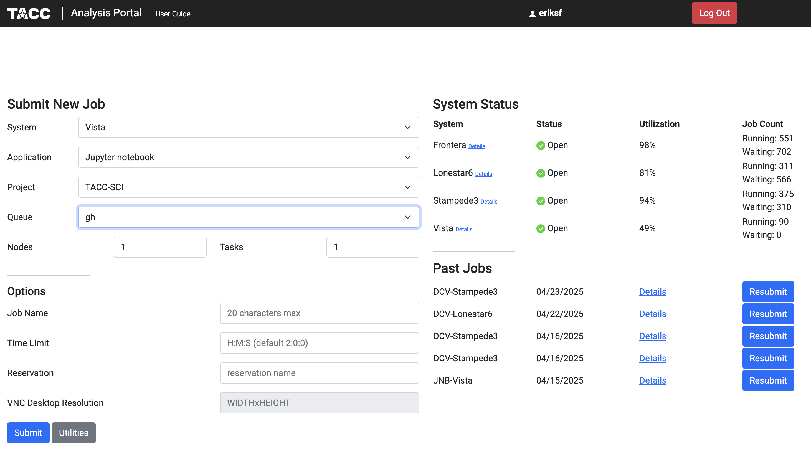
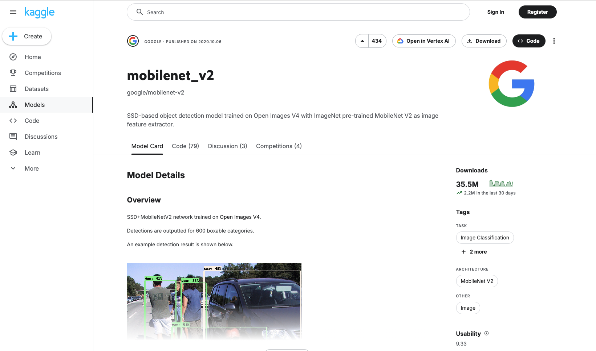
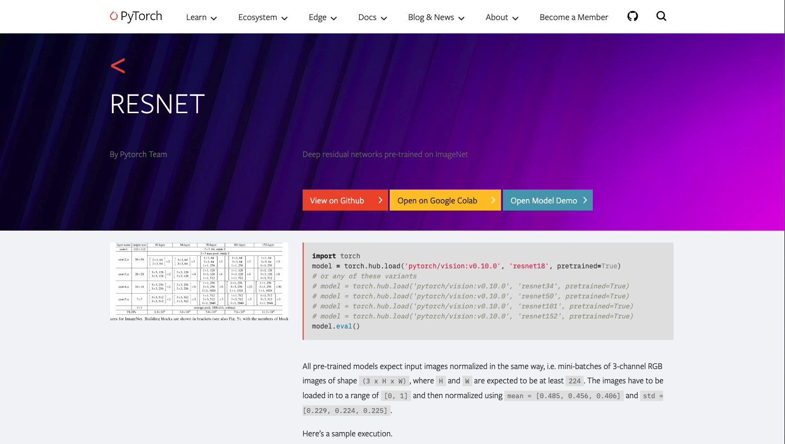
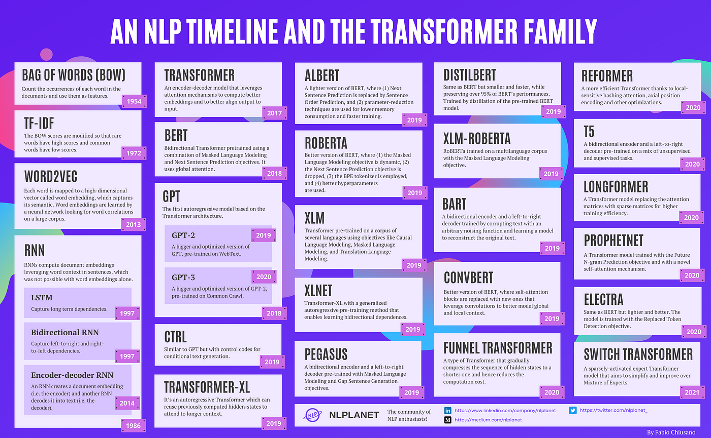
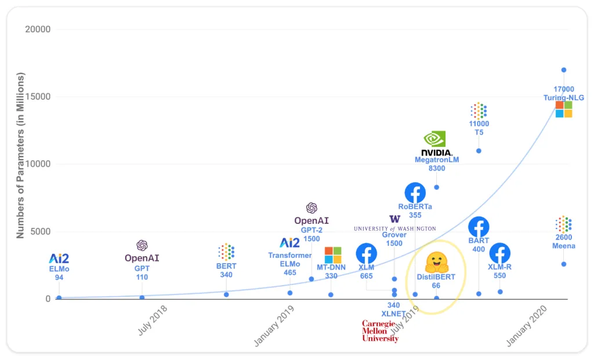

Finding and Running Models
==========================

In this section, we will explore how to find and run pre-trained models for inference using sites like
`PyTorch Hub <https://pytorch.org/hub/>`_ and `Tensorflow Hub <https://www.tensorflow.org/hub>`_. We will
also discuss how to use the `transformers` library to load models from `Hugging Face <https://huggingface.co/>`_.
After completing this section, you will be able to:

- Find and load pre-trained models from PyTorch Hub and Tensorflow Hub.
- Use the `transformers` library to load and run models from Hugging Face.

Setup
-----

To run the code examples in this section, you will need to open a `Jupyter Notebook <https://jupyter.org/>`_ on
the `TACC Analysis Portal <https://tap.tacc.utexas.edu/>`_ using the Vista compute cluster.

   TACC Analysis Portal.

Tensorflow Hub
--------------

Tensorflow Hub is a library for publishing, discovering, and consuming reusable parts of machine learning
models that is open to community contributors. It provides a collection of pre-trained models that can be easily
integrated into Tensorflow applications. To use Tensorflow Hub, you need to install the library. You can do this
using pip:

.. code-block:: console

    $ pip install tensorflow-hub

We're going to use the `MobileNet_V2 <https://www.kaggle.com/models/google/mobilenet-v2>`_ model from Tensorflow Hub. This model is a lightweight deep learning model
that is designed for mobile and embedded vision applications. It is a popular choice for image classification tasks
and is known for its speed and accuracy. The model is pre-trained on the ImageNet dataset.

   The mobilenet_v2 model card at Tensorflow Hub/Kaggle.

The model card provides information about the model, including its architecture, input and output formats,
variations, and usage examples. We're going to use the Tensorflow 2 `tf2-preview-classification` variation to do
a simple image classification task.

First, we will need to import tensorflow, tensorflow_hub, and a few other libraries needed for this task:

.. code-block:: python

    import tensorflow as tf
    import tensorflow_hub as hub
    import numpy as np
    from PIL import Image

Next, we will load the pre-trained model from Tensorflow Hub using information from the model card:

.. code-block:: python

    # Load the pre-trained model from Tensorflow Hub
    model_url = "https://www.kaggle.com/models/google/mobilenet-v2/TensorFlow2/tf2-preview-classification/4"
    img_shape = (224, 224)
    classifier = tf.keras.Sequential([hub.KerasLayer(model_url, input_shape=img_shape+(3,))])

Now, we can use the model to classify an image. We will load an image from a URL, preprocess it, and then
use the model to make a prediction:

.. code-block:: python

    # Download image and compute prediction
    img_url = "https://upload.wikimedia.org/wikipedia/commons/b/b0/Bengal_tiger_%28Panthera_tigris_tigris%29_female_3_crop.jpg"
    img = tf.keras.utils.get_file("image.jpg", img_url)
    img = Image.open(img).resize(img_shape)
    img = np.array(img) / 255.0
    result = classifier.predict(img[np.newaxis, ...])

Finally, we'll map the prediction to a corresponding class label and print out the predicted class name:

.. code-block:: python

    # Map the prediction result to the corresponding class label
    labels_url = "https://storage.googleapis.com/download.tensorflow.org/data/ImageNetLabels.txt"
    predicted_class = tf.math.argmax(result[0], axis=-1)
    labels_path = tf.keras.utils.get_file("ImageNetLabels.txt", labels_url)
    imagenet_labels = np.array(open(labels_path).read().splitlines())
    predicted_class_name = imagenet_labels[predicted_class]
    print(f"Predicted class name: {predicted_class_name}")

PyTorch Hub
-----------

PyTorch Hub is a pre-trained model repository designed to facilitate research exploration. It provides a simple
and efficient way to load pre-trained models and use them for inference and fine-tuning. To use PyTorch Hub, you
need to install the library. You can do this using pip:

.. code-block:: console

    $ pip install torch torchvision

In the previous section, we built a :ref:`Transfer learning <transfer-learning-label>` example that used the
pre-trained `ResNet18 <https://pytorch.org/hub/pytorch_vision_resnet/>`_ model from PyTorch Hub as a starting point.

   The ResNet model card at PyTorch Hub.

We don't need to repeat the example here, but we will show the relevant parts on how to load the model. Since this
was a computer vision problem, we were able to use the `torchvision` library to load the
pre-trained model. The `torchvision` library provides a collection of pre-trained models for computer vision
tasks, including image classification, object detection, and segmentation. To load the pre-trained ResNet18 model,
we can use the following code:

.. code-block:: python

    import torch
    from torchvision import models

    # Load the pre-trained ResNet18 model from PyTorch Hub
    model = models.resnet18(weights='IMAGENET1K_V1')

Hugging Face Transformers
-------------------------

The `transformers` library from `Hugging Face <https://huggingface.co/>`_ provides a collection of pre-trained
models for natural language processing (NLP) tasks, including text classification, named entity recognition,
and question answering as well as for other tasks such as Computer Vision, Multimodel (multiple types of data),
and Audio. The library also provides a simple and efficient way to load pre-trained models and use them for
inference and fine-tuning.

Brief Introduction to Transformers
~~~~~~~~~~~~~~~~~~~~~~~~~~~~~~~~~~

Transformers are a type of neural network architecture that has become the de facto standard for NLP tasks.
They are based on the self-attention mechanism, which allows the model to weigh the importance of different
words in a sentence when making predictions. This allows transformers to capture long-range dependencies and
contextual information in text data. The `transformers` library provides a collection of pre-trained models
that are based on the transformer architecture, including BERT [1]_, GPT-2 [2]_, and RoBERTa [3]_. These models have been
pre-trained on a large corpus of text and can be fine-tuned for specific tasks with relatively small amounts of
task-specific data.

Timeline of NLP and Transformers
~~~~~~~~~~~~~~~~~~~~~~~~~~~~~~~~

Transformers fit into the family of Natural Language Processing (NLP) models that have been developed over the years,
starting with simple models like Bag of Words [4]_ and Word2Vec [5]_, and moving on to more complex models like BERT, GPT, and
the newest Large Language Models (LLM).

   Timeline of NLP models. Source: `A Brief Timeline of NLP from Bag of Words to the Transformer Family <https://medium.com/nlplanet/a-brief-timeline-of-nlp-from-bag-of-words-to-the-transformer-family-7caad8bbba56>`_.

And because the strategy to increase the performance of these models is to increase the size of the model, the trend
is to have larger and larger models.

   Size of Transformer models. Source: `Hugging Face LLM Course <https://huggingface.co/learn/llm-course/chapter1/4?fw=pt>`_.

Architecture
~~~~~~~~~~~~

The transformer architecture is based on the self-attention mechanism, which allows the model to weigh the
importance of different words in a sentence when making predictions. This is the key to the transformer architecture
and was pointed out by the title of the paper introducing it, "Attention Is All You Need" [6]_. The architecture consists of an encoder and
decoder, each of which is made up of multiple layers. Each layer consists of a multi-head self-attention mechanism
and a feed-forward neural network. The encoder processes the input text and generates a set of hidden states,
which are then passed to the decoder. The decoder generates the output text based on the hidden states from the
encoder and the previously generated output text. The self-attention mechanism allows the model to capture long-range
dependencies and contextual information in the text data.

.. figure:: ./images/general_transformer_architecture.png
   :width: 600
   :align: center

   General Transformer architecture. Source: `Attention Is All You Need <https://arxiv.org/abs/1706.03762>`_.

There are three main variations of the transformer architecture and the different models that are based on it are
specialized for different tasks:

1. **Encoder-only models**: These models are used for tasks that require understanding the input text, such as text
   classification and named entity recognition. Examples include BERT, DistilBERT, RoBERTa, and ModernBERT.
2. **Decoder-only models**: These models are used for tasks that require generating text, such as text generation,
   language modeling, and conversational AI. Examples include GPT-(1,2,3,4) and LLaMa.
3. **Encoder-decoder models**: These models are used for tasks that require both understanding and generating text,
   such as machine translation and summarization. Examples include T5 and BART.

Usage
~~~~~

To use the `transformers` library, you need to install the library. You can do this
using pip:

.. code-block:: console

    $ pip install transformers

The most convenient way to use the `transformers` library is to use the Pipeline API. The Pipeline API provides a
simple and efficient way to load pre-trained models and use them for inference and fine-tuning. The API supports a
wide range of tasks, including text classification, named entity recognition, question answering, and text generation.
The API automatically handles the preprocessing and postprocessing of the input and output data, making it easy to use
pre-trained models without having to worry about the details of the model architecture and implementation.

We will first use a `transformers` pipeline to do a text summarization task based on a short article from
`GenomeWeb <https://www.genomeweb.com/>`_ that we stored as a text file. Let's import the necessary libraries:

.. code-block:: python

    from transformers import pipeline
    import requests

Now we will grab the text file and store it as a string:

.. code-block:: python

    url = "https://raw.githubusercontent.com/TACC/life_sciences_ml_at_tacc/refs/heads/main/docs/scripts/genomeweb_story.txt"
    response = requests.get(url)
    text = response.text
    print(text)

Finally, we will load the summarization pipeline and use it to summarize the text:

.. code-block:: python

    summarizer = pipeline("summarization", model="facebook/bart-large-cnn")

    summary = summarizer(text, max_length=150, min_length=50)
    print(summary)

The `transformers` pipeline also allows for more customization, such as specifying the model and tokenizer to use.
For example, let's switch to doing some sentiment analysis using the
`nlptown/bert-base-multilingual-uncased-sentiment <https://huggingface.co/nlptown/bert-base-multilingual-uncased-sentiment>`_ model.
This model was finetuned for sentiment analysis of product reviews in several languages. It predicts the review as a
number of stars from 1-5. We'll up the ante by specifying the "review" in another language, French. First, we will need
to load in the required libraries and set the model name:

.. code-block:: python

    from transformers import AutoTokenizer, AutoModelForSequenceClassification

    model_name = "nlptown/bert-base-multilingual-uncased-sentiment"

Next, we will load the model and tokenizer:

.. code-block:: python

    model = AutoModelForSequenceClassification.from_pretrained(model_name)
    tokenizer = AutoTokenizer.from_pretrained(model_name)

Finally, we will use the model to predict the sentiment of a piece of French text:

.. code-block:: python

    text = "La bibliothèque Transformers est fantastique."
    classifier = pipeline("sentiment-analysis", model= model, tokenizer=tokenizer)
    result = classifier(text)
    print(result)
    [{'label': '5 stars', 'score': 0.7264368534088135}]

Additional Resources
--------------------

The material in this section is based on the following resources:

* `Tensorflow Hub/Kaggle <https://www.tensorflow.org/hub>`_
* `PyTorch Hub <https://pytorch.org/hub/>`_
* `Hugging Face <https://huggingface.co/>`_
* `Dataiku Developer Guide Tensorflow Hub Tutorial <https://developer.dataiku.com/latest/tutorials/machine-learning/code-env-resources/tf-resources/index.html>`_
* `A Brief Timeline of NLP from Bag of Words to the Transformer Family <https://medium.com/nlplanet/a-brief-timeline-of-nlp-from-bag-of-words-to-the-transformer-family-7caad8bbba56>`_.
* `Hugging Face LLM Course <https://huggingface.co/learn/llm-course/chapter1/4?fw=pt>`_.

**References:**

.. [1] Devlin, J., Chang, M. W., Lee, K., & Toutanova, K. (2019, June). Bert: Pre-training of deep bidirectional transformers for language understanding. In Proceedings of the 2019 conference of the North American chapter of the association for computational linguistics: human language technologies, volume 1 (long and short papers) (pp. 4171-4186) `arXiv:1810.04805 <https://arxiv.org/abs/1810.04805>`_.
.. [2] Radford, A., Wu, J., Child, R., Luan, D., Amodei, D., & Sutskever, I. (2019). Language Models are Unsupervised Multitask Learners. `Semantic Scholar <https://www.semanticscholar.org/paper/Language-Models-are-Unsupervised-Multitask-Learners-Radford-Wu/9405cc0d6169988371b2755e573cc28650d14dfe>`_.
.. [3] Liu, Y., Ott, M., Goyal, N., Du, J., Joshi, M., Chen, D., ... & Stoyanov, V. (2019). Roberta: A robustly optimized bert pretraining approach. arXiv preprint `arXiv:1907.11692 <https://arxiv.org/abs/1907.11692>`_.
.. [4] Harris, Z. S. (1954). Distributional Structure. WORD, 10(2–3), 146–162. https://doi.org/10.1080/00437956.1954.11659520.
.. [5] Mikolov, T., Chen, K., Corrado, G., & Dean, J. (2013). Efficient estimation of word representations in vector space. arXiv preprint `arXiv:1301.3781 <https://arxiv.org/abs/1301.3781>`_.
.. [6] Vaswani, A., Shankar, S., Parmar, N., Uszkoreit, J., Jones, L., Gomez, A. N., Kaiser, Ł., Kattner, K., Niki, J., & Kaiser, Ł. (2017). Attention is all you need. In Advances in neural information processing systems (pp. 5998-6008). `arXiv:1706.03762 <https://arxiv.org/abs/1706.03762>`_.

