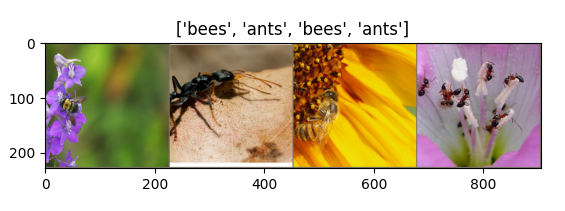
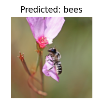

Running Containers on HPC Systems
=================================

High performance computing (HPC) systems serve a large role in academic computing at scale.
In this portion of the training, we will explore methods for running containers that you develop
on HPC systems and also discovering containers built by the community that you can utilize. After
going through this section, you will be able to:

- Use Apptainer to execute Docker containers on a HPC system
- Understand how to run containers that use GPUs for computation
- Discover community curated software containers available at TACC

Introduction to Apptainer
-------------------------

.. Note::

    Prerequisites
	This section uses the Vista compute cluster to run Apptainer. An active allocation on Vista is required, though most content will apply to any system that supports Apptainer.

At face value, Apptainer is an alternative container implementation to Docker that has an overlapping
set of features but some key differences as well.  Apptainer is commonly available on shared clusters,
such as TACC's HPC systems, because the Docker runtime is not secure on systems where users are not
allowed to have "escalated privileges".  Importantly, the Apptainer runtime is compatible with Docker
containers!  So in general, we follow the practice of using Docker to develop containers and using
Apptainer simply as a runtime to execute containers on HPC systems.

If you are familiar with Docker, Apptainer will feel familiar.

Login to Vista
~~~~~~~~~~~~~~

For today's training, we will use the Vista supercomputer. To login, you need to establish a SSH connection from your laptop to the Vista system.  Instructions depend on your laptop's operating system.

Mac / Linux:

|   Open the application 'Terminal'
|   ssh username@vista.tacc.utexas.edu
|   (enter password)
|   (enter 6-digit token)

Windows:

|   If using Windows Subsystem for Linux, use the Mac / Linux instructions.
|   If using an application like 'PuTTY'
|   enter Host Name: vista.tacc.utexas.edu
|   (click 'Open')
|   (enter username)
|   (enter password)
|   (enter 6-digit token)

When you have successfully logged in, you should be greeted with some welcome text and a command prompt.

Start an Interactive Session
~~~~~~~~~~~~~~~~~~~~~~~~~~~~

The Apptainer module is currently only available on compute nodes at TACC. To use Apptainer interactively,
start an interactive session on a compute node using the ``idev`` command.

.. code-block:: console

	$ idev -m 40

If prompted to use a reservation, choose yes.  Once the command runs successfully, you will no longer be
on a login node, but instead have a shell on a dedicated compute node.

Load the Apptainer Module
~~~~~~~~~~~~~~~~~~~~~~~~~

By default, the ``apptainer`` command is not visible, but it can be added to the environment by loading
the module.

.. code-block:: console

	$ module list

	$ module spider apptainer

	$ module load tacc-apptainer

	$ module list

Now the apptainer command is available.

.. code-block:: console

	$ type apptainer

	$ apptainer help

Core Apptainer Commands
~~~~~~~~~~~~~~~~~~~~~~~

Pull a Docker container
^^^^^^^^^^^^^^^^^^^^^^^

Containers in the Docker registry may be downloaded and used, assuming the underlying
architecture (e.g. x86) is the same between the container and the host.

.. code-block:: console

	$ apptainer pull docker://eriksf/lolcow

	$ ls

There may be some warning messages, but this command should download the latest version of the
"lolcow" container and save it in your current working directory as ``lolcow_latest.sif``.

Interactive shell
^^^^^^^^^^^^^^^^^

The ``shell`` command allows you to spawn a new shell within your container and interact with it
as though it were a small virtual machine.

.. code-block:: console

	$ apptainer shell lolcow_latest.sif

	Apptainer>

The change in prompt indicates that you have entered the container (though you should not rely on that
to determine whether you are in container or not).

Once inside of an Apptainer container, you are the same user as you are on the host system.
Also, a number of host directories are mounted by default.

.. code-block:: bash

	Apptainer> whoami

	Apptainer> id

	Apptainer> pwd

	Apptainer> exit

.. Note::

	Docker and Apptainer have very different conventions around how host directories are mounted within the container. In many ways, Apptainer has a simpler process for working with data on the host, but it is also more prone to inadvertantly having host configurations "leak" into the container.

Run a container's default command
^^^^^^^^^^^^^^^^^^^^^^^^^^^^^^^^^

Just like with Docker, Apptainer can run the default "entrypoint" or default command of a container with
the ``run`` subcommand.  These defaults are defined in the Dockerfile (or Apptainer Definition file) that
define the actions a container should perform when someone runs it.

.. code-block:: console

	$ apptainer run lolcow_latest.sif

     ________________________________________
    < The time is right to make new friends. >
     ----------------------------------------
            \   ^__^
             \  (oo)\_______
                (__)\       )\/\
                    ||----w |
                    ||     ||

.. Note::

    You may receive a warning about "Setting locale failed".  This is because, by default, Apptainer sets all shell environment variables inside the container to match whatever is on the host. To override this behavior, add the ``--cleanenv`` argument to your command.

Executing arbitrary commands
^^^^^^^^^^^^^^^^^^^^^^^^^^^^

The exec command allows you to execute a custom command within a container. For instance, to execute
the ``cowsay`` program within the lolcow_latest.sif container:

.. code-block:: console

	$ apptainer exec --cleanenv lolcow_latest.sif cowsay Apptainer runs Docker containers on HPC systems
     _______________________________________
    / Apptainer runs Docker containers on \
    \ HPC systems                           /
     ---------------------------------------
            \   ^__^
             \  (oo)\_______
                (__)\       )\/\
                    ||----w |
                    ||     ||

.. Note::

	``exec`` also works with the library://, docker://, and shub:// URIs. This creates an ephemeral container that executes a command and disappears.

Once you are finished with your interactive session, you can end it and return to the login node with
the exit command:

.. code-block:: console

	$ exit

Apptainer in HPC Environments
-----------------------------

Conducting analyses on high performance computing clusters happens through very different patterns of
interaction than running analyses on a VM or on your own laptop.  When you login, you are on a node
that is shared with lots of people.  Trying to run jobs on that node is not "high performance" at all.
Those login nodes are just intended to be used for moving files, editing files, and launching jobs.

Most jobs on a HPC cluster are neither interactive, nor realtime.  When you submit a job to the scheduler,
you must tell it what resources you need (e.g. how many nodes, what type of nodes) and what you want to run.
Then the scheduler finds resources matching your requirements, and runs the job for you when it can.

For example, if you want to run the command:

.. code-block:: text

  apptainer exec docker://python:latest /usr/local/bin/python --version

On a HPC system, your job submission script would look something like:

.. code-block:: bash

  #!/bin/bash

  #SBATCH -J myjob                             # Job name
  #SBATCH -o output.%j                         # Name of stdout output file (%j expands to jobId)
  #SBATCH -p gh                                # Queue name
  #SBATCH -N 1                                 # Total number of nodes requested (56 cores/node)
  #SBATCH -n 1                                 # Total number of mpi tasks requested
  #SBATCH -t 02:00:00                          # Run time (hh:mm:ss) - 4 hours
  #SBATCH --reservation <my_reservation>       # a reservation only active during the training

  module load tacc-apptainer
  apptainer exec docker://python:latest /usr/local/bin/python --version

This example is for the Slurm scheduler, a popular one used by all TACC systems.  Each of the #SBATCH lines
looks like a comment to the bash kernel, but the scheduler reads all those lines to know what resources
to reserve for you.

.. Note::

  Every HPC cluster is a little different, but they almost universally have a "User's Guide" that serves both as a quick reference for helpful commands and contains guidelines for how to be a "good citizen" while using the system.  For TACC's Vista system, the user guide is at: `https://docs.tacc.utexas.edu/hpc/vista/ <https://docs.tacc.utexas.edu/hpc/vista/>`_

How do HPC systems fit into the development workflow?
~~~~~~~~~~~~~~~~~~~~~~~~~~~~~~~~~~~~~~~~~~~~~~~~~~~~~

A couple of things to consider when using HPC systems:

#. Using 'sudo' is not allowed on HPC systems, and building an Apptainer container from scratch requires sudo.  That means you have to build your containers on a different development system, which is why we started this course developing Docker on your own laptop).  You can pull a docker image on HPC systems.
#. If you need to edit text files, command line text editors don't support using a mouse, so working efficiently has a learning curve.  There are text editors that support editing files over SSH.  This lets you use a local text editor and just save the changes to the HPC system.

In general, most TACC staff that work with containers develop their code locally and then deploy their
containers to HPC systems to do analyses at scale.  If the containers are written in a way that
accommodates the small differences between the Docker and Apptainer runtimes, the transition is fairly
seamless.

Differences between Docker and Apptainer
~~~~~~~~~~~~~~~~~~~~~~~~~~~~~~~~~~~~~~~~

Host Directories
^^^^^^^^^^^^^^^^

**Docker:** None by default. Use ``-v <source>:<destination>`` to mount a source host directory to an arbitrary destination within the container.

**Apptainer:** Mounts your current working directory, $HOME directory, and some system directories by default. Other defaults may be set in a system-wide configuration. The ``--bind`` flag is supported but rarely used in practice.

User ID
^^^^^^^

**Docker:** Defined in the Dockerfile, but containers run as root unless a different user is defined or specified on the command line.  This user ID only exists within the container, and care must be taken when working with files on the host filesystem to make sure permissions are set correctly.

**Apptainer:** Containers are run in "userspace", so you are the same user and user ID both inside and outside the container.

Image Format
^^^^^^^^^^^^

**Docker:** Containers are stored in layers and managed in a repository by Docker.  The ``docker images`` command will show you what containers are on your local machine and images are always referenced by their repository and tag name.

**Apptainer:** Containers are files.  Apptainer can build a container on the fly if you specify a repository, but ultimately they are stored as individual files, with all the benefits and dangers inherent to files.

Running a Batch Job on Vista
~~~~~~~~~~~~~~~~~~~~~~~~~~~~

If you are not already, please login to the Vista system, just like we did at the start of the
previous section.  You should be on one of the login nodes of the system.

We will not be editing much text directly on Vista, but we need to do a little.  If you have a text
editor you prefer, use it for this next part.  If not, the ``nano`` text editor is probably the most
accessible for those new to Linux.

Create a file called "pi.slurm" on the work filesystem:

.. code-block:: console

  $ cd $WORK
  $ mkdir life-sciences-ml-at-tacc
  $ cd life-sciences-ml-at-tacc
  $ nano classify.slurm

Those commands should open a new file in the nano editor.  Either type in (or copy and paste) the
following Slurm script.

.. code-block:: bash

  #!/bin/bash

  #SBATCH -J classify-image                    # Job name
  #SBATCH -o output.%j                         # Name of stdout output file (%j expands to jobId)
  #SBATCH -p gh                                # Queue name
  #SBATCH -N 1                                 # Total number of nodes requested (56 cores/node)
  #SBATCH -n 1                                 # Total number of mpi tasks requested
  #SBATCH -t 00:10:00                          # Run time (hh:mm:ss)
  #SBATCH --reservation <my_reservation>       # a reservation only active during the training

  module load tacc-apptainer

  cd $SCRATCH

  echo "running the lolcow container:"
  apptainer run docker://eriksf/lolcow:latest

  echo "grabbing image dog.jpg:"
  wget https://raw.githubusercontent.com/TACC/life_sciences_ml_at_tacc/main/docs/images/dog.jpg

  echo "classify image dog.jpg:"
  apptainer exec --nv docker://USERNAME/image-classifier:0.1 image_classifier.py dog.jpg

* Don't forget to replace ``USERNAME`` with your DockerHub username! If you didn't publish an image-classifier container from the previous sections, you are welcome to use "eriksf" as the username to pull my container.

* If you have more than one allocation, you will need to add another line specifying what allocation to use, such as: ``#SBATCH -A AllocationName``

Once you are done, try submitting this file as a job to Slurm.

.. code-block:: console

  $ sbatch classify.slurm

You can check the status of your job with the command ``showq -u``.

Once your job has finished, take a look at the output:

.. code-block:: console

  $ cat output*

Apptainer and GPU Computing
---------------------------

Apptainer **fully** supports GPU utilization by exposing devices at runtime with the ``--nv`` flag.
This is similar to ``nvidia-docker``, so all docker containers with libraries that are compatible with
the drivers on our systems can work as expected.

As a base, we recommend starting with the official CUDA
(`nvidia/cuda <https://hub.docker.com/r/nvidia/cuda>`_) images from NVIDIA on Docker Hub.  If you
specifically want to use `PyTorch <https://pytorch.org/>`_ or `Tensorflow <https://www.tensorflow.org/>`_
then the official repositories on Docker Hub, `pytorch/pytorch <https://hub.docker.com/r/pytorch/pytorch>`_ (x86_64)
and `tensorflow/tensorflow <https://hub.docker.com/r/tensorflow/tensorflow>`_ (x86_64) respectively, are good
starting points.

Alternatively, the `NVIDIA GPU Cloud <https://ngc.nvidia.com/>`_ (NGC) has a large number of pre-built
containers for deep learning and HPC applications including
`PyTorch <https://catalog.ngc.nvidia.com/orgs/nvidia/containers/pytorch>`_ and
`Tensorflow <https://catalog.ngc.nvidia.com/orgs/nvidia/containers/tensorflow>`_ (full-featured, large,
and include ARM64/aarch64 versions).

For instance, we can use a tool like ``gpustat`` to poke at the GPU on TACC systems as follows:

.. code-block:: console

  Work from a compute node
  $ idev -m 60 -p gh

  Load the apptainer module
  $ module load tacc-apptainer

  Pull your image
  $ apptainer pull docker://eriksf/monitor-gpu:0.1.0

  Test the GPU
  $ apptainer exec --nv monitor-gpu_0.1.0.sif gpustat --json
  INFO:    squashfuse not found, will not be able to mount SIF or other squashfs files
  INFO:    gocryptfs not found, will not be able to use gocryptfs
  INFO:    Converting SIF file to temporary sandbox...
  {
      "hostname": "c608-151.vista.tacc.utexas.edu",
      "driver_version": "560.35.03",
      "query_time": "2025-04-09T13:44:37.312641",
      "gpus": [
          {
              "index": 0,
              "uuid": "GPU-6248a92d-df2d-db15-af4e-b0e000650adb",
              "name": "NVIDIA GH200 120GB",
              "temperature.gpu": 27,
              "fan.speed": null,
              "utilization.gpu": 0,
              "utilization.enc": 0,
              "utilization.dec": 0,
              "power.draw": 78,
              "enforced.power.limit": 900,
              "memory.used": 0,
              "memory.total": 97871,
              "processes": []
          }
      ]
  }
  INFO:    Cleaning up image...

.. Note::

	If this resulted in an error and the GPU was not detected, and you are on a GPU-enabled compute node, you may have excluded the ``--nv`` flag.

As previously mentioned, the main requirement for GPU-enabled containers to work is that the version of the
NVIDIA host driver on the system supports the version of the CUDA library inside the container.

For some more exciting examples, lets look at two of the most popular Deep Learning frameworks for
Python, `Tensorflow <https://www.tensorflow.org/>`_ and `PyTorch <https://pytorch.org/>`_.

First, we'll run a simple script (`tf_test.py <https://raw.githubusercontent.com/TACC/life_sciences_ml_at_tacc/main/docs/scripts/tf_test.py>`_)
that uses Tensorflow to show the GPUs and then creates two tensors and multiplies them together.
It can be tested as follows:

.. code-block:: console

  Change to your $SCRATCH directory
  $ cd $SCRATCH

  Download the test code
  $ wget https://raw.githubusercontent.com/TACC/life_sciences_ml_at_tacc/main/docs/scripts/tf_test.py

  Pull the image
  $ apptainer pull docker://nvcr.io/nvidia/tensorflow:24.12-tf2-py3

  Run the code
  $ apptainer exec --nv tensorflow_24.12-tf2-py3.sif python tf_test.py 2>warnings.txt
  Tensorflow version: 2.17.0
  GPU available: True

  GPUs:
  Name: /physical_device:GPU:0   Type: GPU

  TNA= tf.Tensor(
  [[1. 2. 3.]
  [4. 5. 6.]], shape=(2, 3), dtype=float32)
  TNB= tf.Tensor(
  [[1. 2.]
  [3. 4.]
  [5. 6.]], shape=(3, 2), dtype=float32)
  TNAxTNB= tf.Tensor(
  [[22. 28.]
  [49. 64.]], shape=(2, 2), dtype=float32)

.. Note::

	If you would like avoid the wordy tensorflow warning messages, run the above command and
	redirect STDERR to a file (i.e. ``2>warnings.txt``).

Next, we'll look at another example of matrix multiplication using PyTorch (`pytorch_matmul_scaling_test.py <https://raw.githubusercontent.com/TACC/life_sciences_ml_at_tacc/main/docs/scripts/pytorch_matmul_scaling_test.py>`_)
where we'll show how long it takes to multiply increasingly bigger matrices using both the CPU and GPU.
It can be tested as follows:

.. code-block:: console

  Change to your $SCRATCH directory
  $ cd $SCRATCH

  Download the test code
  $ wget https://raw.githubusercontent.com/TACC/life_sciences_ml_at_tacc/main/docs/scripts/pytorch_matmul_scaling_test.py

  Pull the image
  $ apptainer pull docker://eriksf/pytorch-ml-container:0.2

  Run the code against the CPU
  $ apptainer exec --nv pytorch-ml-container_0.2.sif python3 pytorch_matmul_scaling_test.py --no-gpu
  INFO:    squashfuse not found, will not be able to mount SIF or other squashfs files
  INFO:    gocryptfs not found, will not be able to use gocryptfs
  INFO:    Converting SIF file to temporary sandbox...
  PyTorch Matrix Multiplication Test for Large Matrices
  PyTorch version: 2.5.1
  Using device: cpu

  Running test for matrix size: 2048x2048
  Estimated memory requirement: 0.03 GB

  Running test for matrix size: 4096x4096
  Estimated memory requirement: 0.12 GB

  Running test for matrix size: 8192x8192
  Estimated memory requirement: 0.50 GB
                    Matrix Multiplication Test Results
  ┏━━━━━━━━━━━━━┳━━━━━━━━━━━━━━━━━━┳━━━━━━━━━━━━━━━━━━━━━━┳━━━━━━━━━━━━━━━┓
  ┃ Matrix Size ┃ Memory Size (GB) ┃ Computation Time (s) ┃ Performance   ┃
  ┡━━━━━━━━━━━━━╇━━━━━━━━━━━━━━━━━━╇━━━━━━━━━━━━━━━━━━━━━━╇━━━━━━━━━━━━━━━┩
  │ 2048x2048   │ 0.03             │ 0.1755               │ 97.88 GFLOPS  │
  │ 4096x4096   │ 0.12             │ 1.3749               │ 99.96 GFLOPS  │
  │ 8192x8192   │ 0.50             │ 10.9043              │ 100.83 GFLOPS │
  └─────────────┴──────────────────┴──────────────────────┴───────────────┘
  Scaling plot saved as 'scaling_plot.png'
  INFO:    Cleaning up image...

The script also produces a scaling plot:

.. figure:: ../images/scaling_plot_cpu.png
  :align: center

  Scaling plot for CPU

.. code-block:: console

  Run the code against the GPU
  $ apptainer exec --nv pytorch-ml-container_0.2.sif python3 pytorch_matmul_scaling_test.py
  INFO:    squashfuse not found, will not be able to mount SIF or other squashfs files
  INFO:    gocryptfs not found, will not be able to use gocryptfs
  INFO:    Converting SIF file to temporary sandbox...
  PyTorch Matrix Multiplication Test for Large Matrices
  PyTorch version: 2.5.1
  Using device: cuda
  CUDA version: 12.4
  GPU: NVIDIA GH200 120GB
  GPU Memory: 95.00 GB

  Running test for matrix size: 2048x2048
  Estimated memory requirement: 0.03 GB

  Running test for matrix size: 4096x4096
  Estimated memory requirement: 0.12 GB

  Running test for matrix size: 8192x8192
  Estimated memory requirement: 0.50 GB
                    Matrix Multiplication Test Results
  ┏━━━━━━━━━━━━━┳━━━━━━━━━━━━━━━━━━┳━━━━━━━━━━━━━━━━━━━━━━┳━━━━━━━━━━━━━━┓
  ┃ Matrix Size ┃ Memory Size (GB) ┃ Computation Time (s) ┃ Performance  ┃
  ┡━━━━━━━━━━━━━╇━━━━━━━━━━━━━━━━━━╇━━━━━━━━━━━━━━━━━━━━━━╇━━━━━━━━━━━━━━┩
  │ 2048x2048   │ 0.03             │ 0.0007               │ 25.98 TFLOPS │
  │ 4096x4096   │ 0.12             │ 0.0053               │ 25.86 TFLOPS │
  │ 8192x8192   │ 0.50             │ 0.0426               │ 25.82 TFLOPS │
  └─────────────┴──────────────────┴──────────────────────┴──────────────┘
  Scaling plot saved as 'scaling_plot.png'
  INFO:    Cleaning up image...

The script also produces a scaling plot:

.. figure:: ../images/scaling_plot.png
  :align: center

  Scaling plot for GPU

Building a GPU aware container
~~~~~~~~~~~~~~~~~~~~~~~~~~~~~~

In the previous couple of examples, we have used pre-built containers to test GPU capability. Here we are going
to build a container to train a CNN for image classification using transfer learning with PyTorch.

Transfer learning is a technique where a model that has been trained on a large dataset
(e.g. `ImageNet <http://www.image-net.org/>`_) is used as a starting point for training a model on a
smaller dataset. This is particularly useful when the smaller dataset is not large enough to train a model
from scratch. The ImageNet dataset contains well over a million images and 1000 classes.
There are 2 main approaches or scenarios used in transfer learning:

1. **Feature Extraction**: Use the pre-trained model as a fixed feature extractor. In this case, we freeze all the
   layers of the pre-trained model and only train the final classification layer.
2. **Fine-tuning**: Unfreeze some of the layers of the pre-trained model and jointly train the model on the new dataset.

In this example, we will train a model to classify `hymenoptera <https://www.inaturalist.org/taxa/47201-Hymenoptera>`_
(ants, bees, and wasps) using the dataset located `here <https://download.pytorch.org/tutorial/hymenoptera_data.zip>`_.
This dataset contains a training set of approximately 120 images each of ants and bees, and a validation set of
approximately 75 images each. Again, too small and specific to train a model from scratch, but well placed to
use for transfer learning.  The model we will use is a pre-trained ResNet18 [1]_ model, which is a convolutional neural network
(CNN) that has been trained on the ImageNet dataset.  The ResNet18 model is a deep residual network with 18 layers
that is designed to learn features from images.  The model is available in the `torchvision <https://pytorch.org/vision/stable/index.html>`_
library, which is a package that provides popular datasets, model architectures, and common image transformations
for computer vision.

.. figure:: ../images/The-architecture-of-ResNet18.png
   :width: 600
   :align: center

   The architecture of ResNet18. Source: [2]_

On your local laptop or VM, clone the following `repository <https://github.com/eriksf/pytorch-transfer-learning>`_:

.. code-block:: console

    $ git clone https://github.com/eriksf/pytorch-transfer-learning.git

Let's take a look at the files:

.. code-block:: console

    $ cd pytorch-transfer-learning
    $ tree .
    .
    ├── Dockerfile
    ├── images
    │   ├── silver-tailed_petalcutter_bee.jpg
    │   └── sri_lankan_relic_ant.jpeg
    ├── LICENSE
    ├── pyproject.toml
    ├── pytorch_transfer_learning
    │   ├── __init__.py
    │   ├── functions.py
    │   ├── predict.py
    │   ├── train.py
    │   └── version.py
    ├── README.md
    └── uv.lock

    3 directories, 12 files

This is the basic directory structure of a Python package. It was built using `uv <https://docs.astral.sh/uv/>`_
which is a tool for building and managing Python packages, and `Click <https://click.palletsprojects.com/en/stable/>`_
which is a module for creating command line interfaces. When installed, this package will create two command line
interfaces: ``train`` and ``predict``. The ``train`` command will train the model, and the ``predict`` command will
use the trained model to make predictions on new images.

The important file that controls the package and dependencies is ``pyproject.toml``.

.. code-block:: console

    $ cat pyproject.toml
    [project]
    name = "pytorch-transfer-learning"
    version = "0.1.1"
    description = "A tool to train a CNN for image classification using transfer learning (from https://pytorch.org/tutorials/beginner/transfer_learning_tutorial.html)"
    authors = [{ name = "Erik Ferlanti", email = "eferlanti@tacc.utexas.edu" }]
    requires-python = ">=3.12"
    readme = "README.md"
    dependencies = [
      "torch",
      "torchvision",
      "scipy>=1.15.2,<2",
      "matplotlib>=3.10.1,<4",
      "rich>=13.9.4,<14",
      "click>=8.1.8,<9",
      "click-loglevel>=0.6.0,<0.7",
    ]

    [project.urls]
    repository = "https://github.com/eriksf/pytorch-transfer-learning"

    [project.scripts]
    train = "pytorch_transfer_learning.train:main"
    predict = "pytorch_transfer_learning.predict:main"

    [dependency-groups]
    dev = [
      "pytest>=8.3.5,<9",
      "pytest-cov>=6.0.0,<7",
      "ruff>=0.11.1,<0.12",
    ]

    [tool.uv]

    [tool.uv.sources]
    torch = [
      { url = "https://download.pytorch.org/whl/cpu/torch-2.6.0-cp312-none-macosx_11_0_arm64.whl", marker = "sys_platform == 'darwin'" },
      { url = "https://download.pytorch.org/whl/cu126/torch-2.6.0%2Bcu126-cp312-cp312-linux_aarch64.whl", marker = "sys_platform == 'linux' and platform_machine == 'aarch64'" },
      { url = "https://download.pytorch.org/whl/cu126/torch-2.6.0%2Bcu126-cp312-cp312-manylinux_2_28_x86_64.whl", marker = "sys_platform == 'linux' and platform_machine == 'x86_64'" },
    ]
    torchvision = [
      { url = "https://download.pytorch.org/whl/cpu/torchvision-0.21.0-cp312-cp312-macosx_11_0_arm64.whl", marker = "sys_platform == 'darwin'" },
      { url = "https://download.pytorch.org/whl/cu126/torchvision-0.21.0-cp312-cp312-linux_aarch64.whl", marker = "sys_platform == 'linux' and platform_machine == 'aarch64'" },
      { url = "https://download.pytorch.org/whl/cu126/torchvision-0.21.0%2Bcu126-cp312-cp312-linux_x86_64.whl", marker = "sys_platform == 'linux' and platform_machine == 'x86_64'" },
    ]

    [tool.hatch.build.targets.sdist]
    include = ["pytorch_transfer_learning"]

    [tool.hatch.build.targets.wheel]
    include = ["pytorch_transfer_learning"]

    [tool.bumpversion]
    current_version = "0.1.1"
    parse = "(?P<major>\\d+)\\.(?P<minor>\\d+)\\.(?P<patch>\\d+)"
    serialize = ["{major}.{minor}.{patch}"]
    search = "{current_version}"
    replace = "{new_version}"
    regex = false
    ignore_missing_version = false
    ignore_missing_files = false
    tag = false
    sign_tags = false
    tag_name = "v{new_version}"
    tag_message = "Bump version: {current_version} → {new_version}"
    allow_dirty = true
    commit = false
    message = "Bump version: {current_version} → {new_version}"
    moveable_tags = []
    commit_args = ""
    setup_hooks = []
    pre_commit_hooks = []
    post_commit_hooks = []

    [[tool.bumpversion.files]]
    filename = "pytorch_transfer_learning/version.py"

    [build-system]
    requires = ["hatchling"]
    build-backend = "hatchling.build"

    [tool.ruff]
    exclude = [".git", ".ruff_cache", ".vscode"]
    line-length = 300

    [tool.ruff.lint]
    select = ["E", "F", "I"]
    fixable = ["ALL"]
    unfixable = ["F401"]

    [tool.pytest.ini_options]
    addopts = "--verbose --cov=pytorch_transfer_learning"

We show this file only to give some insight into how the Dockerfile will used to build the project. In this
uv-based Python package, we'll discuss each of the important Dockerfile sections in detail. As opposed to the
previous section, this Dockerfile is a multi-stage build (see `Multi-stage builds <https://containers-at-tacc.readthedocs.io/en/latest/advanced/01.multistage.html>`_),
which means that it will build the final image in multiple steps.

In stage 1 (base stage), we're going to base our image on a tagged version
(12.6.3-cudnn-runtime-ubuntu24.04) of the official NVIDIA CUDA images, label it ``base``, and then install
some system updates and Python 3.12 using ``apt``, the package manager for Ubuntu/Debian.

.. code-block:: dockerfile

    FROM nvidia/cuda:12.6.3-cudnn-runtime-ubuntu24.04 AS base

    # Install python and pip
    RUN apt-get update \
        && DEBIAN_FRONTEND=noninteractive apt-get install -y \
            python3.12-full \
            python3-pip \
        && apt-get autoremove -y \
        && apt-get clean \
        && rm -rf /var/lib/apt/lists/*

Next, in the second stage (builder stage), we will copy in the ``uv`` executable, set the working directory (``/app``),
and use ``uv`` to install the Python dependencies listed in ``pyproject.toml``. We will then copy in the project files
and use ``uv`` again to install the project.

.. code-block:: dockerfile

    FROM base AS builder
    COPY --from=ghcr.io/astral-sh/uv:0.6.9 /uv /bin/uv
    ENV UV_COMPILE_BYTECODE=1 UV_LINK_MODE=copy
    WORKDIR /app
    COPY uv.lock pyproject.toml /app/
    RUN --mount=type=cache,target=/root/.cache/uv \
        uv sync --frozen --no-install-project --no-dev
    COPY images/ /app/images
    COPY pytorch_transfer_learning /app/pytorch_transfer_learning
    COPY LICENSE \
        README.md \
        /app/
    RUN --mount=type=cache,target=/root/.cache/uv \
        uv sync --frozen --no-dev

In the final stage (runtime stage), we will copy the ``/app`` directory from the builder stage, set the PATH
environment variable, run a Python command to prebuild the matplotlib font cache, and then set the default command
to run the help for the ``train`` command. The important thing to take away here is that we're copying in the
``/app`` directory from the builder stage, which contains all the files we need to run the project, and jettisoning
the rest of the build dependencies. This is a common pattern in multi-stage builds, where we want to keep the final
image as small as possible by only including the files we need to run the project.

.. code-block:: dockerfile

    FROM base
    COPY --from=builder /app /app
    ENV PATH="/app/.venv/bin:$PATH"
    # Build matpotlib font cache
    RUN MPLBACKEND=Agg python -c "import matplotlib.pyplot"

    CMD [ "train", "--help" ]

For reference, here's what the Dockerfile looks like in total:

.. code-block:: dockerfile

    FROM nvidia/cuda:12.6.3-cudnn-runtime-ubuntu24.04 AS base

    # Install python and pip
    RUN apt-get update \
        && DEBIAN_FRONTEND=noninteractive apt-get install -y \
            python3.12-full \
            python3-pip \
        && apt-get autoremove -y \
        && apt-get clean \
        && rm -rf /var/lib/apt/lists/*

    FROM base AS builder
    COPY --from=ghcr.io/astral-sh/uv:0.6.9 /uv /bin/uv
    ENV UV_COMPILE_BYTECODE=1 UV_LINK_MODE=copy
    WORKDIR /app
    COPY uv.lock pyproject.toml /app/
    RUN --mount=type=cache,target=/root/.cache/uv \
        uv sync --frozen --no-install-project --no-dev
    COPY images/ /app/images
    COPY pytorch_transfer_learning /app/pytorch_transfer_learning
    COPY LICENSE \
        README.md \
        /app/
    RUN --mount=type=cache,target=/root/.cache/uv \
        uv sync --frozen --no-dev

    FROM base
    COPY --from=builder /app /app
    ENV PATH="/app/.venv/bin:$PATH"
    # Build matpotlib font cache
    RUN MPLBACKEND=Agg python -c "import matplotlib.pyplot"

    CMD [ "train", "--help" ]

Now let's go ahead and build the container.  This will take a few minutes, so be patient.

.. code-block:: console

  $ docker build -t <username>/pytorch-transfer-learning:0.1.0 .

Or for a different architecture (see `Multi-architecture builds <https://containers-at-tacc.readthedocs.io/en/latest/advanced/02.multiarch.html>`_),
you can use, for example, the following command:

.. code-block:: console

  $ docker build --platform linux/arm64 -t <username>/pytorch-transfer-learning:0.1.0 .

Once you have successfully built the image, push it up to Docker Hub with the ``docker push`` command so that
we can pull it back down on an HPC system.

.. code-block:: console

  $ docker push <username>/pytorch-transfer-learning:0.1.0

Testing the Container Locally with CPU
^^^^^^^^^^^^^^^^^^^^^^^^^^^^^^^^^^^^^^

Before using TACC allocation hours, it's a good idea to test the container locally. In this case, we can at least
test that the program help works.

.. code-block::  console

  $ docker run --rm <username>/pytorch-transfer-learning:0.1.0 train --help
  Usage: train [OPTIONS]

    Train a CNN for hymenoptera classification using transfer learning from the
    pre-trained model ResNet18.

  Options:
    --version                       Show the version and exit.
    --log-level [NOTSET|DEBUG|INFO|WARNING|ERROR|CRITICAL]
                                    Set the log level  [default: 20]
    --log-file PATH                 Set the log file
    --data-dir PATH                 Set the data directory  [default:
                                    hymenoptera_data]
    --scenario [finetuning|fixedfeature]
                                    Transfer learning scenario.  [default:
                                    finetuning]
    --model-dir PATH                Set the model directory  [default: .]
    --output-dir PATH               Set the output directory  [default: .]
    --epochs INTEGER                The number of epochs to train the model
                                    [default: 25]
    --help                          Show this message and exit.

We could also test the training process (or prediction) locally, because it will work on the CPU, but very slowly.
However, we will not do that here because it would take a long time (25-30 minutes to train). Instead, we will run
the training on the Vista system, which has powerful GPUs.

Running the Container on Vista
^^^^^^^^^^^^^^^^^^^^^^^^^^^^^^

To start, let's allocate a single `Grace Hopper <https://docs.tacc.utexas.edu/hpc/vista/#system-gh>`_ node,
which has a single NVIDIA GH200 GPU with 95 GB of Memory.

.. code-block:: console

  $ idev -m 60 -p gh

Once you have your node, pull the image and run it as follows:

.. code-block:: console

  Load apptainer module
  $ module load tacc-apptainer

  Change to $SCRATCH directory
  $ cd $SCRATCH

  Pull the image
  $ apptainer pull docker://<username>/pytorch-transfer-learning:0.1.0

  Grab the hymenoptera dataset
  $ wget https://download.pytorch.org/tutorial/hymenoptera_data.zip
  $ unzip hymenoptera_data.zip

  Run the container
  $ apptainer exec --nv pytorch-transfer-learning_0.1.0.sif train --data-dir hymenoptera_data
  INFO:    squashfuse not found, will not be able to mount SIF or other squashfs files
  INFO:    gocryptfs not found, will not be able to use gocryptfs
  INFO:    Converting SIF file to temporary sandbox...
  Training a CNN for hymenoptera classification using transfer learning
  PyTorch version: 2.6.0+cu126
  Using device: cuda:0
  CUDA version: 12.6
  GPU: NVIDIA GH200 120GB
  GPU Memory: 95.00 GB

  Data directory: hymenoptera_data
  Dataset sizes: {'train': 244, 'val': 153}
  Classes: ['ants', 'bees']
  Transfer learning scenario: finetuning

  Example training data grid saved to './test_grid.png'

  Epoch 0/24
  ----------
  train Loss: 0.6110 Acc: 0.7336
  val Loss: 0.2670 Acc: 0.8954
  Epoch accuracy is better than current best, saving model...

  Epoch 1/24
  ----------
  train Loss: 0.4454 Acc: 0.7951
  val Loss: 0.2542 Acc: 0.8693

  Epoch 2/24
  ----------
  train Loss: 0.3719 Acc: 0.8361
  val Loss: 0.4829 Acc: 0.7908

  Epoch 3/24
  ----------
  train Loss: 0.4174 Acc: 0.8525
  val Loss: 0.5096 Acc: 0.8105

  Epoch 4/24
  ----------
  train Loss: 0.4799 Acc: 0.8238
  val Loss: 0.3103 Acc: 0.8758

  Epoch 5/24
  ----------
  train Loss: 0.6708 Acc: 0.7664
  val Loss: 0.2981 Acc: 0.8889

  Epoch 6/24
  ----------
  train Loss: 0.3612 Acc: 0.8730
  val Loss: 0.6696 Acc: 0.7516

  Epoch 7/24
  ----------
  train Loss: 0.3977 Acc: 0.8074
  val Loss: 0.2333 Acc: 0.9216
  Epoch accuracy is better than current best, saving model...

  Epoch 8/24
  ----------
  train Loss: 0.2202 Acc: 0.9057
  val Loss: 0.2097 Acc: 0.9412
  Epoch accuracy is better than current best, saving model...

  Epoch 9/24
  ----------
  train Loss: 0.3133 Acc: 0.8648
  val Loss: 0.2120 Acc: 0.9477
  Epoch accuracy is better than current best, saving model...

  Epoch 10/24
  ----------
  train Loss: 0.2501 Acc: 0.8852
  val Loss: 0.2218 Acc: 0.9477

  Epoch 11/24
  ----------
  train Loss: 0.3130 Acc: 0.8730
  val Loss: 0.2195 Acc: 0.9346

  Epoch 12/24
  ----------
  train Loss: 0.3436 Acc: 0.8361
  val Loss: 0.2296 Acc: 0.9085

  Epoch 13/24
  ----------
  train Loss: 0.2763 Acc: 0.8566
  val Loss: 0.2455 Acc: 0.9085

  Epoch 14/24
  ----------
  train Loss: 0.2794 Acc: 0.8811
  val Loss: 0.2098 Acc: 0.9477

  Epoch 15/24
  ----------
  train Loss: 0.2356 Acc: 0.9016
  val Loss: 0.2074 Acc: 0.9412

  Epoch 16/24
  ----------
  train Loss: 0.2779 Acc: 0.8811
  val Loss: 0.2045 Acc: 0.9281

  Epoch 17/24
  ----------
  train Loss: 0.2848 Acc: 0.8566
  val Loss: 0.2068 Acc: 0.9477

  Epoch 18/24
  ----------
  train Loss: 0.2334 Acc: 0.9098
  val Loss: 0.2059 Acc: 0.9477

  Epoch 19/24
  ----------
  train Loss: 0.2054 Acc: 0.8934
  val Loss: 0.1988 Acc: 0.9412

  Epoch 20/24
  ----------
  train Loss: 0.2842 Acc: 0.8607
  val Loss: 0.2105 Acc: 0.9412

  Epoch 21/24
  ----------
  train Loss: 0.3721 Acc: 0.8525
  val Loss: 0.2380 Acc: 0.9150

  Epoch 22/24
  ----------
  train Loss: 0.2626 Acc: 0.8770
  val Loss: 0.2290 Acc: 0.9085

  Epoch 23/24
  ----------
  train Loss: 0.2616 Acc: 0.8934
  val Loss: 0.2280 Acc: 0.9281

  Epoch 24/24
  ----------
  train Loss: 0.2375 Acc: 0.8934
  val Loss: 0.2227 Acc: 0.9150

  ----------
  Training complete in 0m 35s
  Best val Acc: 0.947712

  Prediction image for 'finetuning' model saved to './resnet18-finetuned_predictions.png'

  Model saved to './hymenoptera-finetuning.pt'
  INFO:    Cleaning up image...

Before the training started, the script created a grid of the training images and saved it to ``test_grid.png``.

  Example training data grid

After the training was complete, the script saved the model to ``hymenoptera-finetuning.pt`` and created a
prediction image for the validation set and saved it to ``resnet18-finetuned_predictions.png``.

.. figure:: ../images/resnet18-finetuned_predictions.png
  :align: center

  Prediction image for 'finetuning' model

Now that we have a trained model, we can use it to make predictions (run inference) on new images.  The
``predict`` command takes a single image as input and outputs the predicted class.

.. code-block:: console

  $ apptainer exec --nv pytorch-transfer-learning_0.1.0.sif predict --help
  INFO:    squashfuse not found, will not be able to mount SIF or other squashfs files
  INFO:    gocryptfs not found, will not be able to use gocryptfs
  INFO:    Converting SIF file to temporary sandbox...
  Usage: predict [OPTIONS] IMAGE

    Predict the class of a given image based on the CNN model trained by
    transfer learning for hymenoptera classification.

  Options:
    --version                       Show the version and exit.
    --log-level [NOTSET|DEBUG|INFO|WARNING|ERROR|CRITICAL]
                                    Set the log level  [default: 20]
    --log-file PATH                 Set the log file
    --model PATH                    Set the model  [required]
    --output-dir PATH               Set the output directory  [default: .]
    --help                          Show this message and exit.

  $ apptainer exec --nv pytorch-transfer-learning_0.1.0.sif predict --model hymenoptera-finetuning.pt /app/images/silver-tailed_petalcutter_bee.jpg
  INFO:    squashfuse not found, will not be able to mount SIF or other squashfs files
  INFO:    gocryptfs not found, will not be able to use gocryptfs
  INFO:    Converting SIF file to temporary sandbox...
  Predict the class of an image based on the CNN trained for hymenoptera classification
  PyTorch version: 2.6.0+cu126
  Using device: cuda:0
  CUDA version: 12.6
  GPU: NVIDIA GH200 120GB
  GPU Memory: 95.00 GB

  Predicted class: bees

  Predicted image saved to './hymenoptera-finetuning_prediction_silver-tailed_petalcutter_bee.png'
  INFO:    Cleaning up image...

This script also creates an image based on the prediction and saves it to ``hymenoptera-finetuning_prediction_silver-tailed_petalcutter_bee.png``.

  Predicted image for 'silver-tailed_petalcutter_bee.png'

Additional Resources
--------------------

The material in this section is based on the following resources:

* `Apptainer Documentation <https://apptainer.org/docs/user/latest/>`_
* `NVIDIA CUDA Toolkit <https://developer.nvidia.com/cuda-toolkit>`_
* `NVIDIA NGC Catalog <https://ngc.nvidia.com/>`_
* `PyTorch <https://pytorch.org/>`_
* `Tensorflow <https://www.tensorflow.org/>`_
* `nvidia/cuda on Docker Hub <https://hub.docker.com/r/nvidia/cuda>`_
* `PyTorch transfer learning tutorial <https://pytorch.org/tutorials/beginner/transfer_learning_tutorial.html>`_
* `CS231n: Deep Learning for Computer Vision at Stanford <https://cs231n.github.io/>`_
* `ImageNet <http://www.image-net.org/>`_
* `Torchvision datasets <https://pytorch.org/vision/stable/datasets.html>`_
* `Torchvision models <https://pytorch.org/vision/stable/models.html>`_

**References:**

.. [1] He, K., Zhang, X., Ren, S., Sun, J. (2015). Deep Residual Learning for Image Recognition. arXiv preprint arXiv:1512.03385.
.. [2] Yoo, Seung Hoon & Geng, Hui & Chiu, T.L. & Yu, S.K. & Cho, D.C. & Heo, J. & Choi, M.S. & Choi, I.H. & Cung, C.V. & Nhung, N.V. & Min, Byung Jun. (2020). Study on the TB and non-TB diagnosis using two-step deep learning-based binary classifier. Journal of Instrumentation. 15. P10011-P10011. 10.1088/1748-0221/15/10/P10011.
