Intro to LLMs and Retrieval-Augmented Generation (RAG)
======================================================

In this section, we will introduce Large Language Models (LLMs) and Retrieval-Augmented Generation (RAG).
We will discuss the history of LLMs, their applications, and how they work. We will also explore the concept of
RAG, which combines the power of LLMs with external knowledge sources to improve the quality and relevance of
generated text. By the end of this section, you should:

* Have a basic understanding of LLMs and how they are used in various applications
* Understand the concept of Retrieval-Augmented Generation (RAG) and how it enhances LLMs
* Be able to run a chat interface to LLMs using Open WebUI and Ollama

What are LLMs?
--------------
Large Language Models (LLMs) are a type of artificial intelligence model that is trained on vast amounts of text data
to understand and generate human-like text. They are capable of performing a wide range of natural language
processing tasks, including text generation, translation, summarization, and question answering. LLMs are built
using deep learning techniques, particularly transformer architectures, which allow them to capture complex
patterns and relationships in language. They have gained significant attention and popularity due to their ability
to generate coherent and contextually relevant text, making them valuable tools for various applications in fields
such as chatbots, content creation, and data analysis.       

History of LLMs
~~~~~~~~~~~~~~~
The history of Large Language Models (LLMs) can be traced back to the development of natural language processing
(NLP) techniques and the evolution of deep learning.

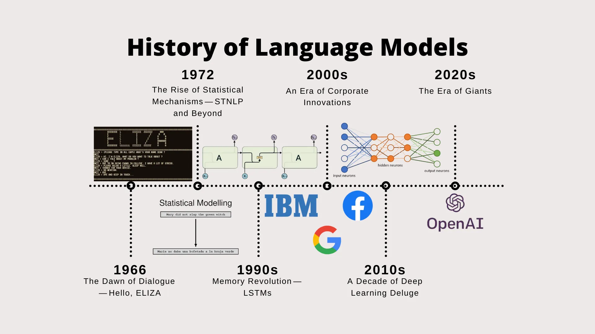

   History of LLMs. Source: `From ELIZA to GPT-4: The Grand Odyssey of Language Models <https://pub.towardsai.net/history-of-llms-931e041ef176>`_.

From the early days of NLP, researchers have been working on algorithms and models to understand and generate
human language. It started with ELIZA, the first chatbot, which was based on pattern matching and responding to
inputs with pre-defined answers. The introduction of statistical methods in the 1990s marked a significant shift in
NLP, as these methods allowed for the analysis of large corpora of text data. The key to this shift was the advent
of LSTMs (long-short-term memory) networks which allowed neural networks to have better "memory" and deal with
problems where understanding long-term patterns was important. However, it wasn't until the advent of
deep learning that LLMs began to take shape.

The introduction of the transformer architecture in 2017 by Vaswani et al. [1]_ revolutionized the field of NLP. The
transformer model's self-attention mechanism enabled it to capture long-range dependencies in text, leading to
significant improvements in various NLP tasks. This breakthrough paved the way for the development of LLMs, as
researchers began to train large-scale models on massive datasets using the transformer architecture.
The release of models like BERT (Bidirectional Encoder Representations from Transformers) [2]_ in 2018 and GPT-2 (Generative
Pre-trained Transformer 2) [3]_ in 2019 showcased the potential of LLMs for tasks such as text generation, translation,
and sentiment analysis. These models demonstrated that pre-training on large amounts of text data followed by fine-tuning
on specific tasks could yield state-of-the-art results.

The subsequent release of GPT-3 [4]_ in 2020, with its 175 billion parameters, further pushed the boundaries of LLMs,
showcasing their ability to generate coherent and contextually relevant text across a wide range of topics. This
model's success sparked interest in the development of even larger models, leading to the emergence of models like
GPT-4 [5]_ and LLaMA (Large Language Model Meta AI) [6]_.

The rapid advancements in LLMs have also been driven by improvements in hardware, such as GPUs and TPUs, as well as
the availability of large-scale datasets. Researchers have also explored various techniques to enhance LLMs,
including fine-tuning, transfer learning, and prompt engineering.

Flow of data in LLMs
~~~~~~~~~~~~~~~~~~~~

The flow of data in Large Language Models (LLMs) involves several key steps, from input processing to output
generation. Here is a simplified overview of the data flow in LLMs:

1. **Input Processing**: The input text is tokenized into smaller units, such as words or subwords, using a tokenizer.
   This step converts the raw text into a format that the model can understand.
2. **Embedding**: The tokenized input is then converted into numerical representations called embeddings.
   These embeddings capture the semantic meaning of the tokens and are typically learned during the training process.
3. **Transformer Architecture**: The embeddings are passed through multiple layers of the transformer architecture,
   which consists of self-attention and feed-forward neural networks. The self-attention mechanism allows the model to
   weigh the importance of different tokens in the context of the input sequence.
4. **Contextual Representation**: As the input passes through the transformer layers, the model generates contextual
   representations for each token, capturing the relationships and dependencies between them.
5. **Output Generation**: The final layer of the transformer produces a probability distribution over the vocabulary
   for each token position. The model can then generate text by sampling from this distribution, selecting the most
   likely next token based on the context provided by the input.
6. **Decoding**: The generated tokens are decoded back into human-readable text. This step may involve
   detokenization, where the tokens are combined to form words or phrases.
7. **Output**: The final output is the generated text, which can be used for various applications, such as chatbots,
   content generation, or summarization.

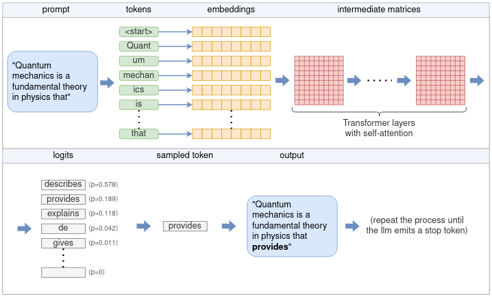

   Flow for generating a token. Source: `Understanding how LLM inference works with llama.cpp <https://www.omrimallis.com/posts/understanding-how-llm-inference-works-with-llama-cpp/>`_.

Prompting LLMs
~~~~~~~~~~~~~~
Prompting LLMs is the process of providing input text or instructions to the model in order to elicit a specific
response or generate text based on the given context. The effectiveness of prompting can significantly impact the
quality and relevance of the generated output. Here are some key aspects of prompting LLMs:

1. **Clear Instructions**: Providing clear and concise instructions in the prompt helps the model understand the
   desired output. For example, instead of asking "What is the weather?", a more specific prompt like "What is the
   weather forecast for New York City tomorrow?" can yield better results.
2. **Contextual Information**: Including relevant context in the prompt can help the model generate more accurate and
   contextually appropriate responses. For instance, if you want the model to generate a story, providing a brief
   background or setting can guide the generation process.
3. **Examples**: Providing examples in the prompt can help the model understand the desired format or style of the
   output. For instance, if you want the model to generate a poem, including a few lines of a poem as an example can
   help the model mimic the style.
4. **Iterative Refinement**: Experimenting with different prompts and iteratively refining them based on the model's
   responses can lead to better results. This process may involve adjusting the wording, structure, or length of the
   prompt to achieve the desired output.
5. **Task-Specific Prompts**: Different tasks may require different prompting strategies. For example, generating
   conversational responses may require a different approach compared to generating technical documentation or
   creative writing or writing code. Understanding the specific requirements of the task can help tailor the
   prompts accordingly.
6. **Limitations**: It's important to be aware of the limitations of LLMs, such as their tendency to produce
   plausible-sounding but incorrect or nonsensical answers. A prompt will only work if the foundational model has
   been trained on similar data. For example, if you ask a model to generate a recipe for a dish that it has never
   seen before, it may not be able to provide a coherent response. Being cautious about the model's limitations and
   validating the generated output is crucial, especially in critical applications.

Retrieval-Augmented Generation (RAG)
------------------------------------

Retrieval-Augmented Generation (RAG) is a technique that combines the strengths of LLMs with external knowledge
sources to improve the quality and relevance of generated text. RAG leverages a retrieval component to access
external information, such as documents or databases, and incorporates this information into the generation process.
This approach allows LLMs to generate more accurate and contextually relevant responses by grounding their
outputs in more up-to-date knowledge.

RAG typically involves two main components:

1. **Retrieval Component**: This component retrieves relevant information from external sources based on the input
   query or context. It can use various retrieval techniques, such as keyword matching, semantic search, or
   information retrieval algorithms, to identify relevant documents or passages.
2. **Generation Component**: The retrieved information is then fed into the LLM, which generates a response based on
   both the input query and the retrieved context. The LLM can use the additional information to enhance its
   understanding and generate more accurate and informative responses.

RAG can be particularly useful in scenarios where the LLM may not have sufficient knowledge or context to generate
accurate responses. By incorporating external information, RAG can help mitigate the limitations of LLMs and improve
the overall quality of generated text.

Note that RAG requires recomputing the embeddings for the external knowledge source at the start of each session.

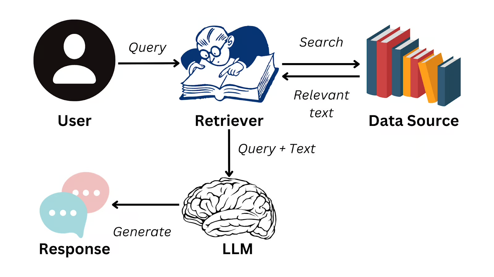

   RAG flowchart. Source: `What is Retrieval Augmented Generation (RAG)? <https://www.datacamp.com/blog/what-is-retrieval-augmented-generation-rag>`_.

Running a chat interface to LLMs
--------------------------------

As a demonstration, we will learn how to run a chat interface to LLMs using the open-source tools
`Open WebUI <https://github.com/open-webui/open-webui>`__  and `Ollama <https://ollama.com/>`_.
Open WebUI is a web-based interface for interacting with LLMs, while Ollama is a command-line tool for running
LLMs locally. In keeping with the theme of the previous section, we will run these tools in a container on an
HPC system.

In order to accomplish this, we will need to open a `DCV <https://docs.aws.amazon.com/dcv/latest/adminguide/what-is-dcv.html>`_
(remote desktop) session on the `TACC Analysis Portal <https://tap.tacc.utexas.edu>`_ using the Vista
compute cluster. See instructions `here </section1/tap_and_jupyter.html>`_.

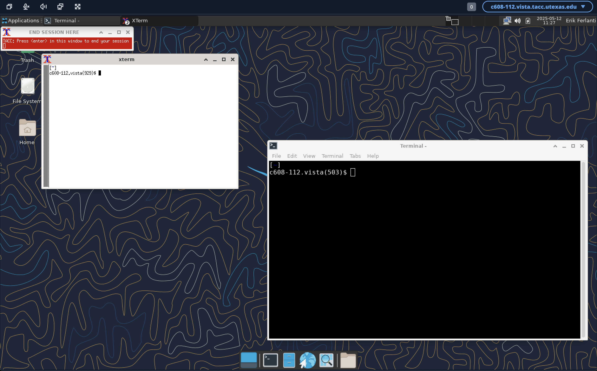

   TACC Analysis Portal - DCV session.

Install a browser
~~~~~~~~~~~~~~~~~

Once working with an active DCV session, we will need to install a browser since this system does not have a browser installed by default.
We will use the open-source `Firefox <https://www.mozilla.org/en-US/firefox/new/>`_ browser.

.. code-block:: console

   # Move to the scratch directory
   [vista]$ cd $SCRATCH

   # Download the Firefox install script
   [vista]$ wget https://raw.githubusercontent.com/TACC/life_sciences_ml_at_tacc/refs/heads/main/docs/section5/files/install_firefox_linux-aarch64.sh

   # Run the install script
   [vista]$ . ./install_firefox_linux-aarch64.sh
   Downloading firefox...
   Extracting firefox to /home1/03762/eriksf/bin...
   Linking /home1/03762/eriksf/bin/firefox/firefox to ff...
   Adding /home1/03762/eriksf/bin/ff to PATH...

   To permanently add '/home1/03762/eriksf/bin' to your PATH, add 'export PATH=$PATH:/home1/03762/eriksf/bin' to /home1/03762/eriksf/.bashrc

Run the Open WebUI/Ollama container
~~~~~~~~~~~~~~~~~~~~~~~~~~~~~~~~~~~

Next, we will run the Open WebUI/Ollama container. To simplify the process, we will download and run a "start" script
that will automatically load the apptainer module, pull the container, create some data directories, and run it
with the appropriate options.

.. code-block:: console

    # Download the start script
    [vista]$ wget https://raw.githubusercontent.com/TACC/life_sciences_ml_at_tacc/refs/heads/main/docs/section5/files/start-openwebui.sh
    
    # Run the start script
    [vista]$ . ./start-openwebui.sh 

    Currently Loaded Modules:
      1) ucc/1.3.0      4) TACC            7) nvpl/25.3
      2) ucx/1.18.0     5) gcc/15.1.0      8) python3/3.11.8
      3) cmake/3.31.5   6) openmpi/5.0.5   9) tacc-apptainer/1.3.3

 

    Pulling open-webui image...
    INFO:    Converting OCI blobs to SIF format
    INFO:    Starting build...
    Copying blob 943331d8a9a9 skipped: already exists  
    Copying blob 4f4fb700ef54 skipped: already exists  
    Copying blob be2fefeabb18 skipped: already exists  
    Copying blob 394dbe96ba14 skipped: already exists  
    Copying blob fa086b39bd17 skipped: already exists  
    Copying blob 8318bf964db3 skipped: already exists  
    Copying blob 4f4fb700ef54 skipped: already exists  
    Copying blob 038636157489 skipped: already exists  
    Copying blob 0e5ecbd2fab7 skipped: already exists  
    Copying blob 441fae03f8ac done   | 
    Copying blob b6fe75420efd done   | 
    Copying blob 3b4e68a21a6d skipped: already exists  
    Copying blob e6f9fdfad974 done   | 
    Copying blob 22e9a58f5348 done   | 
    Copying blob b924c02ac309 skipped: already exists  
    Copying blob df007eea74a3 skipped: already exists  
    Copying config e72d74e30b done   | 
    Writing manifest to image destination
    2025/05/12 12:24:52  info unpack layer: sha256:943331d8a9a9863299c02e5de6cce58602a5bc3dc564315aa886fe706376f27f
    ...
    INFO:    Creating SIF file...
    Creating data directories, if needed...
    Creating secret key...
    Starting open-webui instance...
    Running start script...
    To stop open-webui, type 'apptainer instance stop openwebui1'

    [vista]$ apptainer instance list
    INSTANCE NAME    PID        IP    IMAGE
    openwebui1       1435449          /tmp/rootfs-1217685323/root

Open Web Interface
~~~~~~~~~~~~~~~~~~

Now that the Open WebUI container is running, we can access it using the Firefox browser. In the browser,
navigate to the following URL, http://localhost:8080. This will open the Open WebUI interface.

.. code-block:: console

   # Open Firefox
   [vista]$ ff &

With the browser open to the start page, click the "Get started" link at the bottom of the page.

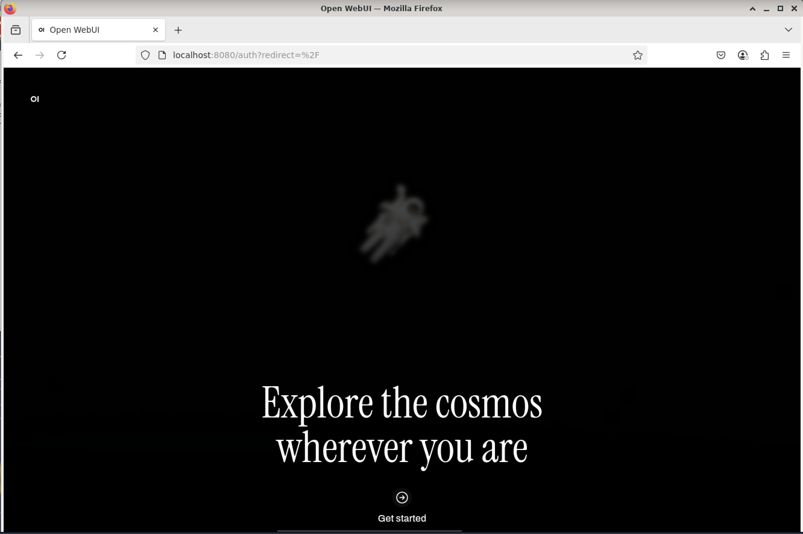

   Open WebUI start page.

Now, fill out the form to create an admin account.

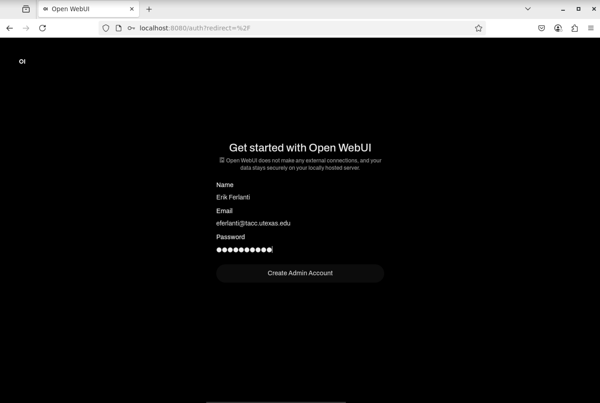

   Open WebUI admin account creation.

With the account created, we now need to load our first model. Navigate to the lower left corner of the
page and click on your name and then "Admin Panel".

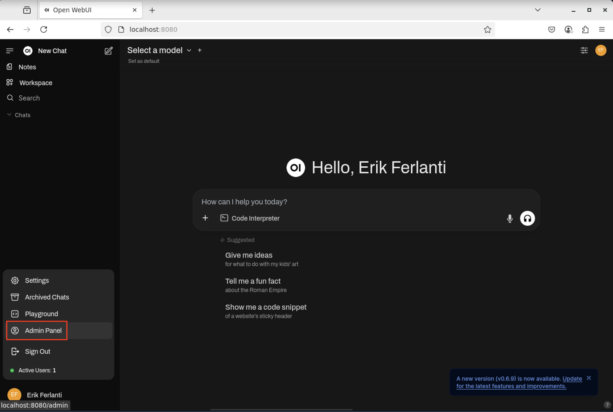

   Open WebUI - Open Admin panel.

On the admin panel, select the "Settings" tab and then "Models" pane.

.. figure:: ./images/open-webui-select-models.png
   :width: 600
   :align: center

   Open WebUI - Admin panel - Settings.

On the Models pane, select the "Manage Models" button (downward arrow) on the far right side of the page to
open the "Manage Models" dialog box. Enter "llama3.1:8b" in the "Pull a model from Ollama.com" text box and click
the "Pull" button to the right. This will pull the Llama3.1 8 billion parameter model from Ollama.com.

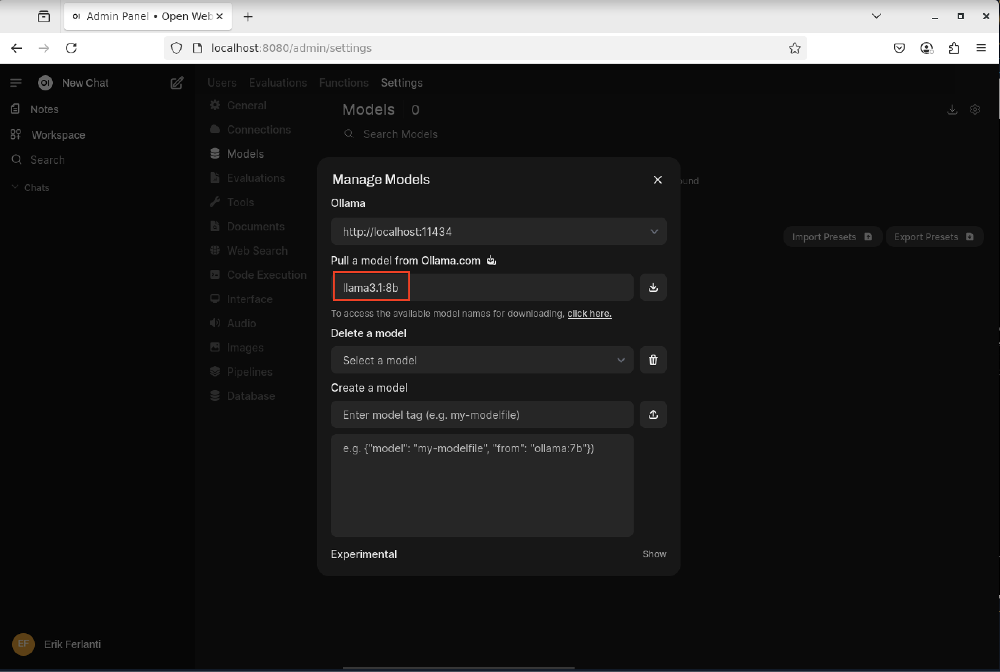

   Open WebUI - Manage Models dialog box.

With the model fully downloaded and verified, close the dialog box and click the "New Chat" button in the upper
left corner of the page. This will bring us to the main chat interface and it should now show that the llama3.1:8b
model is selected.

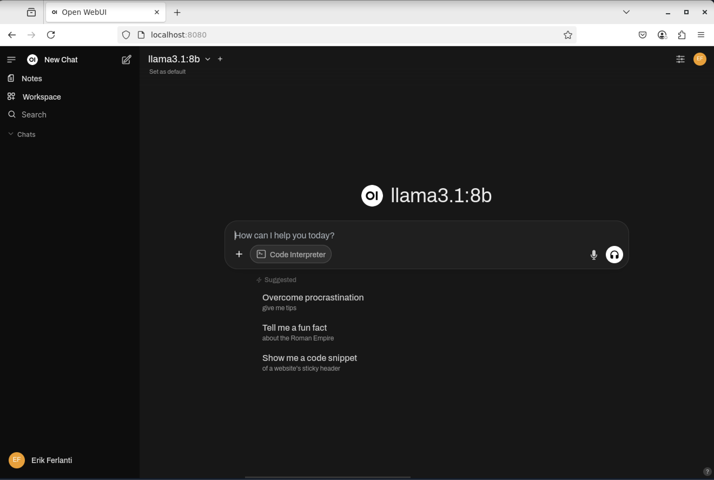

   Open WebUI - Chat interface with llama3.1:8b selected.

RAG Example
~~~~~~~~~~~

Now that we have the Open WebUI chat interface open, we can try running a simple RAG example. The first task is to
install an improved embedding model. Navigate to the lower left corner of the page and click on your name
and then "Admin Panel". On the admin panel, select the "Settings" tab and then "Models" pane. On the Models
pane, select the "Manage Models" button (downward arrow) on the far right side of the page to open the dialog box.
Enter "bge-m3" in the "Pull a model from Ollama.com" text box and click the "Pull" button to the right. This will pull the
BGE-M3 embedding model from Ollama.com.

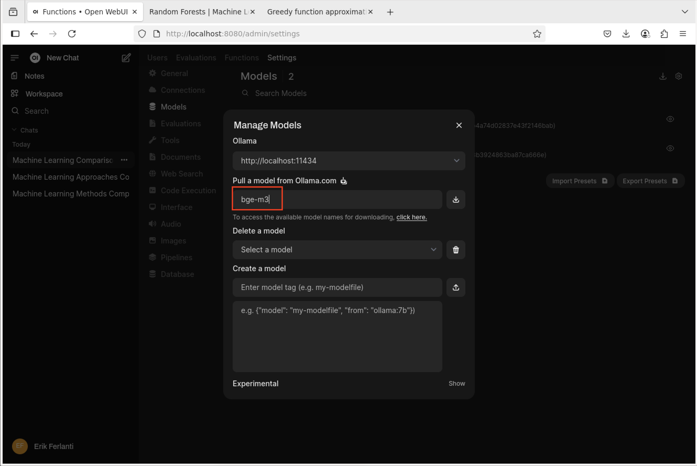

   Open WebUI - Manage Models dialog box.

With the model fully downloaded and verified, close the dialog box, and we should now be looking at the "Models"
pane.

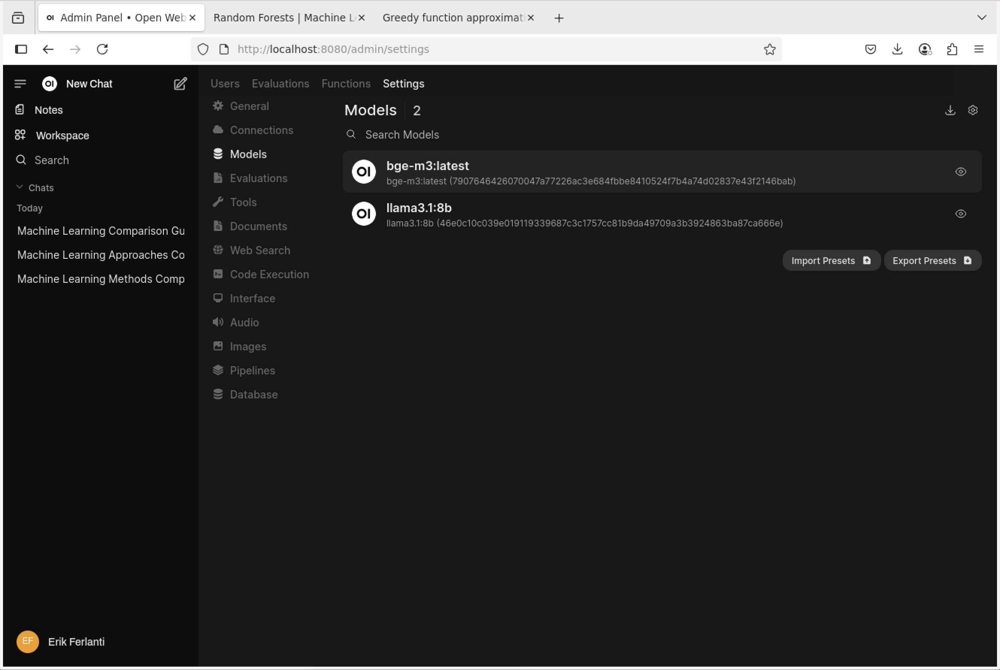

   Open WebUI - Models pane.

Select the "pencil" icon next to the "bge-m3" model to open the "Edit Model" dialog box. Scroll down to
"Advanced Params" section and click on the "Show" button to the right. This will show the advanced parameters for the
model. Scroll down to the "Context Length (Ollama)" parameter, click on the number to the right and set it to 8192. This will increase the
context length for the embedding model to 8192 tokens. Scroll to the bottom and click the 'Save &
Update' button. This will take us back to the "Models" pane.

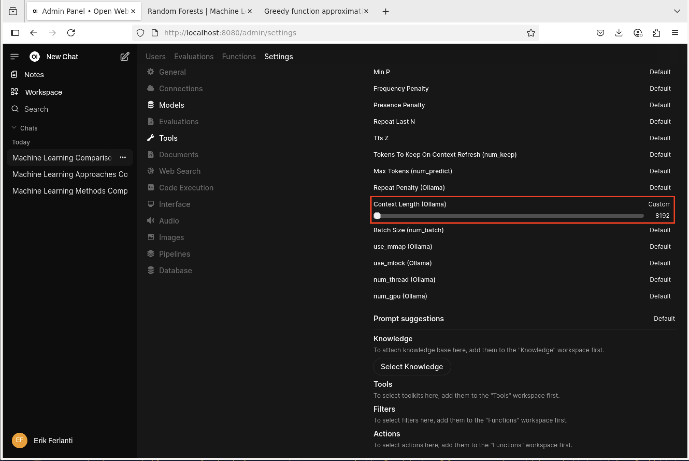

   Open WebUI - Model Setting dialog box.

The last bit of set up we're going to do is to update the "Document" settings. Navigate to the "Admin Panel" once
again and select the "Settings" tab and then "Documents" pane. On the Documents pane, we're going to update the
"Chunk Size" to 3000 under the "General" grouping and under the "Embedding" grouping we're going to set the 
"Embedding Model Engine" to "Ollama" (drop-down menu) and set the "Embedding Model" to "bge-m3". These settings
affect how the external documents are chunked and embedded. Finally, click the "Save" button to save the changes.

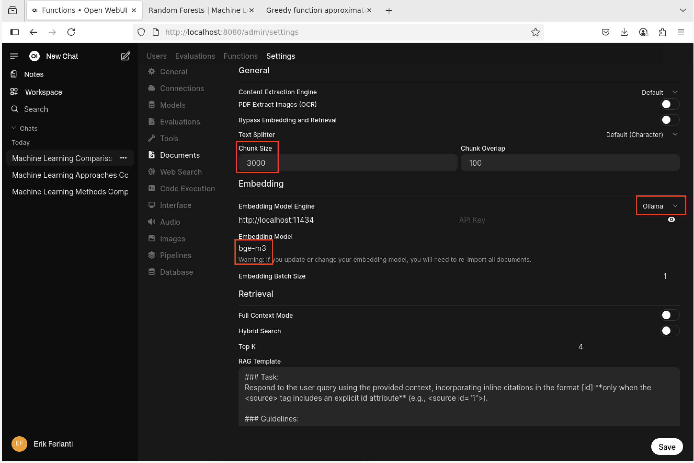

   Open WebUI - Document settings pane.

With our models in place and settings updated, let's give our RAG example a try. Here we're going to upload
two machine learning papers, `Random Forests <https://link.springer.com/article/10.1023/A:1010933404324>`_, and
`Greedy function approximation: A gradient boosting machine <https://projecteuclid.org/journals/annals-of-statistics/volume-29/issue-5/Greedy-function-approximation-A-gradient-boosting-machine/10.1214/aos/1013203451.full>`_
and then ask some comparative questions. To get started, open this documentation in a new tab of the Firefox
browser in your DCV session. Go to each of the above two links and save each paper as a PDF (click on the
"Download PDF" button). With our documents downloaded, Click on the "New Chat" button
in the upper left corner of the page to bring us to the main chat interface. At the chat prompt, click on the "+"
button in the left side of the prompt box and select "Upload Files".

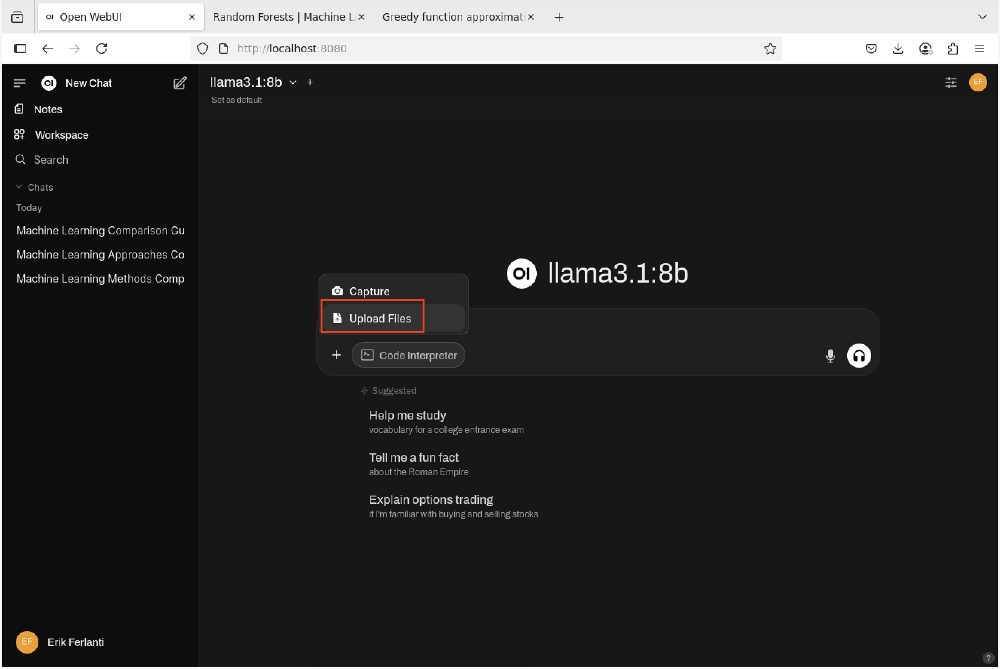

   Open WebUI - Add documents.

This will open a file browser. Navigate to the directory where you saved the two papers, select both of them,
and click the "Open" button. This will upload the two documents to the Open WebUI chat interface.

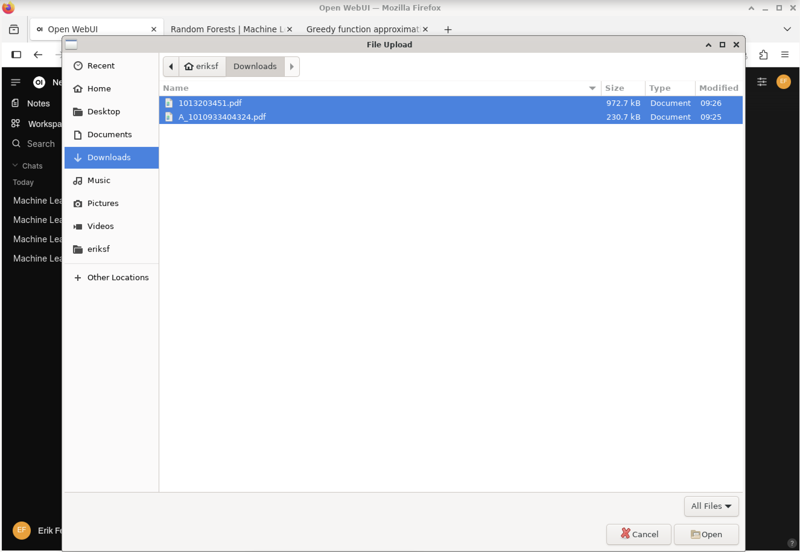

   Open WebUI - Add documents - File browser.

With the documents uploaded, we can now ask some questions. In the chat prompt, type something like the
following question:

   "The articles provided talk about related but slightly different machine learning approaches. Can you
   provide me with a summary and a table where you describe different use cases and where each of the methods
   has advantages and disadvantages?"

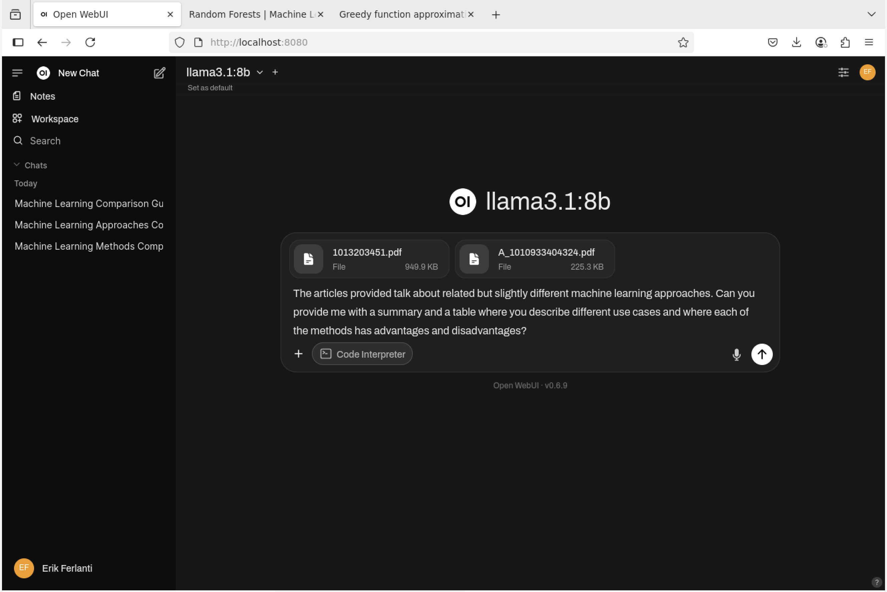

   Open WebUI - Prompt with uploaded documents.

The model will then process the documents and generate a response based on the content of the papers.

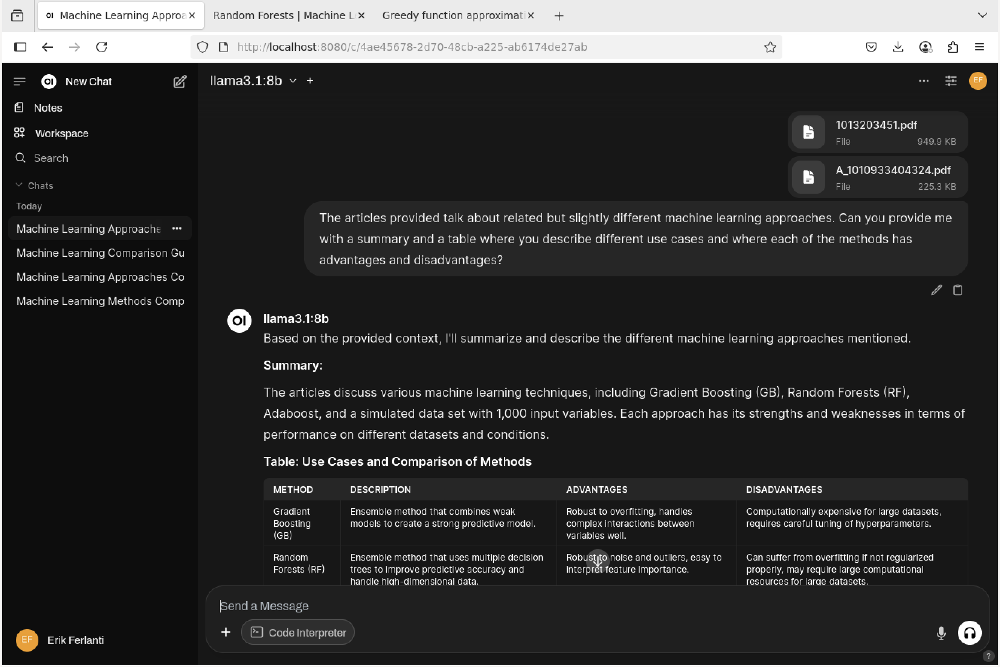

   Open WebUI - RAG response.

Exercise
^^^^^^^^

With this RAG setup in Open WebUI in place, try out some of your own documents/papers and ask the model
relevant questions about them. Feel free to also experiment with other models and settings.

Additional Resources
--------------------

The material in this section is based on the following resources:

* `Ollama <https://ollama.com/>`_
* `Open WebUI <https://openwebui.com/>`_
* `From ELIZA to GPT-4: The Grand Odyssey of Language Models <https://pub.towardsai.net/history-of-llms-931e041ef176>`_
* `Understanding how LLM inference works with llama.cpp <https://www.omrimallis.com/posts/understanding-how-llm-inference-works-with-llama-cpp/>`_
* `What is Retrieval Augmented Generation (RAG)? <https://www.datacamp.com/blog/what-is-retrieval-augmented-generation-rag>`_
* `Part V: Bringing it all together - RAG with ollama and Open WebUI <https://www.linkedin.com/pulse/part-v-bringing-all-together-rag-ollama-open-webui-insigene-vfqxc/>`_

**References:**

.. [1] Vaswani, A., Shankar, S., Parmar, N., Uszkoreit, J., Jones, L., Gomez, A. N., Kaiser, Ł., Kattner, K., Niki, J., & Kaiser, Ł. (2017). Attention is all you need. In Advances in neural information processing systems (pp. 5998-6008). `arXiv:1706.03762 <https://arxiv.org/abs/1706.03762>`_.
.. [2] Devlin, J., Chang, M. W., Lee, K., & Toutanova, K. (2019, June). Bert: Pre-training of deep bidirectional transformers for language understanding. In Proceedings of the 2019 conference of the North American chapter of the association for computational linguistics: human language technologies, volume 1 (long and short papers) (pp. 4171-4186) `arXiv:1810.04805 <https://arxiv.org/abs/1810.04805>`_.
.. [3] Radford, A., Wu, J., Child, R., Luan, D., Amodei, D., & Sutskever, I. (2019). Language Models are Unsupervised Multitask Learners. `Semantic Scholar <https://www.semanticscholar.org/paper/Language-Models-are-Unsupervised-Multitask-Learners-Radford-Wu/9405cc0d6169988371b2755e573cc28650d14dfe>`_.
.. [4] Brown, T., Mann, B., Ryder, N., Subbiah, M., Kaplan, J. D., Dhariwal, P., ... & Amodei, D. (2020). Language models are few-shot learners. Advances in neural information processing systems, 33, 1877-1901. `arXiv:2005.14165 <https://arxiv.org/abs/2005.14165>`_.
.. [5] Achiam, J., Adler, S., Agarwal, S., Ahmad, L., Akkaya, I., Aleman, F. L., ... & McGrew, B. (2023). Gpt-4 technical report. arXiv preprint arXiv:2303.08774. `arXiv:2303.08774 <https://arxiv.org/abs/2303.08774>`_.
.. [6] Touvron, H., Lavril, T., Izacard, G., Martinet, X., Lachaux, M. A., Lacroix, T., ... & Lample, G. (2023). Llama: Open and efficient foundation language models. arXiv preprint arXiv:2302.13971. `arXiv:2302.13971 <https://arxiv.org/abs/2302.13971>`_.
