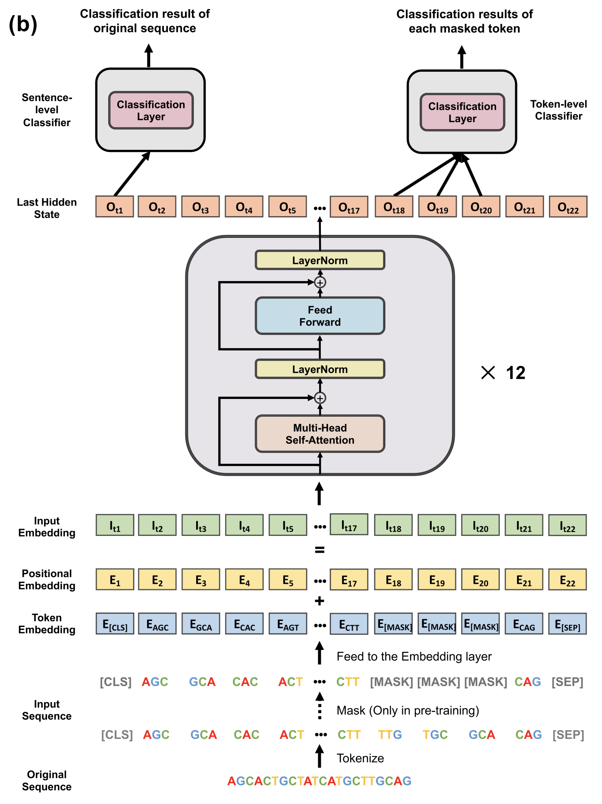
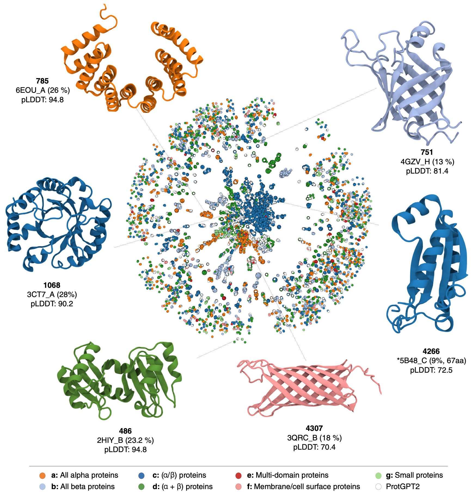

LLMs in Biology Applications
============================

As we saw in the previous section, Large Language Models (LLMs) have demonstrated remarkable
capabilities in summarizing, processing, and generating human-like text. Their success hinges on the
assumption that natural language can be modeled as a system of sequential words/sounds (tokens), and
that the precise arrangement of those tokens is what gives rise to context and meaning.

If we look elsewhere in nature, we find it is rich with sequential information and processes - DNA
sequences, transcriptomes, protein sequences, signal transduction cascades, metabolic pathways, and
even small molecules (interpreted as SMILES strings). Do these sequences in nature have their own
"vocabulary" conferring some biological importance? **If we treat these sequences as language, can
we uncover hidden signals or patterns with LLMs?**

In this section, we will look at how LLMs are currently being used in a few different areas in the
life sciences. The hands-on examples are driven by current topics found in the literature. By the
end of this section, you should be able to:

* Pull existing models from Hugging Face using the ``transformers`` library
* Apply DNABERT-2 to a DNA sequence classification task
* Generate new protein sequences using ProtGPT2

.. note:: 

   The following examples should be done in a Jupyter Notebook on Vista with the ``Day4-pt-251``
   kernel. If you are doing this elsewhere, you need to install a few libraries:

   .. code-block:: console

       $ pip install --user transformers scikit-learn pandas einops

Example 1: DNA Sequence Context
-------------------------------

**DNABERT-2** is an advanced transformer-based foundation model designed for analyzing DNA sequences
across multiple species. It builds upon the original DNABERT model by introducing significant
improvements in tokenization and architecture, and it is trained on genomes from 135 different
species. This allows DNABERT-2 to perform well on a wide range of genomic tasks, including promoter
prediction, gene expression analysis, DNA methylation detection, and more.

How it Works
^^^^^^^^^^^^

DNABERT and DNABERT-2 are transformer-based architectures modeled after Google's BERT architecture.
BERT (Bidirectional Encoder Representations from Transformers) deviates from the traditional 
transformer architecture in that it only uses the encoder portion of the original model. Traditional
transformers include both an encoder and decoder for sequence-to-sequence tasks like translation,
but BERT-like models are designed solely for *understanding language*, not generating it.

The original DNABERT tokenized k-mer sequences with fixed length as input, and added a CLS token (a
tag representing meaning of entire sentence), a SEP token (sentence separator) and MASK tokens (to
represent masked k-mers in pre-training). The input is embedded and fed through 12 transformer
blocks. The outputs can be interepreted for sentence-level classification or token-level
classification.

   The original DNABERT model [1]_ (shown above) was improved in DNABERT-2 [2]_

Some of the key innovations of DNABERT-2 over the original DNABERT include:

1. **Byte Pair Encoding (BPE) Tokenization:** Instead of fixed-length k-mer tokenization, which can
   be computationally inefficient and may not capture variable-length patterns effectively.
   DNABERT-2 replaces this with BPE, a data-driven compression algorithm that identifies and merges
   frequently occurring nucleotide sequences. This approach reduces sequence length by approximately
   five times on average, enhancing computational efficiency and preserving meaningful biological
   patterns.

2. **Enhanced Model Architecture:** DNABERT-2 improves upon the original model by replacing the
   original embeddings with Attention with Linear Biases (ALiBi) embeddings, which overcome
   limitations with input length and allow the model to handle inputs of unlimited length without
   performance issues. Also, DNABERT-2 incorporates Flash Attention, an optimized mechanism for 
   improved IO to accelerate training and inference and reducing memory requirements.

3. **Genome Understanding Evaluation (GUE) Benchmark:** The original DNABERT was trained on human
   sequences alone. DNABERT-2 is trained on genomces from 135 different species, enhancing its
   generalizability across diverse organisms. To assess and compare genome models effectively, the
   developers introduced the GUE benchmark, a massive amalgam of 36 datasets for 9 different genomic
   tasks.

DNABERT-2 is trained and evaluated on massive amounts of data:

* Trained on genomes from **135 species** comprising **>32B bases**
* Evaluated with the GUE benchmark for **9 different genome classification tasks**
* In total, there were **262B training tokens** and **117M parameters** in the model

With these improvements, DNABERT-2 was able to outperform its predecessor on 23 out of 28 datasets 
from the GUE benchmark in tasks like promoter prediction, gene expression analysis, DNA methylation
detection, chromatin state classification, and variant effect prediction.

Try it Out
^^^^^^^^^^

Let's perform a simple classification task using DNABERT-2. First, use the ``transformers.pipeline``
method to load the 117M parameter model from
`Hugging Face <https://huggingface.co/zhihan1996/DNABERT-2-117M>`__:

.. code-block:: python

   >>> import torch
   >>> from transformers import AutoTokenizer, AutoModel

   >>> tokenizer = AutoTokenizer.from_pretrained('zhihan1996/DNABERT-2-117M', trust_remote_code=True)
   >>> model = AutoModel.from_pretrained('zhihan1996/DNABERT-2-117M', trust_remote_code=True)

Then, try *tokenizing* a sample DNA sequence using the tokenizer provided by the authors. This
fragments the sequence into variable length k-mers and assigns each k-mer a unique token ID:

.. code-block:: python

   >>> dna = 'ACGTAGCATCGGATCTATCTATCGACACTTGGTTATCGATCTACGAGCATCTCGTTAGC'  # sample sequence
   >>> inputs = tokenizer(dna, return_tensors='pt')['input_ids']
   >>> print(type(inputs))
   >>> print(inputs.shape)
   >>> print(inputs)

.. code-block:: text

   <class 'torch.Tensor'>
   torch.Size([1, 17])
   tensor([[   1,    5,  194,   32,  757, 1239, 2092,  294,   24,  359,   88,   93,
           32,   75,   77,   19,    2]])

The tokenizer gives you back a tensor (in this case, a vector) of token IDs. With DNABERT-2, the
first token (``1``) and last token (``2``) are always the same - the CLS and SEP tokens. The rest of
the sequence is broken down and given an encoded ID from a look up table.

Can we see how the sequence was tokenized? Yes! Let's do a little reverse engineering to see how
the author's tokenizer broke down the sequence into k-mers:

.. code-block:: python

   >>> token_ids = inputs[0].tolist()
   >>> tokens = tokenizer.convert_ids_to_tokens(token_ids)
   >>> print(tokens)

.. code-block:: text

   ['[CLS]', 'A', 'CGTA', 'GCA', 'TCGGA', 'TCTATCTA', 'TCGACA', 'CTTGG', 'TTA', 'TCGA', 'TCTA', 'CGA', 'GCA', 'TCTC', 'GTTA', 'GC', '[SEP]']

*What are some general observations you can make about the tokenization?*

Lets now turn our attention to the model. To see details of the model architecture, you can inspect
the ``model`` object that we created above: 

.. code-block:: python

   >>> print(model)

*Click below to expand the model architecture - notice anything familiar?*

.. toggle::

   .. code-block:: text

      BertModel(
        (embeddings): BertEmbeddings(
          (word_embeddings): Embedding(4096, 768)
          (token_type_embeddings): Embedding(2, 768)
          (LayerNorm): LayerNorm((768,), eps=1e-12, elementwise_affine=True)
          (dropout): Dropout(p=0.1, inplace=False)
        )
        (encoder): BertEncoder(
          (layer): ModuleList(
            (0-11): 12 x BertLayer(
              (attention): BertUnpadAttention(
                (self): BertUnpadSelfAttention(
                  (dropout): Dropout(p=0.0, inplace=False)
                  (Wqkv): Linear(in_features=768, out_features=2304, bias=True)
                )
                (output): BertSelfOutput(
                  (dense): Linear(in_features=768, out_features=768, bias=True)
                  (LayerNorm): LayerNorm((768,), eps=1e-12, elementwise_affine=True)
                  (dropout): Dropout(p=0.1, inplace=False)
                )
              )
              (mlp): BertGatedLinearUnitMLP(
                (gated_layers): Linear(in_features=768, out_features=6144, bias=False)
                (act): GELU(approximate='none')
                (wo): Linear(in_features=3072, out_features=768, bias=True)
                (dropout): Dropout(p=0.1, inplace=False)
                (layernorm): LayerNorm((768,), eps=1e-12, elementwise_affine=True)
              )
            )
          )
        )
        (pooler): BertPooler(
          (dense): Linear(in_features=768, out_features=768, bias=True)
          (activation): Tanh()
        )
      )

This pre-trained model by itself does not have broad utility. We need to fine tune the model to a 
specific task (e.g. classification). For this example, we will fine tune it to build a classifier
to predict whether a sequence is from a coding region of DNA or not.

We have previously downloaded and modified a DNA sequence dataset from
`Kaggle <https://www.kaggle.com/datasets/adnanyaramis/coding-noncoding-dna-sequences>`_. The adapted
dataset contains two columns: the sequence and a label (1=coding, 0=non-coding). The dataset is in
CSV format and can be downloaded directly from this
`URL <https://raw.githubusercontent.com/TACC/life_sciences_ml_at_tacc/refs/heads/main/docs/section5/files/Coding_NonCoding_DNA_Sequences.csv>`_.
Since the data is available on the web, it is easiest to use pandas to just read it in directly.

.. code-block:: python

   >>> import pandas as pd
   >>> data = pd.read_csv('https://raw.githubusercontent.com/TACC/life_sciences_ml_at_tacc/refs/heads/main/docs/section5/files/Coding_NonCoding_DNA_Sequences.csv')
   >>> print(data.shape)
   >>> print(data.head())

.. code-block:: text

      (65321, 2)
                                           DNA_sequence  Target
   0  CTCTTGCGGTCGATCTGGTCACGGGTGATGGTGAAGGTTACGTAGT...       1
   1  TCGCGGTCCCGAGCCTGATCGTGCGCCGCGCCAACACGACGGTCGA...       1
   2  GGCTACGACGTGACCGCGGGGCAGGTGCTCGTGACCAACGGCGGCA...       1
   3  CAGGTAGGTGCCACAGTAGTAAGCGGTGATGCAGTTGCCCCTGAAT...       1
   4  GAGTTGTCCTGGTAAGATTCTTACCCATGCGAATCACGTCGAAAGG...       1

It appears there are 65,321 rows and 2 columns. How many of each class are included in the dataset?

.. code-block:: python

   >>> data['Target'].value_counts()

.. code-block:: text

      Target
   0    45603
   1    19718
   Name: count, dtype: int64

It's about 70% non-coding and 30% coding DNA. This is a fairly large data set - more data generally
is better for training a model. However to save time in this workshop, let's subsample it to just
1000 sequences, checking to make sure that it preserves the ratio:

.. code-block:: python
   
   >>> data_subset = data.sample(1000)
   >>> print(data_subset['Target'].value_counts())

.. code-block:: text

      Target
   0    694
   1    306
   Name: count, dtype: int64

That's pretty close - we have narrowed it down to 1000 sequences, 694 of which are from non-coding
regions of DNA, and 306 of which are from coding regions. 

Next, let's use the tokenizer that we pulled from Hugging Face to slice up those 1000 sequences into
short k-mers (of variable length), then encode them into a tensor of token IDs. 

.. code-block:: python

   >>> data_subset_list = data_subset.DNA_sequence.values.tolist() 
   >>> inputs = tokenizer(data_subset_list, return_tensors="pt", padding=True)["input_ids"]

Then, use the model that we pulled from Hugging Face to get the embeddings, given the token IDs.
The embeddings are a mathematical representation of the hidden states of the model. 

.. warning::

   This step may take about 3 or 4 minutes for 1000 sequences.

.. code-block:: python

   >>> embeddings = model(inputs)
   >>> embedding_data = torch.mean(embeddings[0], dim=1).detach().numpy()

Given those embeddings and the known labels (coding or non-coding), we can train a simple classifier
to predict the labels of unknown DNA sequences. For this example, we can use a Naive Bayes
Classifier, which typically works well with high-dimension data. As we have seen before, we split
our embeddings (which we treat as features) and labels into train and test sets. Then, we fit the
classifer to the training set and predict the labels of our test set.

.. code-block:: python

   >>> from sklearn.naive_bayes import GaussianNB
   >>> from sklearn.model_selection import train_test_split

   >>> X_train, X_test, y_train, y_test = train_test_split(embedding_data, data_subset.Target, test_size=0.3, stratify=data_subset.Target, random_state=1)
   >>> gnb = GaussianNB()
   >>> y_pred = gnb.fit(X_train, y_train).predict(X_test)

How did we do?

.. code-block:: python

   >>> from sklearn.metrics import classification_report

   >>> print(f"Performance on TEST\n*******************\n{classification_report(y_test, gnb.predict(X_test))}")
   >>> print(f"Performance on TRAIN\n********************\n{classification_report(y_train, gnb.predict(X_train))}")

.. code-block:: text

   Performance on TEST
   *******************
                 precision    recall  f1-score   support
   
              0       0.83      0.69      0.76       214
              1       0.46      0.65      0.54        86
   
       accuracy                           0.68       300
      macro avg       0.65      0.67      0.65       300
   weighted avg       0.72      0.68      0.69       300
   
   Performance on TRAIN
   ********************
                 precision    recall  f1-score   support
   
              0       0.86      0.71      0.78       500
              1       0.49      0.71      0.58       200
   
       accuracy                           0.71       700
      macro avg       0.68      0.71      0.68       700
   weighted avg       0.76      0.71      0.72       700

Accuracy of 0.68 is not great - but this is using the embeddings alone as our features. Could we get
a better outcome if we trained over all ~65K sequences? Can we get a
better outcome if we fine tune the original DNABERT-2 model that was previously trained on
**32B bases**, and then use their baked-in sequence classifier?

.. toggle::

   .. note::
   
      You can also give it just one sequence for classification. For example, give it the sequence from 
      above:
   
      .. code-block:: python
      
         >>> dna = 'ACGTAGCATCGGATCTATCTATCGACACTTGGTTATCGATCTACGAGCATCTCGTTAGC'
         >>> dna_tokenized = tokenizer(dna, return_tensors='pt')['input_ids']
         >>> dna_embedded = model(dna_tokenized)
         >>> dna_embedded_data = torch.mean(dna_embedded[0], dim=1).detach().numpy()
         >>> pred=gnb.predict(dna_embedded_data)
         >>> print(pred)
      
      .. code-block:: text
      
         [0]

Rather than trying to run all of the Python code required for this in the Jupyter notebook, a quick
check of the author's `GitHub repo <https://github.com/MAGICS-LAB/DNABERT_2>`_ shows they wrote a
convenience script to do exactly what we want to do - fine tune their model with our input sequences
for a classification task.

In order to run their script, we just need to clone their GitHub repo, and prepare three input
files: ``train.csv``, ``test.csv``, and ``dev.csv`` (this last one is what they call their 
validation set).

We can prepare those three files by sub-sampling our 1000-sequence subset:

.. code-block:: python

   >>> import os
   >>> scratch = os.environ.get('SCRATCH')
   >>> os.mkdir(f'{scratch}/sample_data_for_dnabert2')

   >>> data_subset.iloc[:600].to_csv(f'{scratch}/sample_data_for_dnabert2/train.csv', index=False)
   >>> data_subset.iloc[600:750].to_csv(f'{scratch}/sample_data_for_dnabert2/dev.csv', index=False)
   >>> data_subset.iloc[750:].to_csv(f'{scratch}/sample_data_for_dnabert2/test.csv', index=False)

*Does anyone see any potential problems with this approach?*

Next, open up a terminal from Jypyter Lab and clone the DNABERT-2 GitHub repo:

.. code-block:: console

   [gh]$ cds     # cd to SCRATCH
   [gh]$ git clone https://github.com/MAGICS-LAB/DNABERT_2
   [gh]$ cd DNABERT_2/finetune/

Then, run the training script. The container image was prepared
previously by installing the dependencies listed in the author's GitHub repo.

.. warning::

   This step may take about 15 minutes for 5 epochs.

.. code-block:: console

   [gh]$ module load tacc-apptainer
   [gh]$ export APPTAINER_CACHEDIR=$SCRATCH/apptainer_cache
   [gh]$ apptainer exec docker://wjallen/dnabert2:1.0 \
                        python train.py \
                        --model_name_or_path zhihan1996/DNABERT-2-117M \
                        --data_path ${SCRATCH}/sample_data_for_dnabert2/\
                        --kmer -1 \
                        --run_name DNABERT2_test \
                        --model_max_length 100 \
                        --per_device_train_batch_size 8 \
                        --per_device_eval_batch_size 16 \
                        --gradient_accumulation_steps 1 \
                        --learning_rate 3e-5 \
                        --num_train_epochs 5 \
                        --fp16 \
                        --save_steps 200 \
                        --output_dir output/ \
                        --evaluation_strategy steps \
                        --eval_steps 200 \
                        --warmup_steps 50 \
                        --logging_steps 100 \
                        --overwrite_output_dir True \
                        --log_level info \
                        --find_unused_parameters False

*What is learning_rate? Is it set to a small number or a big number here? Why is it set the way it
is? Any other notable parameters?*

If successful, the script outputs the results to the ``output/`` directory, which you can check as
follows:

.. code-block:: console

   [gh]$ cat output/results/DNABERT2_test/eval_results.json 
   {"eval_loss": 0.5799916386604309,
    "eval_accuracy": 0.696,
    "eval_f1": 0.5968084203378321,
    "eval_matthews_correlation": 0.2162526926317811,
    "eval_precision": 0.6257488069854807,
    "eval_recall": 0.5929735004879513,
    "eval_runtime": 24.8139,
    "eval_samples_per_second": 10.075,
    "eval_steps_per_second": 0.645,
    "epoch": 5.0 }

Slightly better than the Naive Bayes classifier we trained above, but not by much. Congratulations!
You've successfully completed a simple classification task using DNABERT-2.

Other Notable DNA Sequence Models
^^^^^^^^^^^^^^^^^^^^^^^^^^^^^^^^^

* `DNABERT-S <https://doi.org/10.48550/arXiv.2402.08777>`_  - Species-specific genomic analyses 
* `DNAGPT <https://doi.org/10.48550/arXiv.2307.05628>`_ - Variant calling and motif discovery
* `HyenaDNA <https://doi.org/10.48550/arXiv.2306.15794>`_ - Long range genomic sequence modeling
* `GROVER <https://doi.org/10.1038/s42256-024-00872-0>`_ - DNA sequence context and language rules
  for the human genome

Example 2: Protein Design
-------------------------

**ProtGPT2** is a specialized LLM trained by transfer learning of protein sequence information on
top of GPT-2. It is designed to generate novel protein sequences following biological principles of
naturally-occurring proteins. Sequences generated by ProtGPT2 have typical amino acid compositions,
generally are predicted to be globular, and sequence searches show they are distantly related to
real proteins, yet they exist in a new and unexplored protein space.

How it Works
^^^^^^^^^^^^

ProtGPT2 works by leveraging a GPT-2-like transformer architecture. GPT-2 (Generative Pretrained
Transformer 2) also deviates from the traditional transformer architecture by only using the decoder
portion of the model. As mentioned above, the full transformer includes both an encoder and decoder
for tasks like translation, but GPT-2-like models are designed for generative tasks such as text
completion. It uses a unidirectional (left-to-right) attention mechanism, meaning each token pays
attention (attention is all you need!) only to previous tokens, which enables text generation. This
contrasts with *bidirectional* models like BERT, which use bidirectional attention for deeper
language understanding.

ProtGPT2 is trained specifically on protein sequence data. The model learns patterns, motifs, and
structural features inherent in protein sequences by analyzing vast datasets of known proteins. This
training enables ProtGPT2 to generate sequences that are not only syntactically valid but also
biologically meaningful.

The process involves:

* **Tokenization**: Protein sequences are broken down into smaller units (amino acid tokens) for
  processing
* **Training**: The model is trained on large datasets of protein sequences to predict the next
  token in a sequence, capturing contextual relationships
* **Generation**: Using the learned patterns, the model can generate new protein sequences by
  sampling from the probability distribution of possible tokens

Massive amounts of data go into the training and evaluation:

* An autoregressive transformer model with **738 million parameters**
* Trained on **~50 million non-annotated protein sequences** spanning all of known protein space
* Generated and predicted structural and chemical properties for **10,000 new sequences**

The authors report that by finetuning the model on a subset of sequences that a user chooses, the 
model can be biased toward certain end goals. For example: 

* Designing proteins with specific properties
* Tune or alter biochemical functions of natural proteins
* Exploring sequence space for novel enzymes or therapeutic proteins
* Understanding sequence-function relationships

   Protein space and example proteins sampled by ProtGPT2 [3]_

Try it Out
^^^^^^^^^^

Use the ``transformers.pipeline`` method to load the ``protgpt2`` model from
`Hugging Face <https://huggingface.co/nferruz/ProtGPT2>`__:

.. code-block:: python

   >>> from transformers import pipeline
   >>> protgpt2 = pipeline('text-generation', model="nferruz/ProtGPT2")

.. code-block:: text

   config.json:  100%   850/850  [00:00<00:00,  164kB/s]
   pytorch_model.bin:  100%   3.13G/3.13G  [00:39<00:00,  76.7MB/s]
   model.safetensors:  100%   3.13G/3.13G  [00:29<00:00,  107MB/s]
   vocab.json:  100%   655k/655k  [00:00<00:00,  6.85MB/s]
   merges.txt:  100%   314k/314k  [00:00<00:00,  5.05MB/s]
   tokenizer.json:  100%   1.07M/1.07M  [00:00<00:00,  5.44MB/s]
   special_tokens_map.json:  100%   357/357  [00:00<00:00,  71.7kB/s]

The model may take a few minutes to download from the web, but inference only takes a few seconds.
Use the default parameters to generate 10 brand new protein sequences:

.. code-block:: python

   >>> sequences = protgpt2("<|endoftext|>", max_length=100, do_sample=True, top_k=950, repetition_penalty=1.2, num_return_sequences=10, eos_token_id=0)

A few of the important parameters:

* ``"<|endoftext|>"``: the starting token, in this case interpreted as starting anew or the amino
  acid M
* ``max_length=100``: sets the maximum token length returned where each token is around four amino
  acids
* ``do_sample=True``: enables sampling instead of greedy decoding, meaning the model will not just
  take the next token with the highest likelihood, instead it will randomly sample from the 
  probability distribution of likely 
* ``top_k=950``: number of most probably next tokens that are considered for sampling at each step
* ``repetition_penalty=1.2``: applies a penalty for repeating tokens
* ``num_return_sequences=10``: specifies how many sequences to generate
* ``eos_token_id=0``: generation ceases (end of sequence / EOS) if token 0 is produced

The returned ``sequences`` object is a simple list that contains the generated sequences. Because
the model samples a probability distribution, the sequences should be different every time:

.. code-block:: python

   >>> print(type(sequences))
   >>> print(len(sequences))
   >>> print(sequences[0])

.. code-block:: text

   <class 'list'>
   10
   {'generated_text': '<|endoftext|>\nMAHTRENQWTAMRTLWFRLACLALVVMAITSCEEEEDDTVTRQFADVTSTLPAGITTVQF\nSNAFAGSVTWMTGEATTGPDITIVITGTGFESVASDNSVILTIGDVVVDVIQWSGTEIKI\nSVPASAVASTAKLEIKNMNGLSLDLPAKIKAAFTSINGGSNPNPSGGTNNIIIAGGPFAN\nGYSNIGQFKVGAPATGDDYALIQGNFLENPETGLFYIQLRRAEDSGQTYDLYFSKDDGTN\nWNSPVNLSGTVSPS'}

Alternatively, seed the model with a starting sequence token that you want to build from. For 
example, you may provide an N-termninal sequence or motif for a certain class of proteins (membrane
bound, RNA-binding, etc.) and the model should generate other sequences with similar behavior.

.. code-block:: python

   >>> sequences = protgpt2("<|endoftext|>\nMKTAYIAKQRQISFVKSHFSRQDILDLWIYHTQGYFPDWQNY", max_length=100, do_sample=True, top_k=950, repetition_penalty=1.2, num_return_sequences=1, eos_token_id=0)
   >>> print(sequences[0]['generated_text'])

.. code-block:: text

   <|endoftext|>
   MKTAYIAKQRQISFVKSHFSRQDILDLWIYHTQGYFPDWQNYYLEHLNFMLQDLHPGSSL
   PLILEIGCGSGEFLNYLAQKHQVLGVDINPDEIELAKHINPDANFLVAQAEALPFHKNTF
   DYVLCMEVIEHLPNPELLINECKRVLKPNGTLLFTTPNFQSLQNRIKLLLGRSPKSQYYG
   QEQFGHVNFFEVSSIKEIVKRFGLKPVKQKTFFPYIPSLSILHFIMNVFPIGYKFFCYLY
   FRKEED

Congratulations! You've likely generated realistic protein sequences that no one has ever seen 
before. Perhaps think about plugging them in to
`Alphafold3 <https://docs.tacc.utexas.edu/software/alphafold3/>`_ to model the structure.

Other Notable Protein Sequence Models
^^^^^^^^^^^^^^^^^^^^^^^^^^^^^^^^^^^^^

* `ProteinBERT <https://doi.org/10.1093/bioinformatics/btac020>`_ - Prediction of protein-protein
  interactions
* `ESMFold <https://doi.org/10.1126/science.ade2574>`_ - Protein folding mechanisms and interactions
* `ProGen <https://doi.org/10.1038/s41587-022-01618-2>`_ - Generate novel protein sequences given
  natural language prompts

Additional Resources
--------------------

* `DNABERT-2 on Hugging Face <https://huggingface.co/zhihan1996/DNABERT-2-117M>`_
* `DNABERT-2 on GitHub <https://github.com/MAGICS-LAB/DNABERT_2>`_
* `DNABERT-2 Classification Exercise Adapted from Kaggle <https://www.kaggle.com/code/gabrielcabas/dnabert-for-classification>`_
* `Coding and Non-noncoding Data Adapted from Kaggle <https://www.kaggle.com/datasets/adnanyaramis/coding-noncoding-dna-sequences>`_
* `ProtGPT2 on Hugging Face <https://huggingface.co/nferruz/ProtGPT2>`_
* `LLM Applications in Bioinformatics Review 1 <https://www.sciencedirect.com/science/article/pii/S2001037024003209>`_
* `LLM Applications in Bioinformatics Review 2 <https://pmc.ncbi.nlm.nih.gov/articles/PMC10802675/>`_

References
^^^^^^^^^^

.. [1] Ji, Y., Zhou, Z., Liu, H. & Ramana V Davuluri, R.V., DNABERT: pre-trained Bidirectional Encoder Representations from Transformers model for DNA-language in genome. Bioinformatics 37, 2112-2120 (2021). https://doi.org/10.1093/bioinformatics/btab083
.. [2] Zhou, Z., Ji, Y., Li, W., Dutta, P., Davuluri, R.V., and Liu, H. DNABERT-2: Efficient Foundation Model and Benchmark For Multi-Species Genome. arXiv, 2306.15006, (2023). https://doi.org/10.48550/arXiv.2306.15006
.. [3] Ferruz, N., Schmidt, S. & Höcker, B. ProtGPT2 is a deep unsupervised language model for protein design. Nat Commun 13, 4348 (2022). https://doi.org/10.1038/s41467-022-32007-7